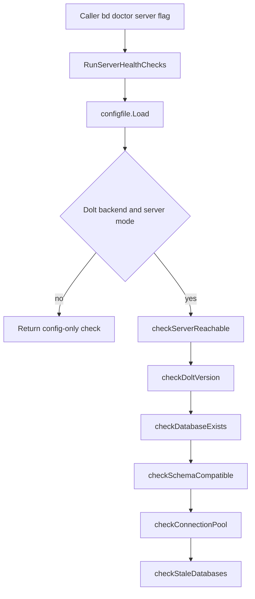

# server_mode_health_pipeline 深度解析

`server_mode_health_pipeline`（实现位于 `cmd/bd/doctor/server.go`）是 `bd doctor --server` 的“专科门诊”：它不尝试做全部健康诊断，而是专门回答一个更尖锐的问题——**当仓库配置为 Dolt server mode 时，这台远端（或本地）Dolt SQL Server 现在到底能不能被安全、正确地使用**。朴素方案通常只做一次 `ping` 就结束，但这里选择了分层体检：先确认“是不是该看这个科室”，再确认“服务器是不是 Dolt 本体”，再确认“目标库/表是否可用”，最后补上连接池与历史垃圾数据库的运营风险扫描。这样做的价值是把“能连上”与“可运维、可持续运行”区分开。

---

## 架构与数据流



把它想象成机场安检通道会更直观：`RunServerHealthChecks` 是总闸机；前面的配置判断是“你是不是这个航站楼的旅客”；`checkServerReachable` 和 `checkDoltVersion` 是证件+身份核验；`checkDatabaseExists` 与 `checkSchemaCompatible` 是“你是否有正确登机牌且航班存在”；最后的连接池与 stale DB 检查是机场运行态巡检，确保不是“今天能飞、明天崩”。

数据流上，它产出统一的 `ServerHealthResult`：内部 `Checks []DoctorCheck` 是逐项检查条目，`OverallOK` 是汇总结论。关键点是它采用**短路策略**：某些前置失败会立即返回（例如无法加载配置、TCP 不可达、不是 Dolt 服务器），因为后续检查在语义上已经不成立。

---

## 1) 这个模块到底解决什么问题

这个模块解决的是“**Dolt server mode 的可用性误判**”问题。只做单点连通测试会漏掉很多真实故障：你可能连上了一个 MySQL 而不是 Dolt；你可能连上 Dolt 但目标 database 不存在；你可能库在但 schema 不兼容；你甚至可能一切都看似正常，却堆积了测试遗留库拖慢共享服务。

所以它把问题拆成六层：配置有效性、网络可达性、服务身份、数据库可访问性、schema 兼容性、运行态卫生。真正的设计意图是：**把“诊断准确性”放在“执行最少 SQL”之前**。

---

## 2) 心智模型：一个“分阶段、会早退”的诊断流水线

读这段代码时，最有效的心智模型不是“六个 if + 六个函数”，而是“**前置条件驱动的 pipeline**”。每一关都在回答“后续检查是否仍有意义”：

- 配置都读不到，谈不上 server health；
- backend 不是 Dolt，server mode 检查就不是当前系统问题；
- TCP 不通，后面的 SQL 检查必然全失败且只会制造噪音；
- 连接后发现不是 Dolt，就必须立即停止，避免误把 MySQL 行为解释成 Dolt 问题。

这解释了为什么它并非“收集尽可能多的错误”，而是优先输出**最接近根因**的错误。

---

## 3) 组件深潜（核心函数与结构）

### `ServerHealthResult`

`ServerHealthResult` 很克制，只保留两个字段：`Checks` 和 `OverallOK`。这是典型的 CLI 诊断结果模型：详细信息由条目承载，汇总位由调用方快速决策（比如 exit code、是否显示修复建议）。这避免把展示策略写死在模块内部。

### `RunServerHealthChecks(path string) ServerHealthResult`

这是整个模块的 orchestrator。入口先通过 `getBackendAndBeadsDir(path)` + `configfile.Load(beadsDir)`拿到配置上下文，随后按关卡推进。

其中一个非常关键、非显然的选择是端口解析：代码明确使用 `doltserver.DefaultConfig(beadsDir).Port`，并在注释中说明原因——`cfg.GetDoltServerPort()` 可能回退到 `3307`，在 standalone 模式下会得到错误端口。这是一个典型“兼容 API 看起来方便，但在新运行模式下有历史陷阱”的案例。

该函数还负责连接生命周期：`checkDoltVersion` 返回 `*sql.DB` 后，后续多个检查复用同一个连接池对象，最后统一关闭。这样比“每个检查自己 open/close”更稳定，也减少了诊断过程对服务端的扰动。

### `checkServerReachable(host string, port int) DoctorCheck`

它用 `net.DialTimeout` 做最便宜的 TCP 探测。这一步故意与 SQL 协议分离：先区分网络/端口层故障，再进入应用层 SQL 诊断。优点是错误定位更清晰，且失败时可以早退，避免不必要的 driver 噪声。

### `checkDoltVersion(cfg *configfile.Config, beadsDir string) (DoctorCheck, *sql.DB)`

这是身份认证关卡。它会：

1. 构造 DSN（密码来自 `BEADS_DOLT_PASSWORD`，而不是配置文件）；
2. `sql.Open("mysql", connStr)` + `PingContext`；
3. 执行 `SELECT dolt_version()` 验证目标服务确实是 Dolt。

返回值里带 `*sql.DB` 是有意设计：这不是普通“检查函数”，而是“检查 + 产出会话句柄”的 stage。它把一次成功握手变成后续检查的共享上下文，避免重复建连。

### `checkDatabaseExists(db *sql.DB, database string) DoctorCheck`

这里有两个值得注意的实现决策。

第一，先执行 `isValidIdentifier` 做数据库名校验，阻断明显非法标识符；但对包含 `-` 的 legacy 名称会放行并 later warning，体现“安全优先 + 向后兼容”。

第二，检查数据库存在性时用 `SHOW DATABASES`，而不是 `INFORMATION_SCHEMA.SCHEMATA`。注释给出了历史事故背景（phantom catalog entries 导致崩溃）。也就是说，这里不是“写法偏好”，而是故障经验沉淀。

找到库后执行 `USE ...`（backtick quoting）切库，后续 schema 查询默认依赖这个上下文。

### `isValidIdentifier(s string) bool`

它是很小但关键的防线：限制字符集并禁止数字开头。由于 `USE` 语句无法参数化，这个校验直接承担 SQL 注入风险控制。代码注释里 `#nosec G201` 的前提正是“已校验标识符”。

### `checkSchemaCompatible(db *sql.DB, database string) DoctorCheck`

函数先对 `issues` 表做 `COUNT(*)`，确认核心表可查询；再尝试从 `metadata` 读取 `bd_version`。如果 `metadata` 表不存在，它返回 warning 而非 error，说明设计上接受“核心数据可用但 schema 偏旧”的灰度状态，并通过 `Fix: Run 'bd migrate'` 引导用户升级。

### `checkConnectionPool(db *sql.DB) DoctorCheck`

它读取 `db.Stats()` 输出池状态，当前实现始终给 `StatusOK`，更像观测点而不是严格告警器。设计上这是“把运行证据暴露给人”，而不是在 doctor 里过早做自动阈值判断。

### `checkStaleDatabases(db *sql.DB) DoctorCheck`

这是 server mode 特有的运维卫生检查。它扫描 `SHOW DATABASES`，匹配 `staleDatabasePrefixes`（如 `testdb_`, `doctest_`, `beads_t` 等）并排除 `knownProductionDatabases`。命中后给 warning，并明确修复命令 `bd dolt clean-databases`。

设计意图非常务实：这些遗留库多数来自中断测试或临时进程，不一定马上导致功能错误，但会长期占用内存、拖累并发场景，因此应被当作运营风险暴露出来。

---

## 4) 依赖关系与契约

从“它调用谁”看，这个模块强依赖三类外部契约。

第一是配置契约：`configfile.Load`、`cfg.GetBackend()`、`cfg.IsDoltServerMode()`、`cfg.GetDoltServerHost()`、`cfg.GetDoltServerUser()`、`cfg.GetDoltDatabase()`。一旦配置字段语义变化，这个 pipeline 的分支条件和连接参数会同步失效。

第二是 Dolt server 契约：`doltserver.DefaultConfig(beadsDir).Port` 与 SQL 函数 `dolt_version()`。前者决定“连哪里”，后者决定“你连到的是不是 Dolt”。

第三是 Doctor 输出契约：每个检查都返回 `DoctorCheck`（`Name/Status/Message/Detail/Fix/Category`），并使用 `StatusOK`、`StatusWarning`、`StatusError` 及分类常量（如 `CategoryFederation`, `CategoryMaintenance`）。上游展示层依赖这个统一结构进行渲染和分组。

从“谁调用它”看，代码注释已经明确 `RunServerHealthChecks` 由 `bd doctor --server` 路径触发；模块树也显示它位于 `CLI Doctor Commands -> dolt_connectivity_and_runtime_health -> server_mode_health_pipeline`，属于 doctor 运行时健康检查子流水线。

---

## 5) 关键设计权衡

这个模块最核心的权衡是**早退准确性 vs 全量可见性**。它选择在关键前置失败时立即返回。代价是一次执行看不到所有潜在问题；收益是避免级联假错误，让用户先修复根因。

第二个权衡是**兼容历史 vs 推动规范**。`checkDatabaseExists` 允许 legacy hyphenated database 名继续工作，但会警告新项目应采用下划线命名。这比“直接报错强制迁移”更温和，但也意味着代码里要长期保留一部分兼容路径。

第三个权衡是**轻量诊断 vs 深度自动判定**。`checkConnectionPool` 目前只报告 stats 不自动下结论，降低误报风险；但也意味着运维仍需人工判断峰值是否异常。

---

## 6) 使用方式与示例

对外主要入口只有一个：

```go
result := RunServerHealthChecks(path)
if !result.OverallOK {
    // 根据 result.Checks 输出/告警/决定退出码
}
```

如果你在本地复现 `checkDoltVersion` 相关问题，记得先设置环境变量（若服务开启鉴权）：

```bash
export BEADS_DOLT_PASSWORD='your-password'
bd doctor --server
```

配置上最关键的是 `metadata.json` 中 backend 与 dolt mode：只有 backend 为 Dolt 且 `dolt_mode` 为 `server` 时，这条 pipeline 才会执行完整 server 检查。

---

## 7) 新贡献者最容易踩的坑

最常见的坑是端口来源。这里不能偷懒改回 `cfg.GetDoltServerPort()`，否则 standalone 模式可能再次连错端口，制造“服务器不可达”的假告警。

第二个坑是 SQL 名称安全。`USE` 语句无法参数化，任何放宽 `isValidIdentifier` 的改动都要重新评估注入与转义风险；兼容 legacy hyphen 的逻辑也必须与 backtick quoting 一起看，不能只改其中一侧。

第三个坑是把 `SHOW DATABASES` 改成 `INFORMATION_SCHEMA` 查询。代码注释已经记录过 phantom catalog 相关故障；回退到看似“更标准”的元数据查询可能重现历史问题。

第四个坑是误解 `OverallOK`。当前实现里 warning 不一定会把 `OverallOK` 置为 false（例如 stale databases），这代表“可运行但需要维护动作”。如果你要调整语义，必须同步评估 CLI exit code 与 CI 集成行为。

---

## 8) 参考模块

- [CLI Doctor Commands](CLI Doctor Commands.md)
- [dolt_connection_and_core_checks](dolt_connection_and_core_checks.md)
- [Dolt Server](Dolt Server.md)
- [Configuration](Configuration.md)
- [metadata_json_config](metadata_json_config.md)
