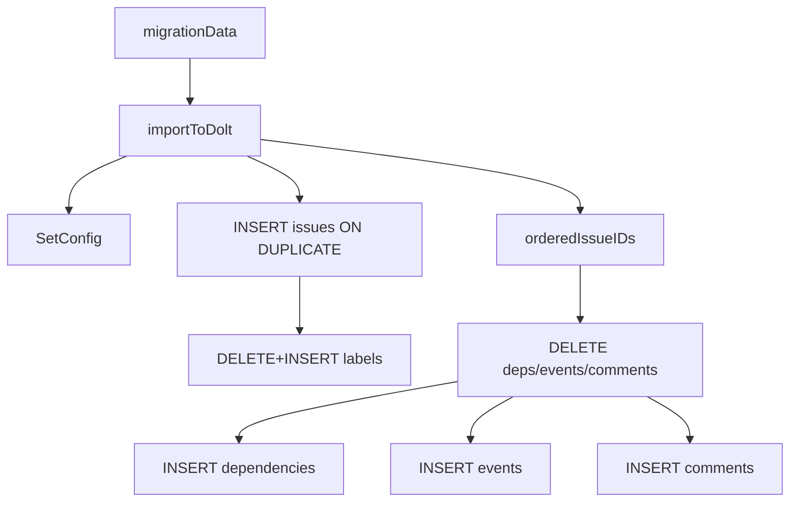

# sqlite_to_dolt_import_pipeline（`cmd/bd/migrate_import.go`）技术深潜

这个子模块解决的是迁移里最“脏活累活”的部分：把从 SQLite 抽取出来的历史数据，尽可能**可重复、可恢复、可兼容**地写入 Dolt。你可以把它理解成“搬家时的装箱和落位工序”：`migrationData` 是待搬清单，`importToDolt` 是搬运与摆放，辅助函数负责把不同格式、不同年代的数据“磨平”成 Dolt 能稳定接受的形状。

## 为什么它存在

在 SQLite → Dolt 迁移中，最容易出问题的不是“能不能写进去”，而是：

- 再跑一次会不会重复污染（幂等性）
- 老数据字段缺失/格式异常时会不会中途崩溃（兼容性）
- 关系表（dependencies/events/comments）是否与 issue 主表一致（一致性）

`migrate_import.go` 的设计明显偏向“迁移鲁棒性优先”。它不追求最少 SQL，而是显式做了 `DELETE + INSERT` 的关系重建、`ON DUPLICATE KEY UPDATE` 的防重入保护、以及大量 nullable/JSON 归一化。

## 心智模型：`migrationData` 是快照，`importToDolt` 是重放器

把 `migrationData` 想成一份“源库快照包”，里面不仅有 issues，还包含 labels、deps、events、comments、config。`importToDolt` 的职责不是“增量 patch”，而是把这份快照**尽量确定性**地重放到 Dolt：

1. 先写配置（`store.SetConfig`）
2. 在单个 DB transaction 内写 issue 主体
3. 对每个 issue 重建 labels
4. 对迁移范围 issue 先清空 relations，再重放 dependencies/events/comments
5. 提交事务

这是一种“source-authoritative”思路：对于本次迁移涉及的 issue，目标端关系集合以源快照为准。

## 架构与数据流

流程上它依赖 [Dolt Storage Backend](Dolt Storage Backend.md) 提供的 `*dolt.DoltStore` 和底层 SQL 事务能力；数据模型来自 [Core Domain Types](Core Domain Types.md)（`types.Issue`、`types.Dependency`、`types.Event`、`types.Comment`）。

## 核心组件与关键函数

### `migrationData`

`migrationData` 是迁移输入载体，字段覆盖主实体和关联实体：

- `issues []*types.Issue`
- `labelsMap map[string][]string`
- `depsMap map[string][]*types.Dependency`
- `eventsMap map[string][]*types.Event`
- `commentsMap map[string][]*types.Comment`
- `config map[string]string`
- `prefix` / `issueCount`

它的价值是把“抽取阶段”和“导入阶段”解耦：导入器不关心你是通过 CGO 还是 sqlite3 CLI 抽出来的，只要给它这个结构就能工作。

### `importToDolt(ctx, store, data)`

这是导入核心。几个非显而易见但很关键的实现点：

- **事务边界大而完整**：issues + labels + deps/events/comments 同事务提交，失败整体回滚。
- **issue upsert**：使用 `INSERT ... ON DUPLICATE KEY UPDATE`，允许重复导入覆盖。
- **关系重建策略**：对迁移 issue 先 `DELETE` 再 `INSERT`，保障重跑确定性。
- **局部容错**：dependencies/events/comments 插入失败会 warning 并继续，而不是立刻中断整个迁移。

这种策略的取舍是：主流程尽量完成（高可用），但可能留下“部分关系失败”告警，需要后续诊断。

### `findSQLiteDB(beadsDir)`

自动发现 SQLite 文件：优先 `beads.db` / `issues.db`，否则扫描 `.db` 文件并排除包含 `backup` 的文件名。它是“零配置迁移”的 UX 支撑。

### 时间与 JSON 归一化辅助

- `parseNullTime`：兼容多种时间布局，解析失败返回 `nil`。
- `normalizeDependencyMetadata` / `normalizedJSONBytes`：空串转 `{}` 或 `nil`，非 JSON 字符串会被 JSON-encode。
- `formatJSONArray`：把字符串数组编码成 JSON 字符串（匹配 Dolt schema 预期）。

这些函数本质在做“脏数据减震器”：尽量让旧数据通过，而不是因为格式小瑕疵中断全量迁移。

### nullable helpers

`nullableString`、`nullableStringPtr`、`nullableIntPtr`、`nullableInt`、`nullableFloat32Ptr` 统一了 SQL 参数的 NULL 语义，避免业务逻辑里散落空值判断。

### `orderedIssueIDs(data)`

从 `data.issues` 抽取去重后的稳定顺序 ID 列表，后续关系清理与导入按这个顺序执行。它减少了 map 迭代导致的不稳定性。

## 设计取舍

1. **正确性/幂等性 > 极简 SQL**
   - 采用 `DELETE + INSERT` 重建关系，SQL 次数更多，但重跑结果更可预测。
2. **兼容性 > 严格校验**
   - 对格式异常元数据尽量归一化处理，不轻易 fail-fast。
3. **迁移完成率 > 全有或全无关系写入**
   - 某些关系插入失败仅告警，避免小范围坏数据拖垮整批迁移。

## 新贡献者注意事项

- `labelsMap`、`depsMap` 等在本文件不总是直接使用；主路径很多时候以 `issue` 内嵌字段为准，改动前要先核对抽取端填充策略。
- `ON DUPLICATE KEY UPDATE` 是刻意保留的“防御性幂等”，不要轻易删。
- 关系表“先删后插”针对的是迁移 issue ID 集，不是全库删；若扩大范围会产生灾难性数据丢失。
- 进度打印受 `jsonOutput` 控制，新增输出时要保持 JSON 模式无噪音。

## 参考

- [CLI Migration Commands](CLI Migration Commands.md)
- [migration_safety_and_cutover](migration_safety_and_cutover.md)
- [Dolt Storage Backend](Dolt Storage Backend.md)
- [Core Domain Types](Core Domain Types.md)
