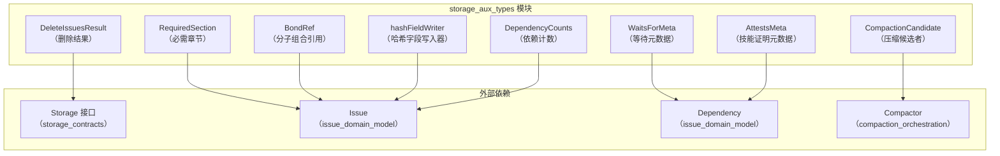

# storage_aux_types 模块技术深度解析

## 模块概述

### 问题空间：为什么需要这个模块？

在构建一个复杂的 issue 跟踪系统时，核心领域模型（如 `Issue`、`Dependency`）解决了"是什么"的问题，存储接口解决了"如何存取"的问题。但在实际操作中，我们还面临一系列具体的工程问题：

1. **智能压缩决策**：如何识别哪些已关闭的 Issue 适合压缩？压缩能节省多少空间？哪些 Issue 虽然已关闭但仍被频繁引用，不应压缩？

2. **批量操作的可观测性**：执行批量删除时，如何告诉用户删除了多少内容、级联影响了多少依赖、产生了哪些孤立问题？

3. **灵活的元数据扩展**：依赖关系有多种类型（blocks、waits-for、attests 等），每种需要不同的元数据。如何在不使核心结构爆炸的情况下支持这种多样性？

4. **内容完整性验证**：如何判断两个 Issue 是否内容完全一致？如何检测内容变更？

5. **复合结构的可追溯性**：当多个 Issue 组合成一个复合分子时，如何记录它们的来源和组合方式？

`storage_aux_types` 模块就是为了解决这些问题而设计的——它不直接处理业务逻辑，而是为存储操作提供必要的支持结构。

### 模块定位

`storage_aux_types` 模块是一个"辅助工具箱"，为存储层提供各种支持性的数据类型。它不像核心领域模型那样定义基本业务概念，也不像存储接口那样定义契约，而是提供一系列**元数据结构、操作结果和实用工具**，帮助存储系统更高效地工作。

想象一下，如果你把存储系统看作一个仓库，核心领域模型是仓库里的货物，存储接口是仓库的装卸规则，那么 `storage_aux_types` 就是：
- 用于标记哪些货物可以打包压缩的标签（`CompactionCandidate`）
- 记录一次批量删除操作结果的清单（`DeleteIssuesResult`）
- 用于模板验证的章节要求（`RequiredSection`）
- 记录分子组合来源的凭证（`BondRef`）
- 计算内容哈希的工具（`hashFieldWriter`）

这些类型不是系统的"主角"，但它们是让存储系统能够高效、可靠运行的"幕后英雄"。

### 心智模型

理解这个模块的关键是建立一个"操作支持层"的心智模型：

```
┌─────────────────────────────────────────────────────────┐
│           业务逻辑层（创建、修改、查询 Issue）            │
└─────────────────────────────┬───────────────────────────┘
                              │
┌─────────────────────────────▼───────────────────────────┐
│         核心领域模型（Issue、Dependency 等）              │
└─────────────────────────────┬───────────────────────────┘
                              │
        ┌─────────────────────┴─────────────────────┐
        │                                           │
┌───────▼──────────┐                    ┌──────────▼────────┐
│  存储接口层      │                    │ storage_aux_types │
│  (如何存取)      │                    │  (操作支持层)      │
└──────────────────┘                    └───────────────────┘
```

在这个模型中，`storage_aux_types` 位于核心领域模型旁边，为各种存储操作提供支持：
- **操作前**：提供决策信息（如 `CompactionCandidate`）
- **操作中**：提供工具支持（如 `hashFieldWriter`）
- **操作后**：提供结果反馈（如 `DeleteIssuesResult`）

## 架构视图



## 核心组件详解

### 1. 存储操作结果类型

#### CompactionCandidate（压缩候选者）
`CompactionCandidate` 用于标识适合进行内容压缩的 issue。当一个 issue 已关闭且内容较大时，系统可以通过压缩其描述和备注来节省存储空间。

**设计意图**：
- 提供压缩决策所需的所有信息：关闭时间、原始大小、预估压缩后大小、依赖数量
- 让压缩子系统可以在不加载完整 issue 内容的情况下做出智能决策

**字段说明**：
- `IssueID`: 候选 issue 的标识符
- `ClosedAt`: issue 关闭时间（用于判断是否足够"旧"）
- `OriginalSize`: 压缩前的内容大小
- `EstimatedSize`: 预估的压缩后大小
- `DependentCount`: 依赖此 issue 的数量（影响压缩优先级）

#### DeleteIssuesResult（删除操作结果）
`DeleteIssuesResult` 记录批量删除操作的统计信息，包括删除的 issue 数量、级联删除的依赖、标签和事件数量，以及因此变成孤儿的 issue 列表。

**设计意图**：
- 提供完整的删除操作反馈，让调用者了解操作的影响范围
- 支持级联删除场景的审计和调试
- 帮助识别可能需要后续处理的孤儿 issue

**字段说明**：
- `DeletedCount`: 直接删除的 issue 数量
- `DependenciesCount`: 级联删除的依赖关系数量
- `LabelsCount`: 级联删除的标签数量
- `EventsCount`: 级联删除的事件数量
- `OrphanedIssues`: 因删除操作变成孤儿的 issue ID 列表

### 2. 分子和依赖元数据类型

#### BondRef（分子组合引用）
`BondRef` 记录复合分子的来源信息。当多个原型或分子被组合在一起时，`BondRef` 记录哪些源被组合以及它们是如何连接的。

**设计意图**：
- 支持复合分子的可追溯性
- 允许系统理解分子的结构和组成方式
- 为分子的展开、分析和调试提供基础数据

**字段说明**：
- `SourceID`: 源原型或分子的 ID
- `BondType`: 组合类型（sequential、parallel、conditional、root）
- `BondPoint`: 连接点（issue ID 或空表示根）

**组合类型常量**：
- `BondTypeSequential`: B 在 A 完成后运行
- `BondTypeParallel`: B 与 A 并行运行
- `BondTypeConditional`: B 仅在 A 失败时运行
- `BondTypeRoot`: 标记主要/根组件

#### WaitsForMeta（等待元数据）
`WaitsForMeta` 存储 `waits-for` 类型依赖的元数据，用于实现扇出门控机制。

**设计意图**：
- 支持动态子任务的等待逻辑
- 允许灵活的门控策略（等待所有 vs 等待任意一个）
- 为复杂的工作流编排提供基础

**字段说明**：
- `Gate`: 门控类型（"all-children" 或 "any-children"）
- `SpawnerID`: 标识生成要等待的子任务的步骤/issue

#### AttestsMeta（技能证明元数据）
`AttestsMeta` 存储 `attests` 类型依赖的元数据，用于实现技能证明系统。

**设计意图**：
- 支持 HOP 实体跟踪和 CV 链
- 允许实体证明其他实体的技能水平
- 为技能评估和任务分配提供数据基础

**字段说明**：
- `Skill`: 被证明的技能标识符
- `Level`: 技能水平
- `Date`: 证明日期（RFC3339 格式）
- `Evidence`: 可选的支持证据
- `Notes`: 可选的自由格式备注

### 3. 实用工具类型

#### RequiredSection（必需章节）
`RequiredSection` 描述 issue 类型的推荐章节，用于 `bd lint` 和 `bd create --validate` 进行模板验证。

**设计意图**：
- 提高 issue 质量和一致性
- 为不同类型的 issue 提供结构化的内容指导
- 支持模板化的 issue 创建流程

**字段说明**：
- `Heading`: Markdown 标题，例如 "## 复现步骤"
- `Hint`: 关于应包含内容的指导

#### hashFieldWriter（哈希字段写入器）
`hashFieldWriter` 提供辅助方法，用于将字段写入哈希。每个方法写入值后跟着一个空分隔符以确保一致性。

**设计意图**：
- 为 `Issue.ComputeContentHash()` 提供可靠的字段序列化机制
- 确保相同的内容始终生成相同的哈希值
- 处理不同类型字段的规范化写入

**主要方法**：
- `str(s string)`: 写入字符串
- `int(n int)`: 写入整数
- `strPtr(p *string)`: 写入字符串指针
- `float32Ptr(p *float32)`: 写入 float32 指针
- `duration(d time.Duration)`: 写入持续时间
- `flag(b bool, label string)`: 写入布尔标志
- `entityRef(e *EntityRef)`: 写入实体引用

#### DependencyCounts（依赖计数）
`DependencyCounts` 保存依赖和被依赖的计数。

**设计意图**：
- 提供高效的依赖关系统计信息
- 避免在需要计数时加载所有依赖关系
- 支持 UI 展示和查询优化

**字段说明**：
- `DependencyCount`: 此 issue 依赖的 issue 数量
- `DependentCount`: 依赖此 issue 的 issue 数量

## 设计决策与权衡

### 1. 元数据存储策略：JSON 序列化 vs 独立字段
**决策**：将复杂元数据（如 `WaitsForMeta` 和 `AttestsMeta`）存储为 JSON 字符串，而不是为每个字段创建独立的数据库列。

**权衡分析**：
- ✅ **灵活性**：可以轻松添加新字段而不改变数据库模式
- ✅ **简单性**：减少了数据库表的复杂性
- ❌ **查询性能**：无法高效查询元数据内部的字段
- ❌ **类型安全**：失去了编译时的类型检查

**适用场景**：这种设计适合元数据主要用于读取和展示，而不是用于过滤和排序的场景。

### 2. 内容哈希计算：稳定排序 vs 字典序
**决策**：在 `ComputeContentHash()` 中使用预定义的稳定字段顺序，而不是按字典序排序。

**权衡分析**：
- ✅ **可读性**：字段顺序与 `Issue` 结构体定义一致，便于理解和维护
- ✅ **性能**：不需要在运行时进行排序
- ❌ **脆弱性**：添加新字段时必须小心保持顺序，否则会破坏哈希兼容性

**适用场景**：这种设计适合字段相对稳定，且需要高效哈希计算的场景。

### 3. 删除结果：完整记录 vs 仅计数
**决策**：`DeleteIssuesResult` 不仅记录数量，还记录孤儿 issue 的完整 ID 列表。

**权衡分析**：
- ✅ **完整性**：提供了操作影响的完整视图
- ✅ **可恢复性**：可以识别需要后续处理的 issue
- ❌ **内存使用**：对于大型删除操作，ID 列表可能占用较多内存
- ❌ **网络传输**：通过 API 返回时会增加数据传输量

**适用场景**：这种设计适合删除操作相对受控，且后续处理可能需要孤儿 issue 列表的场景。

## 与其他模块的关系

### 依赖关系
- **被 [issue_domain_model](issue_domain_model.md) 依赖**：`BondRef`、`RequiredSection` 和 `hashFieldWriter` 被 `Issue` 结构体直接使用
- **被 [storage_contracts](storage_contracts.md) 依赖**：`DeleteIssuesResult` 和 `CompactionCandidate` 被存储接口使用
- **被 [compaction_orchestration](compaction_orchestration.md) 依赖**：`CompactionCandidate` 是压缩子系统的核心输入

### 数据流动
1. **压缩流程**：
   - 存储层查询符合条件的 issue，创建 `CompactionCandidate` 列表
   - 压缩子系统根据候选者信息决定压缩优先级
   - 执行压缩后，更新 issue 的压缩元数据

2. **删除流程**：
   - 调用者发起批量删除请求
   - 存储层执行删除操作，收集统计信息
   - 返回 `DeleteIssuesResult`，包含操作的完整影响

3. **哈希计算流程**：
   - `Issue.ComputeContentHash()` 创建 `hashFieldWriter`
   - 按稳定顺序写入所有实质性字段
   - 生成 SHA256 哈希值作为内容标识符

## 使用指南与最佳实践

### 使用 CompactionCandidate
```go
// 识别压缩候选者
candidates := []CompactionCandidate{
    {
        IssueID:        "bd-abc123",
        ClosedAt:       time.Now().Add(-30 * 24 * time.Hour), // 30天前关闭
        OriginalSize:   10000,
        EstimatedSize:  2000,
        DependentCount: 0,
    },
}

// 根据依赖数量和关闭时间排序
sort.Slice(candidates, func(i, j int) bool {
    if candidates[i].DependentCount != candidates[j].DependentCount {
        return candidates[i].DependentCount < candidates[j].DependentCount
    }
    return candidates[i].ClosedAt.Before(candidates[j].ClosedAt)
})
```

### 使用 BondRef
```go
// 创建复合分子
compound := &Issue{
    ID:    "bd-mol-compound",
    Title: "复合工作流",
    BondedFrom: []BondRef{
        {
            SourceID:  "bd-step-1",
            BondType:  BondTypeRoot,
            BondPoint: "",
        },
        {
            SourceID:  "bd-step-2",
            BondType:  BondTypeSequential,
            BondPoint: "bd-step-1",
        },
    },
}

// 检查是否为复合分子
if compound.IsCompound() {
    constituents := compound.GetConstituents()
    // 处理组成部分...
}
```

## 注意事项与常见陷阱

### 1. 哈希计算的稳定性
⚠️ **问题**：修改 `ComputeContentHash()` 中的字段顺序或写入方式会导致相同内容生成不同的哈希值，这可能破坏同步和冲突检测逻辑。

✅ **最佳实践**：
- 如需修改哈希计算，考虑版本控制机制
- 添加新字段时，始终追加到末尾
- 在注释中明确记录哪些字段是"实质性"的，哪些不是

### 2. 元数据 JSON 的错误处理
⚠️ **问题**：解析 `WaitsForMeta` 和 `AttestsMeta` 时，无效的 JSON 会导致回退到默认值，这可能掩盖数据损坏问题。

✅ **最佳实践**：
- 在解析失败时记录警告日志
- 考虑添加数据验证步骤
- 对于关键数据，考虑使用更严格的解析策略

### 3. BondRef 的一致性
⚠️ **问题**：`BondRef` 中的 `SourceID` 可能指向已删除的 issue，导致引用失效。

✅ **最佳实践**：
- 删除 issue 时检查是否有其他 issue 的 `BondRef` 指向它
- 考虑添加级联更新或标记机制
- 在展示复合分子时处理缺失的源引用

## 数据流程

### 内容哈希计算流程

当 issue 内容发生变化时，`ComputeContentHash()` 方法会被调用：

1. 创建 SHA256 哈希实例
2. 使用 `hashFieldWriter` 按稳定顺序写入所有实质性字段
3. 每个字段后跟随空分隔符以确保唯一性
4. 返回十六进制编码的哈希值

这个哈希用于检测内容变化、验证数据完整性，以及在同步过程中识别冲突。

### 依赖关系元数据处理流程

当创建或查询复杂依赖关系时：

1. 创建相应的元数据结构（`WaitsForMeta`、`AttestsMeta` 等）
2. 序列化为 JSON 存储在 `Dependency.Metadata` 字段中
3. 查询时反序列化并使用专用解析函数（如 `ParseWaitsForGateMetadata`）处理

这种设计保持了核心 `Dependency` 结构的简洁性，同时支持丰富的类型特定元数据。

## 设计决策

### 1. 元数据作为 JSON 字符串

**决策**：将类型特定的依赖关系元数据存储为 JSON 字符串，而不是扩展核心结构。

**权衡**：
- ✅ 保持核心结构简洁和向后兼容
- ✅ 支持灵活的元数据扩展
- ❌ 需要序列化/反序列化开销
- ❌ 类型安全性降低（运行时验证）

**原因**：依赖关系类型多样且可能频繁变化，使用 JSON 允许在不修改数据库 schema 的情况下添加新的元数据类型。

### 2. 哈希计算的字段顺序

**决策**：在计算内容哈希时使用严格的字段顺序。

**权衡**：
- ✅ 确保跨系统和时间的哈希一致性
- ✅ 避免字段顺序变化导致的哈希变化
- ❌ 添加新字段时需要小心维护顺序

**原因**：内容哈希用于冲突检测和数据完整性验证，确定性是最重要的要求。

### 3. 删除操作的丰富统计信息

**决策**：`DeleteIssuesResult` 包含多个计数器和孤立 issue 列表。

**权衡**：
- ✅ 提供完整的操作审计跟踪
- ✅ 允许验证删除操作的完整性
- ❌ 增加了操作的内存开销

**原因**：批量删除是高风险操作，完整的反馈对于调试和用户信任至关重要。

## 与其他模块的关系

### 依赖关系
- **issue_domain_model**：使用 `BondRef` 跟踪复合分子谱系
- **query_and_projection_types**：使用 `DependencyCounts` 进行聚合查询

### 被依赖关系
- **Compaction** 模块：使用 `CompactionCandidate` 识别压缩候选
- **Storage Interfaces**：使用 `DeleteIssuesResult` 返回批量删除结果
- **CLI Commands**：使用 `RequiredSection` 进行模板验证

### 与核心领域模型的边界

在 `issue_domain_model` 中，`Issue` 已经包含了压缩相关字段（例如 `CompactionLevel`、`CompactedAt`、`CompactedAtCommit`、`OriginalSize`）。这意味着：

- `Issue` 负责**持久状态**（压缩之后的事实）。
- `CompactionCandidate` 负责**流程前态**（谁应该被压缩）。

这是一种常见分层：实体模型描述"是什么"，辅助类型描述"这次操作要怎么做/做完怎么样"。

## 使用指南

### 计算内容哈希

```go
issue := &types.Issue{Title: "Test Issue", Description: "Test Description"}
hash := issue.ComputeContentHash()
// hash 现在包含 issue 内容的 SHA256 哈希
```

### 使用 WaitsForMeta

```go
meta := &types.WaitsForMeta{
    Gate:      types.WaitsForAllChildren,
    SpawnerID: "step-123",
}
metaJSON, _ := json.Marshal(meta)

dependency := &types.Dependency{
    Metadata: string(metaJSON),
    // 其他字段...
}
```

### 解析 WaitsForMeta

```go
gateType := types.ParseWaitsForGateMetadata(dependency.Metadata)
if gateType == types.WaitsForAllChildren {
    // 等待所有子项完成
}
```

## 注意事项和陷阱

1. **哈希计算的字段排除**：`ComputeContentHash()` 明确排除了 ID、时间戳和压缩元数据，确保相同内容在不同克隆中产生相同哈希。

2. **空分隔符的重要性**：`hashFieldWriter` 使用空分隔符避免字段边界模糊，例如 "abc" + "def" 应该与 "abcd" + "ef" 产生不同的哈希。

3. **元数据的 JSON 验证**：在存储前确保元数据是有效的 JSON，以避免查询时的解析错误。

4. **RequiredSection 的 Markdown 格式**：`Heading` 字段应该包含完整的 Markdown 标题标记（如 "##"），而不仅仅是文本。

5. **DeleteIssuesResult 的 OrphanedIssues**：这个列表只包含直接由于删除操作而变成孤立的 issue，不包括间接孤立的 issue。

6. **别把 `CompactionCandidate` 当作 `Issue` 的替代品**：它是"候选视图"，信息刻意不完整。需要真实内容时应回到 `Storage.GetIssue` 这类接口读取完整实体。

7. **扩展字段时先想"它是实体事实，还是操作回执"**：前者应进 `Issue` 或相关领域类型，后者才应进 `storage_aux_types`。这个边界守住了，类型体系就不会失控。

## 总结

`storage_aux_types` 模块是存储系统的"工具箱"，提供了描述数据操作结果、元数据和辅助信息的标准化方式。虽然这些类型不像核心领域模型那样引人注目，但它们对于系统的高效运行和可靠性至关重要。

该模块的设计体现了几个关键原则：
1. **实用性优先**：每个类型都解决一个具体的实际问题
2. **灵活性与简单性的平衡**：在保持简单的同时提供足够的灵活性
3. **可追溯性**：支持操作结果的完整记录和审计
4. **性能考虑**：为常见场景提供优化的数据结构

理解这个模块的关键是认识到它的"辅助"性质——它不是为了解决某个大问题，而是为了让解决大问题的过程更加顺畅。

## 参考阅读

- [Core Domain Types](Core Domain Types.md)
- [issue_domain_model](issue_domain_model.md)
- [Storage Interfaces](Storage Interfaces.md)
- [storage_contracts](storage_contracts.md)
- [compaction_orchestration](compaction_orchestration.md)

如果你接下来要改 compaction 路径，建议同步阅读 `Compactor` 及其 `compactableStore` 约束实现，以确认候选筛选字段与实际执行策略是否一致。

```go
type CompactionCandidate struct {
    IssueID        string
    ClosedAt       time.Time
    OriginalSize   int
    EstimatedSize  int
    DependentCount int
}
```

它存在的原因不是“多一个结构体更整洁”，而是为了表达一个关键事实：**压缩是有门槛和收益评估的**，不是对所有 issue 一刀切。

### 字段设计背后的意图

`IssueID` 和 `ClosedAt` 用于标识和时间资格判断（例如只处理已关闭一段时间的问题）。`OriginalSize` 与 `EstimatedSize` 体现了压缩决策的成本收益视角：如果估算收益很低，就没必要触发总结/压缩流水线。`DependentCount` 则把图结构风险引入决策：被大量节点依赖的 issue，通常更需要谨慎压缩或采用更保守策略。

### 与其他模块的连接

从代码注释可知它“Used by the compact subsystem”。在 `internal.compact.compactor` 中，`Compactor` 依赖一个 `compactableStore` 接口，包含：

- `CheckEligibility(ctx, issueID, tier)`
- `GetIssue(ctx, issueID)`
- `UpdateIssue(ctx, issueID, updates, actor)`
- `ApplyCompaction(ctx, issueID, tier, originalSize, compactedSize, commitHash)`
- `AddComment(ctx, issueID, actor, comment)`

这说明压缩流程是“资格检查 → 读取 issue → 更新正文/元数据 → 记录压缩信息 → 写注释”的事务链路。`CompactionCandidate` 在这条链路中的角色，是把“谁值得进链路”这件事先结构化表达出来。

### 设计取舍

这里选择了**显式字段而非嵌套整个 `Issue`**。好处是低耦合、低载荷、语义聚焦；代价是如果筛选规则未来依赖更多上下文，需要扩展该结构体字段或通过额外查询补齐。

---

## `DeleteIssuesResult`

`DeleteIssuesResult` 是批量删除操作的聚合回执：

```go
type DeleteIssuesResult struct {
    DeletedCount      int
    DependenciesCount int
    LabelsCount       int
    EventsCount       int
    OrphanedIssues    []string
}
```

删除 issue 在图数据里不是一个“点删除”动作，而是带级联影响的“子图变更”。这个结构体就是把影响面显式化，避免调用方只能通过 side effect 猜测结果。

### 字段设计背后的意图

`DeletedCount` 只告诉你主操作完成多少；而 `DependenciesCount`、`LabelsCount`、`EventsCount` 告诉你伴随清理规模，便于审计、展示和回归验证。`OrphanedIssues` 则是最关键的补充信息：它把“删除后孤立”的对象明确交给上层处理，而不是静默吞掉。

### 为什么不是只返回 `error`

如果只返回 `error`，你最多知道“成了/没成”；但批处理里最重要的问题往往是“成了多少、影响了什么、还留下什么后续动作”。`DeleteIssuesResult` 的存在，本质是在正确性之外，补上**可运营性与可观测性**。

### 设计取舍

这里采用了**统计聚合而非明细清单**（例如没有返回被删 dependency 的完整列表）。这显著降低了返回体体积，也减少了接口耦合；代价是做深度审计时需要额外查询事件流或审计日志。

---

## 依赖关系分析（基于现有代码与注释）

`storage_aux_types` 本身几乎不依赖业务模块：除了 `time.Time` 没有额外技术依赖，这是一种有意的“底层类型纯净化”策略。它降低了循环依赖风险，也使这些类型可以被存储层、压缩层、CLI 层稳定复用。

从被依赖角度，当前可确认的关系有两条：

1. `CompactionCandidate` 由 compact 子系统消费（源码注释明确指出）。
2. `DeleteIssuesResult` 由批量删除流程消费，用于承载级联删除统计（源码注释明确指出）。

需要说明的是：你给出的模块树没有展开精确 `depended_by` 边列表，因此无法在这里逐函数列出“谁调用谁”。如果要补全到调用点级别，建议进一步拉取 `compact` 与 `storage` 相关实现文件做静态引用扫描。

---

## 与核心领域模型的边界

在 `issue_domain_model` 中，`Issue` 已经包含了压缩相关字段（例如 `CompactionLevel`、`CompactedAt`、`CompactedAtCommit`、`OriginalSize`）。这意味着：

- `Issue` 负责**持久状态**（压缩之后的事实）。
- `CompactionCandidate` 负责**流程前态**（谁应该被压缩）。

这是一种常见分层：实体模型描述“是什么”，辅助类型描述“这次操作要怎么做/做完怎么样”。

---

## 使用方式与示例

典型用法是把它们当作服务边界上的输入/输出载体，而不是在内部逻辑里反复拼 `map[string]any`。

```go
candidate := types.CompactionCandidate{
    IssueID:        "ISS-123",
    ClosedAt:       closedAt,
    OriginalSize:   12000,
    EstimatedSize:  2500,
    DependentCount: 3,
}

// 交给 compact 子系统做资格与执行决策
```

```go
result := types.DeleteIssuesResult{
    DeletedCount:      10,
    DependenciesCount: 24,
    LabelsCount:       12,
    EventsCount:       37,
    OrphanedIssues:    []string{"ISS-9", "ISS-42"},
}

// 上层可直接用于 CLI 输出、审计摘要、后续修复任务派发
```

对于新贡献者，建议把这两个类型当作“跨层契约”，保持字段语义稳定；比起频繁重命名，更应通过新增字段实现演进。

---

## 关键权衡与非显式约束

这个模块体现了一个非常明确的工程偏好：**简单、稳定、可组合优先于过度抽象**。没有方法、没有接口、没有泛型包装，只有结构化数据。这降低了认知成本，也避免了“类型层做业务决策”。

但这也带来约束：

- 字段没有内建校验逻辑，调用方必须保证数据有效性（例如大小估算非负、`OrphanedIssues` 的 ID 合法）。
- 统计字段是“结果快照”，不是可追溯明细；如果你需要详细变更记录，要接审计/事件模块。
- 一旦这些字段被 CLI、API、集成层广泛消费，随意修改字段语义会引发跨模块连锁变更。

---

## 新人最该注意的坑

第一，别把 `CompactionCandidate` 当作 `Issue` 的替代品。它是“候选视图”，信息刻意不完整。需要真实内容时应回到 `Storage.GetIssue` 这类接口读取完整实体。

第二，别把 `DeleteIssuesResult` 里的计数当成强事务证明。它表达的是操作结果摘要，不等价于数据库层面的可重复读审计日志。

第三，扩展字段时先想“它是实体事实，还是操作回执”。前者应进 `Issue` 或相关领域类型，后者才应进 `storage_aux_types`。这个边界守住了，类型体系就不会失控。

---

## 综合总结

### 模块价值回顾

`storage_aux_types` 模块虽然不是系统中最引人注目的部分，但它解决了一系列实际的工程问题，这些问题如果不妥善处理，会严重影响系统的可用性和可维护性：

1. **问题解决**：提供了压缩决策、批量删除统计、灵活元数据等关键功能
2. **心智模型**：作为"操作支持层"，为核心领域模型提供辅助支持
3. **数据流动**：参与压缩、删除、哈希计算等关键流程
4. **设计权衡**：在灵活性与简单性、完整性与性能之间做出了明智选择
5. **注意事项**：新贡献者需要理解类型边界、哈希稳定性、元数据解析等关键点

### 关键设计原则

这个模块的设计体现了几个重要的软件工程原则：

1. **关注点分离**：将操作支持与核心业务逻辑明确分离
2. **实用主义**：每个类型都解决一个具体的实际问题，不过度设计
3. **向后兼容**：通过 JSON 元数据等方式保持扩展性
4. **可观测性**：提供完整的操作结果和反馈
5. **性能意识**：为常见场景提供优化的数据结构

### 作为新贡献者的下一步

如果你是刚加入团队的高级工程师，建议按以下路径深入理解这个模块：

1. **先阅读核心代码**：查看 `internal/types/storage_ext.go` 和 `internal/types/types.go` 中的相关定义
2. **理解调用上下文**：找到使用这些类型的实际代码（特别是压缩模块和存储实现）
3. **动手实验**：尝试使用这些类型进行一些简单操作，观察其行为
4. **阅读相关文档**：查看 [issue_domain_model](issue_domain_model.md) 和 [storage_contracts](storage_contracts.md) 等相关模块的文档
5. **参与代码审查**：通过查看历史变更和代码审查来理解设计演变

通过这样的路径，你将能够不仅理解这些类型"是什么"，更能理解它们"为什么是这样"，以及如何在未来的开发中正确使用和扩展它们。

---

## 参考阅读

- [Core Domain Types](Core Domain Types.md)
- [issue_domain_model](issue_domain_model.md)
- [Storage Interfaces](Storage Interfaces.md)
- [storage_contracts](storage_contracts.md)
- [store_core](store_core.md)

如果你接下来要改 compaction 路径，建议同步阅读 `Compactor` 及其 `compactableStore` 约束实现，以确认候选筛选字段与实际执行策略是否一致。
