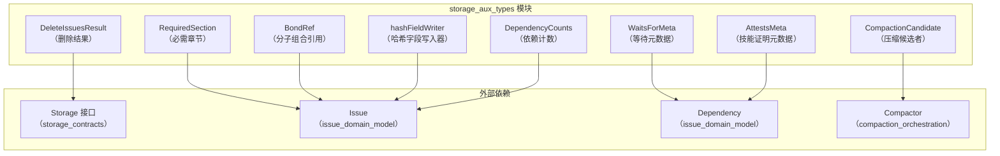

# storage_aux_types 模块

## 模块概述

`storage_aux_types` 模块是一个"辅助工具箱"，为存储层提供各种支持性的数据类型。它不像核心领域模型那样定义基本业务概念，也不像存储接口那样定义契约，而是提供一系列**元数据结构、操作结果和实用工具**，帮助存储系统更高效地工作。

想象一下，如果你把存储系统看作一个仓库，核心领域模型是仓库里的货物，存储接口是仓库的装卸规则，那么 `storage_aux_types` 就是：
- 用于标记哪些货物可以打包压缩的标签（`CompactionCandidate`）
- 记录一次批量删除操作结果的清单（`DeleteIssuesResult`）
- 用于模板验证的章节要求（`RequiredSection`）
- 记录分子组合来源的凭证（`BondRef`）
- 计算内容哈希的工具（`hashFieldWriter`）

这些类型不是系统的"主角"，但它们是让存储系统能够高效、可靠运行的"幕后英雄"。

## 架构视图



## 核心组件详解

### 1. 存储操作结果类型

#### CompactionCandidate（压缩候选者）
`CompactionCandidate` 用于标识适合进行内容压缩的 issue。当一个 issue 已关闭且内容较大时，系统可以通过压缩其描述和备注来节省存储空间。

**设计意图**：
- 提供压缩决策所需的所有信息：关闭时间、原始大小、预估压缩后大小、依赖数量
- 让压缩子系统可以在不加载完整 issue 内容的情况下做出智能决策

**字段说明**：
- `IssueID`: 候选 issue 的标识符
- `ClosedAt`: issue 关闭时间（用于判断是否足够"旧"）
- `OriginalSize`: 压缩前的内容大小
- `EstimatedSize`: 预估的压缩后大小
- `DependentCount`: 依赖此 issue 的数量（影响压缩优先级）

#### DeleteIssuesResult（删除操作结果）
`DeleteIssuesResult` 记录批量删除操作的统计信息，包括删除的 issue 数量、级联删除的依赖、标签和事件数量，以及因此变成孤儿的 issue 列表。

**设计意图**：
- 提供完整的删除操作反馈，让调用者了解操作的影响范围
- 支持级联删除场景的审计和调试
- 帮助识别可能需要后续处理的孤儿 issue

**字段说明**：
- `DeletedCount`: 直接删除的 issue 数量
- `DependenciesCount`: 级联删除的依赖关系数量
- `LabelsCount`: 级联删除的标签数量
- `EventsCount`: 级联删除的事件数量
- `OrphanedIssues`: 因删除操作变成孤儿的 issue ID 列表

### 2. 分子和依赖元数据类型

#### BondRef（分子组合引用）
`BondRef` 记录复合分子的来源信息。当多个原型或分子被组合在一起时，`BondRef` 记录哪些源被组合以及它们是如何连接的。

**设计意图**：
- 支持复合分子的可追溯性
- 允许系统理解分子的结构和组成方式
- 为分子的展开、分析和调试提供基础数据

**字段说明**：
- `SourceID`: 源原型或分子的 ID
- `BondType`: 组合类型（sequential、parallel、conditional、root）
- `BondPoint`: 连接点（issue ID 或空表示根）

**组合类型常量**：
- `BondTypeSequential`: B 在 A 完成后运行
- `BondTypeParallel`: B 与 A 并行运行
- `BondTypeConditional`: B 仅在 A 失败时运行
- `BondTypeRoot`: 标记主要/根组件

#### WaitsForMeta（等待元数据）
`WaitsForMeta` 存储 `waits-for` 类型依赖的元数据，用于实现扇出门控机制。

**设计意图**：
- 支持动态子任务的等待逻辑
- 允许灵活的门控策略（等待所有 vs 等待任意一个）
- 为复杂的工作流编排提供基础

**字段说明**：
- `Gate`: 门控类型（"all-children" 或 "any-children"）
- `SpawnerID`: 标识生成要等待的子任务的步骤/issue

#### AttestsMeta（技能证明元数据）
`AttestsMeta` 存储 `attests` 类型依赖的元数据，用于实现技能证明系统。

**设计意图**：
- 支持 HOP 实体跟踪和 CV 链
- 允许实体证明其他实体的技能水平
- 为技能评估和任务分配提供数据基础

**字段说明**：
- `Skill`: 被证明的技能标识符
- `Level`: 技能水平
- `Date`: 证明日期（RFC3339 格式）
- `Evidence`: 可选的支持证据
- `Notes`: 可选的自由格式备注

### 3. 实用工具类型

#### RequiredSection（必需章节）
`RequiredSection` 描述 issue 类型的推荐章节，用于 `bd lint` 和 `bd create --validate` 进行模板验证。

**设计意图**：
- 提高 issue 质量和一致性
- 为不同类型的 issue 提供结构化的内容指导
- 支持模板化的 issue 创建流程

**字段说明**：
- `Heading`: Markdown 标题，例如 "## 复现步骤"
- `Hint`: 关于应包含内容的指导

#### hashFieldWriter（哈希字段写入器）
`hashFieldWriter` 提供辅助方法，用于将字段写入哈希。每个方法写入值后跟着一个空分隔符以确保一致性。

**设计意图**：
- 为 `Issue.ComputeContentHash()` 提供可靠的字段序列化机制
- 确保相同的内容始终生成相同的哈希值
- 处理不同类型字段的规范化写入

**主要方法**：
- `str(s string)`: 写入字符串
- `int(n int)`: 写入整数
- `strPtr(p *string)`: 写入字符串指针
- `float32Ptr(p *float32)`: 写入 float32 指针
- `duration(d time.Duration)`: 写入持续时间
- `flag(b bool, label string)`: 写入布尔标志
- `entityRef(e *EntityRef)`: 写入实体引用

#### DependencyCounts（依赖计数）
`DependencyCounts` 保存依赖和被依赖的计数。

**设计意图**：
- 提供高效的依赖关系统计信息
- 避免在需要计数时加载所有依赖关系
- 支持 UI 展示和查询优化

**字段说明**：
- `DependencyCount`: 此 issue 依赖的 issue 数量
- `DependentCount`: 依赖此 issue 的 issue 数量

## 设计决策与权衡

### 1. 元数据存储策略：JSON 序列化 vs 独立字段
**决策**：将复杂元数据（如 `WaitsForMeta` 和 `AttestsMeta`）存储为 JSON 字符串，而不是为每个字段创建独立的数据库列。

**权衡分析**：
- ✅ **灵活性**：可以轻松添加新字段而不改变数据库模式
- ✅ **简单性**：减少了数据库表的复杂性
- ❌ **查询性能**：无法高效查询元数据内部的字段
- ❌ **类型安全**：失去了编译时的类型检查

**适用场景**：这种设计适合元数据主要用于读取和展示，而不是用于过滤和排序的场景。

### 2. 内容哈希计算：稳定排序 vs 字典序
**决策**：在 `ComputeContentHash()` 中使用预定义的稳定字段顺序，而不是按字典序排序。

**权衡分析**：
- ✅ **可读性**：字段顺序与 `Issue` 结构体定义一致，便于理解和维护
- ✅ **性能**：不需要在运行时进行排序
- ❌ **脆弱性**：添加新字段时必须小心保持顺序，否则会破坏哈希兼容性

**适用场景**：这种设计适合字段相对稳定，且需要高效哈希计算的场景。

### 3. 删除结果：完整记录 vs 仅计数
**决策**：`DeleteIssuesResult` 不仅记录数量，还记录孤儿 issue 的完整 ID 列表。

**权衡分析**：
- ✅ **完整性**：提供了操作影响的完整视图
- ✅ **可恢复性**：可以识别需要后续处理的 issue
- ❌ **内存使用**：对于大型删除操作，ID 列表可能占用较多内存
- ❌ **网络传输**：通过 API 返回时会增加数据传输量

**适用场景**：这种设计适合删除操作相对受控，且后续处理可能需要孤儿 issue 列表的场景。

## 与其他模块的关系

### 依赖关系
- **被 [issue_domain_model](issue_domain_model.md) 依赖**：`BondRef`、`RequiredSection` 和 `hashFieldWriter` 被 `Issue` 结构体直接使用
- **被 [storage_contracts](storage_contracts.md) 依赖**：`DeleteIssuesResult` 和 `CompactionCandidate` 被存储接口使用
- **被 [compaction_orchestration](compaction_orchestration.md) 依赖**：`CompactionCandidate` 是压缩子系统的核心输入

### 数据流动
1. **压缩流程**：
   - 存储层查询符合条件的 issue，创建 `CompactionCandidate` 列表
   - 压缩子系统根据候选者信息决定压缩优先级
   - 执行压缩后，更新 issue 的压缩元数据

2. **删除流程**：
   - 调用者发起批量删除请求
   - 存储层执行删除操作，收集统计信息
   - 返回 `DeleteIssuesResult`，包含操作的完整影响

3. **哈希计算流程**：
   - `Issue.ComputeContentHash()` 创建 `hashFieldWriter`
   - 按稳定顺序写入所有实质性字段
   - 生成 SHA256 哈希值作为内容标识符

## 使用指南与最佳实践

### 使用 CompactionCandidate
```go
// 识别压缩候选者
candidates := []CompactionCandidate{
    {
        IssueID:        "bd-abc123",
        ClosedAt:       time.Now().Add(-30 * 24 * time.Hour), // 30天前关闭
        OriginalSize:   10000,
        EstimatedSize:  2000,
        DependentCount: 0,
    },
}

// 根据依赖数量和关闭时间排序
sort.Slice(candidates, func(i, j int) bool {
    if candidates[i].DependentCount != candidates[j].DependentCount {
        return candidates[i].DependentCount < candidates[j].DependentCount
    }
    return candidates[i].ClosedAt.Before(candidates[j].ClosedAt)
})
```

### 使用 BondRef
```go
// 创建复合分子
compound := &Issue{
    ID:    "bd-mol-compound",
    Title: "复合工作流",
    BondedFrom: []BondRef{
        {
            SourceID:  "bd-step-1",
            BondType:  BondTypeRoot,
            BondPoint: "",
        },
        {
            SourceID:  "bd-step-2",
            BondType:  BondTypeSequential,
            BondPoint: "bd-step-1",
        },
    },
}

// 检查是否为复合分子
if compound.IsCompound() {
    constituents := compound.GetConstituents()
    // 处理组成部分...
}
```

## 注意事项与常见陷阱

### 1. 哈希计算的稳定性
⚠️ **问题**：修改 `ComputeContentHash()` 中的字段顺序或写入方式会导致相同内容生成不同的哈希值，这可能破坏同步和冲突检测逻辑。

✅ **最佳实践**：
- 如需修改哈希计算，考虑版本控制机制
- 添加新字段时，始终追加到末尾
- 在注释中明确记录哪些字段是"实质性"的，哪些不是

### 2. 元数据 JSON 的错误处理
⚠️ **问题**：解析 `WaitsForMeta` 和 `AttestsMeta` 时，无效的 JSON 会导致回退到默认值，这可能掩盖数据损坏问题。

✅ **最佳实践**：
- 在解析失败时记录警告日志
- 考虑添加数据验证步骤
- 对于关键数据，考虑使用更严格的解析策略

### 3. BondRef 的一致性
⚠️ **问题**：`BondRef` 中的 `SourceID` 可能指向已删除的 issue，导致引用失效。

✅ **最佳实践**：
- 删除 issue 时检查是否有其他 issue 的 `BondRef` 指向它
- 考虑添加级联更新或标记机制
- 在展示复合分子时处理缺失的源引用

## 总结

`storage_aux_types` 模块是存储系统的"瑞士军刀"，提供了一系列实用的数据类型和工具。虽然这些类型不像核心领域模型那样引人注目，但它们对于系统的高效运行和可靠性至关重要。

该模块的设计体现了几个关键原则：
1. **实用性优先**：每个类型都解决一个具体的实际问题
2. **灵活性与简单性的平衡**：在保持简单的同时提供足够的灵活性
3. **可追溯性**：支持操作结果的完整记录和审计
4. **性能考虑**：为常见场景提供优化的数据结构

理解这个模块的关键是认识到它的"辅助"性质——它不是为了解决某个大问题，而是为了让解决大问题的过程更加顺畅。
