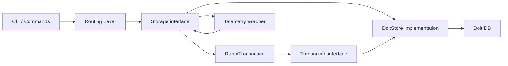

# storage_contracts 模块深度解析

`storage_contracts` 的核心价值，不是“把 issue 存起来”这么简单，而是**把业务层对存储的期望固化成一份稳定契约**。你可以把它想象成机场的登机口标准：飞机机型（Dolt、Mock、未来别的后端）可以变化，但登机口的对接尺寸不能乱。这一层通过 `Storage` 与 `Transaction` 两个接口，把“问题跟踪系统真正需要的存储能力”统一暴露出来，让上层命令、同步、路由、遥测等模块只依赖语义，不依赖具体数据库实现。

---

## 1. 这个模块解决了什么问题？

如果没有 `storage_contracts`，最直接的做法是让 CLI、同步引擎、集成适配器直接调用 `internal/storage/dolt` 的具体类型和方法。短期看快，长期会出现三个结构性问题：第一，调用方会和 Dolt 细节强耦合，测试时难以替换；第二，业务语义会散落在各处，每个调用方都“自定义”一套存储访问方式；第三，一旦后端细节变化，改动会向整个系统扩散。

`storage_contracts` 的设计洞察是：**系统真正稳定的不是“如何存”，而是“应该能做什么”**。于是这里定义的不是表结构，也不是 SQL，而是业务动作级别的能力面：Issue CRUD、依赖关系、标签、工作队列查询、评论事件、配置、事务与生命周期。调用方只认这些动作；实现方（当前是 Dolt）负责把动作映射到具体存储机制。

这让它在架构上扮演“领域存储端口（port）”的角色：它不是 orchestrator，也不是 adapter，本质上是跨模块的稳定协议层。

---

## 2. 心智模型：把它当作“领域数据库操作系统”

理解这个模块最有效的方式，是把 `Storage` 看成一个**单仓库领域数据操作系统 API**，而 `Transaction` 是它的“原子批处理上下文”。

`Storage` 负责暴露“平时你能做什么”，例如创建 issue、打标签、查询 blocked work；`RunInTransaction` 则像“进入内核态”，在一个原子边界内执行一组操作，确保要么都成功要么都失败。`Transaction` 不是 `Storage` 的完整复制，而是**刻意收敛后的子集**：只暴露事务内需要、且语义可控的方法（并额外提供 `SetMetadata` / `GetMetadata` 这类偏内部状态操作）。

这种分层非常关键：它阻止调用方在事务回调里做不受控的“全能力调用”，降低实现复杂度，同时明确事务场景的边界。

---

## 3. 架构与数据流



上图里的关键点是：上层模块（CLI、路由、同步流程）并不直接面向 Dolt 细节，而是依赖 `Storage`。在普通单操作路径上，调用方直接通过 `Storage` 方法执行；在需要一致性的复合操作路径上，调用 `RunInTransaction(ctx, commitMsg, fn)`，由实现方创建事务并把 `Transaction` 传入回调。

数据流上可以分成两类热点路径。第一类是高频读写路径：`GetIssue`、`SearchIssues`、`UpdateIssue`、`AddDependency`、`GetReadyWork` 等，服务日常命令和自动化流程。第二类是“工作流型原子路径”：例如一次操作里同时创建 issue、关联依赖、打标签、写评论，此时通过 `RunInTransaction` 把多个动作包进单次提交边界。

注：当前提供的代码片段只包含契约定义与注释，没有实现体；因此具体 SQL/表级数据流在本模块内不可见，应参考后端实现文档。

---

## 4. 组件级深潜

## 4.1 `Storage` 接口：业务语义优先的总入口

`Storage` 是系统最核心的存储抽象。它的方法分组本身就体现了设计意图：以业务能力组织，而不是按底层资源组织。

### Issue CRUD

`CreateIssue` / `CreateIssues` / `GetIssue` / `GetIssueByExternalRef` / `GetIssuesByIDs` / `UpdateIssue` / `CloseIssue` / `DeleteIssue` / `SearchIssues` 这组方法覆盖了 issue 生命周期。值得注意的是：

`UpdateIssue` 的 `updates map[string]interface{}` 体现了“部分字段更新”的灵活性，调用方不需要为每种更新组合定义新方法。但 tradeoff 是类型安全下降，字段名与值类型约束转移到运行时。

`CloseIssue` 显式包含 `reason`、`actor`、`session`，说明关闭不是单纯状态写入，而是有审计/事件语义的领域动作。

`SearchIssues` 接受 `query string` + `types.IssueFilter`，暗示文本查询与结构化过滤并存，查询层能力被放在存储契约面上统一暴露。

### Dependency

`AddDependency` / `RemoveDependency` / `GetDependencies` / `GetDependents` / 带 metadata 版本 / `GetDependencyTree` 体现了本系统将“依赖图”作为一等公民，而不是 issue 的附属字段。

特别是 `GetDependencyTree(ctx, issueID, maxDepth, showAllPaths, reverse)` 把遍历策略参数化：深度限制、路径收敛策略、方向切换。这是一种把图查询复杂度留给后端实现、让上层保持简洁的选择。

### Label、Work Queries、Comments/Events、Statistics、Configuration

`Label` 与 `Work Queries` 分离，表明“标签是基础事实”，“ready/blocked/epic closure 是推导视图”。

评论和事件并列也很有意思：`AddIssueComment` / `GetIssueComments` 关注用户内容；`GetEvents` / `GetAllEventsSince` 关注系统时间线和增量消费。

配置方法 (`SetConfig` / `GetConfig` / `GetAllConfig`) 放在同一接口里，是为了支持“业务动作 + 仓库配置”协同流程（这点在 `Transaction` 的 config 方法中也得到呼应）。

### 事务与生命周期

`RunInTransaction` 是整个接口最关键的方法之一。它不是简单暴露 begin/commit，而是以回调形式强制事务边界由实现方托管，从而统一处理提交、回滚、panic 安全与资源释放。

`Close()` 则提供生命周期收口，允许调用方显式释放底层连接或句柄资源。

## 4.2 `Transaction` 接口：受控原子域

`Transaction` 的注释明确了语义：同一连接、提交前对外不可见、任意错误回滚、panic 回滚、回调成功才提交。这个约束集合是调用方能放心编排复杂写路径的根基。

它与 `Storage` 的一个关键差异，是**读写一致性语义被显式考虑**。例如 `GetIssue`、`SearchIssues` 的注释强调 “For read-your-writes within transaction”，意味着你可以在同一事务里写后立刻读到新值，避免上层自己实现缓存/补丁合并。

`GetDependencyRecords` 返回 `[]*types.Dependency`（而不是 `[]*types.Issue`）也很有代表性：事务内部往往需要原始关系记录做校验和重写，比面向展示的 issue 展开结果更合适。

`SetMetadata` / `GetMetadata` 的存在说明事务不仅服务用户可见数据，也服务内部状态（注释中写了 import hashes 场景）。这是一种务实选择：把“过程性元数据”和业务写入放进同一个原子边界，减少分布式补偿逻辑。

## 4.3 哨兵错误（sentinel errors）

模块定义了四个错误值：`ErrAlreadyClaimed`、`ErrNotFound`、`ErrNotInitialized`、`ErrPrefixMismatch`。这让调用方可以用 `errors.Is` 做稳定分支，而不依赖字符串匹配。

这些错误对应的都是高价值控制流节点：资源存在性、初始化状态、ID 前缀一致性、并发领取冲突。它们在接口层定义，意味着无论底层后端报什么细节错误，都应在实现层被映射为统一语义。

---

## 5. 依赖关系分析（谁调用它、它依赖谁）

从代码与模块树可确认的关系如下：

`storage_contracts` 直接依赖 `internal/types`（即 `types.Issue`、`types.Dependency`、`types.IssueFilter`、`types.TreeNode`、`types.Comment`、`types.Event` 等领域类型）。这说明该模块是“存储契约 + 领域类型”耦合，而不是通用 KV 接口。

根据接口注释，`Storage` 由 `*dolt.DoltStore` 实现（在 Dolt Storage Backend 模块）。因此调用链是“上层模块 -> `Storage` 接口 -> Dolt 实现”。在测试或包装场景，也可替换为 mock/proxy（接口注释已明确这个意图）。

模块树还显示 Telemetry 存在 `internal.telemetry.storage.InstrumentedStorage`。虽然当前代码片段没展示其实现，但命名上它很可能是 `Storage` 的装饰器/包装器，用于在不改变调用方的前提下增加观测能力。

关于 depended-by 的广度：从模块树可见，大量 CLI、集成、路由、压缩、分子等模块都围绕存储能力运作。即使它们未在本片段逐条列出调用点，这个接口明显处于系统热路径中心，属于高影响面契约。

参考阅读：

- [dolt_storage_backend](dolt_storage_backend.md)
- [routing](routing.md)
- [telemetry](telemetry.md)
- [core_domain_types](core_domain_types.md)

---

## 6. 关键设计取舍

最显著的取舍是“接口广度 vs 实现自由度”。`Storage` 方法很多，意味着实现方负担较重；但换来的好处是调用方几乎不需要知道底层细节，业务语义集中统一，避免上层重复拼装数据访问逻辑。

第二个取舍是“动态更新灵活性 vs 编译期类型安全”。`UpdateIssue` 使用 `map[string]interface{}`，非常灵活，适合命令式 patch；代价是字段拼写、类型错误只能运行时发现。

第三个取舍是“事务回调封装 vs 手动事务控制”。回调模式更安全、也更一致，能统一 panic 回滚语义；代价是高级调用方失去细粒度事务生命周期操作（例如手动分段提交）。就当前系统以业务命令为主的场景，这个取舍是合理的。

第四个取舍是“接口中包含配置/元数据能力 vs 关注点纯粹性”。严格分层会把配置和业务拆开，但这里选择放在同一契约（尤其事务内）以支持原子工作流，减少跨系统一致性问题。

---

## 7. 使用方式与示例

最常见的使用方式是：简单操作直接调 `Storage`；复合操作进入 `RunInTransaction`。

```go
func createIssueWithDeps(ctx context.Context, store storage.Storage, issue *types.Issue, dep *types.Dependency, actor string) error {
    return store.RunInTransaction(ctx, "bd: create issue with dependency", func(tx storage.Transaction) error {
        if err := tx.CreateIssue(ctx, issue, actor); err != nil {
            return err
        }
        if err := tx.AddDependency(ctx, dep, actor); err != nil {
            return err
        }
        if err := tx.AddLabel(ctx, issue.ID, "backend", actor); err != nil {
            return err
        }
        return nil
    })
}
```

对错误处理，建议优先使用哨兵错误分流：

```go
iss, err := store.GetIssue(ctx, id)
if err != nil {
    switch {
    case errors.Is(err, storage.ErrNotFound):
        // 转成上层 404 / 用户提示
    case errors.Is(err, storage.ErrNotInitialized):
        // 引导初始化流程
    default:
        // 其他系统错误
    }
    return err
}
_ = iss
```

---

## 8. 新贡献者最该注意的坑

第一，`Transaction` 不是 `Storage` 的完整超集。不要假设所有 `Storage` 方法在事务内都可用；需要的能力应先核对接口，必要时通过新增契约演进，而不是在调用方绕过事务边界。

第二，`UpdateIssue` 的 `updates` 是弱类型入口。贡献代码时要保持字段命名与值类型约定一致，并在实现层做好校验与错误映射，否则会产生“调用成功但语义错误”的隐性 bug。

第三，事务回调内的 `ctx` 传播要一致。虽然接口允许传入 `context.Context`，但若在回调内混用外部取消策略，可能造成部分操作被中断并触发回滚，要明确这是预期行为。

第四，`ErrPrefixMismatch` 与 `ErrNotInitialized` 暗示了 ID/配置的隐式契约：issue 标识并非纯自由字符串，而受仓库配置约束。任何导入、迁移、跨系统同步逻辑都必须先满足这个前提。

第五，`CloseIssue`、评论、事件相关方法带有 `actor` / `session` / 时间等语义参数，说明系统重视审计轨迹。新增功能时不要只关心“数据最终值”，还要考虑事件历史是否完整。

---

## 9. 总结

`storage_contracts` 的本质，是把“issue 领域的存储动作”抽象成稳定边界，并把原子性、一致性、可替换实现这三件事同时兼顾。对新加入的高级工程师来说，最重要的不是记住每个方法，而是抓住两条主线：**`Storage` 是日常业务能力面，`Transaction` 是受控原子执行面**。围绕这条边界扩展功能，系统才能在继续演进后端实现的同时，保持上层模块的稳定性。
