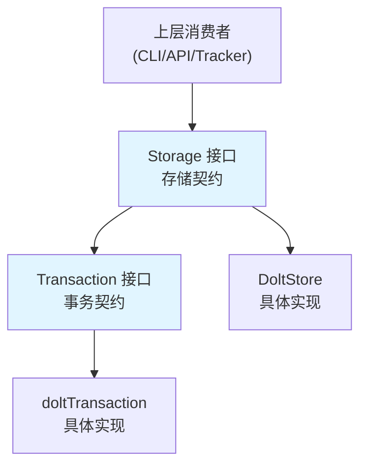

# Storage Contracts 模块技术深度解析

## 1. 模块概述

`storage_contracts` 模块是整个系统的存储抽象层核心，它定义了问题跟踪系统与底层持久化存储之间的契约。这个模块不包含具体的存储实现，而是通过接口定义了一组操作规范，使得上层应用可以与任何满足这些接口的存储后端进行交互。

**为什么需要这个模块？** 在一个复杂的问题跟踪系统中，存储层是基础设施的关键部分。直接依赖具体的存储实现（如 Dolt）会导致系统高度耦合，难以进行单元测试、难以替换存储技术、难以实现中间件（如缓存、审计、遥测等）。通过定义清晰的接口契约，我们实现了关注点分离：上层逻辑只需要知道"我能做什么"，而不需要知道"具体怎么做"。

## 2. 核心架构

### 2.1 核心组件关系图



### 2.2 架构角色

这个模块在系统中扮演着**防腐层（Anti-Corruption Layer）**的角色。它定义了两个核心接口：

- **`Storage`**: 定义了完整的存储操作集合，是系统与存储交互的主要入口点
- **`Transaction`**: 定义了在单个事务上下文中可执行的操作子集，确保多个操作的原子性

这种设计类似于传统的仓库模式（Repository Pattern），但更侧重于接口契约而非具体实现。

## 3. 核心组件深度解析

### 3.1 `Storage` 接口

`Storage` 接口是存储层的主要契约，它提供了对问题跟踪系统所有核心实体的操作方法。

**设计意图**：
- 定义完整的存储操作范围，涵盖问题、依赖、标签、评论、事件等所有核心领域概念
- 提供事务支持，确保复杂操作的原子性
- 作为系统与具体存储实现之间的边界，降低耦合度

**核心方法分类**：

1. **问题 CRUD 操作**：
   - `CreateIssue` / `CreateIssues`：创建单个或多个问题
   - `GetIssue` / `GetIssueByExternalRef` / `GetIssuesByIDs`：查询问题
   - `UpdateIssue`：更新问题
   - `CloseIssue`：关闭问题
   - `DeleteIssue`：删除问题
   - `SearchIssues`：搜索问题

2. **依赖管理**：
   - `AddDependency` / `RemoveDependency`：添加/移除依赖关系
   - `GetDependencies` / `GetDependents`：查询依赖/被依赖关系
   - `GetDependenciesWithMetadata` / `GetDependentsWithMetadata`：查询带元数据的依赖关系
   - `GetDependencyTree`：获取依赖树

3. **标签管理**：
   - `AddLabel` / `RemoveLabel`：添加/移除标签
   - `GetLabels` / `GetIssuesByLabel`：查询标签

4. **工作查询**：
   - `GetReadyWork`：获取可进行的工作
   - `GetBlockedIssues`：获取被阻塞的问题
   - `GetEpicsEligibleForClosure`：获取可关闭的史诗

5. **评论和事件**：
   - `AddIssueComment` / `GetIssueComments`：管理评论
   - `GetEvents` / `GetAllEventsSince`：查询事件

6. **配置和统计**：
   - `GetStatistics`：获取统计信息
   - `SetConfig` / `GetConfig` / `GetAllConfig`：管理配置

7. **事务和生命周期**：
   - `RunInTransaction`：执行事务
   - `Close`：关闭存储连接

**关键设计决策**：
- 所有方法都接收 `context.Context` 作为第一个参数，支持取消和超时控制
- 操作问题时通常需要 `actor` 参数，用于审计跟踪
- 错误类型通过包级变量定义（如 `ErrNotFound`），便于调用者进行类型断言

### 3.2 `Transaction` 接口

`Transaction` 接口定义了在单个数据库事务中可执行的操作，是实现原子性工作流的关键。

**设计意图**：
- 提供原子性保证：多个操作要么全部成功，要么全部失败
- 支持"读取自己写入"（read-your-writes）语义：在事务内可以读取到之前未提交的修改
- 隔离事务内部状态与外部状态，确保一致性

**核心特性**：

1. **操作子集**：`Transaction` 接口包含了 `Storage` 接口的大部分方法，但也有一些差异：
   - 包含了一些仅在事务上下文中有意义的方法，如 `GetDependencyRecords`
   - 包含了元数据操作方法 `SetMetadata` / `GetMetadata`
   - 包含了导入评论的方法 `ImportIssueComment`

2. **事务语义**（文档中明确说明）：
   - 所有操作共享同一个数据库连接
   - 更改在提交前对其他连接不可见
   - 任何操作返回错误都会导致回滚
   - 回调函数 panic 也会导致回滚
   - 回调成功返回则提交事务

**使用示例**：
```go
err := store.RunInTransaction(ctx, "bd: create parent and child", func(tx storage.Transaction) error {
    // 创建父问题
    if err := tx.CreateIssue(ctx, parentIssue, actor); err != nil {
        return err // 触发回滚
    }
    // 创建子问题
    if err := tx.CreateIssue(ctx, childIssue, actor); err != nil {
        return err // 触发回滚
    }
    // 添加依赖关系
    if err := tx.AddDependency(ctx, dep, actor); err != nil {
        return err // 触发回滚
    }
    return nil // 触发提交
})
```

## 4. 数据流程分析

### 4.1 典型操作流程

让我们通过一个典型的场景——创建带有依赖关系的多个问题——来理解数据如何通过这个模块：

1. **上层调用**：CLI 或 API 层调用 `Storage.RunInTransaction` 方法
2. **事务启动**：存储实现启动一个数据库事务
3. **回调执行**：
   - 调用 `Transaction.CreateIssue` 创建第一个问题
   - 调用 `Transaction.CreateIssue` 创建第二个问题
   - 调用 `Transaction.AddDependency` 创建依赖关系
4. **提交或回滚**：
   - 如果所有操作成功，事务提交
   - 如果任何操作失败，事务回滚

### 4.2 依赖关系

从依赖图来看，这个模块处于系统的底层位置：
- **被依赖**：几乎所有上层模块都依赖这个模块（CLI、Tracker Integration、Molecules 等）
- **依赖**：仅依赖 `internal/types` 模块，定义了核心领域类型

这种单向依赖关系是良好设计的标志——核心契约不应该依赖上层逻辑。

## 5. 设计决策与权衡

### 5.1 接口 vs 具体实现

**决策**：定义清晰的接口契约，具体实现放在单独的包中

**理由**：
- 支持依赖倒置原则（DIP）：上层模块依赖抽象，而不是具体实现
- 便于测试：可以轻松创建 mock 实现进行单元测试
- 支持多种实现：理论上可以有除 Dolt 之外的其他存储实现

**权衡**：
- 增加了一定的抽象层复杂性
- 接口变更成本较高，会影响所有实现和使用者

### 5.2 事务模型

**决策**：采用回调式事务模型（`RunInTransaction` + 函数参数）

**理由**：
- 自动管理事务生命周期：不需要手动调用 Begin/Commit/Rollback
- 异常安全：自动处理 panic 和错误情况
- 简洁的 API：使用者专注于业务逻辑，而不是事务管理

**权衡**：
- 回调函数可能导致"回调地狱"，特别是在复杂逻辑中
- 调试相对困难，因为事务逻辑封装在回调中

### 5.3 错误处理

**决策**：使用包级错误变量（如 `ErrNotFound`）

**理由**：
- 调用者可以使用 `errors.Is` 进行精确的错误类型判断
- 统一的错误定义，便于跨层错误处理

**权衡**：
- 错误上下文信息有限（不过可以通过 `fmt.Errorf` 包装提供更多上下文）

### 5.4 接口粒度

**决策**：选择相对粗粒度的接口设计，例如 `UpdateIssue` 接受 `map[string]interface{}`

**理由**：
- 灵活性：可以在不修改接口的情况下支持新字段的更新
- 简单性：减少了接口方法的数量
- 性能：减少了往返次数

**权衡**：
- 失去了一些类型安全性（使用 `interface{}`）
- 调用者需要了解字段名称和类型

## 6. 使用指南与最佳实践

### 6.1 何时使用事务

使用事务的场景：
- 多个操作需要原子性保证（如创建问题+依赖+标签）
- 需要读取自己写入的数据（read-your-writes）
- 配置和数据需要同时更新

不使用事务的场景：
- 单个独立操作（如只读查询）
- 操作之间没有一致性要求

### 6.2 最佳实践

1. **错误处理**：
   - 始终检查返回的错误
   - 使用 `errors.Is` 检查特定错误类型（如 `ErrNotFound`）

2. **事务使用**：
   - 保持事务简短，避免长时间持有事务
   - 在事务回调中避免进行外部 I/O 操作
   - 确保回调函数中的所有错误都被正确返回

3. **上下文管理**：
   - 始终传递有效的 `context.Context`
   - 利用上下文进行超时和取消控制

## 7. 注意事项与潜在陷阱

### 7.1 事务注意事项

- **事务内和事务外操作的隔离**：事务内的修改在提交前对事务外不可见
- **避免嵌套事务**：当前接口设计不支持嵌套事务
- **错误处理**：在事务回调中，任何错误都会导致回滚，确保你真正想回滚时才返回错误

### 7.2 并发注意事项

- 虽然接口没有明确规定，但底层实现（如 Dolt）可能有并发限制
- 注意 `ErrAlreadyClaimed` 错误，表示并发声明冲突

### 7.3 初始化注意事项

- 注意 `ErrNotInitialized` 错误，表示数据库尚未正确初始化
- 注意 `ErrPrefixMismatch` 错误，表示问题 ID 与配置的前缀不匹配

## 8. 扩展与集成点

### 8.1 实现自定义存储

如果需要实现自定义存储后端，需要：
1. 实现 `Storage` 接口的所有方法
2. 实现 `Transaction` 接口的所有方法
3. 确保事务语义符合文档描述

### 8.2 中间件模式

由于 `Storage` 是接口，可以轻松实现中间件包装：
- 缓存层：缓存常用查询结果
- 审计层：记录所有操作
- 遥测层：收集性能指标
- 日志层：记录所有操作日志

## 9. 相关模块

- [Core Domain Types](Core-Domain-Types.md)：定义了接口中使用的所有核心类型
- [Dolt Storage Backend](Dolt-Storage-Backend.md)：`Storage` 接口的具体实现
- [Tracker Integration Framework](Tracker-Integration-Framework.md)：主要的 `Storage` 接口消费者之一
- [CLI Command Context](CLI-Command-Context.md)：另一个主要的 `Storage` 接口消费者
