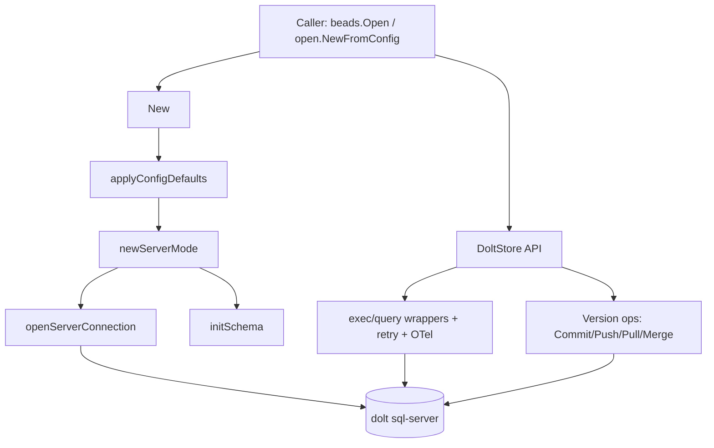

# store_core（`internal/storage/dolt/store.go`）技术深潜

`store_core` 是 Beads 存储体系里的“数据库内核适配层”：上层想要的是一个稳定的 `Storage`/版本控制语义接口，下层却是一个会抖动（网络、连接池、server 重启、catalog 延迟）、并且带 Git-like 行为（commit/branch/merge/push/pull）的 Dolt SQL Server。这个模块存在的核心价值，不是“把 SQL 调通”，而是把 **不稳定的运行时现实** 包装成 **可预测的工程契约**。如果没有它，上层命令与服务代码会被迫到处处理重试、锁错误、schema 初始化竞态、测试污染生产端口、提交作者不一致等问题，系统会迅速退化成“每层都懂一点 Dolt，结果每层都踩坑”。

## 这个模块解决的根本问题

从问题空间看，Beads 不是在用一个普通 MySQL：它在用 Dolt 这种“SQL + 版本控制”混合体。朴素实现通常会做三件事：直接 `sql.Open`、直接 `Exec`/`Query`、把 `CALL DOLT_*` 暴露给上层。这样短期可跑，但在真实场景会马上失效：

第一，Dolt server 模式下，连接中断、短暂拒连、`unknown database`（catalog 尚未刷新）、`no root value found`（新库 root 初始化竞态）都可能出现，且很多是短暂可恢复错误。朴素实现会把这些波动直接放大给调用方。  
第二，Dolt 默认 `--no-auto-commit` 场景下，写操作如果没有显式事务，会出现“看似成功、连接关闭后回滚”的静默数据丢失。  
第三，测试环境如果误连生产 Dolt 端口，测试库可能污染生产实例。这个风险不是理论问题，代码里明确把它当作“防火墙级”风险处理。  
第四，版本控制操作（commit/push/pull/merge）本质上是状态机，不是普通 CRUD；如果作者、分支、remote 处理不一致，会导致历史不可追溯或协作异常。

`store_core` 的设计意图是：把这些“数据库外部性”吸收到一个边界内，让上层只面对可组合、可观测、可恢复的存储行为。

## 心智模型：把它当成“带缓冲与保险丝的变速箱”

可以把 `DoltStore` 想象成汽车变速箱，不直接创造动力（业务逻辑），但把发动机（上层调用）和路况（Dolt server + 网络 + 版本控制）之间的扭矩转换成稳定输出。

- `Config` 像点火参数：确定你连接哪里、以什么身份提交、是否只读、是否自动拉起 server。  
- `New` / `newServerMode` 像启动车辆：先确认道路通（TCP 探测），必要时尝试自动拉起服务器，再完成连接与 schema 就绪。  
- `execContext` / `queryContext` / `queryRowContext` 像减震器：自动重试可恢复错误，记录 telemetry，并把锁错误包装成可执行建议。  
- `Commit`/`Push`/`Pull`/`Merge` 像变速档位：把 Dolt 的版本控制原语映射为上层可调用操作，并补上作者确定性、凭证注入、pull 后自增修复等工程细节。  

这种模型的关键点是：`DoltStore` 既是 **gateway**（统一入口），也是 **stability layer**（稳定性层），还是一部分 **policy layer**（安全策略与默认行为）。

## 架构与数据流



从依赖关系看，已有图中明确可见 `beads.Open -> internal.storage.dolt.store.New`。另外，`beads.OpenFromConfig` 走的是 `internal.storage.dolt.open.NewFromConfig`（该函数再返回 `DoltStore`），说明 `store_core` 是“标准入口”与“配置入口”最终都会收敛到的核心实现层。上层依赖它提供统一 `Storage` 能力，下层依赖它正确编排 `dolt sql-server` 的连接、初始化与版本控制调用。

一次典型读写路径如下：

1. 调用方通过 `New(ctx, cfg)` 构建实例。`applyConfigDefaults` 先注入默认值与环境变量覆盖。  
2. `newServerMode` 先做 TCP fail-fast。如果不可达，会根据 `AutoStart`、是否本地 host、以及 Gas Town 环境条件选择不同启动策略。  
3. `openServerConnection` 建立连接池、创建数据库（如不存在）、等待 catalog 可见，然后 `Ping`。  
4. 非只读模式下执行 `initSchema`（含快速 schema version 短路、DDL、默认配置、index migration、视图与 `RunMigrations`）。  
5. 运行期 API 使用统一包装：写经 `execContext`（显式事务 + retry），读经 `queryContext`/`queryRowContext`（retry + span）。  
6. 若调用版本控制操作（如 `Pull`），除 `CALL DOLT_PULL` 外，还会执行 `resetAutoIncrements` 修复自增游标，避免后续插入冲突。

## 组件深潜

### `DoltStore`：状态与策略的承载体

`DoltStore` 不是一个轻量句柄，而是一个“有状态的运行时对象”。它持有：

- 连接状态：`db`, `connStr`, `closed`, `mu`, `readOnly`。  
- 生命周期级缓存：`customStatusCache` / `customTypeCache` / `blockedIDsCache` 及相关标记（这些字段在当前文件中定义，但具体填充逻辑在其他实现文件）。  
- 可观测性缓存：`spanAttrsOnce` + `spanAttrsCache`，避免热路径重复分配 attribute 切片。  
- 版本控制上下文：`committerName`, `committerEmail`, `remote`, `branch`, `remoteUser`, `remotePassword`。

设计上它偏向“单对象集中策略”，而不是把连接、schema、vc 操作拆成多个对象。这降低了调用复杂度，但也意味着该结构会逐渐变重；贡献者新增字段时要格外注意并发保护与生命周期边界。

### `Config` 与 `applyConfigDefaults`：配置解析即安全边界

`Config` 同时覆盖本地运行、测试、Hosted Dolt、自动拉起 server 等场景。`applyConfigDefaults` 的关键价值是把“默认值逻辑”变成显式策略，而不是散落在调用点。

非显而易见但很重要的点：

- `Database` 在 `BEADS_TEST_MODE=1` 且有 `Path` 时，按路径 hash 生成 `testdb_*`，实现共享测试 server 下的库隔离。  
- 端口解析优先级中，测试模式有“强制护栏”：若将落到生产默认端口 `3307`，会改为 `1`（快速失败），并在 `New` 中再次 hard guard。  
- remote/server 凭证优先从环境变量取，减少命令行明文暴露。  

这体现的是“默认安全失败（fail closed）”策略：宁可让测试失败，也不冒污染生产库的风险。

### `New` 与 `newServerMode`：连接建立不是一行 `sql.Open`

`New` 的作用是参数验证 + 防护（测试误连生产端口时直接 panic）+ 委托 `newServerMode`。这里选择 panic 而非普通 error，是在“数据污染风险”语境下的强硬策略：让 CI/测试立即爆炸，避免静默继续。

`newServerMode` 则是完整启动编排：

- 先 `net.DialTimeout` 快速判断 server 可达。  
- 不可达时三分支处理：`AutoStart` 本地自动拉起；Gas Town 环境委托 `gt dolt start`；否则返回包含操作建议的错误。  
- 建立连接后执行 `Ping`，然后创建 `DoltStore`，再做 schema 初始化重试（针对 Dolt 初始化竞态）。

这个流程选择了“启动期多做事，运行期少踩坑”。代价是初始化逻辑复杂，但换来调用方几乎无感知的稳定体验。

### `openServerConnection` / `buildServerDSN`：连接层的工程化细节

`buildServerDSN` 明确写入 `timeout/readTimeout/writeTimeout`，防止 agent 或 CLI 永久挂死。  
`openServerConnection` 的关键行为包括：

- 配置连接池（默认 `MaxOpenConns=10`，可覆盖；测试可设为 1 以配合 `DOLT_CHECKOUT` 的 session 语义）。  
- 用不带数据库的 init 连接先执行 `CREATE DATABASE IF NOT EXISTS`。  
- `ValidateDatabaseName` 先校验再拼接反引号 SQL，防注入。  
- 若数据库名匹配测试前缀且端口是生产端口，拒绝创建（模式防火墙）。  
- 针对 CREATE 后 catalog 延迟，用指数退避等待 `Ping` 成功（GH-1851 语义）。

这里明显选择了“冗余防线”而非“相信上游配置正确”。

### 统一执行包装：`withRetry` + `execContext` + `queryContext` + `queryRowContext`

`withRetry` 是核心稳定性机制：只对 `isRetryableError` 识别的暂态错误重试，非暂态立即 `Permanent`。并通过 `doltMetrics.retryCount` 记录重试次数。

`execContext` 的设计非常关键：每次写操作显式 `BeginTx -> ExecContext -> Commit`。这是在 Dolt `--no-auto-commit` 默认下保证持久性的硬约束，避免“写成功但连接关闭后回滚”的隐藏灾难。

`queryContext` 会在重试前关闭上次失败产生的 `Rows`，防连接泄漏；`queryRowContext` 用 scan 回调把 `QueryRow` 的错误时机纳入统一重试框架。

三者都包裹 OTel span，且 `spanSQL` 截断 SQL 文本，兼顾可观测性与日志可读性。

### 错误分类：`isRetryableError`、`isLockError`、`wrapLockError`

错误处理不是按类型断言，而是字符串特征匹配。这在理想世界不优雅，但在多层错误包装（driver/net/server）环境下更鲁棒。它覆盖了连接断开、timeout、catalog race、read-only 抖动等典型暂态。

`wrapLockError` 把“锁冲突”转换为带可执行建议的错误信息（重启 server / `bd doctor --fix`），体现了运维友好设计：不仅告诉你失败了，还告诉你下一步怎么做。

### schema 初始化：`initSchemaOnDB`

`initSchemaOnDB` 先尝试读取 `config.schema_version`，若已达到 `currentSchemaVersion` 直接短路，避免每次启动都跑几十条 DDL。

完整流程包括 schema script 执行、default config、索引迁移、外键移除迁移、视图创建、`RunMigrations`、最后更新 schema version。注意其中对“已存在/重复”类错误做了 idempotent 处理，体现了“可反复执行”的迁移思路。

### 版本控制扩展：`Commit` / `CommitPending` / `Push` / `Pull` / `Merge`

`Commit` 使用 `CALL DOLT_COMMIT('-Am', ?, '--author', ?)` 强制显式作者，防止历史作者被 SQL 登录用户污染。  
`CommitPending` 先查 `dolt_status`（并排除 `dolt_ignore`），再通过 `buildBatchCommitMessage` 基于 `dolt_diff('HEAD','WORKING','issues')` 生成语义化消息，属于对批处理模式的可审计性增强。  
`Push`/`Pull` 在有 `remoteUser` 时通过互斥锁 + 环境变量注入凭证，避免并发污染进程级环境。  
`Pull` 后执行 `resetAutoIncrements`，防止拉取后本地 AUTO_INCREMENT 低于现有最大值导致插入失败。  
`Merge` 遇错后尝试 `GetConflicts`（定义在同模块其他文件）把“失败”转译为“可处理冲突列表”，贴合 `storage.VersionedStorage` 语义。

### 状态与历史读接口：`Status` / `Log` / `CurrentBranch`

这些方法是对 Dolt 系统表/函数的轻量封装：

- `Status` 读取 `dolt_status` 并按 staged/unstaged 拆分。  
- `Log` 读取 `dolt_log` 映射为 `CommitInfo`。  
- `CurrentBranch` 调用 `active_branch()`。

封装价值在于把 SQL 细节与错误上下文统一化，而不是功能复杂度。

## 依赖与契约分析

`store_core` 直接依赖：

- 标准库：`database/sql`、`net`、`os/exec`、并发原语等。  
- 第三方：`github.com/cenkalti/backoff/v4`（指数退避）、`go-sql-driver/mysql`、OpenTelemetry API。  
- Beads 内部：`internal/doltserver`（server 生命周期）、`internal/storage`（`Conflict` 等契约）、`internal/storage/doltutil`（关闭超时工具）。

从“谁调用它”看：

- 依赖图明确显示 `beads.Open` 直接调用 `internal.storage.dolt.store.New`。  
- `beads.OpenFromConfig` 调 `internal.storage.dolt.open.NewFromConfig`，该函数返回 `*DoltStore`，说明配置入口最终也收敛到同一核心实现。

它对上层的关键契约是 `Storage` 接口（例如 CRUD、依赖管理、事件、统计、事务 `RunInTransaction` 等）；`store_core` 文件主要提供基础设施与版本控制能力，其他接口方法分布在同模块其他文件中。

耦合点需要特别注意：

- 对 Dolt 系统表/存储过程名（`dolt_status`, `dolt_log`, `DOLT_PULL` 等）是强耦合；Dolt 版本行为变化会直接影响此层。  
- 对错误字符串特征（例如 `unknown database`, `no root value found`）也是隐性契约；上游错误文案变化会削弱重试判定准确性。  
- Hosted Dolt 凭证通过进程环境变量传递，天生与进程级并发语义耦合，因此引入了 `federationEnvMutex` 序列化。

## 设计取舍与权衡

最明显的取舍是“复杂初始化换稳定运行”。模块把大量保护逻辑前置在 `New` 流程：端口防火墙、server 可达性探测、自动拉起、catalog race 重试、schema 初始化与迁移。代价是启动路径复杂且代码较长；收益是运行期错误显著减少。

第二个取舍是“可恢复性优先于严格失败”。`withRetry` 对暂态故障宽容，提升可用性；但重试意味着同一调用耗时波动，且必须小心幂等性。当前通过“仅重试连接/暂态类别”来控制风险。

第三个取舍是“确定性历史优先于最少参数”。`Commit`/`Merge` 强制 author，牺牲一点简洁性，换来审计一致性。

第四个取舍是“安全硬防线优先于开发便利”。测试模式碰到生产端口直接 panic、防火墙拒绝创建测试库到生产端口，这些都可能让误配置更早失败，但这是有意为之。

## 使用方式与示例

最小创建：

```go
ctx := context.Background()
store, err := dolt.New(ctx, &dolt.Config{
    Path: "/repo/.beads/dolt",
})
if err != nil {
    return err
}
defer store.Close()
```

显式 server 与只读配置：

```go
store, err := dolt.New(ctx, &dolt.Config{
    Path:       "/repo/.beads/dolt",
    Database:   "beads",
    ServerHost: "127.0.0.1",
    ServerPort: 3307,
    ReadOnly:   true,
})
```

批处理提交 + 同步：

```go
committed, err := store.CommitPending(ctx, "ci-bot")
if err != nil {
    return err
}
if committed {
    if err := store.Push(ctx); err != nil {
        return err
    }
}
```

常见配置关注点：`AutoStart`、`ServerTLS`、`MaxOpenConns`、`RemoteUser`/`RemotePassword`。其中 `MaxOpenConns=1` 常用于需要 session 隔离语义的测试场景。

## 新贡献者最该警惕的坑

第一，不要绕过 `execContext` 直接写 `s.db.ExecContext`（除非你非常确定事务语义），否则可能在 `--no-auto-commit` 下产生静默回滚风险。  
第二，新增 SQL 错误处理时优先考虑是否属于暂态，并评估是否要加入 `isRetryableError`；但要避免把永久错误误判成可重试。  
第三，涉及数据库名拼接的代码必须经过 `ValidateDatabaseName` 之类校验路径，不能直接字符串拼接。  
第四，修改测试/端口逻辑时不要削弱生产防火墙语义（`BEADS_TEST_MODE` + 端口 guard + testdb 前缀拒绝）。  
第五，若新增依赖进程环境变量的逻辑，要考虑并发隔离，参考 push/pull 的互斥处理方式。  
第六，`DoltStore` 中若新增缓存字段，要明确并发访问策略（`cacheMu` / `mu` / 原子变量）与失效时机。

## 边界、限制与不确定性说明

本文件暴露了若干来自同 package 其他文件的符号调用（如 `RunMigrations`、`ValidateDatabaseName`、`isDoltNothingToCommit`、`GetConflicts`、`setFederationCredentials` 等），这些具体实现不在当前源码片段中，因此本文只基于调用语义描述其作用，不展开实现细节。

## 相关模块参考

- [transaction_layer](transaction_layer.md)：事务层（`doltTransaction`）如何与 `DoltStore` 协同。  
- [history_and_conflicts](history_and_conflicts.md)：冲突与历史读取能力（`issueHistory` / `tableConflict`）。  
- [schema_migrations](schema_migrations.md)：`RunMigrations` 的迁移策略细节。  
- [federation_sync](federation_sync.md)：联邦同步语义与结果建模。  
- [routing](routing.md)：如果调用链经过 `RoutedStorage`，其路由语义如何影响底层 store 调用。
