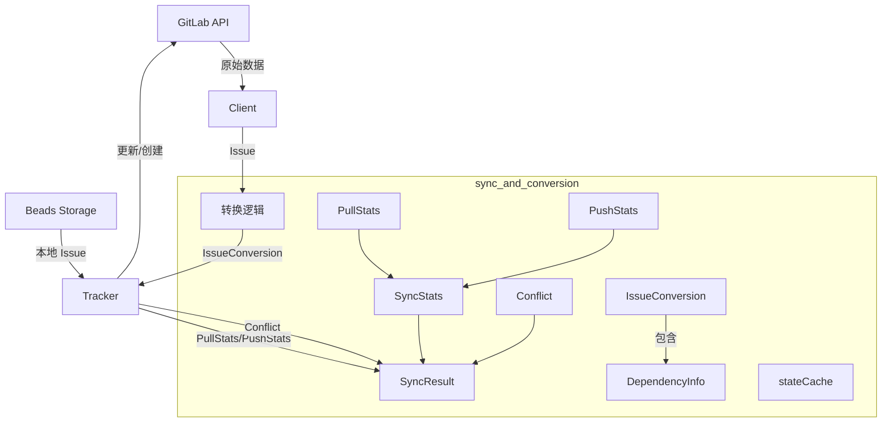

# sync_and_conversion 模块技术深度解析

## 1. 模块概述与问题空间

`internal.gitlab.types` 包中的 `sync_and_conversion` 模块是 GitLab 集成的核心数据转换与同步协调层。它解决了 Beads 内部问题跟踪系统与外部 GitLab 平台之间的**双向数据模型不匹配**和**同步冲突处理**问题。

### 为什么需要这个模块？

直接在 Beads 的核心领域模型和 GitLab API 响应之间进行映射会导致以下问题：
1. **数据模型不一致**：GitLab 使用状态字符串（"opened"/"closed"/"reopened"）和标签系统，而 Beads 有结构化的状态枚举和优先级系统
2. **依赖关系延迟建立**：GitLab 的 issue 链接（`blocks`/`is_blocked_by`）需要在所有 issue 导入后才能正确建立
3. **冲突检测复杂性**：需要精确跟踪本地和远程的最后修改时间以识别并发修改
4. **统计信息聚合**：同步操作需要细粒度的成功率、冲突率等指标

这个模块的设计思路是：**将 GitLab 的原始数据模型转换为中间表示，在此基础上进行同步协调、冲突检测和统计收集**。

## 2. 核心抽象与心智模型

### 关键抽象

1. **IssueConversion** - 转换结果容器
   > 将一个 GitLab issue 转换为 Beads issue，同时暂存依赖关系信息，等待批量建立链接
   
2. **Conflict** - 冲突状态快照
   > 记录冲突发生时的完整上下文：双方的最后修改时间、ID 映射、外部引用等

3. **PullStats/PushStats/SyncStats** - 分层统计收集器
   > 从底层操作统计（pull/push）向上聚合为完整同步结果的分层统计体系

4. **stateCache** - 项目状态缓存
   > 在同步操作中缓存标签和里程碑信息，减少重复 API 调用

### 类比："双向翻译官"

可以将这个模块想象成一个**高级翻译官**，它不仅逐字翻译两个系统的语言（issue 字段），还要：
- 记住双方最后一次沟通的内容（状态缓存）
- 检测双方是否同时修改了同一内容（冲突检测）
- 记录翻译过程中的所有细节（统计信息）
- 处理需要上下文理解的复杂关系（依赖关系暂存）

## 3. 架构与数据流向



### 数据流转路径

1. **拉取同步（Pull）**
   - `Client` 从 GitLab API 获取原始 `Issue`
   - 转换逻辑处理标签解析（`parseLabelPrefix`）、状态映射、优先级转换
   - 产生 `IssueConversion`，包含转换后的 `types.Issue` 和 `DependencyInfo` 列表
   - 依赖信息暂存，待所有 issue 导入后批量建立
   - 操作结果汇总到 `PullStats`

2. **推送同步（Push）**
   - 从 Beads 存储读取本地 issue
   - 通过 `gitlabFieldMapper` 转换为 GitLab 可接受格式
   - 检测冲突：比较 `LocalUpdated` 和 `GitLabUpdated`
   - 若冲突，创建 `Conflict` 记录；否则执行更新/创建
   - 操作结果汇总到 `PushStats`

3. **完整同步（Full Sync）**
   - 协调拉取和推送阶段
   - 合并 `PullStats` 和 `PushStats` 到 `SyncStats`
   - 收集所有冲突和警告
   - 生成最终 `SyncResult`

## 4. 核心组件深度解析

### 4.1 转换容器：IssueConversion

```go
type IssueConversion struct {
    Issue        *types.Issue
    Dependencies []DependencyInfo
}
```

**设计意图**：解决依赖关系建立的"鸡生蛋"问题。在批量导入时，我们无法在处理 issue A 时就建立它对 issue B 的依赖，因为 issue B 可能还没被导入。所以 `IssueConversion` 将依赖信息**暂存**起来，等所有 issue 都转换完成后，再在第二阶段批量建立。

**关键特点**：
- 分离 issue 本身和依赖关系的处理时机
- `DependencyInfo` 使用 GitLab IID 作为临时引用，因为此时 Beads ID 尚未生成

### 4.2 冲突检测：Conflict

```go
type Conflict struct {
    IssueID           string    // Beads issue ID
    LocalUpdated      time.Time // 本地最后修改时间
    GitLabUpdated     time.Time // GitLab 最后修改时间
    GitLabExternalRef string    // GitLab issue URL
    GitLabIID         int       // GitLab 项目内 IID
    GitLabID          int       // GitLab 全局 ID
}
```

**设计意图**：不仅仅记录"有冲突"，而是记录**冲突发生时的完整上下文**，这样可以：
- 向用户展示丰富的冲突信息（包括直接链接到 GitLab 的 URL）
- 支持后续的冲突解决策略（如"强制使用本地"或"强制使用远程"）
- 用于调试和审计

**冲突检测逻辑**（隐含在使用此结构的代码中）：
当 `LocalUpdated > LastSyncTime` 且 `GitLabUpdated > LastSyncTime` 时，判定为冲突。

### 4.3 分层统计：PullStats / PushStats / SyncStats

**设计模式**：这是一个**分层统计收集器**模式，从细粒度操作聚合到高层结果。

```go
// 底层：拉取操作统计
type PullStats struct {
    Created     int
    Updated     int
    Skipped     int
    Incremental bool     // 是否为增量同步
    SyncedSince string   // 增量同步的时间点
    Warnings    []string
}

// 底层：推送操作统计  
type PushStats struct {
    Created int
    Updated int
    Skipped int
    Errors  int
}

// 中层：合并的同步统计
type SyncStats struct {
    Pulled    int  // 从 GitLab 拉取数
    Pushed    int  // 推送到 GitLab 数
    Created   int  // 本地创建数
    Updated   int  // 更新数
    Skipped   int  // 跳过数
    Errors    int  // 错误数
    Conflicts int  // 冲突数
}
```

**设计意图**：
- `PullStats` 和 `PushStats` 关注各自方向的操作细节（如增量同步信息只在 pull 时有意义）
- `SyncStats` 提供统一的高层视图
- 这种分离使得在同步过程中可以独立收集两个方向的统计，最后再合并

### 4.4 标签解析系统

```go
// parseLabelPrefix 将 "priority::high" 拆分为 ("priority", "high")
func parseLabelPrefix(label string) (prefix, value string)

// 全局映射表
var PriorityMapping = map[string]int{...}
var StatusMapping = map[string]string{...}
var typeMapping = map[string]string{...}
```

**设计意图**：这是一个**约定优于配置**的设计。GitLab 的标签是自由文本，所以我们通过命名约定（`::` 分隔符）来编码结构化信息。

**映射策略**：
- `priority::high` → 优先级 P1
- `status::in_progress` → 状态 "in_progress"  
- `type::bug` → issue 类型 "bug"

**为什么使用映射表而不是硬编码？**
- 单一事实来源（SSOT）：所有映射集中定义
- 可扩展性：可以轻松添加新的优先级/状态
- 可测试性：映射逻辑可以独立测试

### 4.5 状态缓存：stateCache

```go
type stateCache struct {
    Labels     []Label
    Milestones []Milestone
}
```

**设计意图**：在一次同步操作中，标签和里程碑信息不会变化，所以缓存它们可以：
- 减少 GitLab API 调用次数
- 提高同步速度
- 降低遇到速率限制的风险

## 5. 依赖关系分析

### 入站依赖（调用 sync_and_conversion 的模块）

1. **[tracker_adapter](gitlab.md#tracker_adapter)** - `Tracker` 结构体
   - 使用 `IssueConversion` 进行数据转换
   - 使用 `SyncResult` 返回同步结果
   - 使用 `Conflict` 记录和处理冲突

2. **[field_mapping](gitlab.md#field_mapping)** - `gitlabFieldMapper`
   - 与本模块协作完成字段转换
   - 共享映射配置（`MappingConfig`）

### 出站依赖（sync_and_conversion 调用的模块）

1. **[Core Domain Types](../core_domain_types.md)** - `types.Issue`
   - 转换的目标类型
   - `IssueConversion.Issue` 字段类型

2. **GitLab API** - 原始数据来源
   - 通过 `Client` 结构体获取原始 `Issue`、`Label`、`Milestone` 等

### 数据契约

**与 Tracker 的契约**：
- `IssueConversion` 必须包含完整的 `types.Issue` 和所有关联的 `DependencyInfo`
- `Conflict` 必须包含足够的信息用于展示和解决冲突
- `SyncResult` 必须提供完整的统计信息以便用户了解同步结果

**与核心领域模型的契约**：
- 转换后的 `types.Issue` 必须符合 Beads 的验证规则
- `DependencyInfo.Type` 必须是有效的 Beads 依赖类型

## 6. 设计决策与权衡

### 6.1 决策：分离转换和依赖建立

**选择**：先转换所有 issue，暂存依赖信息，再批量建立依赖
**替代方案**：边转换边建立依赖（可能需要二次处理）

**理由**：
- 避免了依赖图的拓扑排序问题
- 简化了错误处理（如果某个依赖建立失败，不会影响 issue 本身的导入）
- 支持增量导入（可以先导入所有 issue，再在单独步骤处理依赖）

**权衡**：
- ✅ 优点：更简单、更健壮的同步流程
- ❌ 缺点：需要额外的内存来暂存依赖信息，同步分为两个阶段

### 6.2 决策：使用标签约定编码结构化信息

**选择**：通过 `prefix::value` 格式的标签编码优先级、状态等
**替代方案**：使用 GitLab 的自定义字段（仅限 Premium）、或完全独立管理

**理由**：
- 兼容性：适用于所有 GitLab 版本（包括免费版）
- 可见性：用户可以直接在 GitLab 界面看到这些信息
- 简单性：不需要额外的存储或配置

**权衡**：
- ✅ 优点：兼容性好、用户体验好、实现简单
- ❌ 缺点：依赖用户遵守标签命名约定，可能与现有标签冲突

### 6.3 决策：完整的冲突上下文记录

**选择**：在 `Conflict` 中记录时间戳、ID、URL 等完整信息
**替代方案**：只记录 "issue X 有冲突"

**理由**：
- 可调试性：开发人员可以快速诊断冲突原因
- 用户体验：用户可以直接跳转到 GitLab 查看远程版本
- 扩展性：未来可以基于这些信息实现自动化冲突解决

**权衡**：
- ✅ 优点：信息丰富、可扩展
- ❌ 缺点：`Conflict` 结构体较大，存储和传输成本稍高

### 6.4 决策：分层统计收集

**选择**：分离 `PullStats`、`PushStats`、`SyncStats`
**替代方案**：单一的统计结构体

**理由**：
- 关注点分离：拉取和推送操作有不同的关注点（如 `Incremental` 只对拉取有意义）
- 灵活性：可以单独执行拉取或推送，仍能获得完整统计
- 清晰性：代码更容易理解和维护

**权衡**：
- ✅ 优点：设计清晰、灵活性高
- ❌ 缺点：需要在最后进行统计合并，稍增复杂度

## 7. 使用指南与最佳实践

### 7.1 标签命名约定

要使转换正常工作，GitLab 标签应遵循以下约定：

```
priority::critical   # P0
priority::high       # P1  
priority::medium     # P2
priority::low        # P3
priority::none       # P4

status::open         # 开放
status::in_progress  # 进行中
status::blocked      # 被阻塞
status::deferred     # 延期
status::closed       # 已关闭

type::bug            # 缺陷
type::feature        # 新功能
type::task           # 任务
type::epic           # 史诗
type::chore          # 杂务
```

### 7.2 增量同步最佳实践

使用 `PullStats.Incremental` 和 `PullStats.SyncedSince` 可以实现高效的增量同步：

```
1. 保存上次同步的时间戳
2. 下次同步时，使用该时间戳作为 `since` 参数
3. 只拉取和处理变更的 issue
4. 保存新的同步时间戳
```

### 7.3 冲突处理策略

当检测到冲突时，可以根据业务需求选择：
- **远程优先**：放弃本地修改，使用 GitLab 版本
- **本地优先**：强制推送本地修改，覆盖 GitLab 版本
- **手动解决**：暂停同步，由用户决定如何处理
- **合并策略**：尝试自动合并非冲突字段

## 8. 边缘情况与陷阱

### 8.1 隐式契约与注意事项

1. **标签解析的模糊性**
   - 如果一个 issue 同时有 `priority::high` 和 `priority::low`，只会使用最后解析的一个
   - **建议**：在推送时确保标签一致性，或在转换时选择优先级最高的标签

2. **依赖关系的完整性**
   - 如果依赖的目标 issue 不在同步范围内，`DependencyInfo` 会指向一个不存在的 IID
   - **后果**：依赖建立会失败，但不会影响 issue 本身的导入
   - **缓解**：记录警告，让用户知道有未解析的依赖

3. **时间戳精度**
   - GitLab 和 Beads 可能使用不同的时间戳精度（毫秒 vs 纳秒）
   - **陷阱**：比较时间戳时可能因为精度差异导致错误的冲突检测
   - **建议**：统一截断到秒级别进行比较

### 8.2 已知限制

1. **不支持 GitLab 的所有功能**
   - 不支持多 assignee（只使用第一个）
   - 不支持 GitLab Premium 的某些功能（如健康状态）
   - 不支持评论同步（当前版本）

2. **标签映射是单向的**
   - 从 GitLab 拉取时会解析标签，但推送到 GitLab 时不会重新创建结构化标签
   - **后果**：如果在 Beads 中修改了优先级，不会自动更新 GitLab 的 `priority::` 标签

## 9. 与其他模块的关系

- **[tracker_adapter](gitlab.md#tracker_adapter)**：本模块的主要使用者，调用转换逻辑并处理同步流程
- **[field_mapping](gitlab.md#field_mapping)**：协作完成字段级别的转换
- **[Core Domain Types](../core_domain_types.md)**：定义了 `types.Issue` 等目标类型
- **[Tracker Integration Framework](../tracker_integration_framework.md)**：定义了 `IssueTracker` 接口，GitLab 集成是其实现之一

## 10. 总结

`sync_and_conversion` 模块是 GitLab 集成的"数据脊梁"，它通过巧妙的设计解决了两个系统之间的模型不匹配问题：

1. **分离关注点**：将转换、同步、冲突检测、统计收集分解为独立的抽象
2. **延迟建立依赖**：通过 `IssueConversion` 解决了批量导入时的依赖顺序问题
3. **完整上下文记录**：通过 `Conflict` 提供丰富的冲突信息
4. **分层统计**：通过三层统计结构提供灵活而详细的同步指标
5. **约定优于配置**：通过标签命名约定实现结构化信息的编码

这个模块的设计展示了如何在两个不同系统之间构建一个健壮、可扩展的适配层——不仅仅是数据格式的转换，更是同步流程的协调、冲突的处理、以及操作结果的全面反馈。
