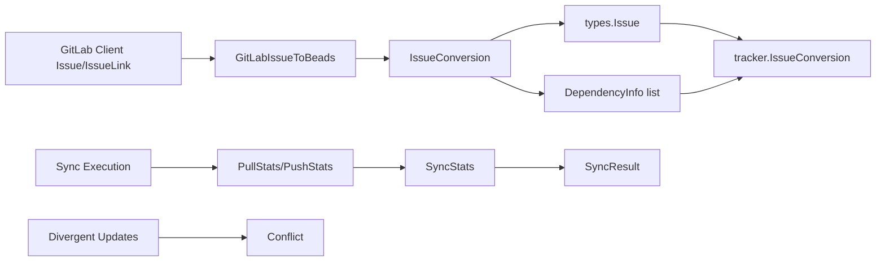

# sync_and_conversion_types

`sync_and_conversion_types` 这一层看起来只是几个“普通 struct”，但它解决的是一个很实际、很棘手的问题：**GitLab 和 Beads 的同步不是简单字段拷贝，而是跨系统语义对齐、跨阶段处理、跨边界契约兼容**。如果没有这层类型，调用方要么把 GitLab 原始模型一路传透（强耦合、难演进），要么在每个调用点重复拼装统计、冲突、依赖转换（高重复、高错误率）。这个模块的价值在于把“同步过程中的中间语义”固定下来，让上游编排和下游映射都围绕稳定契约工作。

## 这模块到底在解决什么问题？

在 GitLab 集成里，同步流程同时面临三种不一致：第一，字段模型不一致（例如 GitLab 用 label 表达 priority/status/type，而 Beads 是结构化字段）；第二，标识体系不一致（GitLab 的 `ID`、`IID`、URL 与 Beads 本地 `IssueID` 各自有用途）；第三，同步阶段不一致（先导入 issue，再补建 dependency）。

`internal/gitlab/types.go` 中的 `SyncStats`、`PullStats`、`PushStats`、`SyncResult`、`Conflict`、`IssueConversion`、`DependencyInfo`，就是为这三类不一致建立“缓冲区”的类型集合。你可以把它理解成**国际机场的转机层**：乘客（数据）不会直接从国内安检跳到国际登机口，而是先进入一个中间区做证件转换、状态记录和路径重定向。

## 心智模型：三层语义，而不是一层 DTO

理解这个模块最有效的方式，是把它当成三个语义层的组合：

1. **过程观测层**：`SyncStats` / `PullStats` / `PushStats` / `SyncResult` 描述“这次同步发生了什么”。
2. **一致性裁决层**：`Conflict` 描述“哪里无法自动合并，需要决策”。
3. **转换暂存层**：`IssueConversion` + `DependencyInfo` 描述“主对象已转好，但跨对象关联要延后处理”。

这不是简单的数据容器，而是把同步引擎中的关键阶段显式化。这样做的核心收益是：上层编排逻辑（例如 tracker engine）不必理解 GitLab 的每个细节，也能按统一契约推进流程。

## 架构与数据流



从代码关系看，关键路径是这样的：

`GitLabIssueToBeads`（`mapping.go`）返回本模块定义的 `*IssueConversion`。其中 `Issue` 字段是 `*types.Issue`，依赖信息是 `[]DependencyInfo`。随后 `gitlabFieldMapper.IssueToBeads`（`fieldmapper.go`）把 `gitlab.DependencyInfo` 转成 `tracker.DependencyInfo`（把 IID `int` 转为字符串 external ID），再组装 `*tracker.IssueConversion` 返回给 tracker 框架。

另一条路径是同步统计：GitLab 侧定义了 `SyncStats` / `SyncResult` 等结果结构，同时 tracker 框架也有同名结构（`internal/tracker/types`）。这说明 GitLab 包既能在本包内表达同步状态，也能通过适配层输出框架契约。

## 组件深潜

### `SyncStats`

`SyncStats` 是总览计数器：`Pulled`、`Pushed`、`Created`、`Updated`、`Skipped`、`Errors`、`Conflicts`。它偏“汇总视角”，适合最终结果展示和跨系统统一报表。设计上它非常朴素，但朴素是刻意的：计数字段足够稳定，能跨版本保持兼容。

### `PullStats` 与 `PushStats`

`PullStats` 比 `PushStats` 多了 `Incremental`、`SyncedSince`、`Warnings`。这反映了一个现实：拉取路径通常更复杂，需要表达“是否增量同步”以及“非致命异常”。推送路径更偏命令式写入，因此统计维度更少。

这个拆分的好处是语义清晰，不把所有字段硬塞进一个大结构；代价是调用方在汇总时要做一次归并。

### `SyncResult`

`SyncResult` 是对外可序列化结果（带 `json` tag），包含 `Success`、`Stats`、`LastSync`、`Error`、`Warnings`。这类结构常用于 CLI/API 响应。`LastSync` 用 `string` 而不是 `time.Time`，换来的是序列化弹性（调用者可传 RFC3339 或其他统一格式），但也把格式正确性的责任交给上层流程。

### `Conflict`

`Conflict` 记录本地与远端的并发修改冲突：`IssueID`、`LocalUpdated`、`GitLabUpdated`、`GitLabExternalRef`、`GitLabIID`、`GitLabID`。这里同时保留 URL、IID、全局 ID，不是冗余，而是为了满足不同操作场景：

- 人工排障看 URL 最直观；
- API 回写常用 IID；
- 跨项目或审计关联可能需要全局 ID。

这是“存一点重复，换取冲突处理可操作性”的典型取舍。

### `IssueConversion`

`IssueConversion` 的核心设计点是：

- `Issue *types.Issue`
- `Dependencies []DependencyInfo`

也就是“主对象转换”和“依赖关系构建”解耦。注释写得很直接：依赖需要等所有 issue 导入后再链接。这避免了单次转换时因目标 issue 尚不存在而失败。

### `DependencyInfo`

`DependencyInfo` 使用 `FromGitLabIID` / `ToGitLabIID`（`int`）和 `Type`（依赖类型字符串）。它不是最终存储模型，而是导入阶段的**连接计划**。在 `gitlabFieldMapper.IssueToBeads` 中，这两个 `int` 会被转成 tracker 层的字符串 external ID。

这是一种边界内强类型、边界外统一格式的策略：GitLab 包内保留原生 IID（计算/比较方便），跨插件边界转为通用字符串（契约统一）。

### 辅助函数与映射常量（同文件内）

虽然模块名聚焦“sync & conversion types”，但 `types.go` 里还有几组关键辅助逻辑：

- `parseLabelPrefix(label string) (prefix, value string)`：解析 `priority::high` 这类 scoped label；
- `PriorityMapping` / `StatusMapping` / `typeMapping`：标签值到 Beads 语义的单一映射源；
- `getPriorityFromLabel` / `getStatusFromLabel` / `getTypeFromLabel`：安全查表入口；
- `isValidState`：基于 `validStates` 校验 GitLab state。

这里最关键的意图是“单一事实来源（single source of truth）”。`DefaultMappingConfig()`（`mapping.go`）明确从这些映射复制数据，避免在多个文件重复定义造成漂移。

## 依赖分析：它调用谁、被谁调用

从已验证代码关系看：

- 本模块类型被 `GitLabIssueToBeads`、`issueLinksToDependencies` 等转换逻辑直接使用（`mapping.go`）。
- `gitlabFieldMapper.IssueToBeads` 消费 `*IssueConversion` 和 `[]DependencyInfo`，再适配到 `tracker.IssueConversion` 与 `tracker.DependencyInfo`（`fieldmapper.go`）。
- `Tracker` 持有 `MappingConfig` 并通过 `FieldMapper()` 暴露该转换能力给 tracker 框架（`tracker.go`）。

与外部契约的对齐点：

- 与 Core Domain 的契约：`IssueConversion.Issue` 必须是 `*types.Issue`（见 [issue_domain_model](issue_domain_model.md)）。
- 与 Tracker 框架的契约：GitLab 私有转换结果最终需适配到 `internal/tracker/types` 的同名结构（见 [tracker_plugin_contracts](tracker_plugin_contracts.md)）。
- 与 GitLab API 模型契约：`DependencyInfo` 基于 IID，而 IID 来自 `Issue` / `IssueLink`（见 [client_and_api_types](client_and_api_types.md)）。

一个非显而易见但很重要的点是：GitLab 包内和 tracker 包内存在同名结构（如 `SyncResult`、`Conflict`、`IssueConversion`），这是一种“边界镜像模型”设计，而不是重复造轮子。它降低插件内部演化对框架契约的冲击。

## 关键设计取舍

这个模块整体偏向**显式、可审计、可分阶段处理**，而不是追求最少类型数量。

第一，选择了“按语义分结构”（`PullStats`/`PushStats`/`SyncStats`）而非一个万能 stats struct。优点是语义清晰、字段含义稳定；缺点是归并逻辑增多。

第二，选择了“依赖延迟链接”（`IssueConversion` 内分离 `Dependencies`）而非一次性写入。优点是避免导入顺序问题；缺点是流程变成两阶段，需要维护中间状态。

第三，选择了“GitLab 内部类型 + Tracker 对外类型并存”。优点是插件内部可以贴近 GitLab 语义（如 `GitLabIID int`）；缺点是需要适配代码，并承担两套模型同步维护成本。

第四，映射常量采用单一来源并在 `DefaultMappingConfig()` 复制 map。优点是避免外部修改全局 map 带来副作用；代价是初始化时有一次复制开销（通常可忽略）。

## 如何使用与扩展

典型用法（从 GitLab issue 转到 tracker 可消费结果）：

```go
config := DefaultMappingConfig()
conv := GitLabIssueToBeads(glIssue, config)

// conv.Issue: *types.Issue
// conv.Dependencies: []gitlab.DependencyInfo (IID-based)
```

在字段映射器里完成跨边界适配：

```go
func (m *gitlabFieldMapper) IssueToBeads(ti *tracker.TrackerIssue) *tracker.IssueConversion {
    gl, ok := ti.Raw.(*Issue)
    if !ok {
        return nil
    }

    conv := GitLabIssueToBeads(gl, m.config)
    // ... convert []gitlab.DependencyInfo -> []tracker.DependencyInfo
    return &tracker.IssueConversion{Issue: conv.Issue, Dependencies: deps}
}
```

扩展建议是优先改 `MappingConfig` 与映射表，而不是在多个转换函数里散落 if/switch。这样可以把“业务策略变化”（比如新增 label 语义）限制在配置层。

## 新贡献者最该注意的坑

最容易踩坑的是标识符混用：`Issue.ID`（GitLab 全局 ID）与 `Issue.IID`（项目内 ID）不是一回事。依赖链接和多数 issue API 路径都以 IID 为核心，本模块的 `DependencyInfo` 也明确使用 IID。

第二个坑是状态语义优先级。在 `statusFromLabelsAndState` 中，`state == "closed"` 会覆盖 label 状态；这在测试里有覆盖。如果你改状态映射，务必保持这个优先级，否则会出现“已关闭 issue 仍显示 in_progress”的错误。

第三个坑是未知映射默认值：优先级默认 `medium`，类型默认 `task`，未知 link type 默认 `related`。这些默认值让系统“尽量继续运行”，但也可能掩盖映射配置错误。生产排障时要结合 `Warnings`/统计计数看是否有静默降级。

第四个坑是 `issueLinksToDependencies` 对 nil source/target 的容忍：它仍可能产出 `ToGitLabIID == 0` 的依赖（测试已验证）。后续消费方如果不做过滤，可能引入无效关系。

## 参考阅读

- GitLab API 基础模型与客户端： [client_and_api_types](client_and_api_types.md)
- Tracker 框架契约（插件边界）： [tracker_plugin_contracts](tracker_plugin_contracts.md)
- Beads Issue 领域模型： [issue_domain_model](issue_domain_model.md)
- 通用同步/版本化类型（跨存储视角）： [versioning_and_sync_types](versioning_and_sync_types.md)
