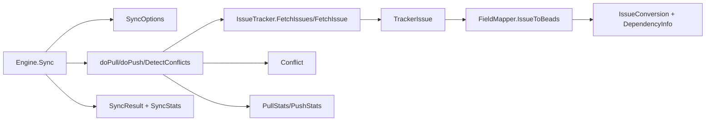

# sync_data_models_and_options

`sync_data_models_and_options`（`internal/tracker/types.go`）是 Tracker 同步体系里的“公共协议层”。如果把 `sync_orchestration_engine` 想成一个跨境物流调度中心，那么这个模块就是统一运单格式：无论货物来自 Linear、GitLab 还是 Jira，调度中心都要求先写成同一套字段和结果模型，再决定怎么拉取、冲突处理、推送和统计。它存在的核心原因是：外部平台语义差异很大，但同步编排必须稳定、可复用、可观测。

## 先讲问题：为什么要有这一层

外部 tracker 的 API 不是“同一语言的不同方言”，而是“完全不同语法体系”。同样叫 issue，不同平台对状态、优先级、类型、标识符的表达都不同，甚至一个平台里也会同时存在“内部主键”和“人类可读编号”两套 ID。如果没有这层公共数据模型，最直接的写法会是把平台分支塞进同步引擎：`if linear ... else if gitlab ...`。这种写法短期快，但很快会导致三个问题。

第一，同步流程和平台细节耦合，新增平台时必须改核心路径，回归风险高。第二，冲突检测、增量同步、统计口径会在不同实现里逐渐漂移，结果“看起来都叫 sync，但行为不一致”。第三，测试边界变差：你无法单独验证“映射正确”，只能用端到端测试兜底，成本高且定位慢。

这个模块的设计洞察是：把“流程控制”和“数据契约”拆开。流程在 [sync_orchestration_engine](sync_orchestration_engine.md)，平台接入在 [tracker_plugin_contracts](tracker_plugin_contracts.md)，而这里专门定义两者之间交换的数据形状。这样编排逻辑可以长期稳定，平台差异通过映射层吸收。

## 心智模型：它是一套“同步语言的语法”

理解这个模块最有效的方式，是把它当作同步子系统的 DSL（领域语言）数据字典。`TrackerIssue` 表达“外部世界里的 issue 通用形态”，`SyncOptions` 表达“这次同步怎么跑”，`SyncResult/SyncStats` 表达“跑完之后怎么汇报”，`Conflict` 表达“本地与远端同时改动时的事实证据”，`IssueConversion + DependencyInfo` 表达“导入时主实体和关系的两阶段落地”。

这套语法有一个关键特征：它不追求把每个平台都强行收敛成完全强类型，而是保留必要弹性（例如 `interface{}`、`map[string]interface{}`）来容纳异构 API。这是一个“以边界稳定换内部灵活”的典型架构选择。

## 架构位置与数据流



从调用关系看，数据流是非常清晰的。`Engine.Sync` 接收 `SyncOptions`，在 pull 阶段把 `FetchOptions` 传给 `IssueTracker.FetchIssues`。外部数据先进入 `TrackerIssue`，再由 `FieldMapper.IssueToBeads` 转成 `IssueConversion`。`IssueConversion.Issue` 会进入存储层，`IssueConversion.Dependencies` 会在主实体导入后统一补建，这就是“实体先落地、关系后补齐”的两阶段策略。

在双向同步时，`Engine.DetectConflicts` 构造 `Conflict` 列表，后续按 `SyncOptions.ConflictResolution` 决策。push 阶段产出 `PushStats`，pull 阶段产出 `PullStats`，最终汇总为 `SyncResult`（包含 `SyncStats` 和 `Warnings/Error/LastSync`）。可以把它理解为：细粒度运行计数先在子阶段累积，再在顶层统一对外暴露。

## 组件深潜（按设计职责）

### `TrackerIssue`

`TrackerIssue` 是跨平台 issue 的中间表示。它不是数据库模型，也不是某个 API 的镜像，而是“足够通用且可双向转换”的协议对象。

最容易踩坑的设计点是 ID 双轨：`ID` 是外部系统内部 ID（用于 API 更新），`Identifier` 是人类可读编号（如 `TEAM-123` 或项目内编号）。这一点在引擎调用里非常关键：例如 `doPush` 会从 `external_ref` 提取标识后调用 `FetchIssue` / `UpdateIssue`，不同 tracker 再决定如何解释该标识。

`State` 和 `Type` 使用 `interface{}`，因为不同平台状态对象结构差异过大；`Raw interface{}` 则显式保留原始 API 对象，供 mapper 做平台特定读取。`Metadata map[string]interface{}` 用于保存无法映射到核心字段的信息，目的是 round-trip 保真，避免“同步一次就丢字段”。

### `FetchOptions`

`FetchOptions` 是 pull 输入：`State`、`Since`、`Limit`。它把增量同步能力抽象为 `Since *time.Time`，由引擎在 `doPull` 中根据 `<tracker>.last_sync` 组装。也就是说，增量策略不是写死在 tracker 实现里，而是由引擎统一调度、tracker 选择性实现（例如 `FetchIssuesSince`）。

### `SyncOptions`

`SyncOptions` 是整个同步会话的控制面。`Pull`/`Push` 决定方向；如果两者都不设，`Engine.Sync` 会默认双向。`DryRun` 让流程走完但不落库/不调用实际写操作。`CreateOnly` 用于只创建不更新。`State` 是跨 pull/push 的筛选线索。

`ConflictResolution` 是冲突策略核心，支持 `timestamp`、`local`、`external` 三种。`TypeFilter` 与 `ExcludeTypes` 依赖 `types.IssueType`，把“同步哪些 issue 类型”提升到框架层而不是散落在具体 tracker。`ExcludeEphemeral` 则体现了对 Beads 特殊工作流（wisp/ephemeral）的显式支持。

### `SyncResult` 与 `SyncStats`

`SyncResult` 是对调用方最友好的总出口：是否成功、统计、最后同步时间、错误、告警。它使用 JSON tag，说明它被当作 CLI/API 输出契约消费。`SyncStats` 把 `Pulled/Pushed/Created/Updated/Skipped/Errors/Conflicts` 固化为统一口径，避免每个 tracker 输出自己的一套统计定义。

### `PullStats` 与 `PushStats`

这两个结构是阶段内统计。`PullStats` 额外记录 `Incremental` 与 `SyncedSince`，因为 pull 对增量语义更敏感；`PushStats` 关注创建、更新、跳过、错误，贴合写远端的执行特性。引擎先用它们做内部汇总，再折叠进 `SyncStats`。

### `Conflict` 与 `ConflictResolution`

`Conflict` 不是策略，而是事实模型：同一 issue 的本地更新时间、远端更新时间、远端引用信息。`ConflictResolution` 才是策略枚举。把事实和策略分开，是一个很重要的设计：你可以改变策略（例如默认 `timestamp`），而不改变冲突检测的数据采样结构。

### `IssueConversion` 与 `DependencyInfo`

`IssueConversion` 的关键价值是把“issue 主体”和“依赖关系”一起返回，但不要求同一时刻落库。`DependencyInfo` 用外部标识（`FromExternalID`、`ToExternalID`）描述边，类型放在 `Type`（如 `blocks`、`related`、`duplicates`、`parent-child`）。这使得 pull 可以先导入全部节点，再根据外部 ID 建边，减少“目标节点尚未导入”导致的失败。

## 依赖分析：它依赖什么、被谁依赖

这个模块本身几乎不包含行为逻辑，主要承担类型契约，因此“调用谁”的关系很少，更多是“被谁消费”。从源码可确认，它直接依赖 [Core Domain Types](Core Domain Types.md) 中的 `types.Issue` 与 `types.IssueType`，并依赖 `time.Time`。

它被 [sync_orchestration_engine](sync_orchestration_engine.md) 高频使用：`Engine.Sync` 接收 `SyncOptions`、返回 `SyncResult`；`doPull` 生成 `FetchOptions`、累积 `PullStats`、消费 `IssueConversion/DependencyInfo`；`doPush` 累积 `PushStats`；`DetectConflicts` 产出 `[]Conflict`。因此这个模块的字段变化会直接影响引擎热路径。

它也被具体集成实现消费和适配。比如 GitLab/Linear 的 tracker 实现都返回 `[]tracker.TrackerIssue`，field mapper 都实现 `IssueToBeads(*tracker.TrackerIssue) *tracker.IssueConversion`，并把各自的依赖类型转换成 `tracker.DependencyInfo`。这说明该模块在架构上承担“跨集成最小公分母”的角色。

## 关键设计取舍

第一个取舍是类型安全 vs 跨平台表达力。`TrackerIssue.State/Type/Raw` 与 `IssueToTracker` 的 `map[string]interface{}` 牺牲了一部分编译期约束，但换来对 Jira/GitLab/Linear 差异结构的容纳能力。对一个插件系统来说，这通常比“看起来更强类型”更实用。

第二个取舍是统一统计口径 vs 平台特定细节。`SyncStats` 非常统一，便于上层消费，但它刻意不暴露每个平台特有细节。细节可通过 `Warnings` 或 tracker 内部日志补充。这个选择偏向可观测一致性，而非每次都输出最丰富信息。

第三个取舍是两阶段导入的正确性优先。`IssueConversion` 带 `Dependencies` 的设计让依赖创建延后，牺牲了一点实现复杂度，换来更稳健的批量导入行为，特别是面对跨引用和乱序返回时。

## 使用方式与示例

最常见用法是由引擎层构造并消费这些类型：

```go
opts := tracker.SyncOptions{
    Pull:               true,
    Push:               true,
    DryRun:             false,
    State:              "all",
    ConflictResolution: tracker.ConflictTimestamp,
    ExcludeEphemeral:   true,
}

result, err := engine.Sync(ctx, opts)
if err != nil {
    // result.Error 与 err 一起用于诊断
}
_ = result.Stats
```

对于插件实现者，pull 侧要返回 `TrackerIssue`，mapper 侧要返回 `IssueConversion`。下面这个模式在 GitLab/Linear 实现里都存在：

```go
func (m *someFieldMapper) IssueToBeads(ti *tracker.TrackerIssue) *tracker.IssueConversion {
    // 1) 读取 ti.Raw 做平台特定解析
    // 2) 构造 *types.Issue
    // 3) 把平台依赖关系转成 []tracker.DependencyInfo
    return &tracker.IssueConversion{Issue: issue, Dependencies: deps}
}
```

## 新贡献者要重点注意的坑

最重要的隐式契约是 ID 语义一致性：`ID` 与 `Identifier` 不能混用，尤其在更新路径。第二个高风险点是时间语义，`DetectConflicts` 与增量同步都依赖 `UpdatedAt` 和 RFC3339 时间戳，如果某个集成返回的更新时间不可靠，会直接影响冲突判定与跳过逻辑。第三个是空结果约定：`FetchIssue` 在“远端不存在”时应返回 `nil, nil`，否则引擎会把不存在误判为错误。

另外，`IssueToBeads` 返回 `nil`（或 `Issue=nil`）会被 pull 统计为 skipped。这是合法行为，但如果没有配套告警，容易出现“同步成功但数据没进来”的静默问题。最后，`Metadata` 的 round-trip 是此模块的重要承诺，改动时要确保不会在 pull/push 中被意外丢弃。

## 参考

- [tracker_plugin_contracts](tracker_plugin_contracts.md)
- [sync_orchestration_engine](sync_orchestration_engine.md)
- [GitLab Integration](GitLab Integration.md)
- [Linear Integration](Linear Integration.md)
- [Jira Integration](Jira Integration.md)
- [Core Domain Types](Core Domain Types.md)
