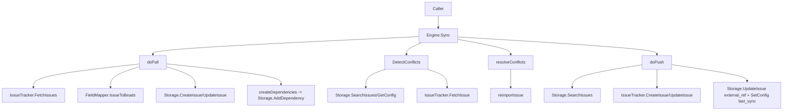

# sync_orchestration_engine

`sync_orchestration_engine`（`internal/tracker/engine.go`）是一个“同步总调度器”：它把 **beads 本地存储** 和 **外部 Tracker（Linear/GitLab/Jira）** 之间的双向同步流程，收敛成一套统一的 Pull → Conflict Detect/Resolve → Push 管线。你可以把它想象成一个机场塔台：不同航空公司（各 Tracker）机型不同、协议不同，但塔台用统一起降流程确保不会撞机、不会漏班、也不会反复调度同一架飞机。

它存在的核心原因是：如果每个 Tracker 自己实现完整双向同步逻辑，重复代码会非常多，而且“冲突处理、增量同步、幂等跳过、dry-run、观测埋点”这些横切能力很容易在不同实现里逐步漂移，最后变成难以维护的行为碎片。

---

## 这个模块在解决什么问题（Why）

外部 issue 系统同步不是简单的“拉一下、推一下”。真实场景里会同时存在：

- 本地和远端都在修改同一条 issue；
- 有些 Tracker 字段模型与 beads 不同（状态、优先级、类型、描述结构）；
- 有些系统需要预处理/后处理（比如导入时改 ID，导出时改描述）；
- 需要增量同步（`last_sync`）避免全量扫描成本；
- 需要尽量减少无意义 API 调用（内容未变化时跳过更新）；
- 需要 dry-run 预览，且不污染状态。

一个天真的方案是“先全量 pull 覆盖本地，再全量 push 覆盖远端”。这种方式短期实现简单，但会导致三个直接问题：

第一，会无声丢失用户修改。因为你在 pull 阶段就可能把本地新改动覆盖掉，后续再做冲突检测已经来不及了。`Engine.doPull` 里专门有保护：当 `existing.UpdatedAt.After(lastSync)` 时跳过更新，让冲突在第二阶段再决策。

第二，性能和 API 成本不可控。没有增量和跳过策略意味着每次都大量请求外部 API，还会触发不必要 update。

第三，行为不可预测。不同 Tracker 团队如果各自实现冲突策略和过滤规则，用户体验会在系统之间不一致。

`Engine` 的设计意图就是把这类“同步策略逻辑”集中在一处，把“系统差异”下沉到 `IssueTracker` + `FieldMapper` + Hooks。

---

## 心智模型（How it thinks）

理解这个模块，建议用三层心智模型：

1. **Orchestrator（编排层）**：`Engine` 负责流程顺序、冲突策略、统计、埋点、配置时间戳更新。
2. **Adapter（适配层）**：`IssueTracker` 负责“怎么和某个外部系统说话”（fetch/create/update/ref parsing）。
3. **Mapping/Policy（映射与策略层）**：`FieldMapper` 负责字段语义转换；`PullHooks/PushHooks` 负责可插拔策略（过滤、格式化、状态缓存等）。

如果类比现实系统：

- `Engine` 是“物流调度中心”；
- `IssueTracker` 是不同承运商（顺丰/UPS/DHL）接口；
- `FieldMapper` 是货物规格换算器（磅↔公斤，编码体系转换）；
- Hooks 是“企业自定义规则”（贵重品特殊包装、某些仓库不发货）。

这样设计的关键收益是：主流程统一，差异点可插拔。

---

## 架构与数据流



`Sync(ctx, opts)` 是入口，内部严格按阶段执行：

- 如果 `opts.Pull` 和 `opts.Push` 都没设，会默认变成双向（都设为 true）。
- Phase 1 Pull：外部 → 本地。
- Phase 2 Conflict（仅双向）：识别并决策“跳过 push”或“强制 push”。
- Phase 3 Push：本地 → 外部。
- 成功后（且非 dry-run）写入 `<tracker>.last_sync`。

这里有一个非常重要的时序决策：**冲突检测在 pull 之后、push 之前**。看起来反直觉，但 pull 里已经有“本地更新保护”，不会盲盖本地更新，因此仍能保留冲突信息。这样做可以先把绝大多数无冲突数据收敛，再对少量冲突项做定向处理。

---

## 核心组件深潜

## `type Engine struct`

`Engine` 持有这几类状态：

- 必选依赖：`Tracker IssueTracker`、`Store storage.Storage`、`Actor string`；
- 可选行为：`PullHooks`、`PushHooks`；
- 可选 UI 回调：`OnMessage`、`OnWarning`；
- 运行期缓存：`stateCache interface{}`（仅 push 周期内使用）。

`stateCache` 用 `interface{}` 是刻意的：编排层不理解各 Tracker 的状态模型，缓存结构完全由适配器决定。这是“弱类型换可扩展性”的典型取舍。

## `type PullHooks`

Pull 钩子控制“导入前后策略”：

- `ShouldImport(*TrackerIssue) bool`：在转换前过滤。
- `TransformIssue(*types.Issue)`：在 `IssueToBeads` 后、落库前做标准化。
- `GenerateID(context.Context, *types.Issue) error`：允许导入时自定义 ID（如哈希 ID）。

顺序是明确的：`ShouldImport` → `IssueToBeads` → `TransformIssue` → `GenerateID`。这让你能在最便宜阶段先过滤，再在结构化数据上变换，最后再做 ID 相关决策。

## `type PushHooks`

Push 钩子控制“导出策略”：

- `ShouldPush(*types.Issue) bool`：附加过滤；
- `FormatDescription(*types.Issue) string`：导出描述格式化；
- `ContentEqual(local, remote) bool`：内容相等跳过更新；
- `BuildStateCache(ctx) (interface{}, error)` + `ResolveState(cache,status)`：一次建缓存，多次状态解析。

`FormatDescription` 的实现很细心：它在 `doPush` 里拷贝 issue 后再改描述，避免污染本地存储对象（测试 `TestEnginePushWithFormatDescription` 也覆盖了这个契约）。

## `func NewEngine(...)`

只是注入依赖，不做副作用。它不主动 `Init` tracker，也不做 `Validate`。这意味着初始化顺序由上层控制，更灵活，但也要求调用方先完成 tracker 生命周期管理。

## `func (e *Engine) Sync(...)`

这是完整 orchestration：

- 建 OTel span（`tracker.sync`），记录 tracker 名称、pull/push/dry-run 标记；
- 处理默认双向；
- 维护 `skipPushIDs` / `forcePushIDs` 两个 map，承接冲突决策；
- 按阶段调用 `doPull` / `DetectConflicts+resolveConflicts` / `doPush`；
- 汇总 `SyncStats`；
- 非 dry-run 情况写 `last_sync`。

失败策略：pull/push 阶段的“阶段级错误”会直接返回 error 并 `Success=false`；但单条 issue 的失败通常是 warn + `stats.Errors++`，不让整个任务崩掉。这是明显偏向“任务韧性”的设计。

## `func (e *Engine) DetectConflicts(...)`

冲突判定依据是 `last_sync`：

1. 读取 `<prefix>.last_sync`，没有则直接无冲突；
2. `SearchIssues` 扫本地 issue，筛出属于当前 tracker 的 `ExternalRef`；
3. 只看本地在 `last_sync` 后更新的 issue；
4. 对每条 issue 调 `Tracker.FetchIssue` 拉远端版本；
5. 如果远端也在 `last_sync` 后更新，记录 `Conflict`。

这是“时间戳双写窗口检测”，实现简单通用；代价是需要按 issue 逐条 fetch 远端，热点路径的远端调用数会高。

## `func (e *Engine) doPull(...)`

关键流程：

- 构造 `FetchOptions{State: opts.State}`；若有 `last_sync` 则带 `Since`，进入增量模式；
- 调 `Tracker.FetchIssues` 拉外部列表；
- 对每条 issue：过滤 → 转换 → hooks → create/update；
- 累积 `DependencyInfo`，最后统一 `createDependencies`。

两个非显然设计点：

- **冲突保护提前发生**：更新已有本地 issue 前检查 `existing.UpdatedAt.After(lastSync)`，避免 pull 覆盖本地新改动。
- **依赖后置创建**：先导入所有 issue，再建立依赖，避免因为引用目标尚未导入导致依赖失败。

## `func (e *Engine) doPush(...)`

关键流程：

- 可选预建状态缓存（`BuildStateCache`），挂在 `e.stateCache`；
- `SearchIssues` 拉本地 issue；
- 依次应用基础过滤（`shouldPushIssue`）、`ShouldPush`、冲突跳过；
- 根据 `ExternalRef` 判断 create 或 update；
- update 前可做 `ContentEqual`，否则 fallback 到时间戳比较；
- 创建成功后会回写本地 `external_ref`。

这里有个契约细节：update 分支通过 `ExtractIdentifier(extRef)` 得到参数传给 `Tracker.UpdateIssue`。而 `IssueTracker.UpdateIssue` 注释写的是“内部 ID”，但 `ExtractIdentifier` 注释写“human-readable identifier”。目前 GitLab/Jira 的实现实际上接受 IID/key，这说明接口注释与现实实现存在张力，新实现要格外谨慎。

## `func (e *Engine) resolveConflicts(...)` 与 `reimportIssue(...)`

冲突策略来自 `SyncOptions.ConflictResolution`：

- `ConflictLocal`：加入 `forceIDs`，push 时强推本地；
- `ConflictExternal`：加入 `skipIDs`，并 `reimportIssue` 覆盖本地；
- 默认（`ConflictTimestamp`）：比较更新时间，较新者胜。

`reimportIssue` 会重新 fetch 外部、再走 mapper 并本地更新字段（title/description/priority/status/metadata），是“冲突后定向回灌”。

## `func (e *Engine) createDependencies(...)`

按 `DependencyInfo` 的 external ID 去 `GetIssueByExternalRef` 找本地 issue，再 `AddDependency`。如果任一端找不到直接跳过，不会中断同步。

注意：`DependencyInfo.FromExternalID/ToExternalID` 的注释是“External identifier”，但这里查找调用的是 `GetIssueByExternalRef`（通常期望完整 external_ref）。这要求 mapper 产出的值与 store 查找语义一致，否则依赖可能静默丢失。

## `func (e *Engine) shouldPushIssue(...)`

这是内建基础过滤器：

- `ExcludeEphemeral` + `issue.Ephemeral`；
- `TypeFilter` 白名单；
- `ExcludeTypes` 黑名单；
- `State == "open"` 时排除 `StatusClosed`。

然后才叠加 `PushHooks.ShouldPush`。

## `func (e *Engine) ResolveState(...)`

仅在 push 期间、且配置了 `BuildStateCache + ResolveState` 时可用。它提供“编排层透传状态缓存”的统一入口，供 tracker adapter 使用。

---

## 依赖分析：它调用谁、谁依赖它

从代码可验证的依赖关系：

`Engine` 直接调用：

- [tracker_plugin_contracts](tracker_plugin_contracts.md) 中 `IssueTracker` / `FieldMapper`：
  - `FetchIssues`, `FetchIssue`, `CreateIssue`, `UpdateIssue`
  - `IsExternalRef`, `ExtractIdentifier`, `BuildExternalRef`
  - `FieldMapper().IssueToBeads(...)`
- [storage_contracts](storage_contracts.md) 中 `Storage`：
  - `SearchIssues`, `GetIssueByExternalRef`, `CreateIssue`, `UpdateIssue`
  - `AddDependency`
  - `GetConfig`, `SetConfig`
- [sync_data_models_and_options](sync_data_models_and_options.md) 中同步数据模型：`SyncOptions`, `SyncResult`, `Conflict`, `PullStats`, `PushStats`。

谁“实现了它所依赖的契约”：

- `internal/linear/tracker.go`、`internal/gitlab/tracker.go`、`internal/jira/tracker.go` 都实现了 `IssueTracker`，因此可作为 `Engine.Tracker`。

谁“调用它”：

- 在当前提供代码里能明确看到 `engine_test.go` 通过 `NewEngine(...).Sync(...)` 驱动；
- 生产调用点应位于 CLI/上层集成流程，但在本次提供片段中未直接展示，无法在这里精确列出函数名。

---

## 设计决策与权衡

这个模块最核心的设计权衡是“统一流程 + 可插拔差异”。

统一流程带来的好处是跨 Tracker 的行为一致（冲突语义、dry-run、统计口径、last_sync 机制），也便于加统一观测（OTel span）。代价是编排器需要理解较多跨系统共性细节，接口契约一旦模糊（例如 external identifier 语义）会把问题放大到所有适配器。

在冲突处理上，选择了时间戳驱动而非版本向量/变更日志合并。前者实现简单、易解释、跨系统兼容好；后者正确性更强但依赖外部系统提供更稳定的版本语义，接入成本高。当前选择符合“多 Tracker 统一接入”的现实约束。

在性能上，选择了“简单线性扫描 + 必要远端查询”，而不是预建复杂索引。这样代码可读性高，但 `DetectConflicts` 在大规模数据集会变成热点（本地全扫描 + 逐条 FetchIssue）。

在错误处理上，选择“单条失败继续，阶段失败中止”。这有利于长期运行任务韧性，但需要调用方关注 `Stats.Errors`，不能只看 `Success`。

---

## 使用方式与示例

最小用法：构建 tracker、store，注入 engine，执行同步。

```go
tracker := &linear.Tracker{} // 或 gitlab.Tracker / jira.Tracker
_ = tracker.Init(ctx, store)

engine := trackerpkg.NewEngine(tracker, store, "sync-bot")
result, err := engine.Sync(ctx, trackerpkg.SyncOptions{
    Pull: true,
    Push: true,
    State: "open",
    ConflictResolution: trackerpkg.ConflictTimestamp,
    ExcludeEphemeral: true,
})
if err != nil {
    // 阶段级失败
}
_ = result
```

带 Hooks 的典型模式：

```go
engine.PullHooks = &trackerpkg.PullHooks{
    ShouldImport: func(ti *trackerpkg.TrackerIssue) bool {
        return ti.Identifier != "LEGACY-1"
    },
    TransformIssue: func(i *types.Issue) {
        i.Description = strings.TrimSpace(i.Description)
    },
}

engine.PushHooks = &trackerpkg.PushHooks{
    FormatDescription: func(i *types.Issue) string {
        return i.Description + "\n\n---\nSynced from beads"
    },
    ContentEqual: func(local *types.Issue, remote *trackerpkg.TrackerIssue) bool {
        return local.Title == remote.Title && local.Description == remote.Description
    },
}
```

---

## 新贡献者最该注意的边界与坑

第一，`DryRun` 也会统计“would create/update”，但不会写库、不会更新 `last_sync`。不要拿 dry-run 统计去推断实际落库结果。

第二，`last_sync` 是增量与冲突检测共同基线。一旦手动改坏或格式错误（非 RFC3339），`DetectConflicts` 可能报错或退化行为。

第三，`Success=true` 不代表零失败。push 过程中单条失败是累计在 `Stats.Errors`，不会让整个 `Sync` 返回 error。

第四，`doPull` 更新字段是“受控子集”（title/description/priority/status/metadata），不是整个 issue 全量覆盖。扩展字段同步时要显式补充。

第五，`createDependencies` 与 external ref 语义耦合较强。如果 mapper 输出的依赖引用格式和 `GetIssueByExternalRef` 不一致，会出现“无报错但依赖没建”的静默问题。

第六，`ResolveState` 只有在 push 周期里且状态缓存已构建时才有意义；在其他时机调用会返回 `("", false)`。

第七，`Engine` 本身没有并发保护语义（例如 `stateCache` 是实例字段），同一个 `Engine` 实例并发执行多个 `Sync` 不是一个安全假设。

---

## 参考文档

- [tracker_plugin_contracts](tracker_plugin_contracts.md)
- [sync_data_models_and_options](sync_data_models_and_options.md)
- [storage_contracts](storage_contracts.md)
- [issue_domain_model](issue_domain_model.md)
- [GitLab Integration](GitLab Integration.md)（若存在）
- [Jira Integration](Jira Integration.md)（若存在）
- [Linear Integration](Linear Integration.md)（若存在）
