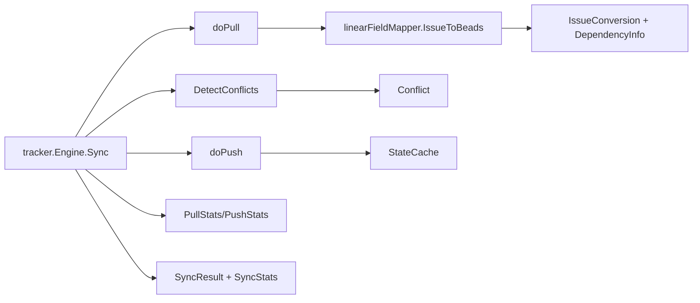

# sync_statistics_and_conflicts

`sync_statistics_and_conflicts`（对应 `internal/linear/types.go` 中的 `SyncStats`、`SyncResult`、`PullStats`、`PushStats`、`Conflict`、`IssueConversion`、`DependencyInfo`、`StateCache`）本质上是 Linear 同步链路里的“账本 + 事故单 + 中间件数据包”。它解决的不是“怎么调 API”这个问题，而是“同步跑完以后，系统如何稳定地表达发生了什么、哪里有冲突、哪些关系要延迟补建、哪些状态应被缓存复用”。如果没有这一层，你会在 pull/push/conflict 各处散落临时字段和 ad-hoc map，最后系统行为难以解释、难以观测、也难以扩展。

## 这个模块为什么存在：它解决的是“同步语义一致性”问题

在双向同步里，真正复杂的不是请求发送，而是语义对齐。一次同步可能同时包含：增量拉取、已有条目更新、新条目创建、冲突判定、冲突回灌、依赖补建、状态映射、最终统计汇总。朴素做法通常是“在哪个阶段需要什么字段就临时拼什么结构”，短期看很快，长期会产生三个后果：统计口径不一致、冲突信息丢上下文、以及关系建边时缺少稳定中间表示。

这个模块的设计洞察是：把“同步过程中的关键事实”抽成稳定类型，让流程层（`internal/tracker/engine.go`）和平台适配层（`internal/linear/tracker.go`、`internal/linear/fieldmapper.go`、`internal/linear/mapping.go`）围绕同一套事实对象协作。你可以把它想成航空黑匣子协议：飞机怎么飞可以演进，但黑匣子记录格式必须稳定，否则你无法复盘。

## 心智模型：三本账 + 一个缓存

理解这个模块最有效的方式，是在脑中放四个抽象：

第一本账是“结果账”——`SyncResult` + `SyncStats`，用于对外汇报这次同步到底干了什么。

第二本账是“阶段账”——`PullStats` 和 `PushStats`，用于 pull/push 阶段内部累计，再折叠进总账。

第三本账是“冲突账”——`Conflict`，记录同一 issue 在本地和 Linear 两边都改过的证据。

最后一个是“状态缓存”——`StateCache`，避免在 push 循环里反复请求团队 workflow states，把状态解析从 N 次远程调用降到一次预热 + 本地查找。

此外，`IssueConversion` + `DependencyInfo` 是导入路径的“运输箱”：先把 issue 主体运进来，再把依赖关系二阶段补齐。

## 架构位置与数据流



这条链路里，`sync_statistics_and_conflicts` 的角色不是 orchestrator，而是 **同步编排的语义载体层**。`tracker.Engine.Sync` 在 pull 阶段累计 `PullStats`，在 push 阶段累计 `PushStats`，冲突检测阶段产出 `[]tracker.Conflict`。Linear 适配层则提供自己的对应类型（`internal.linear.types.*`）和转换逻辑（例如 `linearFieldMapper.IssueToBeads` 把 `linear.IssueConversion` 转成 `tracker.IssueConversion`）。

从实现上看，最“热”的路径是 pull/push 循环本身；这些循环会频繁读写统计字段，并依赖 `IssueConversion`、`DependencyInfo` 的稳定结构来避免每次手写转换。`StateCache` 则是 push 热路径的性能杠杆：在进入循环前一次性 `BuildStateCache`，循环内只做 `FindStateForBeadsStatus`。

## 组件深潜：每个核心类型背后的设计意图

### `SyncStats`

`SyncStats` 是跨阶段统一统计口径，字段为 `Pulled`、`Pushed`、`Created`、`Updated`、`Skipped`、`Errors`、`Conflicts`。设计重点不是字段本身，而是“统一口径”。在 `Engine.Sync` 里，pull/push 子阶段会把内部统计折叠到这组字段中，这让 CLI 或上层调用方不必理解阶段细节也能得到稳定输出。

### `SyncResult`

`SyncResult` 把一次同步当作一个事务结果来表达：`Success`、`Stats`、`LastSync`、`Error`、`Warnings`。它的价值在于把“可机器消费”的字段和“可人工诊断”的字段放在同一返回体里。`LastSync` 由引擎在非 `DryRun` 下写回 `<tracker>.last_sync` 后同步返回，这让增量同步链路可闭环。

### `PullStats`

`PullStats` 提供 pull 阶段内部计数，并额外记录 `Incremental` 与 `SyncedSince`。这是一个很务实的选择：增量语义几乎只在拉取侧成立，因此不把它塞进总账，而是在阶段账里单独表达，既保留细节又避免污染通用统计模型。

### `PushStats`

`PushStats` 聚焦写远端的四类结果：`Created`、`Updated`、`Skipped`、`Errors`。它没有增量字段，因为 push 增量通常由“是否有 external_ref + 内容比较 + 时间比较 + 冲突策略”共同决定，不是单一 `Since` 能表达的。

### `Conflict`

`Conflict` 在 Linear 侧记录：`IssueID`、`LocalUpdated`、`LinearUpdated`、`LinearExternalRef`、`LinearIdentifier`、`LinearInternalID`。本质上它是“冲突事实快照”，不是策略。策略发生在引擎的 `resolveConflicts`，可选 `timestamp/local/external`。这类设计把“观测事实”和“决策规则”解耦，便于后续替换策略而不改数据采样结构。

### `IssueConversion`

`IssueConversion` 承载“把 Linear issue 转成本地 issue 后，还要顺带创建哪些依赖”。值得注意的是，`Issue` 字段类型是 `interface{}`（注释中明确用于避免循环依赖）。这是一种有意识的工程折中：牺牲编译期强类型，换取包边界解耦。

在 `linearFieldMapper.IssueToBeads` 中，这个 `interface{}` 会被断言为 `*types.Issue`；断言失败时返回 `nil`，引擎会将该条目计入 `Skipped`。因此它是一个“软失败”路径，避免单条坏数据拖垮整次同步。

### `DependencyInfo`

`DependencyInfo` 用外部标识描述边：`FromLinearID`、`ToLinearID`、`Type`。设计原因是导入时往往先有节点、后有边；如果在节点尚未落库时立即建边，失败率会高。两阶段导入（先 issue，后 dependency）可以显著降低顺序依赖问题。

### `StateCache`

`StateCache` 保存 `States`、`StatesByID` 和 `OpenStateID`。它的目标非常明确：把状态表查询从“每个 issue 一次 API 调用”优化为“每次 push 一次预取”。`BuildStateCache` 在 `client.go` 中构建缓存，`FindStateForBeadsStatus` 负责状态映射与兜底（找不到目标类型时回退到第一个 state，空列表则返回空字符串）。

## 依赖与契约分析

这个模块本身是类型层，几乎不主动“调用别人”；它主要被流程层与映射层消费。

向上看，`tracker.Engine`（见 [sync_orchestration_engine](sync_orchestration_engine.md)）期望拿到稳定的统计、冲突和转换结果模型。它在 `Sync` 中汇总统计，在 `DetectConflicts` 中生成冲突对象，在 `doPull` 中消费 `IssueConversion/DependencyInfo` 并延迟建依赖。

向下看，Linear 适配层提供这些模型的生产者：`IssueToBeads` 负责构造 `IssueConversion` 与 `[]DependencyInfo`，`BuildStateCache`/`FindStateForBeadsStatus` 提供状态缓存能力，`Tracker` 负责把 Linear API 数据转成引擎可消费的 `tracker.TrackerIssue`。

还有一个重要的横向契约：`internal/tracker/types.go` 中存在同构的 `SyncStats`、`SyncResult`、`Conflict`、`IssueConversion`、`DependencyInfo`。Linear 包含自己的一套类型，随后在 `linearFieldMapper` 中再转换为 tracker 通用类型。这样做隔离了包依赖，但也引入“结构漂移”风险——两套定义必须长期保持语义一致。

## 关键设计取舍与为什么合理

这里最明显的取舍是“去重”与“解耦”的对抗。你会看到 Linear 和 tracker 层都有一套统计/冲突/转换结构。表面看是重复，但它换来了适配层可独立演进、避免循环依赖，且让 `internal/linear` 能在不引入 tracker 细节的情况下组织自己的领域模型。代价是维护时必须关注双模型一致性。

第二个取舍是 `interface{}` 的使用。`IssueConversion.Issue interface{}` 与 `TrackerIssue.Raw interface{}` 都在降低类型严格度，但它们解决了插件式系统的现实问题：不同 tracker 的原始载荷结构不可能提前统一。当前代码通过“边界处断言 + 失败即跳过”保证系统健壮性，偏向正确性与容错，而非极致静态类型安全。

第三个取舍是性能与实时性的平衡。`StateCache` 明显偏向性能（预取并缓存），但这也意味着 push 过程中若远端状态定义被实时更改，当前批次不会立刻感知。对于一次同步会话，这通常是可接受的，因为状态表变化频率远低于 issue 推送频率。

## 使用方式与示例

典型接入方式是：让引擎在 push 前构建 `StateCache`，并在状态映射时复用它。

```go
eng := tracker.NewEngine(tr, store, "sync")
eng.PushHooks = &tracker.PushHooks{
    BuildStateCache: func(ctx context.Context) (interface{}, error) {
        // 通过 Linear tracker 暴露的 helper 构建缓存
        return linear.BuildStateCacheFromTracker(ctx, tr)
    },
    ResolveState: func(cache interface{}, status types.Status) (string, bool) {
        sc, ok := cache.(*linear.StateCache)
        if !ok {
            return "", false
        }
        id := sc.FindStateForBeadsStatus(status)
        return id, id != ""
    },
    FormatDescription: linear.BuildLinearDescription,
}
```

导入侧则依赖 `IssueConversion` 的两阶段语义：`Issue` 先入库，`Dependencies` 后补建。这个模式在 `Engine.doPull` + `createDependencies` 的组合里已经固定，新增映射逻辑时应保持这一约束。

## 新贡献者最该注意的边界与坑

第一个隐式契约是外部引用键空间一致性。`createDependencies` 使用 `Store.GetIssueByExternalRef` 通过 `DependencyInfo` 的外部标识查找节点；因此 `DependencyInfo` 中放的值必须和落库时 `external_ref` 的格式一致。当前 Linear 注释里强调的是 identifier（如 `TEAM-123`），而 issue 落库外部引用常见是 canonical URL（`BuildExternalRef`）。如果两者未在转换层做统一，依赖补建会静默跳过。

第二个坑是状态兜底策略。`FindStateForBeadsStatus` 在找不到匹配类型时回退到第一个 state；这能保证请求可发出，但语义不一定正确。新增状态映射配置时要优先确保 `StatusToLinearStateType` 与团队 workflow 实际可匹配。

第三个坑是软失败吞吐。`IssueToBeads` 的类型断言失败会返回 `nil`，引擎最终把该条目计为 `Skipped`。这提高了批量任务稳定性，但可能掩盖映射退化。建议在适配器层增加明确日志，避免“同步成功但数据没进来”的假象。

第四个坑是时间字段语义。冲突检测依赖 `UpdatedAt` 与 `last_sync` 比较；任何时间解析失败或时区处理不一致都会直接影响 `Conflict` 数量与策略分支。所有时间应保持 RFC3339/UTC 一致。

## 参考阅读

- [tracker_plugin_contracts](tracker_plugin_contracts.md)
- [sync_data_models_and_options](sync_data_models_and_options.md)
- [linear_api_types_and_payloads](linear_api_types_and_payloads.md)
- [sync_orchestration_engine](sync_orchestration_engine.md)
