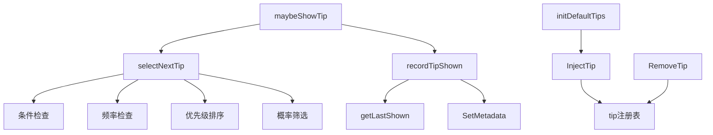

# Tip System 模块深度解析

## 1. 概述

Tip System 是 Beads CLI 中的一个上下文感知的提示系统，它在用户成功执行命令后，根据当前环境、用户行为和系统状态，智能地展示相关的提示信息。这个系统解决了两个核心问题：

1. **渐进式功能发现**：帮助用户在日常使用中自然地了解新功能，而不需要阅读冗长的文档
2. **主动状态通知**：及时提醒用户需要关注的系统状态（如同步冲突）

从设计哲学来看，Tip System 采用了"不打扰但有帮助"的原则——它只在合适的时机出现，并且可以通过 `--quiet` 或 `--json` 标志完全禁用。

## 2. 架构设计

### 2.1 核心组件



### 2.2 数据流程

Tip System 的工作流程可以分为三个主要阶段：

1. **初始化阶段**：在程序启动时，`init()` 函数调用 `initDefaultTips()` 注册内置提示
2. **选择阶段**：当命令执行成功后，`maybeShowTip()` 被调用，它通过 `selectNextTip()` 筛选合适的提示
3. **展示与记录阶段**：选择到的提示被展示给用户，同时 `recordTipShown()` 记录展示时间，用于后续的频率控制

## 3. 核心组件详解

### 3.1 Tip 结构体

`Tip` 是整个系统的核心数据结构，它封装了一个提示的所有属性：

```go
type Tip struct {
    ID          string        // 唯一标识符，用于频率跟踪
    Condition   func() bool   // 条件函数，返回 true 时提示才可能被显示
    Message     string        // 要显示的提示消息
    Frequency   time.Duration // 两次显示之间的最小间隔
    Priority    int           // 优先级，数值越高越优先显示
    Probability float64       // 0.0-1.0 之间的概率，表示符合条件时显示的可能性
}
```

**设计意图**：
- `Condition` 函数使提示可以响应环境变化，实现上下文感知
- `Frequency` 防止同一提示过于频繁地打扰用户
- `Priority` 确保重要提示（如同步冲突）优先于教育性提示
- `Probability` 提供了平滑的用户体验，避免每次都显示相同的提示

### 3.2 提示选择算法

`selectNextTip()` 函数实现了一个多阶段的筛选过程：

1. **条件筛选**：遍历所有提示，只保留 `Condition()` 返回 true 的提示
2. **频率筛选**：从条件符合的提示中，进一步筛选出距离上次显示超过 `Frequency` 的提示
3. **优先级排序**：将剩余提示按 `Priority` 降序排列
4. **概率筛选**：按优先级顺序依次进行概率测试，返回第一个通过测试的提示

**设计亮点**：
- 采用"瀑布式"筛选，先快速排除大部分不符合条件的提示
- 优先级排序确保重要提示有更高的展示机会
- 概率筛选在优先级基础上增加了随机性，提升用户体验

### 3.3 持久化机制

Tip System 使用 Dolt 存储的元数据功能来持久化提示的显示时间：

```go
// 存储格式
key: "tip_{tipID}_last_shown"
value: RFC3339 格式的时间戳
```

**设计决策**：
- 使用 Dolt 的元数据存储而不是单独的文件，简化了部署和备份
- 时间戳采用 RFC3339 格式，确保了跨平台的兼容性和可读性
- 写入操作是非关键的，失败时静默处理，不影响主命令的执行

## 4. 与其他模块的交互

### 4.1 依赖关系

Tip System 主要依赖以下模块：

1. **[Dolt Storage Backend](DOLT-BACKEND.md)**：用于持久化提示显示时间
2. **CLI Command Context**：接收 `--quiet` 和 `--json` 标志
3. **[GitLab Integration](gitlab-integration.md) / [Linear Integration](linear_integration.md)**：通过环境检测间接交互

### 4.2 数据契约

Tip System 与其他模块的交互遵循以下契约：

- **输入**：`maybeShowTip()` 接收一个 `*dolt.DoltStore` 参数，用于读写元数据
- **输出**：提示消息直接写入 `os.Stdout`，格式为 `"\n💡 Tip: {Message}\n"`
- **副作用**：通过 `SetMetadata` 写入提示显示时间

## 5. 设计权衡与决策

### 5.1 线程安全 vs 性能

**决策**：使用 `sync.RWMutex` 保护提示注册表

**原因**：
- 提示注册表在初始化后主要是读操作，`RWMutex` 提供了更好的读性能
- 虽然 `InjectTip` 和 `RemoveTip` 是写操作，但它们使用频率较低
- 线程安全确保了在并发环境（如测试或扩展）中的可靠性

### 5.2 确定性 vs 随机性

**决策**：结合优先级和概率的混合模型

**权衡**：
- 纯优先级模型：确保重要提示总是显示，但可能变得可预测和烦人
- 纯概率模型：提供多样性，但可能忽略重要提示
- **混合模型**：优先考虑重要性，同时在同一优先级内引入随机性，平衡了可靠性和用户体验

### 5.3 内存存储 vs 持久化

**决策**：使用 Dolt 元数据持久化显示时间

**原因**：
- 持久化确保提示频率控制跨会话生效
- 使用 Dolt 元数据而不是单独文件，减少了系统依赖
- 与 Beads 的整体架构保持一致，利用了已有的存储基础设施

## 6. 使用指南

### 6.1 注册新提示

使用 `InjectTip()` 函数动态添加提示：

```go
InjectTip(
    "my_feature_tip",              // 唯一 ID
    "Try using bd myfeature",      // 提示消息
    50,                             // 优先级
    24*time.Hour,                   // 频率限制
    0.5,                            // 显示概率
    func() bool {                   // 条件函数
        return isMyFeatureAvailable() && !hasUsedMyFeatureRecently()
    },
)
```

### 6.2 内置提示示例

#### Claude 设置提示

```go
InjectTip(
    "claude_setup",
    "Install the beads plugin for automatic workflow context, or run 'bd setup claude' for CLI-only mode",
    100,          // 高优先级
    24*time.Hour, // 每日一次
    0.6,          // 60% 概率
    func() bool {
        return isClaudeDetected() && !isClaudeSetupComplete()
    },
)
```

这个提示的设计体现了 Tip System 的核心思想：
- **上下文感知**：只在检测到 Claude 环境且未设置时显示
- **频率控制**：每天最多显示一次，避免骚扰
- **适当的概率**：60% 的概率确保用户有机会看到，但不会每次都出现

## 7. 扩展点与自定义

### 7.1 动态提示管理

Tip System 提供了两个关键的扩展函数：

1. **`InjectTip(id, message string, priority int, frequency time.Duration, probability float64, condition func() bool)`**：
   - 添加或更新提示
   - 如果 ID 已存在，则替换现有提示
   - 线程安全，可以在运行时调用

2. **`RemoveTip(id string)`**：
   - 从注册表中移除指定 ID 的提示
   - 安全的无操作（no-op），如果 ID 不存在

### 7.2 测试支持

Tip System 设计时考虑了测试需求：

```go
// 通过环境变量设置随机种子，实现确定性测试
os.Setenv("BEADS_TIP_SEED", "12345")

// 在测试中注入特定提示
InjectTip("test_tip", "Test message", 100, 0, 1.0, func() bool { return true })

// 验证提示是否显示
// ...
```

## 8. 边缘情况与注意事项

### 8.1 常见陷阱

1. **过度使用高优先级**：避免创建太多高优先级提示，否则它们会总是显示，降低用户体验
2. **忽略频率设置**：设置 `Frequency` 为 0 时要小心，这可能导致提示每次都显示
3. **复杂的条件函数**：条件函数应该快速返回，避免阻塞主命令流程
4. **忘记线程安全**：在从多个 goroutine 访问提示注册表时，确保使用提供的函数

### 8.2 性能考虑

- 提示选择算法的时间复杂度是 O(n log n)，主要由排序操作决定
- 对于大多数用例（n < 100），性能影响可以忽略不计
- 条件函数应该避免昂贵的操作，如网络请求或复杂计算

### 8.3 错误处理

Tip System 采用"优雅降级"的错误处理策略：

- 如果无法读取或写入元数据，系统会继续运行，只是频率控制可能不准确
- 如果 Dolt 存储为 nil，提示系统会静默跳过，不影响主命令
- 所有错误都不会返回给用户，确保 Tip System 是"隐形"的

## 9. 总结

Tip System 是一个精心设计的上下文感知提示系统，它通过条件、频率、优先级和概率的组合，实现了"不打扰但有帮助"的设计目标。它的核心价值在于：

1. **渐进式功能发现**：帮助用户自然地了解新功能
2. **主动状态通知**：及时提醒用户需要关注的系统状态
3. **优雅的用户体验**：通过多种机制确保提示既有用又不烦人

作为 Beads CLI 的一个组成部分，Tip System 展示了如何在命令行工具中实现智能、上下文感知的用户交互。
