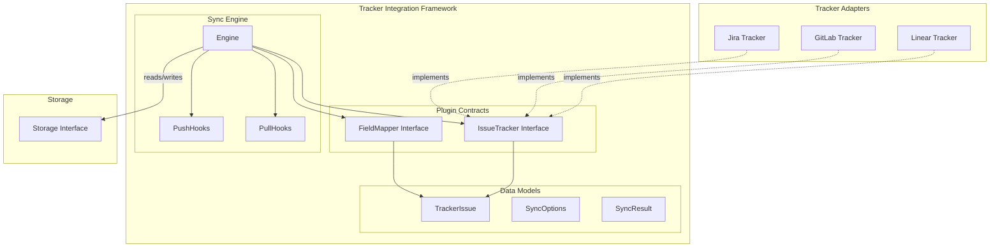

# Tracker Integration Framework

## 概述

Tracker Integration Framework（跟踪器集成框架）是 beads 系统与外部问题跟踪器（如 Linear、GitLab、Jira）之间的**适配器层**。它的核心职责是实现**双向同步**：将外部跟踪器的问题拉入 beads，同时将 beads 中的问题推送到外部系统。

想象一下这个模块的角色：**它是 beads 派驻在各个外部系统的"驻外记者"**。每个外部跟踪器就像一个国家有自己的语言和习俗，"记者"需要翻译（FieldMapper）、协调同步节奏（Engine），并将信息双向传递。

## 为什么需要这个模块？

在多团队协作的工作流中，不同团队可能使用不同的问题跟踪工具。beads 作为工作流编排系统，需要：

1. **统一数据视图** — 将所有外部跟踪器的问题汇聚到 beads，形成统一的工作队列
2. **状态双向同步** — 外部系统中的状态变更需要反映到 beads，反之亦然
3. **依赖关系映射** — 外部跟踪器中的问题依赖（如 Linear 的 "blocks"）需要转换为 beads 的依赖模型

在引入这个框架之前，每个跟踪器的集成代码都是独立实现的，导致大量重复的同步逻辑。通过提取共性，这个框架让新增一个跟踪器只需要实现 `IssueTracker` 和 `FieldMapper` 两个接口。

## 架构概览



**数据流向说明**：

1. **Pull（拉取）**：Engine 调用 tracker 的 `FetchIssues` → FieldMapper 转换为 beads 格式 → 写入 Storage
2. **Conflict Detection（冲突检测）**：比对本地和外部问题的 `UpdatedAt` 时间戳，识别双向修改
3. **Push（推送）**：从 Storage 读取问题 → FieldMapper 转换为 tracker 格式 → 调用 `CreateIssue` 或 `UpdateIssue`

## 核心抽象

### IssueTracker 接口 — 插件契约

```go
type IssueTracker interface {
    Name() string                          // "linear", "gitlab", "jira"
    DisplayName() string                   // "Linear", "GitLab", "Jira"
    Init(ctx context.Context, store storage.Storage) error
    Validate() error
    Close() error
    
    FetchIssues(ctx context.Context, opts FetchOptions) ([]TrackerIssue, error)
    FetchIssue(ctx context.Context, identifier string) (*TrackerIssue, error)
    CreateIssue(ctx context.Context, issue *types.Issue) (*TrackerIssue, error)
    UpdateIssue(ctx context.Context, externalID string, issue *types.Issue) (*TrackerIssue, error)
    
    FieldMapper() FieldMapper
    IsExternalRef(ref string) bool
    ExtractIdentifier(ref string) string
    BuildExternalRef(issue *TrackerIssue) string
}
```

这个接口是**每个跟踪器适配器的合约**。关键设计点：

- **外部引用格式**：每个 tracker 需要能解析和构建 `external_ref` 字符串（例如 `linear:123` 或 `gitlab:project/456`），这是 beads 追踪"这个本地问题对应外部哪个问题"的方式
- **状态缓存**：`BuildStateCache` 和 `ResolveState` 机制允许 tracker 预缓存工作流状态，避免每次推送都查询 API

### FieldMapper 接口 — 字段翻译

```go
type FieldMapper interface {
    PriorityToBeads(trackerPriority interface{}) int
    PriorityToTracker(beadsPriority int) interface{}
    StatusToBeads(trackerState interface{}) types.Status
    StatusToTracker(beadsStatus types.Status) interface{}
    TypeToBeads(trackerType interface{}) types.IssueType
    TypeToTracker(beadsType types.IssueType) interface{}
    
    IssueToBeads(trackerIssue *TrackerIssue) *IssueConversion
    IssueToTracker(issue *types.Issue) map[string]interface{}
}
```

FieldMapper 解决的是**语义映射**问题：Linear 的 priority 是字符串 "urgent"，beads 是整数 0-4；Jira 的状态是 "In Progress"，beads 是枚举 "open"。这个接口让每个 tracker 定义自己的翻译规则。

### Engine — 同步编排器

Engine 实现了所有 tracker 适配器共享的同步模式：

```
┌─────────────────────────────────────────────────────────────┐
│                        Sync()                                │
├─────────────────────────────────────────────────────────────┤
│  Phase 1: Pull                                             │
│    └─→ FetchIssues → Convert → Import → Create Deps        │
│                                                             │
│  Phase 2: Detect Conflicts (if bidirectional)              │
│    └─→ Compare timestamps → Build skip/force maps          │
│                                                             │
│  Phase 3: Push                                             │
│    └─→ Filter → Convert → Create/Update → Update refs      │
└─────────────────────────────────────────────────────────────┘
```

**关键设计决策**：

1. **先 Pull 再 Push** — 这样可以利用增量同步的 `last_sync` 时间戳，减少 API 调用
2. **冲突检测在两阶段之间** — 确保在 Push 之前就识别出冲突，避免盲目覆盖
3. **依赖延迟创建** — `IssueConversion.Dependencies` 在所有 issue 导入后才创建，确保依赖目标存在

### Hooks 机制 — 扩展点

```go
type PullHooks struct {
    GenerateID    func(ctx context.Context, issue *types.Issue) error
    TransformIssue func(issue *types.Issue)
    ShouldImport  func(issue *TrackerIssue) bool
}

type PushHooks struct {
    FormatDescription func(issue *types.Issue) string
    ContentEqual      func(local *types.Issue, remote *TrackerIssue) bool
    ShouldPush        func(issue *types.Issue) bool
    BuildStateCache   func(ctx context.Context) (interface{}, error)
    ResolveState      func(cache interface{}, status types.Status) (string, bool)
}
```

Hooks 模式的选择而非继承，是一种**组合优于继承**的设计。tracker 适配器只需要设置自己需要的钩子，不必继承一个庞大的基类。

## 设计权衡分析

### 1. 同步策略：时间戳 vs 哈希 vs 矢量时钟

**当前选择**：时间戳比较 + 可选的 ContentEqual 钩子

**权衡**：
- **时间戳**：简单高效，但在时钟不同步时可能出错。框架记录 `last_sync`，只比较该时间点之后的修改。
- **内容哈希**：更准确但需要每次都计算哈希，且无法处理字段级别冲突。
- **矢量时钟**：理论上最优但实现复杂度极高，当前场景不需要。

框架通过 `ContentEqual` 钩子允许 tracker 实现更精确的相等判断（Linear 使用它）。

### 2. 冲突解决：三种策略

```go
const (
    ConflictTimestamp = "timestamp"  // 默认：保留最新修改
    ConflictLocal     = "local"      // 始终保留本地版本
    ConflictExternal  = "external"   // 始终保留外部版本
)
```

**设计意图**：
- `timestamp` 是最安全的选择，遵循"谁最新谁赢"的原则
- `local` 适用于"beads 是真理源"的场景
- `external` 适用于"外部系统是真理源"的场景

### 3. 增量同步：可选但推荐

框架默认尝试增量同步（通过 `last_sync` 配置键），但不是强制的。如果 tracker 不支持，可以忽略 `Since` 参数。

### 4. 状态缓存：性能 vs 复杂度

`BuildStateCache` 是一个**性能优化**。没有缓存时，每次 push 都要调用 API 获取工作流状态列表；有了缓存，只在 push 开始时调用一次。这个设计将 API 调用从 O(n) 降到 O(1)，其中 n 是待推送的问题数量。

## 子模块文档

本模块包含三个主要子模块：

### 1. Tracker Plugin Contracts（跟踪器插件契约）

定义了 `IssueTracker` 和 `FieldMapper` 两个核心接口。所有外部跟踪器适配器（Linear、GitLab、Jira）都通过实现这些接口接入系统。

→ 查看详细文档：[tracker-plugin-contracts](tracker-plugin-contracts.md)

### 2. Sync Orchestration Engine（同步编排引擎）

`Engine` 结构体实现了完整的 Pull → Detect → Push 同步流程，配合 `PullHooks` 和 `PushHooks` 提供扩展点。

→ 查看详细文档：[sync-orchestration-engine](sync-orchestration-engine.md)

### 3. Sync Data Models and Options（同步数据模型与选项）

定义了同步操作中使用的数据结构：`TrackerIssue`、`SyncOptions`、`SyncResult`、`Conflict` 等。

→ 查看详细文档：[sync-data-models-and-options](sync-data-models-and-options.md)

## 与其他模块的关系

### 上游依赖

- **[Core Domain Types](core-domain-types.md)**：提供 `types.Issue`、`types.Dependency`、`types.Status` 等核心领域类型。FieldMapper 在翻译时依赖这些类型。
  
- **[Storage Interfaces](storage-interfaces.md)**：`Engine` 通过 `storage.Storage` 接口读取和写入问题数据。`Transaction` 接口用于确保同步操作的原子性。

### 下游实现

- **[GitLab Integration](gitlab-integration.md)**：实现 `IssueTracker` 接口，将 GitLab API 转换为框架内部格式。
  
- **[Jira Integration](jira-integration.md)**：实现 `IssueTracker` 接口，适配 Jira 的 REST API。
  
- **[Linear Integration](linear-integration.md)**：实现 `IssueTracker` 接口，使用 Linear 的 GraphQL API。

### 配置依赖

- **[Configuration](configuration.md)**：`SyncConfig` 定义了同步参数（如冲突解决策略），`Engine` 从配置中读取这些参数。

## 新贡献者注意事项

### 1. External Ref 格式约定

每个 tracker 的 external ref 必须能被 `IsExternalRef` 和 `ExtractIdentifier` 正确解析。约定格式是 `tracker_name:identifier`（如 `linear:TEAM-123`）。

**常见陷阱**：如果 tracker 的 identifier 包含冒号（如 GitLab 的 `group/project#123`），需要设计合适的编码方式。

### 2. 冲突检测的时间窗口

冲突检测依赖于 `last_sync` 时间戳。如果用户修改了系统时钟，或者在同步过程中同时有外部修改，可能漏检或误检冲突。

**缓解**：框架在 Pull 阶段也检查 `UpdatedAt`，会跳过"最后一次 pull 之后又被本地修改"的问题。

### 3. 状态缓存的生命周期

`BuildStateCache` 构建的缓存存储在 `Engine.stateCache` 字段，只在单次 `doPush` 调用期间有效。如果需要跨多次 push 保持缓存，需要自行管理。

### 4. Pull Hooks 的执行顺序

在 Pull 阶段，hooks 的执行顺序是：
1. `ShouldImport` — 过滤原始外部问题
2. `IssueToBeads` — 转换为 beads 格式
3. `TransformIssue` — 修改转换后的问题
4. `GenerateID` — 生成 ID

这个顺序意味着 `TransformIssue` 可以基于已转换的字段做处理，但无法影响是否导入的决策。

### 5. Push 阶段的描述格式化

`FormatDescription` hook 作用于**一个拷贝**，而非原始问题。这是刻意的设计，避免本地数据被意外修改。

## 扩展点与边界

**设计为可扩展的部分**：
- 每个 tracker 的字段映射逻辑（通过 FieldMapper）
- 导入/推送时的过滤和转换逻辑（通过 Hooks）
- 冲突检测和解决的策略（通过 SyncOptions.ConflictResolution）

**设计为封闭的部分**：
- 同步的宏观流程（Pull → Detect → Push 的顺序是固定的）
- 同步结果的统计结构（SyncStats 字段是固定的）
- 问题 ID 的生成策略（由 GenerateID hook 控制，但默认由 storage 层决定）

## 相关设计文档

- GitHub Issue #1150：插件化 tracker 架构的原始讨论
- PRs #1564-#1567：框架的初始实现