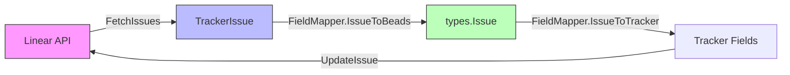

# tracker_plugin_contracts 模块技术深潜

## 概述

`tracker_plugin_contracts` 模块是 beads 系统与外部问题跟踪器（如 Linear、GitLab、Jira）集成的**适配器契约层**。它定义了两个核心接口：`IssueTracker` 和 `FieldMapper`，前者规定了跟踪器插件必须实现的操作集合，后者负责在外部跟踪器的数据模型与 beads 内部域模型之间进行双向转换。

这个模块解决的核心问题是：**beads 是一个独立于任何特定问题跟踪器的系统，但它需要与多种外部系统保持同步**。如果没有这个抽象层，beads 的同步引擎（SyncEngine）将被迫包含 Linear 的 API 调用逻辑、GitLab 的 GraphQL 查询、Jira 的 REST 交互——这不仅是代码重复，更是一场维护噩梦。通过定义清晰的接口，每个跟踪器只需实现一次"适配器"，而同步逻辑只需了解这一个统一的合约。

## 架构角色与数据流

### 核心抽象

把这个模块想象成**外交翻译官**的角色。当你进入一个外国时，你不需要学会他们的语言，你需要的是一个翻译。beads 说"Issue"（问题），Linear 说"Issue"（但字段完全不同），GitLab 又说"Issue"。"IssueTracker" 接口就像是规定了什么级别的对话必须能够进行——fetch、create、update、delete。而 "FieldMapper" 就是具体的翻译字典——把 Linear 的 "priority: urgent" 翻译成 beads 的 "priority: 4"。

### 数据流向



当执行**拉取（pull）**操作时，数据从外部跟踪器出发，经过 `TrackerIssue` 这一中间表示，最终通过 `FieldMapper.IssueToBeads()` 转换为 beads 的 `types.Issue` 结构。**推送（push）**操作则反之，从 beads 的 `Issue` 出发，经由 `FieldMapper.IssueToTracker()` 转换为跟踪器需要的字段映射，再调用 `CreateIssue` 或 `UpdateIssue` 发送到外部系统。

### 依赖关系

这个模块被以下组件依赖：

- **[sync_orchestration_engine](sync-orchestration-engine.md)** — 同步引擎是这个接口的主要消费者，它持有 `IssueTracker` 实例并调用其方法执行双向同步
- **[sync_data_models_and_options](sync-data-models-and-options.md)** — 提供 `TrackerIssue`、`FetchOptions`、`IssueConversion` 等数据模型，与合约配合使用

这个模块依赖：

- **[Core Domain Types](core-domain-types.md)** — 使用 `types.Issue`、`types.Status`、`types.IssueType` 等 beads 核心类型
- **[Storage Interfaces](storage-interfaces.md)** — `IssueTracker.Init()` 接收 `storage.Storage` 参数用于初始化

## 核心组件详解

### IssueTracker 接口

```go
type IssueTracker interface {
    Name() string
    DisplayName() string
    ConfigPrefix() string
    Init(ctx context.Context, store storage.Storage) error
    Validate() error
    Close() error
    FetchIssues(ctx context.Context, opts FetchOptions) ([]TrackerIssue, error)
    FetchIssue(ctx context.Context, identifier string) (*TrackerIssue, error)
    CreateIssue(ctx context.Context, issue *types.Issue) (*TrackerIssue, error)
    UpdateIssue(ctx context.Context, externalID string, issue *types.Issue) (*TrackerIssue, error)
    FieldMapper() FieldMapper
    IsExternalRef(ref string) bool
    ExtractIdentifier(ref string) string
    BuildExternalRef(issue *TrackerIssue) string
}
```

**设计意图**：这个接口采用**插件模式**——beads 不知道也不关心背后是哪个跟踪器，它只知道调用这些方法。所有的跟踪器特异性都封装在各自的实现中。

**关键设计决策**：

1. **分离 Init 和 Validate**：初始化操作是昂贵的（建立连接、加载配置），而验证只是检查配置是否有效。这种分离允许同步引擎在需要时快速验证配置，而不必每次都重新初始化。

2. **externalID vs Identifier 的区分**：这是容易混淆的点。`externalID` 是跟踪器内部的 UUID 或数字 ID（如 Linear 的 `issue-id-uuid`），而 `identifier` 是人类可读的标识符（如 `TEAM-123`）。更新操作使用 internal ID，因为这是 API 的要求；查询操作使用 identifier，因为这是用户输入的。接口通过 `ExtractIdentifier` 和 `BuildExternalRef` 辅助方法在两种表示之间转换。

3. **返回 TrackerIssue 而非直接转换**：Fetch 方法返回的是中间表示 `TrackerIssue`，而不是直接的 beads `Issue`。这有两层考虑：一是让调用方有机会在转换前检查原始数据；二是允许批量操作（如依赖关系解析）在转换前进行。

### FieldMapper 接口

```go
type FieldMapper interface {
    PriorityToBeads(trackerPriority interface{}) int
    PriorityToTracker(beadsPriority int) interface{}
    StatusToBeads(trackerState interface{}) types.Status
    StatusToTracker(beadsStatus types.Status) interface{}
    TypeToBeads(trackerType interface{}) types.IssueType
    TypeToTracker(beadsType types.IssueType) interface{}
    IssueToBeads(trackerIssue *TrackerIssue) *IssueConversion
    IssueToTracker(issue *types.Issue) map[string]interface{}
}
```

**设计意图**：这个接口处理 beads 域模型与外部跟踪器数据模型之间的**字段级转换**。注意它不是 IssueTracker 的一部分，而是通过 `FieldMapper() FieldMapper` 方法单独获取。这种设计有几个微妙的好处：

- **可测试性**：你可以在不启动完整跟踪器的情况下单独测试字段映射逻辑
- **可组合性**：一个跟踪器可以有多个 FieldMapper 实现（虽然当前未使用，但架构允许）
- **关注点分离**：跟踪器的职责是 API 交互，映射器的职责是数据转换

**设计权衡**：

使用 `interface{}` 而非泛型是经过权衡的。一方面，这失去了编译时的类型安全——如果你传错了类型，运行时会 panic。但另一方面，每个跟踪器的 Priority/State/Type 类型完全不同：Linear 用字符串、GitLab 用枚举、Jira 用对象。如果用泛型 `T any`，代码中会充满类型断言；用 `interface{}` 则把这个问题直接抛给实现者。团队的选择是把复杂性留给每个适配器的实现，而不是在框架层面过度抽象。

## 实际实现分析

### 具体跟踪器实现

从模块树可以看到，三个跟踪器实现了这个接口：

1. **GitLab** (`internal.gitlab.tracker.Tracker`) — 通过 GitLab REST API 交互
2. **Linear** (`internal.linear.tracker.Tracker`) — 通过 Linear GraphQL API 交互  
3. **Jira** (`internal.jira.tracker.Tracker`) — 通过 Jira REST API 交互

每个实现都包含一个私有的 `Client`（与外部 API 通信）和一个 `MappingConfig`（字段映射配置）。FieldMapper 的实现（如 `gitlabFieldMapper`、`linearFieldMapper`）是私有结构体，通过闭包捕获配置。

### 转换示例

以 Priority 转换为例。beads 使用 0-4 的整数表示优先级（0 最高，4 最低），但各跟踪器的表示完全不同：

- **Linear**："urgent" → 0, "high" → 1, "medium" → 2, "low" → 3, "none" → 4
- **GitLab**：标签 "priority::critical" → 0，其他通过配置映射
- **Jira**：可能是字符串 "Highest" → 0，也可能是数字

`FieldMapper` 的实现需要知道这些映射规则，通常从配置文件读取。这解释了为什么 `gitlabFieldMapper` 和 `linearFieldMapper` 都持有 `*MappingConfig`。

## 设计决策与权衡

### 1. 中间表示 vs 直接转换

**选择**：使用 `TrackerIssue` 作为中间表示，而不是在 Fetch 时直接返回 `types.Issue`

**原因**：这允许同步引擎在转换前检查和处理原始数据。例如，同步引擎需要先收集所有问题的依赖关系，然后在转换时一起处理。直接返回 `Issue` 会丢失这个灵活性。

**代价**：需要额外的数据结构，调用方必须了解两个模型

### 2. 宽松的类型设计

**选择**：使用 `interface{}` 处理 tracker-specific 的字段（State、Type、Priority）

**原因**：每个跟踪器的类型系统完全不同。Linear 的 state 是字符串，Jira 的 state 是包含多个属性的对象。试图用 Go 的泛型或强类型来统一这些会导致脆弱的抽象层。

**代价**：运行时类型错误的风险，需要实现者小心处理类型断言

### 3. 分离的 FieldMapper

**选择**：FieldMapper 是独立接口，而非 IssueTracker 的方法

**原因**：便于单元测试；允许运行时切换映射策略；关注点清晰

**代价**：需要额外的方法调用，调用方必须获取并持有两个对象

### 4. external_ref 的双重编码

**选择**：`BuildExternalRef` 返回的字符串同时编码跟踪器类型和标识符

**原因**：beads 可能在同一个仓库中同步多个跟踪器的问题。`external_ref` 字段需要能够区分"这个 issue 来自 Linear"还是"来自 GitLab"。通过在 ref 字符串中嵌入类型信息（如 `linear-123`、`gitlab-456`），`IsExternalRef` 和 `ExtractIdentifier` 可以快速判断归属。

## 潜在问题与注意事项

### 1. 标识符解析的陷阱

```go
// 这两个方法看似简单，但容易出错
IsExternalRef(ref string) bool      // 检查 ref 是否属于此跟踪器
ExtractIdentifier(ref string) string // 从 ref 提取人类可读标识符
```

如果 ref 格式定义不严格，可能会发生误判。例如，如果 Linear 用 `linear-123`，GitLab 用 `gl-123`，前缀匹配就足够了。但如果两个跟踪器都使用纯数字 ID，需要更复杂的解析逻辑。

### 2. 字段覆盖问题

当从外部拉取问题时，`FieldMapper.IssueToBeads()` 生成的 `IssueConversion.Issue` 会包含转换后的字段。但 beads 的 Issue 有很多字段，外部系统可能只有其中一部分。**未设置的字段会怎样？** 这取决于调用方如何处理——可能会丢失本地修改。

### 3. 依赖关系的延迟处理

`IssueToBeads` 返回的 `IssueConversion` 包含 `Dependencies` 字段。这意味着依赖关系是在问题转换时一起返回的，而不是从 `TrackerIssue.Dependencies` 直接读取。调用方需要在转换问题后立即创建这些依赖关系，否则会丢失。

### 4. 元数据的往返

`TrackerIssue.Metadata` 字段用于存储不能映射到核心 Issue 字段的 tracker-specific 数据。这些数据被写入 `Issue.Metadata` 进行持久化。但要注意：这是一个 `map[string]interface{}`，序列化为 JSON 时需要确保类型兼容。

### 5. 并发安全

`IssueTracker` 接口没有规定线程安全的要求。实现者需要自行决定是否需要 mutex 或其他同步机制。同步引擎在调用这些方法时会假设它们是安全的。

## 扩展点

如果你需要添加新的跟踪器，需要实现以下内容：

1. **实现 IssueTracker 接口**：创建 `Tracker` 结构体，实现所有方法
2. **实现 FieldMapper 接口**：创建私有的 mapper 结构体，实现字段转换
3. **配置加载**：在配置系统中注册跟踪器，定义其 ConfigPrefix
4. **HTTP/GraphQL 客户端**：实现与外部 API 的通信

不需要修改同步引擎——这是接口驱动设计的核心优势。

## 相关文档

- [sync_orchestration_engine](sync-orchestration-engine.md) — 消费这些合约的同步引擎实现
- [sync_data_models_and_options](sync-data-models-and-options.md) — TrackerIssue、FetchOptions 等数据模型
- [core-domain-types](core-domain-types.md) — beads 核心域模型 types.Issue
- [storage-interfaces](storage-interfaces.md) — 存储接口定义
- [gitlab_tracker](gitlab-tracker.md) — GitLab 跟踪器实现
- [linear_tracker](linear-tracker.md) — Linear 跟踪器实现