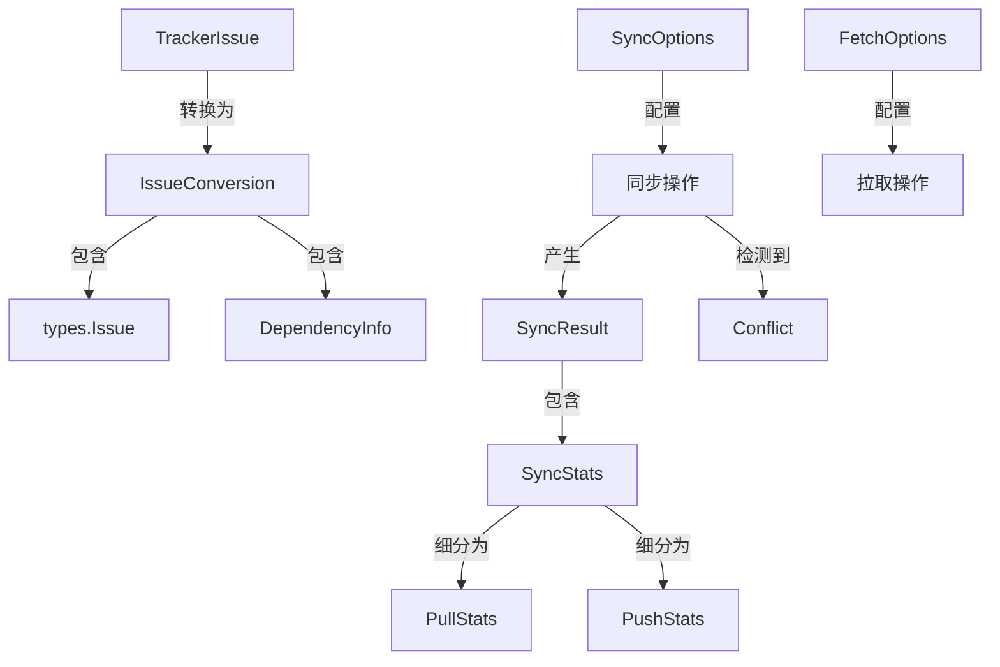

# sync_data_models_and_options 模块技术深度剖析

## 1. 问题域与模块定位

在多系统协作的现代开发环境中，不同的问题追踪系统（如 Jira、GitLab、Linear 等）各自拥有独特的数据模型和 API 设计。当团队需要在本地 Beads 系统与外部追踪器之间同步数据时，面临着几个核心挑战：

- **数据模型碎片化**：每个追踪器都有自己的 Issue 表示方式，字段名称、类型、语义各不相同
- **同步状态复杂性**：双向同步需要处理冲突检测、状态跟踪、增量更新等复杂逻辑
- **操作可观测性**：需要清晰的统计信息和错误报告来理解同步过程中发生了什么
- **配置灵活性**：不同场景需要不同的同步策略（全量/增量、拉取/推送、冲突处理等）

`sync_data_models_and_options` 模块正是为了解决这些问题而设计的。它提供了一套**统一的中间数据模型**和**同步操作契约**，使得不同追踪器的适配器可以通过这套通用语言与核心同步引擎交互，而不必让引擎直接处理每个追踪器的特殊性。

### 设计洞察

这个模块的核心设计思想是：**将数据转换与同步逻辑分离**。通过定义一套中间表示（`TrackerIssue`），同步引擎可以专注于同步策略、冲突解决和状态管理，而具体的追踪器适配器只需要负责在原生格式和中间格式之间进行转换。这种分层设计大大降低了系统的耦合度。

## 2. 核心抽象与心智模型

理解这个模块的关键在于掌握几个核心抽象及其相互关系。我们可以用**"翻译官-谈判专家-记账员"**的比喻来理解：

- **`TrackerIssue` 是翻译官**：它将不同追踪器的"方言"翻译成 Beads 能理解的"普通话"
- **`SyncOptions` 是谈判专家**：它决定了同步过程中的各种策略和规则
- **`SyncStats`、`PullStats`、`PushStats` 是记账员**：它们记录同步过程中的所有操作和结果
- **`Conflict` 是争端记录**：当翻译官发现两边说法不一致时，它记录下争端的详细信息

### 核心类型关系图



## 3. 组件深度解析

### 3.1 TrackerIssue：统一的问题表示

`TrackerIssue` 是整个模块的核心。它不是 Beads 内部的 Issue 类型，也不是某个特定追踪器的原生类型，而是一个**中间交换格式**。

```go
type TrackerIssue struct {
    // 核心标识
    ID         string // 外部追踪器的内部 ID（如 UUID）
    Identifier string // 人类可读的标识符（如 "TEAM-123"）
    URL        string // 问题的 Web URL
    
    // 内容
    Title       string
    Description string
    
    // 分类
    Priority int         // 优先级值（追踪器特定，通过 FieldMapper 映射）
    State    interface{} // 追踪器特定的状态对象（通过 FieldMapper 映射）
    Type     interface{} // 追踪器特定的类型（通过 FieldMapper 映射）
    Labels   []string    // 标签
    
    // 分配
    Assignee      string // 负责人姓名或邮箱
    AssigneeID    string // 负责人的追踪器特定 ID
    AssigneeEmail string // 负责人邮箱（如果可用）
    
    // 时间戳
    CreatedAt   time.Time
    UpdatedAt   time.Time
    CompletedAt *time.Time
    
    // 关系
    ParentID         string // 父问题标识符（用于子任务）
    ParentInternalID string // 父问题内部 ID
    
    // 原始数据，用于追踪器特定处理
    Raw interface{} // 原始 API 响应
    
    // 元数据，用于追踪器特定字段
    Metadata map[string]interface{}
}
```

**设计意图**：
- **分离内部与外部标识**：`ID` 用于 API 调用，`Identifier` 用于用户界面展示
- **保留原始数据**：`Raw` 字段允许适配器访问完整的原始响应，处理特殊情况
- **元数据扩展**：`Metadata` 字段为无法映射到核心字段的追踪器特定数据提供了存储空间

**关键设计决策**：
- `State` 和 `Type` 字段使用 `interface{}` 类型，这是因为不同追踪器的状态和类型系统差异极大，无法用统一的枚举表示。这些字段的实际转换由配套的 `FieldMapper` 接口处理。

### 3.2 SyncOptions：同步操作的指挥棒

`SyncOptions` 结构体封装了同步操作的所有配置选项，它是一个典型的**选项模式**应用，但使用结构体而非函数选项，因为配置项较多且经常需要一起传递。

```go
type SyncOptions struct {
    Pull bool                  // 是否从外部追踪器拉取
    Push bool                  // 是否推送到外部追踪器
    DryRun bool                // 预览模式，不做实际更改
    CreateOnly bool            // 仅创建新问题，不更新现有问题
    State string               // 状态过滤器
    ConflictResolution ConflictResolution // 冲突解决策略
    TypeFilter []types.IssueType // 限制同步哪些问题类型（空=所有）
    ExcludeTypes []types.IssueType // 排除特定问题类型
    ExcludeEphemeral bool     // 跳过临时/短暂问题（CLI默认行为）
}
```

**设计亮点**：
- **双向控制**：`Pull` 和 `Push` 独立控制，支持单向同步
- **冲突解决策略枚举**：`ConflictResolution` 提供了清晰的冲突处理选项
- **类型过滤**：`TypeFilter` 和 `ExcludeTypes` 允许精细控制同步哪些类型的问题

### 3.3 统计与结果类型

模块提供了三层统计结构，从不同粒度记录同步过程：

1. **`SyncStats`**：整体同步统计，包含拉取和推送的汇总信息
2. **`PullStats`**：专门记录拉取操作的详细统计
3. **`PushStats`**：专门记录推送操作的详细统计

```go
// SyncStats 累积同步统计信息
type SyncStats struct {
    Pulled    int `json:"pulled"`
    Pushed    int `json:"pushed"`
    Created   int `json:"created"`
    Updated   int `json:"updated"`
    Skipped   int `json:"skipped"`
    Errors    int `json:"errors"`
    Conflicts int `json:"conflicts"`
}
```

这种分层设计的好处是：**调用者可以根据需要获取不同粒度的信息**。例如，UI 可能只需要 `SyncStats` 来显示概览，而日志系统可能需要 `PullStats` 和 `PushStats` 来记录详细操作。

### 3.4 Conflict：冲突的结构化表示

当双向同步检测到本地和外部都有修改时，`Conflict` 结构体记录了所有必要的信息来理解和解决冲突：

```go
type Conflict struct {
    IssueID            string    // Beads 问题 ID
    LocalUpdated       time.Time // 本地版本最后修改时间
    ExternalUpdated    time.Time // 外部版本最后修改时间
    ExternalRef        string    // 外部问题的 URL 或标识符
    ExternalIdentifier string    // 外部追踪器的标识符（如 "TEAM-123"）
    ExternalInternalID string    // 外部追踪器的内部 ID（用于 API 调用）
}
```

**设计意图**：
- 包含足够的信息让用户或自动化策略做出明智的冲突解决决策
- 同时记录外部标识符（`ExternalIdentifier`）和内部 ID（`ExternalInternalID`），分别用于展示和 API 操作

**冲突解决策略**：
```go
type ConflictResolution string

const (
    // ConflictTimestamp 通过保留更新的版本解决冲突
    ConflictTimestamp ConflictResolution = "timestamp"
    // ConflictLocal 始终保留本地 beads 版本
    ConflictLocal ConflictResolution = "local"
    // ConflictExternal 始终保留外部追踪器版本
    ConflictExternal ConflictResolution = "external"
)
```

## 4. 数据流与架构角色

### 数据流向

`sync_data_models_and_options` 模块在整个同步架构中扮演着**数据契约**的角色，数据流向如下：

1. **拉取方向**：
   ```
   外部追踪器 API → 追踪器适配器 → TrackerIssue → 同步引擎 → types.Issue → 存储层
   ```

2. **推送方向**：
   ```
   存储层 → types.Issue → 同步引擎 → TrackerIssue → 追踪器适配器 → 外部追踪器 API
   ```

### 架构交互

这个模块与其他模块的交互关系：

- **被依赖**：[sync_orchestration_engine](tracker-sync_orchestration_engine.md) 模块使用这些类型来执行实际的同步逻辑
- **依赖**：依赖 [Core Domain Types](core-domain-types.md) 中的 `types.Issue` 等基础类型
- **实现**：各个追踪器集成模块（[GitLab Integration](gitlab-integration.md)、[Jira Integration](jira-integration.md)、[Linear Integration](linear-integration.md)）都实现了到这些类型的转换

## 5. 设计决策与权衡

### 5.1 中间格式 vs 直接转换

**决策**：使用 `TrackerIssue` 作为中间格式，而非直接在外部类型和 `types.Issue` 之间转换。

**权衡**：
- ✅ **优点**：
  - 隔离变化：外部追踪器 API 变化只影响适配器，不影响同步引擎
  - 可测试性：可以独立测试适配器和同步引擎
  - 复用性：同一套同步引擎可以用于所有追踪器
- ❌ **缺点**：
  - 额外的转换层：每次同步都需要两次转换（外部↔中间↔内部）
  - 可能丢失信息：中间格式可能无法表达某些追踪器的特殊字段（尽管通过 `Metadata` 缓解了这一点）

### 5.2 结构体选项 vs 函数选项

**决策**：使用结构体（`SyncOptions`、`FetchOptions`）而非函数选项模式。

**权衡**：
- ✅ **优点**：
  - 易于序列化：结构体可以轻松转换为 JSON，便于配置文件存储
  - 清晰的默认值：结构体的零值提供了合理的默认行为
  - 易于传递：多个相关选项作为一个单元传递
- ❌ **缺点**：
  - 扩展性稍差：添加新选项需要修改结构体定义
  - 可选字段不够明显：与显式的函数选项相比，哪些是必填哪些是可选不够直观

### 5.3 interface{} 的使用

**决策**：在 `TrackerIssue` 中使用 `interface{}` 类型表示 `State`、`Type` 和 `Raw`。

**权衡**：
- ✅ **优点**：
  - 最大的灵活性：可以表示任何追踪器的状态和类型系统
  - 渐进式处理：适配器可以先将原始数据放入这些字段，然后逐步实现转换
- ❌ **缺点**：
  - 类型不安全：编译时无法捕获类型错误
  - 需要类型断言：使用这些字段时需要进行运行时类型检查

## 6. 使用指南与最佳实践

### 6.1 正确使用 TrackerIssue

当实现新的追踪器适配器时，遵循以下原则：

```go
// 良好实践：尽可能填充所有相关字段
trackerIssue := &TrackerIssue{
    ID:         externalIssue.ID,
    Identifier: externalIssue.Key,
    URL:        externalIssue.WebURL,
    Title:      externalIssue.Title,
    // ... 其他字段
    Raw:        externalIssue, // 始终保留原始数据
    Metadata: map[string]interface{}{
        "gitlab_iid": externalIssue.IID, // 追踪器特定字段
    },
}
```

**注意事项**：
- 始终填充 `Raw` 字段，这样在需要处理特殊情况时有退路
- 对于无法映射到核心字段的重要数据，使用 `Metadata` 存储
- `Identifier` 应该是用户在追踪器界面上看到的那个标识符

### 6.2 配置 SyncOptions

常见的同步场景配置：

```go
// 场景1：完全同步（拉取+推送）
fullSyncOptions := SyncOptions{
    Pull:               true,
    Push:               true,
    ConflictResolution: ConflictTimestamp,
}

// 场景2：仅预览拉取
previewPullOptions := SyncOptions{
    Pull:   true,
    DryRun: true,
}

// 场景3：增量同步（仅更新，不创建）
incrementalOptions := SyncOptions{
    Pull:       true,
    CreateOnly: false,
    State:      "open",
}
```

## 7. 边缘情况与注意事项

### 7.1 时间戳处理

`Conflict` 结构体中的时间戳比较是冲突解决的关键。需要注意：
- 不同追踪器的时间戳精度可能不同（有些到毫秒，有些到秒）
- 时区问题：确保所有时间戳都转换为同一时区（建议 UTC）进行比较

### 7.2 标识符映射

`TrackerIssue` 中有多个标识符字段，使用时不要混淆：
- `ID`：外部追踪器的**内部** ID，通常用于 API 调用
- `Identifier`：外部追踪器的**显示** ID，如 "TEAM-123"
- `IssueConversion.Issue.ID`：Beads 内部的 ID，仅在转换后存在

### 7.3 依赖关系处理

`DependencyInfo` 中的 `FromExternalID` 和 `ToExternalID` 引用的是外部追踪器的标识符，这意味着：
- 所有问题必须先转换完成，然后才能创建依赖关系
- 如果某个依赖的目标问题未被同步，依赖关系将无法创建

## 8. 相关模块参考

- [sync_orchestration_engine](tracker-sync_orchestration_engine.md)：使用这些数据模型的实际同步引擎
- [tracker_plugin_contracts](tracker-tracker_plugin_contracts.md)：定义了追踪器适配器需要实现的接口
- [Core Domain Types](core-domain-types.md)：Beads 内部的核心数据类型
- 各个追踪器集成模块：
  - [GitLab Integration](gitlab-integration.md)
  - [Jira Integration](jira-integration.md)
  - [Linear Integration](linear-integration.md)
