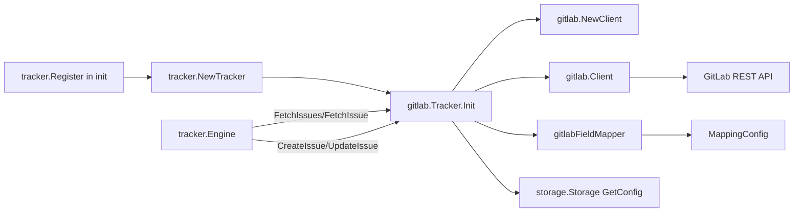

# tracker_adapter（GitLab `internal.gitlab.tracker.Tracker`）深度解析

`tracker_adapter` 的存在，本质上是在做一件“翻译官 + 网关”的工作：上游同步引擎（`internal.tracker.engine.Engine`）只懂统一的 `IssueTracker` 协议，但 GitLab API 有自己的一套语义（例如 `opened`/`closed`、`IID`/`ID`、label-scope 规则）。`internal.gitlab.tracker.Tracker` 负责把这两套世界接起来，让引擎不必理解 GitLab 的细节，也让 GitLab 集成不必重写一套同步框架。没有这一层，最直接的“朴素方案”会把 GitLab 特有逻辑散落进同步主流程，导致每新增一种平台都要复制/改写 pull/push/conflict 代码，复杂度会按集成数线性爆炸。

## 架构角色与数据流



从架构上看，`Tracker` 不是 orchestrator（编排者），而是 **adapter/gateway**。真正 orchestrate pull→conflict→push 的是 [`tracker_plugin_contracts`](tracker_plugin_contracts.md) 中定义能力并在引擎里实现的通用同步流程；`Tracker` 只实现 `IssueTracker` 接口，专注于三类职责：

第一，初始化和配置装配：`Init` 读取 `storage.Storage` 配置并回退到环境变量，构造 `Client` 与默认映射 `DefaultMappingConfig()`。

第二，GitLab API 访问封装：`FetchIssues`、`FetchIssue`、`CreateIssue`、`UpdateIssue` 直接调用 `Client`，并在边界上做必要的语义归一（例如把 `open` 转成 GitLab 的 `opened`）。

第三，标识与引用协议：`IsExternalRef` / `ExtractIdentifier` / `BuildExternalRef` 定义了“什么是 GitLab 外部引用、如何从中取标识符、如何生成引用”的契约，这会直接影响冲突检测与增量同步路径。

## 心智模型：把它当成“协议转换插槽”

可以把 `Tracker` 想成机场里的“国家专用入境柜台”：

- 海关总流程（`Engine`）对所有人一致；
- 每个国家（GitLab/Linear/Jira）在自己柜台里解释本国证件格式；
- 柜台必须输出统一格式给总流程（`tracker.TrackerIssue`、`FieldMapper`）。

在这个模型里，`Tracker` 的核心抽象不是“业务对象”，而是“**边界契约**”：

- 对上游契约：`IssueTracker`（见 [`tracker_plugin_contracts`](tracker_plugin_contracts.md)）；
- 对下游契约：`Client` 的 HTTP 访问能力（见 [`client_and_api_types`](client_and_api_types.md)）；
- 对语义转换契约：`MappingConfig` + `gitlabFieldMapper`（见 [`sync_and_conversion_types`](sync_and_conversion_types.md) 与 `field_mapping` 相关模块）。

## 关键组件深挖

### `init()` + `tracker.Register("gitlab", ...)`

这个注册动作让 GitLab 适配器以插件方式接入全局注册表。设计上的关键点是：同步框架不直接 import 具体实现，而是通过名字查工厂函数（`tracker.NewTracker(name)`）。这减少了核心同步代码与具体平台的编译期耦合。

代价是注册是“隐式的”（依赖包初始化副作用）。如果构建目标没有正确引入该包，`tracker.Get("gitlab")` 会返回空，属于运行期失败而非编译期失败。

### `type Tracker struct { client *Client; config *MappingConfig; store storage.Storage }`

这个结构体是典型“轻状态适配器”：

- `client`：远端 API 通道；
- `config`：字段映射策略；
- `store`：本地配置读取入口（这里只用于 `GetConfig`）。

它没有缓存同步状态，也不持有复杂生命周期资源，因此 `Close()` 是 no-op。

### `Init(ctx, store)`

`Init` 的设计意图是**一次性注入运行环境**，并在最早时刻做“可运行性校验”。

它按以下顺序处理配置：

1. `gitlab.token`，失败则回退 `GITLAB_TOKEN`，缺失直接报错。
2. `gitlab.url`，失败时默认 `https://gitlab.com`。
3. `gitlab.project_id`，失败则回退 `GITLAB_PROJECT_ID`，缺失报错。
4. 构造 `NewClient(token, baseURL, projectID)`。
5. 设置 `DefaultMappingConfig()`。

这里有个细节：`getConfig` 忽略 `store.GetConfig` 的错误细节（只要没拿到值就继续 env fallback）。这提升了鲁棒性（配置源短暂异常时仍可用 env 启动），但也降低了可观测性（你看不到 store 为什么失败）。

### `Validate()` / `Close()`

`Validate()` 只检查 `t.client != nil`，不做网络探测。这个选择偏“快速失败、低成本检查”，而不是“强保证”。优点是初始化快、无额外 API 开销；缺点是 token 权限错误或 URL 不通要到第一次真实请求才暴露。

`Close()` 返回 `nil`，表明该适配器没有需要主动释放的资源。

### `FetchIssues(ctx, opts)`

这是 pull 路径热点之一。它做了两个非显而易见但关键的语义处理：

- `opts.State == ""` 时默认 `all`；
- `open` 被转换为 GitLab 的 `opened`（语义桥接）。

然后根据 `opts.Since` 选择 `Client.FetchIssuesSince`（增量）或 `Client.FetchIssues`（全量），最后逐条用 `gitlabToTrackerIssue` 转成统一 `tracker.TrackerIssue`。

注意：`tracker.FetchOptions.Limit` 在这里没有被使用。也就是说即便调用者传了 limit，这个适配器当前实现不会主动截断结果。

### `FetchIssue(ctx, identifier)`

这里强依赖 GitLab `IID` 语义：先 `strconv.Atoi(identifier)`，再调用 `FetchIssueByIID`。因此传入值必须是纯数字字符串。这个函数返回 `(*tracker.TrackerIssue, error)`，并保持 `nil, nil` 表示“远端不存在”，与 `IssueTracker` 接口约定一致。

### `CreateIssue(ctx, issue)`

创建时通过 `BeadsIssueToGitLabFields(issue, t.config)` 先做字段转换，但真正提交 `Client.CreateIssue` 时只使用 `title`、`description` 和 `labels`。这反映了一个务实权衡：先覆盖最通用字段，避免在创建路径引入更多 GitLab 特性复杂度（例如状态流转、里程碑、更多定制字段）。

### `UpdateIssue(ctx, externalID, issue)`

更新路径同样把 `externalID` 当 IID（数字字符串），再将 `BeadsIssueToGitLabFields` 结果整体传给 `Client.UpdateIssue`。相比创建路径，更新支持字段更广（`mapping.go` 里可能包含 `weight`、`state_event` 等）。

这里有一个隐含契约：上游必须给出可被 `Atoi` 的标识符；而这个标识符通常来自 `ExtractIdentifier(external_ref)`。

### `FieldMapper()`

返回 `&gitlabFieldMapper{config: t.config}`。这让引擎在 pull 阶段调用 `IssueToBeads`，在 push 阶段调用 `IssueToTracker`，而无需知道 GitLab 的 label 约定。

### `IsExternalRef` / `ExtractIdentifier` / `BuildExternalRef`

这组三个函数共同定义 external ref 协议：

- `IsExternalRef(ref)`：要求同时满足“包含 `gitlab` 子串”与匹配正则 `/issues/(\d+)`；
- `ExtractIdentifier(ref)`：从 URL 中提取 IID；
- `BuildExternalRef(issue)`：优先用 `issue.URL`，否则回退 `gitlab:<identifier>`。

这套设计在“标准 GitLab URL”上工作稳定，但也暴露一个边界张力：回退格式 `gitlab:<id>` 不能匹配 `/issues/(\d+)`，因此 `IsExternalRef` 会返回 false。当前通常因为 GitLab 返回 `WebURL`，所以不常触发；但在 URL 缺失场景会造成后续识别失败。

### `getConfig(ctx, key, envVar)`

配置优先级是 **store > env > empty**。函数返回 `(string, error)`，但当前实现几乎总是返回 `nil` error（包括 key 不存在时）。因此调用方主要通过空字符串判断是否缺失。

### `gitlabToTrackerIssue(gl *Issue)`

这个转换函数是本模块数据出口的核心。它把 GitLab `Issue` 映射为 `tracker.TrackerIssue`，并保留 `Raw: gl` 以便 `gitlabFieldMapper.IssueToBeads` 进行强类型反向断言（`ti.Raw.(*Issue)`）。

关键字段语义：

- `ID` 使用 GitLab 全局 `ID`，`Identifier` 使用项目内 `IID`；
- `State` 原样放入 `interface{}` 字段，后续由 `FieldMapper` 解释；
- 时间字段采用空指针保护，`ClosedAt` -> `CompletedAt`。

## 端到端调用链（基于实际调用关系）

从代码可见的主路径如下：

1. 包加载时 `init()` 调用 `tracker.Register("gitlab", ...)`。
2. 上游通过 `tracker.NewTracker("gitlab")` 取得实例（注册表逻辑在 `internal/tracker/registry.go`）。
3. 同步前调用 `Tracker.Init(ctx, store)`。
4. [`tracker.Engine`](tracker_plugin_contracts.md) 在 pull 中调用：
   - `Tracker.FetchIssues(...)` -> `Client.FetchIssues/FetchIssuesSince` -> GitLab API；
   - 然后 `FieldMapper().IssueToBeads(...)` 完成落库前转换。
5. 在 push 中调用：
   - 新建：`Tracker.CreateIssue(...)`；
   - 更新：`Tracker.UpdateIssue(...)`，其中外部标识来自 `ExtractIdentifier(external_ref)`。
6. 冲突检测路径调用：
   - `IsExternalRef` 过滤本平台引用；
   - `ExtractIdentifier` 提取 IID；
   - `FetchIssue` 拉取远端版本比较 `UpdatedAt`。

也就是说，`external_ref` 的格式正确性不是小细节，而是 pull/push/conflict 三条热路径共同依赖的“主键协议”。

## 依赖分析

`tracker_adapter` 直接依赖：

- `internal.tracker`：实现 `IssueTracker` 接口并注册插件。
- `internal.storage.storage.Storage`：只用于读取配置（`GetConfig`）。
- `internal.gitlab.client`（`Client` + `NewClient`）：执行所有 GitLab HTTP 操作。
- `internal.gitlab.mapping` / `internal.gitlab.fieldmapper`：字段映射与双向转换。
- `internal.types.types.Issue`：创建/更新时的本地领域对象输入。

反向依赖（调用它的上游）主要是通用同步框架：`internal.tracker.engine.Engine` 按接口调用该适配器。模块边界上最关键的契约是：

- `FetchIssue` / `UpdateIssue` 使用的是可数字化的 GitLab `IID` 字符串；
- `BuildExternalRef` 产物必须可被 `IsExternalRef` + `ExtractIdentifier` 识别；
- `FieldMapper.IssueToBeads` 依赖 `TrackerIssue.Raw` 实际类型为 `*gitlab.Issue`。

这些约束一旦被破坏，往往不是编译错误，而是同步行为异常（跳过、误判冲突、无法更新）。

## 设计决策与取舍

这个模块体现了几组明确取舍：

**1）简单性优先于“完整 GitLab 特性覆盖”**。
创建接口只发 `title/description/labels`，更新才承载更丰富字段。好处是路径清晰、失败面小；代价是一些 GitLab 特性不能在 create 时一步到位。

**2）插件隔离优先于强类型统一模型**。
`TrackerIssue.Raw interface{}` 给了适配器充分自由，避免把所有平台字段都塞进公共结构；代价是运行时类型断言（`ti.Raw.(*Issue)`）带来潜在 nil/类型错误风险。

**3）运行时灵活配置优先于强校验**。
`getConfig` 支持 store/env 双源并宽松降级；`Validate` 只校验初始化。好处是部署友好；代价是错误可能延后到真实 API 调用时才暴露。

**4）URL 识别策略偏保守**。
`IsExternalRef` 既要含 `gitlab` 又要匹配 `/issues/(\d+)`，可以避免把 GitHub/Jira 链接误识别成 GitLab；但也使非标准引用格式兼容性较弱。

## 使用方式与示例

典型接入流程（与 `Engine` 协同）：

```go
ctx := context.Background()

tr, err := tracker.NewTracker("gitlab")
if err != nil {
    return err
}
if err := tr.Init(ctx, store); err != nil {
    return err
}
if err := tr.Validate(); err != nil {
    return err
}
defer tr.Close()

eng := tracker.NewEngine(tr, store, "sync-bot")
res, err := eng.Sync(ctx, tracker.SyncOptions{
    Pull:  true,
    Push:  true,
    State: "open", // Tracker 内部会转换为 GitLab "opened"
})
_ = res
_ = err
```

配置上，`Init` 实际读取以下键：

- `gitlab.token`（或 `GITLAB_TOKEN`）
- `gitlab.url`（或 `GITLAB_URL`，默认 `https://gitlab.com`）
- `gitlab.project_id`（或 `GITLAB_PROJECT_ID`）

## 新贡献者最该注意的坑

第一，`external_ref` 协议一致性。`Engine` 冲突检测和更新路径都会依赖 `IsExternalRef/ExtractIdentifier`。如果你改了 `BuildExternalRef` 格式，却没同步调整识别/提取逻辑，会出现“明明有关联却被当新建或被跳过”的问题。

第二，`IID` vs `ID` 混淆。GitLab 有全局 `ID` 和项目内 `IID`。本适配器对“可定位 issue 的外部标识”统一使用 `IID`（字符串）。把 `ID` 传入 `UpdateIssue`/`FetchIssue` 会失败。

第三，`FetchOptions.Limit` 当前未实现。若你在上游期待限量抓取，必须在适配器或 client 层补充分页截断逻辑。

第四，`FieldMapper.IssueToBeads` 依赖 `Raw` 强类型。`gitlabToTrackerIssue` 必须持续填充 `Raw: gl`，否则映射会直接返回 `nil`。

第五，`Validate` 不是连通性检查。不要把它当“网络探活”。线上诊断应看第一次 API 调用错误。

## 参考文档

- Tracker 插件接口与同步引擎：[`tracker_plugin_contracts`](tracker_plugin_contracts.md)
- GitLab API 客户端与数据类型：[`client_and_api_types`](client_and_api_types.md)
- GitLab 同步/转换相关类型：[`sync_and_conversion_types`](sync_and_conversion_types.md)
- 存储接口契约：[`storage_contracts`](storage_contracts.md)
