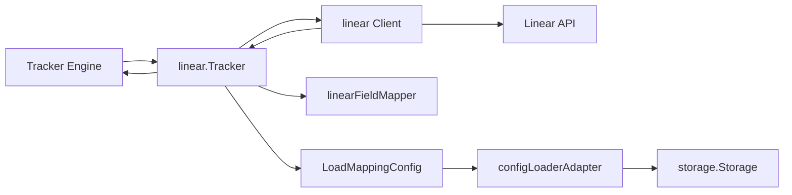

# tracker_adapter_layer 模块深度解析

`tracker_adapter_layer`（当前对应 `internal/linear/tracker.go`）本质上是一个“翻译官”：上游的同步引擎只懂统一的 `tracker.IssueTracker` 契约，而 Linear API 说的是另一套语言（字段、状态、ID 规则、时间格式都不同）。这个模块存在的价值，不是“多包一层”这么简单，而是把**外部系统不稳定、各家不一致的细节**隔离起来，让同步主流程可以稳定地按统一接口工作。

## 问题空间：为什么必须有这一层

如果没有 adapter 层，最直接的做法是让同步引擎直接调用 Linear Client。短期看代码更少，长期会出现三个结构性问题。第一，领域模型被外部 API 反向污染：引擎到处散落 `stateId`、`identifier`、GraphQL 字段名。第二，扩展成本暴涨：接 Jira/GitLab 时，核心流程会被迫分叉。第三，变更半径失控：Linear API 或团队工作流配置变动，会直接冲击同步主路径。

`Tracker` 结构体选择实现 `tracker.IssueTracker`，把这些波动收敛到模块边界内。同步引擎只关心“获取/创建/更新 issue”的统一语义，不关心 Linear 的字段命名、状态体系、外部引用格式。这就是该模块最核心的设计洞察：**让不稳定的部分靠近边缘，让稳定的部分留在中心**。

## 心智模型：机场“国际到达”转运层

可以把它想成机场国际到达后的转运层：

外部旅客（Linear Issue）先入境检查（`linearToTrackerIssue` 统一化），再进入国内航站楼（`tracker.TrackerIssue`）；反向出境时，本地旅客（`types.Issue`）要先办外航手续（`FieldMapper().IssueToTracker` + `findStateID`），再登机（`client.CreateIssue` / `client.UpdateIssue`）。

这层不负责业务策略编排（那是 [Tracker Integration Framework](tracker_integration_framework.md) 的职责），它负责的是**协议、字段、标识符、状态语义的对齐**。

## 架构与数据流



从调用关系看，`linear.Tracker` 是一个边界编排器：

它在 `init()` 里通过 `tracker.Register("linear", ...)` 完成插件注册，意味着上游按名字装配 tracker；`Init(ctx, store)` 负责组装运行态依赖（`Client`、`MappingConfig`、team/project 上下文）；`FetchIssues/FetchIssue` 负责“外部 -> 统一模型”的单向归一化；`CreateIssue/UpdateIssue` 负责“本地 -> 外部 API payload”的单向投影；`BuildExternalRef/ExtractIdentifier/IsExternalRef` 负责跨系统引用字符串的一致性。

### 关键路径 1：初始化路径（热路径前置）

`Init` 先保存 `store`，然后通过 `getConfig` 读取 `linear.api_key` 与 `linear.team_id`（读取顺序是 store，再 fallback 到环境变量 `LINEAR_API_KEY` / `LINEAR_TEAM_ID`）。这两个缺一不可，缺失会立即返回错误。随后构造 `NewClient(apiKey, teamID)`，再从 store 读取可选 `linear.api_endpoint`、`linear.project_id` 并覆写 client。最后用 `LoadMappingConfig(&configLoaderAdapter{...})` 装载映射配置。

这里的设计重点是：认证与团队上下文是硬前置条件，而 endpoint/project 属于可选运行时约束；映射配置读取失败时 `LoadMappingConfig` 会回落到默认映射，而不是阻塞启动。

### 关键路径 2：拉取路径（外部到统一模型）

`FetchIssues(ctx, opts)` 会把空 `opts.State` 视为 `"all"`。当 `opts.Since != nil` 时走 `client.FetchIssuesSince`，否则走 `client.FetchIssues`。拿到 `[]Issue` 后逐条调用 `linearToTrackerIssue`，产出 `[]tracker.TrackerIssue`。

要注意，当前实现并没有在拉取阶段调用 `FieldMapper.IssueToBeads`；它只完成“Linear 原生结构 -> tracker 通用结构”的转换。更深层的 beads 领域映射由上游其他层处理。

`FetchIssue` 路径类似，调用 `client.FetchIssueByIdentifier`，当外部不存在时返回 `nil, nil`（这是明确契约，不是错误）。

### 关键路径 3：推送路径（本地到外部）

`CreateIssue` 会先做两件投影：其一，`PriorityToLinear(issue.Priority, t.config)`；其二，`findStateID(ctx, issue.Status)` 把 beads 状态映射到 Linear workflow state ID。然后调用 `client.CreateIssue(title, description, priority, stateID, nil)`。

`UpdateIssue` 的策略是“字段映射 + 显式状态补丁”：先 `FieldMapper().IssueToTracker(issue)` 生成 updates，再单独解析 `stateID` 并写入 `updates["stateId"]`，最后 `client.UpdateIssue(ctx, externalID, updates)`。这说明作者有意把状态更新做成必经路径，避免仅靠 mapper 时状态变更被漏推。

## 组件深潜

### `Tracker`：边界编排器，而不是业务引擎

`Tracker` 字段很克制：`client`（外部调用）、`config`（映射规则）、`store`（配置来源）、`teamID/projectID`（运行上下文）。它没有维护复杂缓存或事务状态，说明设计意图是保持 adapter 无状态/轻状态，降低生命周期管理负担。

`Name/DisplayName/ConfigPrefix` 是插件系统的静态元数据，分别服务于注册标识、用户可读名称和配置命名空间。

`Validate` 目前只检查 `client != nil`。这是一个“最小可用校验”，优点是快、无外部依赖；代价是不能提前发现 API 可达性问题（例如 key 失效）。

`Close` 返回 `nil`，意味着当前没有显式资源释放需求（如长连接池清理、后台协程停止）。

### `configLoaderAdapter`：微型防腐层

`LoadMappingConfig` 依赖的是 `ConfigLoader` 接口（只要 `GetAllConfig`）。`configLoaderAdapter` 把更大的 `storage.Storage` 收敛成这个小接口，并把 `ctx` 固定下来。这样 mapping 层不需要感知 storage 全部能力，减少不必要耦合。

### `linearToTrackerIssue`：统一模型归一化器

这个函数把 `linear.Issue` 映射为 `tracker.TrackerIssue`，重点在“稳健降噪”：

它保留核心识别字段（`ID/Identifier/URL`）、文本字段、优先级与 `Raw` 原始对象；对可选对象（`State/Labels/Assignee/Parent`）全部做 nil 防护；时间字段按 `time.RFC3339` 解析，解析失败时静默跳过而非报错中断。

这种策略选择了“同步连续性优先”——即便个别时间字段异常，也不让整条 issue 失败。

### `BuildStateCacheFromTracker`

这个函数是一个桥接辅助函数：外部调用方只拿到 `*Tracker` 时，可以安全触发 `BuildStateCache(ctx, t.client)`，而不直接接触 tracker 内部 client 字段。它先做 `t.client == nil` 防卫，失败时返回 `Linear tracker not initialized`。

## 依赖分析与契约边界

从代码可验证的依赖看，本模块直接依赖：

- [Tracker Integration Framework](tracker_integration_framework.md)：`tracker.IssueTracker`、`tracker.FieldMapper`、`tracker.FetchOptions`、`tracker.TrackerIssue`、`tracker.Register`。
- [Storage Interfaces](storage_interfaces.md)：`storage.Storage`（`GetConfig`、`GetAllConfig`）。
- [Core Domain Types](core_domain_types.md)：`types.Issue`、`types.Status`。
- [mapping_and_field_translation](mapping_and_field_translation.md)：`MappingConfig`、`LoadMappingConfig`、`linearFieldMapper` 及优先级/状态映射函数。
- [linear_api_types_and_payloads](linear_api_types_and_payloads.md)：`Client`、`Issue`、`StateCache` 及相关 API 数据结构。

它向上游暴露的核心契约是 `IssueTracker` 的完整方法集。上游依赖它满足两个隐含保证：一是初始化后方法可调用；二是返回的 `TrackerIssue` 在关键字段上具有稳定语义（ID、Identifier、URL、时间、父子关系）。

## 设计取舍与背后的理由

第一个明显取舍是“简单校验 vs 提前失败”。`Validate` 仅检查初始化状态，不做网络探测，牺牲了一部分早发现能力，换取更低初始化延迟和更少副作用。对 CLI/批处理场景，这通常是合理的，因为真正 I/O 错误会在首次 fetch/push 处暴露。

第二个取舍是“动态状态解析 vs 静态映射”。`findStateID` 每次通过 `GetTeamStates` 查找匹配类型，找不到则回退第一个状态，最后才在空列表时报错。好处是适配不同团队工作流，无需硬编码 state ID；代价是可能发生“语义上可用但不精准”的回退（尤其当状态类型映射不充分时）。

第三个取舍是“容错转换 vs 严格数据质量”。`linearToTrackerIssue` 对时间解析失败不报错，这提升了同步健壮性，但会让部分时间信息静默丢失。该策略适合以“尽可能同步成功”为优先级的系统。

第四个取舍是“配置多来源灵活性 vs 可观测性复杂度”。`getConfig` 支持 store + env fallback，部署更灵活；但当配置冲突时，排查成本会上升，需要运维文档明确优先级与来源。

## 新贡献者最该注意的坑

最容易踩的坑是把 `externalID` 和 `identifier` 混用。`UpdateIssue` 需要的是外部系统内部 ID（UUID 风格），不是人类可读的 `TEAM-123`。这点在 `IssueTracker` 契约注释里是明确的。

第二个坑是误以为 `FetchOptions.Limit` 在这里生效。当前 `FetchIssues` 实现没有使用 `opts.Limit`，如果你需要分页/限流，需要在 client 层或该方法里显式实现，不要假设框架会自动处理。

第三个坑是状态映射的隐式回退。`findStateID` 找不到目标类型时会选 `states[0]`，这会让更新“成功但状态不对”。如果你在做严格流程治理，建议先审计 `StatusToLinearStateType` 与团队状态配置的一致性。

第四个坑是 `Raw` 字段里放的是 `*Issue` 指针。下游若做类型断言，请使用 Linear 的 `Issue` 类型并做好 nil/字段缺失防护。

## 使用示例

```go
// 通过框架注册名 "linear" 获取实例后，典型调用顺序如下：
var t tracker.IssueTracker = &linear.Tracker{}
if err := t.Init(ctx, store); err != nil {
    return err
}
if err := t.Validate(); err != nil {
    return err
}

issues, err := t.FetchIssues(ctx, tracker.FetchOptions{State: "all"})
if err != nil {
    return err
}
_ = issues
```

如果调用方需要构建状态缓存（例如给 push hooks 使用），可以使用：

```go
lt := &linear.Tracker{}
_ = lt.Init(ctx, store)
cache, err := linear.BuildStateCacheFromTracker(ctx, lt)
if err != nil {
    return err
}
_ = cache
```

## 相关模块

建议结合阅读以下文档形成完整闭环：

- [tracker_integration_framework](tracker_integration_framework.md)：插件注册、同步编排、统一 tracker 契约。
- [mapping_and_field_translation](mapping_and_field_translation.md)：`MappingConfig`、字段映射和状态/优先级映射规则。
- [linear_api_types_and_payloads](linear_api_types_and_payloads.md)：Linear `Client` 与 GraphQL 数据模型。
- [sync_statistics_and_conflicts](sync_statistics_and_conflicts.md)：同步结果、统计与冲突模型。
