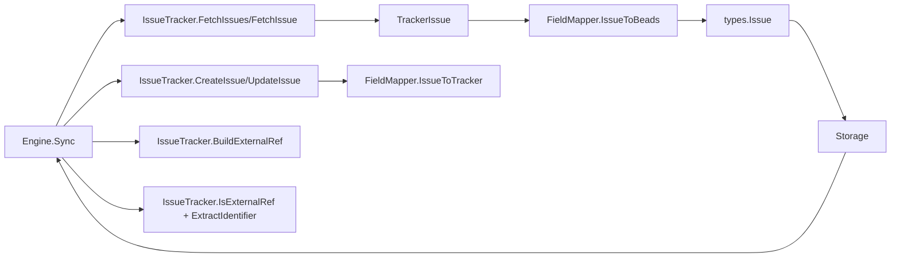

# tracker_plugin_contracts

`tracker_plugin_contracts` 是 Tracker 集成层的“插座标准”。你可以把它想成一块全球通用的电源转接板：不同外部系统（Linear、GitLab、Jira）电压、插头形状都不一样，但只要它们实现了 `IssueTracker` + `FieldMapper` 这两组契约，统一的同步引擎就能驱动它们做 pull / push / conflict handling，而不需要为每个系统重写一套同步流程。这一层存在的核心价值不是“封装 API”，而是把**变化最快的外部语义**隔离在插件边界内，让同步编排保持稳定。

## 这个模块解决了什么问题？

问题空间本质上是“同构业务、异构语义”。Beads 内部有稳定的领域模型（`types.Issue`、`types.Status`、`types.IssueType`），但外部 tracker 的现实是：状态字段类型不一致、优先级刻度不同、ID 体系双轨（内部 ID vs 人类可读编号）、更新时间语义也可能不同。如果采用朴素方案——在同步引擎里写 `if tracker == "linear"` / `if tracker == "jira"` 的分支——很快就会出现三类失控：

第一，编排逻辑和平台细节混杂，导致任何新平台接入都要改动核心同步路径。第二，字段映射规则分散在各处，冲突判断、增量同步、外链引用解析容易前后不一致。第三，测试粒度被迫变粗，无法单测“映射正确性”与“同步流程正确性”的边界。

`tracker_plugin_contracts` 的设计洞察是：把“同步行为”与“平台语义”拆成两组稳定接口。`IssueTracker` 负责生命周期、远端 CRUD、外链引用规则；`FieldMapper` 负责值域转换与结构映射。同步引擎只依赖这两个抽象，就可以复用同一套 Pull→Detect→Resolve→Push 流程。

## 心智模型：两层适配器 + 一个中间语义

理解这个模块最有效的心智模型是“三明治结构”：

- 上层是同步编排器（`Engine`，见 [sync_orchestration_engine](sync_orchestration_engine.md)），关心流程控制、冲突策略和统计。
- 中层是通用中间表示（`TrackerIssue` / `IssueConversion`，见 [sync_data_models_and_options](sync_data_models_and_options.md)）。
- 下层是插件契约（本模块 `IssueTracker` / `FieldMapper`），把具体平台语言翻译成中间语义。

类比现实世界：`Engine` 像国际物流总调度，`IssueTracker` 像各国本地承运商，`FieldMapper` 像报关翻译官。总调度不需要知道每个国家的报关字段细节，只要求承运商和翻译官遵守统一单据格式。

## 架构与数据流



从调用关系看，`tracker_plugin_contracts` 的架构角色是**能力边界层（capability boundary）**：

在 pull 路径中，`Engine` 先调用 `IssueTracker.FetchIssues` 拉取远端数据（`TrackerIssue`），再通过 `FieldMapper.IssueToBeads` 转换为 `*types.Issue`，最后写入 `Storage`。在 push 路径中，`Engine` 从本地 `Storage` 读 `*types.Issue`，必要时通过 `FieldMapper.IssueToTracker` 生成远端字段，再调用 `IssueTracker.CreateIssue` 或 `IssueTracker.UpdateIssue`。而 `BuildExternalRef` / `IsExternalRef` / `ExtractIdentifier` 组成了“外链引用协议”，用于识别某条本地 issue 是否归属当前 tracker、以及如何从引用里还原远端标识。

关键点是：`Engine` 不知道 GitLab/Jira/Linear 的字段细节，只假设契约总能给出可比较、可持久化、可回写的稳定结果。

## 组件深潜

### `IssueTracker`：平台能力适配接口

`IssueTracker` 是插件主接口，覆盖了一个 tracker 适配器的完整职责面。

`Name()`、`DisplayName()`、`ConfigPrefix()` 不是“装饰性方法”，而是同步系统的路由键。`ConfigPrefix()` 直接影响配置读取和 `last_sync` 存储键（在 `Engine` 中以 `<prefix>.last_sync` 使用），所以它的稳定性是隐式契约：一旦改名，增量同步历史会断档。

`Init(ctx, store)` 与 `Validate()` 的组合体现了“延迟初始化 + 显式健康检查”设计。`Init` 注入 `storage.Storage`，让插件能读取映射配置或凭据；`Validate` 则把“能否连接、配置是否合法”前置为显式步骤，避免在同步中途才失败。

`FetchIssues(ctx, opts)` / `FetchIssue(ctx, identifier)` / `CreateIssue(ctx, issue)` / `UpdateIssue(ctx, externalID, issue)` 构成远端 I/O 面。注意两个不明显但非常关键的约束：

一是 `FetchIssue` 注释规定“not found 返回 `nil, nil`”，这让调用方可以区分“远端不存在”和“网络/权限错误”。二是 `UpdateIssue` 的 `externalID` 明确是 tracker 的内部 ID，而不是人类可读编号；这避免了编号可变或不唯一带来的更新歧义。

`FieldMapper()` 把“字段语义翻译”从 tracker I/O 里拆出，强制插件实现映射器。这是防止 adapter 变成“巨型 God object”的关键边界。

`IsExternalRef(ref)`、`ExtractIdentifier(ref)`、`BuildExternalRef(issue)` 共同定义外链引用协议。它们存在的原因是：本地只持久化一个 `external_ref` 字符串，需要跨平台统一判断归属、提取标识、反向构造引用；如果没有这组方法，`Engine` 将不得不硬编码每个平台的引用格式。

### `FieldMapper`：语义映射接口

`FieldMapper` 负责“值域对齐”和“结构对齐”。

`PriorityToBeads` / `PriorityToTracker`、`StatusToBeads` / `StatusToTracker`、`TypeToBeads` / `TypeToTracker` 是六个基础双向映射。这里故意使用 `interface{}` 作为 tracker 侧输入输出类型，不是因为类型设计松散，而是为了允许 Jira 的复杂状态对象、Linear 的 ID 字符串、GitLab 的枚举值共存。代价是编译期类型安全下降，但收益是契约对异构 API 的容忍度显著提高。

`IssueToBeads(trackerIssue *TrackerIssue) *IssueConversion` 负责完整导入转换，并携带待创建依赖关系。它返回 `IssueConversion`（而不是单一 `*types.Issue`）的设计，说明同步流程把“实体导入”和“依赖补建”视为两个阶段：先把 issue 主体落地，再统一补关系，减少跨引用尚未导入时的失败。

`IssueToTracker(issue *types.Issue) map[string]interface{}` 则面向更新请求体构造。返回 `map[string]interface{}` 的权衡与前述一致：牺牲静态类型，换取跨平台字段载荷的表达力。

## 依赖关系分析（调用谁、被谁调用）

从模块树与代码职责可见，本模块处于 Tracker Integration Framework 的最上游抽象层：

它被 [sync_orchestration_engine](sync_orchestration_engine.md) 依赖；`Engine` 持有 `IssueTracker`，在 `Sync` / `doPull` / `doPush` / `DetectConflicts` 等路径中持续调用契约方法。最“热”的调用通常是 `FetchIssues`（pull 全量或增量）和 `CreateIssue`/`UpdateIssue`（push 循环），其次是 `FetchIssue`（冲突检测与更新前比对）。

它也被具体集成实现依赖（准确说是“实现”该契约），包括 [GitLab Integration](GitLab Integration.md)、[Jira Integration](Jira Integration.md)、[Linear Integration](Linear Integration.md) 中的 `Tracker` 与各自 field mapper。换句话说，`tracker_plugin_contracts` 是下游实现的编译目标、上游编排的运行时依赖。

它间接依赖 [Core Domain Types](Core Domain Types.md)（`types.Issue`、`types.Status`、`types.IssueType`）与 [Storage Interfaces](Storage Interfaces.md)（`storage.Storage` 在 `Init` 中注入）。这些依赖定义了插件的“语义输入输出面”：如果核心类型字段语义变化，映射器必须同步调整；如果 `Storage` 配置读取行为变化，`Init/Validate` 逻辑也会受影响。

## 设计决策与权衡

这个模块最核心的取舍是“接口稳定性优先于静态类型完备性”。大量使用 `interface{}` 与 `map[string]interface{}`，看上去不够 Go-idiomatic，但在跨平台适配场景是务实选择：它把平台差异限制在插件内部，避免核心引擎被某一平台的数据结构牵着走。

第二个取舍是“显式协议优先于隐式约定”。外链引用相关的三方法（`BuildExternalRef` / `IsExternalRef` / `ExtractIdentifier`）看似重复，实际是在防止字符串协议在多个模块分叉实现。代价是插件实现者要多写一些样板代码，但换来的是引用解析的一致性和可测试性。

第三个取舍是“编排与映射分离”。理论上可以把映射逻辑放进 `IssueTracker`，减少接口数量；但现有设计把 `FieldMapper` 独立出来，能让你单测映射规则而不依赖网络客户端，也让不同 tracker 的“API 交互代码”和“语义翻译代码”分层更清楚。

## 如何使用与扩展

典型接入模式是：实现一个 `IssueTracker`，再实现一个 `FieldMapper`，并让 `IssueTracker.FieldMapper()` 返回该映射器实例。然后由引擎侧通过工厂/注册机制创建 tracker，并执行 `Init`、`Validate`、`Sync`。

```go
// 伪代码：展示契约使用形态（方法名均来自真实接口）
trk, err := tracker.NewTracker("linear")
if err != nil { /* handle */ }

if err := trk.Init(ctx, store); err != nil { /* handle */ }
if err := trk.Validate(); err != nil { /* handle */ }

en := tracker.NewEngine(trk, store, "sync-bot")
res, err := en.Sync(ctx, tracker.SyncOptions{Pull: true, Push: true})
_ = res
```

在实现侧，一个常见模式是把“协议元信息”和“业务映射”分开维护：`Name/ConfigPrefix` 保持稳定，`FieldMapper` 内部再根据配置文件做状态/优先级映射。这样可以把用户配置变更限制在 mapper 层，不影响引擎流程。

## 新贡献者最该注意的边界与坑

第一，`external_ref` 协议必须自洽。`BuildExternalRef` 产出的字符串，必须能被同实现的 `IsExternalRef` 识别，并可由 `ExtractIdentifier` 提取出可用于 `FetchIssue` 的标识；三者任何一个不一致，冲突检测和增量更新都会出现“查不到远端”的隐性故障。

第二，别混淆 `Identifier` 与 `ID`。在 `TrackerIssue` 中，`ID` 是远端内部主键，`Identifier` 是人类可读编号。接口注释已明确 `UpdateIssue` 用内部 ID；若错误传入 `Identifier`，某些平台可能表现为 404，某些平台会误更新同名对象。

第三，`FetchIssue` 的 not-found 语义是 `nil, nil`。如果实现返回自定义错误，`Engine` 侧通常会把它当成真正失败或跳过逻辑异常，进而影响冲突判断和 push 前比较。

第四，`IssueToBeads` 允许返回 `nil`（或 `Issue=nil`）来跳过导入，这虽然提供了弹性，但也意味着你需要在 mapper 里对“不可映射状态”做清晰策略，否则会出现静默 `Skipped` 增长却难以定位原因。

第五，`ConfigPrefix` 一旦发布就尽量不要改。因为同步引擎按该前缀读写 `last_sync`，改名前缀等同于“新 tracker 首次同步”，可能触发非预期全量拉取。

## 参考

- [sync_orchestration_engine](sync_orchestration_engine.md)
- [sync_data_models_and_options](sync_data_models_and_options.md)
- [GitLab Integration](GitLab Integration.md)
- [Jira Integration](Jira Integration.md)
- [Linear Integration](Linear Integration.md)
- [Core Domain Types](Core Domain Types.md)
- [Storage Interfaces](Storage Interfaces.md)
