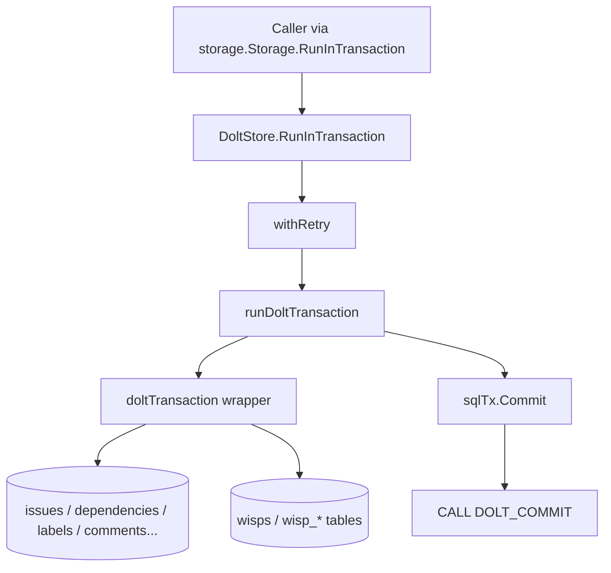

# transaction_layer 深度解析

`transaction_layer` 的存在，不是为了“把 SQL 包一层”这么简单。它真正解决的是：在 Dolt 这种“数据库 + 版本控制”双语义存储里，如何让一次业务写入既满足事务一致性（`sql.Tx`），又在合适时机形成可追踪的版本提交（`DOLT_COMMIT`），并且对调用方暴露统一的 `storage.Transaction` 编程模型。你可以把它想象成一个“空港联运中转层”：上游只关心“货到了没”，它负责把货同时送进“本地仓库（SQL working set）”和“海关留档（Dolt commit history）”，还要处理某些货物（ephemeral wisps）只进仓不留档的特殊通道。

## 架构角色与数据流



这个模块在 Dolt backend 中是一个**事务适配层**：

它的北向接口是 `storage.Transaction`（由 `internal.storage.storage.Transaction` 定义），因此调用方只需要在闭包里做 `CreateIssue` / `UpdateIssue` / `AddDependency` 之类操作，不需要知道底层是普通 SQL 事务还是 Dolt 工作集。

它的南向依赖是 `*sql.Tx` 和 `DoltStore`。其中 `*sql.Tx` 负责单次操作的 ACID 语义；`DoltStore` 提供连接、重试（`withRetry`）和最终版本提交（`CALL DOLT_COMMIT`）能力。

关键路径是 `DoltStore.RunInTransaction`：先重试包装，再在 `runDoltTransaction` 中开启事务、执行用户闭包、提交 SQL 事务、最后尝试 Dolt commit。这个顺序并不是“看起来顺”，而是为了规避历史上 `DOLT_COMMIT` 在事务内执行导致的“nothing to commit + tx 状态异常 + wisp 数据丢失”问题（代码注释已明确记录）。

## 心智模型：两个平面，一次写入

理解这个模块最有效的方式是把它看成“两层平面”的协调器：

- **工作集平面（SQL Transaction Plane）**：所有写入先落在 `sql.Tx` 里，确保原子性与可回滚。
- **版本平面（Dolt History Plane）**：`sqlTx.Commit` 成功后，再由 `CALL DOLT_COMMIT` 生成版本历史节点。

这解释了一个看似反直觉的实现：`DOLT_COMMIT` 不在 `sql.Tx` 内执行。该设计牺牲了“单语句感觉上的一体化”，换来对 Dolt 行为边界的正确兼容，尤其是对 dolt-ignored 表（如 `wisps`）场景的可靠性。

同时还有第三个横切维度：**ephemeral 路由**。`Issue.Ephemeral` 或 `isActiveWisp(id)` 会把 CRUD/边关系/标签/评论等操作路由到 `wisps` 与 `wisp_*` 表，而非持久化主表。这让“短期、非同步、运行时消息”与“长期任务数据”共用接口但隔离存储。

## 组件深潜

### `doltTransaction`（struct）

`doltTransaction` 很薄，只有 `tx *sql.Tx` 与 `store *DoltStore` 两个字段，但它是整个交易层的核心适配器。它实现了 `storage.Transaction` 接口中事务内所需的全部操作：Issue、Dependency、Label、Config、Metadata、Comment。

设计意图是把“事务上下文”收敛到一个对象里，避免调用链到处传 `*sql.Tx`，也保证闭包内读取能看到自身未提交写入（read-your-writes）。

### `DoltStore.RunInTransaction` / `runDoltTransaction`

`RunInTransaction` 是外部入口，负责把一次业务事务放进 `withRetry`。真正的生命周期控制在 `runDoltTransaction`：

1. `BeginTx` 创建 `sql.Tx`
2. 构造 `doltTransaction`
3. 执行调用方闭包 `fn(tx storage.Transaction)`
4. 出错或 panic 时回滚（best effort）
5. 先 `sqlTx.Commit()`
6. 若 `commitMsg != ""`，执行 `CALL DOLT_COMMIT('-Am', ?, '--author', ?)`
7. 若 commit 报“nothing to commit”，由 `isDoltNothingToCommit` 判定为可忽略

这里最重要的隐含契约：**SQL commit 成功并不保证一定产生 Dolt commit**。当只有 dolt-ignored 变更时这是预期行为，而非异常。

### `isDoltNothingToCommit(err error) bool`

这是一个小函数，但非常关键。它通过错误文本匹配（`"nothing to commit"` 或 `"no changes" + "commit"`）把 Dolt 的“无变更可提交”从失败语义中剥离。

代价是字符串匹配对错误消息格式有耦合；收益是跨驱动/跨层包装时仍可稳健识别该 benign condition。

### `CreateIssue` / `CreateIssueImport` / `CreateIssues`

`CreateIssue` 体现了本模块最密集的业务规则编排：

- 自动填充 `CreatedAt`/`UpdatedAt`
- 自动计算 `ContentHash`
- 按 `Issue.Ephemeral` 选择 `issues` 或 `wisps`
- 若未给 ID，从 `config.issue_prefix` 读取前缀并生成 ID
- 前缀会去掉尾随 `-`（避免双连字符）
- ephemeral 走 `wispPrefix(...)`
- 非 ephemeral 支持 `PrefixOverride` 与 `IDPrefix`
- `metadata` 在写入前走 `validateMetadataIfConfigured`
- 最终写入通过 `insertIssueTxIntoTable`

`CreateIssueImport` 并不引入特殊写入流程，只是导入友好入口，最终委托给 `CreateIssue`。这反映一个设计选择：在 Dolt backend 里不把 prefix 校验放在“导入路径特殊逻辑”中，而保持主路径一致。

`CreateIssues` 是串行循环调用 `CreateIssue`，简洁但不追求批量 SQL 优化；它依赖外层事务保证整体原子性。

### `GetIssue` / `SearchIssues`

`GetIssue` 的关键不是查询本身，而是路由策略：先用 `isActiveWisp(ctx, id)` 判断该 ID 在事务视角下是否属于 wisp，再决定查 `issues` 还是 `wisps`。这个“事务内可见未提交数据”的判断，正是该层存在的价值之一。

`SearchIssues` 先在目标表查出 `id` 列表，再逐个调用 `GetIssue` 取完整对象。这个两阶段流程看起来多一次往返，但它复用了 `GetIssue` 的路由语义，避免搜索结果在 wisp/issue 混合场景下出现读路径不一致。代价是 N+1 查询风险；收益是行为一致性和代码复用。

### `UpdateIssue` / `CloseIssue` / `DeleteIssue`

这三个方法都遵循“先路由表，再执行 SQL”的模式。

`UpdateIssue` 有几个非显然点：

- 仅允许 `isAllowedUpdateField` 白名单字段
- `wisp` 更新键会映射到列名 `ephemeral`
- `waiters` 会 JSON 序列化后落库
- `metadata` 使用 `storage.NormalizeMetadataValue` 归一化，再按 schema 校验
- 总是刷新 `updated_at`

这种做法选择了“动态 map 更新 + 强校验”而非“为每个字段建显式 setter”，更灵活但也更依赖运行时验证。

### `AddDependency` / `RemoveDependency` / `GetDependencyRecords`

`AddDependency` 明确防止“同一 pair 覆盖 type”的静默错误：

- 若 `(issue_id, depends_on_id)` 已存在且 type 相同，视为幂等成功
- 若已存在但 type 不同，返回错误并提示先 remove 再 add

这是典型的“正确性优先”策略：牺牲一点操作便捷性，避免边类型在无感知下被覆写。

### `AddLabel` / `RemoveLabel` / `GetLabels`

标签路径相对直接，但 `AddLabel` 使用 `INSERT IGNORE`，说明标签添加语义是幂等的。该决策减少上层去重负担，也避免重复标签报错中断事务。

### `SetConfig` / `GetConfig` 与 `SetMetadata` / `GetMetadata`

这两组 API 都使用 upsert（`ON DUPLICATE KEY UPDATE`），支持“原子配置+业务写入”场景。`Get*` 在 `sql.ErrNoRows` 下返回空字符串而非错误，属于“缺省值优先”的调用体验设计。

### `ImportIssueComment` / `GetIssueComments` / `AddComment`

这里其实存在两套“评论”概念：

- `ImportIssueComment` / `GetIssueComments` 走 `comments`/`wisp_comments`，返回 `types.Comment`
- `AddComment` 走 `events`/`wisp_events`，写入 `event_type = types.EventCommented`

可把它理解为“实体评论记录”与“事件流注释”并存：前者偏内容存储，后者偏审计/行为轨迹。

## 依赖关系与契约分析

`transaction_layer` 直接依赖：

- `database/sql`：事务与查询执行
- `internal.storage.storage.Transaction`：实现的接口契约
- `internal.types`：`Issue`、`Dependency`、`IssueFilter`、`Comment` 等核心领域类型
- 同包内辅助函数（如 `generateIssueIDInTable`、`insertIssueTxIntoTable`、`scanIssueTxFromTable`、`validateMetadataIfConfigured` 等）

它向上游提供的关键契约是：调用方通过 `Storage.RunInTransaction` 拿到的 `tx`，应满足 read-your-writes，并且在一次闭包中完成复合写操作的原子性。

从模块树看，上游调用者会经由 Storage 抽象来自多个系统层（CLI、路由、集成等），但本文件本身不显式绑定某个命令或服务。换句话说，它被设计成后端能力层，而非业务用例层。

一个重要耦合点是表结构命名约定：`issues` vs `wisps`，以及 `dependencies`/`labels`/`comments`/`events` 对应的 `wisp_*` 镜像表。若 schema 命名变更，这里会是高影响面。

## 设计取舍

这个模块的核心取舍可以概括为：

- 选择**可靠提交顺序**（先 `sqlTx.Commit` 再 `DOLT_COMMIT`），而不是看似更“原子”的事务内 Dolt commit；这是对 Dolt 实际行为的工程化妥协。
- 选择**统一接口 + 内部路由**（isActiveWisp 决策表），而不是让上层显式区分 ephemeral/persistent 两套 API；简化调用方但增加底层复杂度。
- 选择**运行时动态更新 map**，配合字段白名单与 metadata 校验；提升扩展性但把一部分错误推迟到运行时。
- 选择**幂等优先**（labels insert ignore、dependency 同型重复 add 无害）与**防静默覆盖**（dependency 类型冲突直接报错）并存，体现“常见操作宽松、危险操作严格”的策略。

## 使用方式与示例

典型用法是通过 `DoltStore.RunInTransaction` 组合多步写入：

```go
err := store.RunInTransaction(ctx, "create issue with deps", func(tx storage.Transaction) error {
    issue := &types.Issue{Title: "Refactor transaction layer"}
    if err := tx.CreateIssue(ctx, issue, "alice"); err != nil {
        return err
    }

    if err := tx.AddLabel(ctx, issue.ID, "tech-debt", "alice"); err != nil {
        return err
    }

    dep := &types.Dependency{IssueID: issue.ID, DependsOnID: "bd-123", Type: types.DependencyBlocks}
    if err := tx.AddDependency(ctx, dep, "alice"); err != nil {
        return err
    }

    return nil
})
```

如果 `commitMsg` 为空字符串，事务仍会提交 SQL 写入，但不会触发 `DOLT_COMMIT`。这在你只需要“数据库状态变更”而不需要“版本历史节点”时可用。

## 新贡献者需要特别注意的坑

首先，不要把 `DOLT_COMMIT` 移回 `sql.Tx` 内。当前顺序是修复过真实数据丢失风险后的结果，不是偶然实现细节。

其次，涉及 issue/dependency/label/comment 的新功能，如果支持 ephemeral，需要同步考虑 `wisp_*` 表路由；只改 persistent 表通常会产生“功能在普通 issue 正常、在 wisp 静默失效”的隐蔽 bug。

再次，`SearchIssues` 是“先查 ID 再逐个 hydrate”的模型，改造时要谨慎评估路由一致性，不能只看 SQL 性能。

最后，`UpdateIssue` 的 `updates map[string]interface{}` 是高灵活入口，也是高风险入口。新增可更新字段时要同步更新白名单、序列化规则（如 JSON 字段）与校验逻辑，避免出现写入格式漂移。

## 参考文档

- [storage_contracts](storage_contracts.md)
- [store_core](store_core.md)
- [issue_domain_model](issue_domain_model.md)
- [Core Domain Types](Core Domain Types.md)
