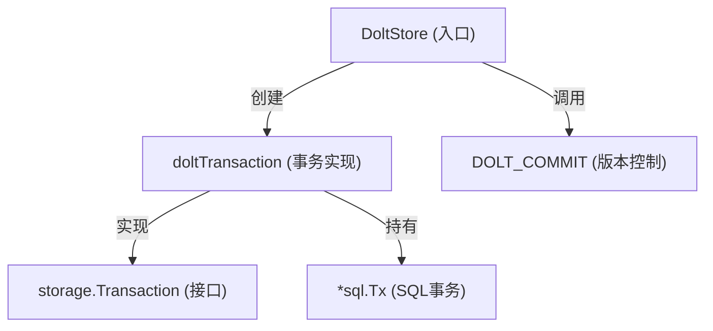

# Transaction Management 模块技术深度解析

## 1. 模块概述

Transaction Management 模块是 Dolt 存储后端的核心组件，负责在 Dolt 数据库上实现事务性操作。该模块解决了两个关键问题：如何将标准 SQL 事务与 Dolt 的版本控制功能无缝集成，以及如何在事务级别支持普通 issue 和临时 wisp 两种数据模型的透明路由。

想象一下这个模块就像是一个"双重记账"的会计系统——它既要维护传统 SQL 事务的 ACID 特性，又要确保这些变更在 Dolt 的版本历史中被正确记录。同时，它还像一个智能分拣员，根据数据的特性（普通 issue vs 临时 wisp）自动将操作路由到不同的数据表中。

## 2. 核心架构

### 2.1 组件关系图



### 2.2 核心组件解析

#### 2.2.1 `doltTransaction` 结构体

这是模块的核心实现，它包装了标准的 SQL 事务对象，并提供了 `storage.Transaction` 接口的完整实现。

**设计意图**：
- 作为 SQL 事务与业务逻辑之间的适配器
- 实现 wisp 与普通 issue 的透明路由
- 确保事务内操作的一致性和隔离性

**关键字段**：
- `tx *sql.Tx`：底层的 SQL 事务对象
- `store *DoltStore`：指向创建该事务的 DoltStore 实例，用于访问共享资源

## 3. 数据流程分析

### 3.1 事务执行流程

`RunInTransaction` 方法是整个模块的协调中心，它的执行流程体现了模块的核心设计：

```
1. 开始 SQL 事务 (db.BeginTx)
   ↓
2. 创建 doltTransaction 实例
   ↓
3. 执行用户提供的函数 (fn)
   ↓
4. 提交 SQL 事务 (sqlTx.Commit) - 先提交，确保 wisp 等数据持久化
   ↓
5. 如果有提交信息，调用 DOLT_COMMIT 创建版本控制提交
```

**关键设计决策**：先提交 SQL 事务，再执行 DOLT_COMMIT。这个顺序是经过深思熟虑的，解决了一个重要问题：

**历史问题**：之前 DOLT_COMMIT 是在 SQL 事务内部调用的。当所有写入都针对 dolt-ignored 表（如 wisps）时，DOLT_COMMIT 会返回 "nothing to commit"，这会导致 Go 的 sql.Tx 处于损坏状态，Commit() 静默失败，从而丢失 wisp 数据。

**当前解决方案**：先提交 SQL 事务，确保所有数据（包括 dolt-ignored 表）都被持久化，然后再尝试创建 Dolt 版本提交。即使 DOLT_COMMIT 返回 "nothing to commit"，数据也已经安全保存。

### 3.2 Wisp 路由机制

模块的另一个核心特性是 wisp 的透明路由。对于每个操作，模块会检查目标 ID 是否是活跃的 wisp，然后自动路由到相应的表：

| 数据类型 | Issues 表 | Wisps 表 | Dependencies 表 | Wisp Dependencies 表 |
|----------|-----------|----------|-----------------|----------------------|
| 普通 Issue | ✅ | ❌ | ✅ | ❌ |
| Ephemeral Wisp | ❌ | ✅ | ❌ | ✅ |

**路由逻辑**：
1. 对于查询操作（如 GetIssue），先通过 `isActiveWisp` 检查 ID 是否存在于 wisps 表
2. 对于创建操作，根据 `issue.Ephemeral` 标志决定目标表
3. 对于更新/删除操作，同样先检查是否是活跃 wisp，再决定操作哪个表

## 4. 核心方法深度解析

### 4.1 `isActiveWisp`

```go
func (t *doltTransaction) isActiveWisp(ctx context.Context, id string) bool
```

**功能**：检查给定 ID 是否在当前事务中是活跃的 wisp。

**设计亮点**：
- 与 store 级别的 `isActiveWisp` 不同，这个方法在事务内查询，因此能看到未提交的 wisp
- 支持两种 wisp 模式：标准的 `-wisp-` 前缀模式和显式 ID 的临时模式（GH#2053）

### 4.2 `CreateIssue`

```go
func (t *doltTransaction) CreateIssue(ctx context.Context, issue *types.Issue, actor string) error
```

**功能**：在事务内创建 issue，自动处理 wisp 路由和 ID 生成。

**关键流程**：
1. 初始化时间戳和内容哈希
2. 根据 `Ephemeral` 标志决定目标表
3. 如果需要，生成 ID（涉及前缀配置、wisp 前缀特殊处理等）
4. 验证元数据（如果配置了元数据模式）
5. 插入到相应的表

**设计细节**：
- 前缀规范化：自动去除配置前缀的尾部连字符，防止出现双连字符 ID（bd-6uly）
- 灵活的前缀支持：配置前缀、PrefixOverride、IDPrefix 三种方式
- 元数据验证：支持可选的元数据模式验证（GH#1416 Phase 2）

### 4.3 `UpdateIssue`

```go
func (t *doltTransaction) UpdateIssue(ctx context.Context, id string, updates map[string]interface{}, actor string) error
```

**功能**：更新 issue 字段，处理字段验证和特殊字段的序列化。

**设计特点**：
- 字段白名单机制：通过 `isAllowedUpdateField` 确保只允许更新特定字段
- 特殊字段处理：
  - "wisp" 字段映射到 "ephemeral" 列
  - "waiters" 字段自动 JSON 序列化
  - "metadata" 字段规范化和验证（GH#1417）
- 自动更新 `updated_at` 时间戳

### 4.4 `AddDependency`

```go
func (t *doltTransaction) AddDependency(ctx context.Context, dep *types.Dependency, actor string) error
```

**功能**：添加依赖关系，防止静默的类型覆盖。

**安全设计**：
- 先检查是否已存在相同的依赖对
- 如果存在且类型相同，操作幂等，直接返回成功
- 如果存在但类型不同，返回明确的错误，要求先删除再重新添加

## 5. 设计决策与权衡

### 5.1 SQL 提交与 Dolt 提交的分离

**决策**：先提交 SQL 事务，再执行 DOLT_COMMIT。

**权衡分析**：
- ✅ **优点**：确保即使 Dolt 提交失败或没有内容可提交，数据也不会丢失
- ⚠️ **缺点**：在罕见情况下，SQL 提交成功但 Dolt 提交失败，会导致数据已保存但版本历史中没有记录
- 🔧 **缓解措施**：Dolt 提交失败时会返回错误，调用者可以决定如何处理

### 5.2 Wisp 的表路由策略

**决策**：为 wisp 创建独立的表（wisps、wisp_dependencies、wisp_labels 等），而不是在现有表中添加标志位。

**权衡分析**：
- ✅ **优点**：
  - 查询性能更好（可以使用更小的索引）
  - Dolt 可以忽略 wisp 表，不纳入版本控制
  - 数据分离更清晰，便于独立管理（如清理过期 wisps）
- ⚠️ **缺点**：
  - 代码复杂度增加（每个操作都需要路由逻辑）
  - 表结构重复

### 5.3 依赖类型变更的严格处理

**决策**：当尝试添加已存在但类型不同的依赖时，返回错误而不是静默覆盖。

**权衡分析**：
- ✅ **优点**：防止意外的数据丢失，显式处理类型变更
- ⚠️ **缺点**：调用者需要处理这种错误情况

## 6. 使用指南与最佳实践

### 6.1 基本用法

```go
store.RunInTransaction(ctx, "commit message", func(tx storage.Transaction) error {
    // 创建 issue
    issue := &types.Issue{Title: "New Issue"}
    if err := tx.CreateIssue(ctx, issue, "actor"); err != nil {
        return err
    }
    
    // 读取自己的写入（支持 read-your-writes）
    retrieved, err := tx.GetIssue(ctx, issue.ID)
    if err != nil {
        return err
    }
    
    // 更多操作...
    return nil
})
```

### 6.2 常见模式

#### 6.2.1 原子的多步操作

使用事务可以确保多个操作要么全部成功，要么全部失败：

```go
store.RunInTransaction(ctx, "create issue with dependencies", func(tx storage.Transaction) error {
    // 创建主 issue
    mainIssue := &types.Issue{Title: "Main Issue"}
    if err := tx.CreateIssue(ctx, mainIssue, "actor"); err != nil {
        return err
    }
    
    // 创建依赖 issue
    depIssue := &types.Issue{Title: "Dependency Issue"}
    if err := tx.CreateIssue(ctx, depIssue, "actor"); err != nil {
        return err
    }
    
    // 添加依赖关系
    dep := &types.Dependency{
        IssueID:     mainIssue.ID,
        DependsOnID: depIssue.ID,
        Type:        types.DependsOn,
    }
    return tx.AddDependency(ctx, dep, "actor")
})
```

#### 6.2.2 使用 Wisps 处理临时数据

```go
store.RunInTransaction(ctx, "create temp wisp", func(tx storage.Transaction) error {
    wisp := &types.Issue{
        Title:     "Temporary Work Item",
        Ephemeral: true, // 标记为 wisp
        WispType:  types.WispTypeWork,
    }
    return tx.CreateIssue(ctx, wisp, "actor")
})
```

## 7. 注意事项与陷阱

### 7.1 隐式契约

1. **Read-Your-Writes 保证**：在同一个事务内，你可以读取到自己之前的写入。这是通过在事务内查询而不是使用 store 级别的缓存实现的。

2. **ID 生成的事务性**：ID 生成是在事务内完成的，确保并发事务不会生成相同的 ID。

3. **Dolt-ignored 表**：wisps 及其相关表被 Dolt 忽略，不会出现在版本历史中。

### 7.2 常见陷阱

1. **忘记处理依赖类型冲突**：添加依赖时，如果已存在相同的依赖对但类型不同，会返回错误。确保你的代码能处理这种情况。

2. **在事务外使用 wisp ID**：wisp 只在事务内可见（在提交前），不要期望在事务外能立即查询到新创建的 wisp。

3. **元数据格式问题**：metadata 字段会被验证为有效的 JSON。确保传入的是正确格式的数据。

### 7.3 性能考虑

1. **事务大小**：虽然 Dolt 支持大事务，但尽量保持事务简洁，避免长时间持有锁。

2. **批量操作**：使用 `CreateIssues` 而不是循环调用 `CreateIssue` 来批量创建 issue。

3. **Wisp 查询**：由于 `isActiveWisp` 需要查询数据库，避免在热点路径上频繁调用。

## 8. 依赖关系

### 8.1 被依赖模块

- [Storage Interfaces](storage_interfaces.md)：定义了 `Transaction` 接口
- [Core Domain Types](core_domain_types.md)：提供了 `Issue`、`Dependency` 等核心类型
- [Dolt Storage Backend](dolt_storage_backend.md)：包含 `DoltStore`，是事务的创建者和管理者

### 8.2 依赖模块

- `database/sql`：标准库的 SQL 数据库接口
- Dolt 特定的 SQL 函数（如 `DOLT_COMMIT`）

## 9. 总结

Transaction Management 模块是连接传统 SQL 事务和 Dolt 版本控制的桥梁，它通过精心设计的事务执行流程和 wisp 路由机制，为上层应用提供了既符合 ACID 特性又能利用版本控制优势的数据操作接口。

模块的设计体现了对数据一致性、用户体验和系统复杂性的细致权衡，特别是在 SQL 提交与 Dolt 提交分离、wisp 表路由策略等方面的决策，都展示了对实际问题的深刻理解和巧妙解决。
