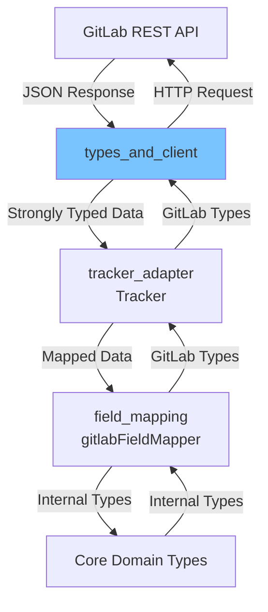

# GitLab Types and Client 模块深度解析

## 1. 为什么这个模块存在

在深入代码之前，让我们理解这个模块解决的问题。Beads 需要与 GitLab 这样的外部问题跟踪系统进行双向同步，但 GitLab 的数据模型与 Beads 的内部数据模型完全不同：

- GitLab 使用全局 ID 和项目作用域的 IID，而 Beads 使用自己的 ID 系统
- GitLab 的标签格式（如 "priority::high"）需要映射到 Beads 的结构化字段
- GitLab 的问题状态（"opened"、"closed"、"reopened"）与 Beads 的状态模型不一致
- GitLab 的里程碑、用户、项目等概念需要在 Beads 中有对应的表示

这个模块充当了**翻译层**：它定义了与 GitLab API 完全匹配的数据结构，并提供了一个 HTTP 客户端来与 GitLab 交互。没有这个模块，GitLab 集成代码将直接处理原始 JSON 和 HTTP 请求，导致代码耦合度高、难以维护。

## 2. 核心概念与心智模型

把这个模块想象成一个**"GitLab API 的强类型镜像"**：

1. **数据模型镜像**：`Issue`、`User`、`Milestone` 等结构体精确反映 GitLab API 返回的 JSON 结构
2. **客户端封装**：`Client` 结构体封装了所有 HTTP 通信细节，提供了一个干净的接口
3. **转换辅助**：包含标签解析、状态验证、优先级映射等辅助函数，为后续的模型转换做准备

这种设计的关键在于**关注点分离**：这个模块只关心"GitLab 是什么样的"，而不关心"Beads 是什么样的"。实际的转换逻辑由上层的 [tracker_adapter](tracker_adapter.md) 和 [field_mapping](field_mapping.md) 模块处理。

## 3. 架构与数据流向

让我们用 Mermaid 图展示这个模块在整个 GitLab 集成中的位置：



**数据流向详解**：

1. **拉取方向（GitLab → Beads）**：
   - `Client` 发送 HTTP 请求到 GitLab API
   - GitLab 返回 JSON 响应，被反序列化为 `Issue` 等结构体
   - 这些结构体被传递给 `Tracker`
   - `Tracker` 使用 `gitlabFieldMapper` 将 GitLab 类型转换为 Beads 的 `types.Issue`

2. **推送方向（Beads → GitLab）**：
   - `Tracker` 接收 Beads 的 `types.Issue`
   - 使用 `gitlabFieldMapper` 将其转换为 GitLab 类型
   - 通过 `Client` 发送到 GitLab API

## 4. 核心组件深度解析

### 4.1 Client 结构体

```go
type Client struct {
    Token      string       // GitLab 个人访问令牌或 OAuth 令牌
    BaseURL    string       // GitLab 实例 URL
    ProjectID  string       // 项目 ID 或 URL 编码路径
    HTTPClient *http.Client // 可选的自定义 HTTP 客户端
}
```

**设计意图**：
- 封装所有 GitLab API 调用所需的配置
- 允许注入自定义 `HTTPClient` 以支持测试、代理、特殊 TLS 配置等
- 保持简洁，只包含必要的配置项

**为什么这样设计**：
- 不直接包含 API 方法（这与常见的客户端设计不同），这种分离使得数据类型和 API 调用可以独立演变
- 配置项都是导出的，便于灵活配置

### 4.2 Issue 结构体

```go
type Issue struct {
    ID           int        `json:"id"`  // 全局问题 ID
    IID          int        `json:"iid"` // 项目作用域问题 ID
    ProjectID    int        `json:"project_id"`
    Title        string     `json:"title"`
    Description  string     `json:"description"`
    State        string     `json:"state"` // "opened", "closed", "reopened"
    // ... 更多字段
    Labels       []string   `json:"labels"`
    // ... 更多字段
}
```

**关键设计点**：
- **双 ID 系统**：同时包含 `ID`（全局）和 `IID`（项目作用域），这是 GitLab 的独特设计
- **可选字段处理**：使用指针类型（如 `*User`、`*time.Time`）来区分"字段不存在"和"字段为空值"
- **标签作为字符串切片**：GitLab 标签是简单的字符串，但 Beads 会将其解析为结构化数据

**为什么这样设计**：
- 完全忠实于 GitLab API 文档，确保序列化/反序列化的准确性
- 使用指针处理可选字段是 Go 中处理 JSON 可选字段的惯用方式

### 4.3 辅助函数与映射表

```go
// 标签解析
func parseLabelPrefix(label string) (prefix, value string)

// 优先级映射
var PriorityMapping = map[string]int{
    "critical": 0, "high": 1, "medium": 2, "low": 3, "none": 4,
}

// 状态映射
var StatusMapping = map[string]string{
    "open": "open", "in_progress": "in_progress", /* ... */
}
```

**设计意图**：
- **单一事实来源**：所有 GitLab ↔ Beads 的映射都集中在这里
- **可测试性**：纯函数和映射表易于测试
- **可重用性**：这些映射被 [field_mapping](field_mapping.md) 模块使用

**为什么放在这里**：
这些映射本质上是关于"GitLab 概念如何对应到 Beads 概念"的知识，放在与 GitLab 数据类型相同的包中是合理的。

## 5. 依赖关系分析

### 5.1 被依赖的模块

这个模块非常精简，只依赖：
- 标准库（`net/http`、`strings`、`time`）
- `internal/types`（仅用于 `IssueConversion` 结构体中的引用）

**设计优势**：
- 低耦合使得这个模块可以独立测试
- 修改 Beads 核心类型不会直接影响 GitLab 数据类型定义

### 5.2 依赖此模块的组件

- **[tracker_adapter](tracker_adapter.md)**：使用 `Client` 进行 API 调用，使用数据类型来传输信息
- **[field_mapping](field_mapping.md)**：使用映射表和辅助函数进行类型转换
- **[sync_and_conversion](sync_and_conversion.md)**：使用 `SyncStats`、`Conflict` 等类型

## 6. 设计权衡与决策

### 6.1 完全镜像 vs 简化模型

**决策**：选择完全镜像 GitLab API 的数据结构

**理由**：
- 向前兼容：GitLab API 添加新字段时，只需扩展结构体而无需重构
- 灵活性：可以支持 GitLab 的高级功能（如 `Weight`、`Confidential`）
- 可调试性：可以精确检查从 GitLab 接收的数据

**权衡**：
- 结构体较大，包含很多可能不常用的字段
- 需要维护与 GitLab API 的同步

### 6.2 客户端与数据类型同包 vs 分离

**决策**：将 `Client` 和数据类型放在同一个包中

**理由**：
- 它们是紧密相关的：`Client` 返回这些数据类型
- 便于使用：导入一个包就可以获得完整的 GitLab 交互能力

**权衡**：
- 包的职责稍微有些混合
- 如果将来需要支持多个 GitLab API 版本，可能需要重构

### 6.3 映射表的导出 vs 封装

**决策**：导出 `PriorityMapping`、`StatusMapping` 等映射表

**理由**：
- 允许 [field_mapping](field_mapping.md) 模块直接使用，避免重复
- 便于自定义配置（如果需要）

**权衡**：
- 暴露了内部实现细节
- 外部代码可能会修改这些映射（尽管 Go 的 map 在运行时是可变的，但这个模块的文档隐含了不应修改它们）

## 7. 使用指南与常见模式

### 7.1 创建 Client

```go
client := &gitlab.Client{
    Token:     "your-access-token",
    BaseURL:   "https://gitlab.com/api/v4",
    ProjectID: "group/project",
}
```

### 7.2 标签解析模式

```go
// 解析 GitLab 标签
prefix, value := parseLabelPrefix("priority::high")
// prefix = "priority", value = "high"

// 获取优先级
priority := getPriorityFromLabel(value)
// priority = 1 (P1)
```

### 7.3 状态验证

```go
if isValidState(gitlabIssue.State) {
    // 处理有效状态
}
```

## 8. 边缘情况与注意事项

### 8.1 时间字段的处理

GitLab 返回的时间字段是指针类型，始终检查是否为 nil：

```go
if issue.ClosedAt != nil {
    // 处理关闭时间
}
```

### 8.2 标签的大小写问题

映射函数会自动处理大小写，但最好保持一致性：

```go
// getPriorityFromLabel 内部会调用 strings.ToLower
getPriorityFromLabel("HIGH") // 仍然返回 1
```

### 8.3 GitLab 状态的特殊性

注意 GitLab 有 "reopened" 状态，这在 Beads 中通常映射回 "open"：

```go
// isValidState 包含 "reopened"
isValidState("reopened") // 返回 true
```

## 9. 总结

`types_and_client` 模块是 GitLab 集成的基础，它提供了：

1. **强类型的数据模型**，精确反映 GitLab API
2. **简洁的 HTTP 客户端**，封装 API 调用配置
3. **转换辅助工具**，为上层映射提供支持

它的设计遵循**低耦合、高内聚**原则，只关注"GitLab 是什么"，而不关心"如何与 Beads 集成"。这种分离使得 GitLab 集成代码更加清晰、可维护和可测试。

对于新贡献者，理解这个模块的关键是认识到它只是一个**"翻译层"**——真正的集成逻辑在 [tracker_adapter](tracker_adapter.md) 和 [field_mapping](field_mapping.md) 模块中。
