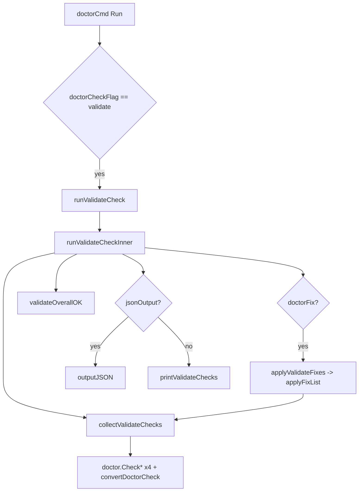

# validate_check_focus_pipeline 模块深度解析

`validate_check_focus_pipeline`（对应 `cmd/bd/doctor_validate.go`）可以把它理解成 `bd doctor` 里的“**数据完整性快速安检通道**”。它不做全量系统体检，而是专门盯四类高价值、常见、且会直接影响协作正确性的风险：重复 issue、孤儿依赖、测试污染、Git 冲突。这个模块存在的核心价值，不是“再做一套检查”，而是把 `doctor` 的通用体检能力收敛成一个可自动化、可脚本化、可安全修复的窄流程，让团队在 CI、日常开发、批量修复时都能用同一套语义。

---

## 1) 这个模块解决什么问题？为什么不是“直接跑全部 doctor 检查”？

`bd doctor` 的默认路径（见 `cmd/bd/doctor.go`）覆盖安装、版本、schema、hooks、迁移、server 等广泛健康项。那条路径很完整，但对“我现在只想确认数据没坏、并尽快修”这个场景来说太重了。`--check=validate` 这条支路通过 `runValidateCheck` 进入，只执行聚焦的四项数据一致性检查，形成一个轻量但高信号的结果。

朴素方案通常是“调用四个检查函数，然后打印结果”。但这个模块多做了几件关键事：它统一了输出模型（人类可读 + JSON）、统一了失败语义（warning/error 都视为整体失败）、统一了修复入口（复用 `applyFixList` 而不是自己再维护一套 fix dispatch），并且在 `--fix` 模式下执行“先检查、再修复、再复检”的闭环。这些设计让它不仅是一个函数集合，而是一条可运营的 pipeline。

---

## 2) 心智模型：它像“专科门诊分诊台”，不是“医院总检中心”

可以把 `runValidateCheckInner` 想象成分诊台：

- `collectValidateChecks` 负责“挂号采样”（把四个检查结果收集回来，并附加 `fixable` 元信息）；
- `applyValidateFixes` 负责“可治先治”（仅对标记可自动修复且当前异常的项触发修复流程）；
- `validateOverallOK` 给出“是否可放行”；
- `printValidateChecks` / `outputJSON` 负责“把结论交给人或机器”。

其中 `validateCheckResult` 是一个很小但很关键的抽象：它把 `doctorCheck` 和 `fixable` 绑定起来。也就是说，这个模块不改变 doctor 子系统对“检查项”的定义，而是在本地加了一层“修复策略维度”。这是一种低侵入扩展：既复用已有数据结构，又避免把 `fixable` 这个 validate 特有语义硬塞回通用 `doctorCheck`。

---

## 3) 架构与数据流



入口在 `doctorCmd` 的 `Run` 分支里：当 `doctorCheckFlag` 为 `"validate"` 时，调用 `runValidateCheck(absPath)`。外层 `runValidateCheck` 只做一件事：若 `runValidateCheckInner` 返回 `false`，则 `os.Exit(1)`。这个分层是为了测试友好（`runValidateCheckInner` 不直接退出进程，测试可直接断言布尔结果）。

核心流在 `runValidateCheckInner`。它先调用 `collectValidateChecks(path)`，内部固定顺序执行四个检查：`doctor.CheckDuplicateIssues`、`doctor.CheckOrphanedDependencies`、`doctor.CheckTestPollution`、`doctor.CheckGitConflicts`，并通过 `convertDoctorCheck` 转成 CLI 侧 `doctorCheck`。其中只有 `Orphaned Dependencies` 被标记 `fixable: true`。

如果命令带 `--fix`（`doctorFix`），就进入 `applyValidateFixes`。这里不会盲修：先筛出“可修且当前非 OK”的检查，再处理交互确认（受 `doctorYes` 与终端交互性检测影响），最后调用 `applyFixList(path, fixable)` 真正执行修复。修复后会再次 `collectValidateChecks`，确保输出是“修复后的真实状态”，而不是“修复前的缓存结果”。

最终 `validateOverallOK` 计算总体状态；若 `jsonOutput` 为真，输出结构化结果（`path`、`checks`、`overall_ok`）；否则打印人类可读摘要，并在非 `--fix` 且失败时给出可修复提示。若全部通过，再打印成功总结。

---

## 4) 组件深挖（函数/结构）

### `type validateCheckResult struct`

这是本模块唯一新增的数据结构。字段很少：`check doctorCheck` 与 `fixable bool`。设计意图是把“事实结果”（状态、消息）与“操作能力”（能不能自动修）分离。`doctorCheck` 本身已有 `Fix` 文案，但那是说明级别，不等于一定可自动修；`fixable` 在这里承担的是“是否允许进入自动修复分支”的强约束。

### `runValidateCheck(path string)`

职责是 CLI 语义桥接：把布尔成功/失败转成 shell 退出码。它不参与业务细节，确保上层调用点（`doctorCmd`）保持简洁。

### `runValidateCheckInner(path string) bool`

这是管道编排器。内部顺序体现了一个明确策略：

1. 先拿到当前诊断；
2. 若要求修复，先修再复检；
3. 统一算 `overallOK`；
4. 根据输出模式分别走 JSON 或人类输出。

非显而易见但重要的一点是：它把 `warning` 也视为 `overallOK=false`（通过 `validateOverallOK` 实现）。这个选择明显偏向“正确性门禁”而非“告警仅提示”。对 CI 场景尤其关键：数据风险不应被 warning 轻易放过。

### `collectValidateChecks(path string) []validateCheckResult`

这里是检查清单的“白名单装配点”。它固定了 validate 模式的边界：只有四项，不多不少。扩展此 pipeline 的首要入口就是这个函数——新增检查时需要同时考虑：

- 是否应纳入 validate 的“高信号集合”；
- 是否应该标记 `fixable`；
- 该检查在 `applyFixList` 中是否已有同名修复分发。

### `validateOverallOK(checks []validateCheckResult) bool`

逻辑非常严格：一旦出现 `statusError` 或 `statusWarning` 即失败。该函数把状态判定集中起来，避免输出层各自定义“失败”。这也让测试（见 `TestValidateOverallOK`）可以独立锁定门禁语义。

### `printValidateChecks(checks []validateCheckResult)`

这是人类输出适配层。它使用 `internal/ui` 渲染分类、图标、弱化文本、树形 detail 和汇总统计。重点不是美观，而是稳定的信息层级：名称 + message 是主干，detail 是次级补充，最后统一 summary。对于 CLI 工具，这种稳定格式能降低排障时的认知负担。

### `applyValidateFixes(path string, checks []validateCheckResult)`

这个函数体现了“安全优先”的修复策略：

- 只修 `fixable && status != ok`；
- 默认需要确认；
- 非交互 stdin 且未加 `--yes` 时不执行修复，并明确提示如何无提示执行；
- 真正修复动作委托给 `applyFixList`。

它刻意不自己实现每项 fix 的细节，而是复用 `doctor_fix.go` 的统一分发。这样做提高一致性：validate 子流程与完整 doctor 流程共享同一修复执行面，避免两套修复逻辑漂移。

---

## 5) 依赖分析：它调用谁、谁调用它、契约是什么

从调用关系看，`validate_check_focus_pipeline` 的上游是 `doctorCmd` 的 `--check=validate` 分支，下游包括三类依赖：

第一类是检查提供者，即 `cmd/bd/doctor/validation.go` 里的 `CheckDuplicateIssues`、`CheckOrphanedDependencies`、`CheckTestPollution`、`CheckGitConflicts`。这些函数返回 `doctor.DoctorCheck`，本模块通过 `convertDoctorCheck` 转成本地 `doctorCheck`。这层转换契约很直接：字段语义一一映射（`Name/Status/Message/Detail/Fix/Category`）。

第二类是修复分发器 `applyFixList`（`cmd/bd/doctor_fix.go`）。本模块只负责“要不要修、修哪些”，不关心“怎么修”。真正的按名称路由（比如 `"Orphaned Dependencies"`）发生在 `applyFixList` 的 `switch check.Name`。这意味着存在一个隐式契约：检查名字符串必须与修复分发中的 case 对齐。

第三类是输出与交互基础设施，包括 `outputJSON`、状态常量 `statusOK/statusWarning/statusError`、全局 flag（`doctorFix`、`doctorYes`、`jsonOutput`、`doctorGastown`、`gastownDuplicatesThreshold`）以及 UI 渲染函数。该模块依赖这些全局配置，换来的是与整个 CLI 一致的行为与样式；代价是它不是一个“纯函数式、可独立复用”的自治组件。

---

## 6) 关键设计取舍

这个模块最明显的取舍是“简单编排 + 全局复用”优先于“完全解耦”。例如它直接读取全局 flag，而不是显式传入配置对象。好处是接入成本低、行为与 `doctor` 主流程天然一致；坏处是测试和复用时需要关心全局状态。

第二个取舍是“warning 即失败”。这牺牲了部分宽松性，但对数据完整性检查是合理的：重复、污染、孤儿依赖虽然不总是立即崩溃，却会在后续演化中放大成本。

第三个取舍是“修复逻辑集中在 `applyFixList` 的字符串分发”。这种方式扩展非常快，但类型安全较弱，重命名检查项时容易产生断链风险。当前设计显然更看重维护一处修复总线，而不是为每类检查建立强类型注册机制。

第四个取舍是“修复后必复检”。这增加了一次检查成本，但换来结果可信度：用户看到的是最终状态，而不是“尝试修了但不知道是否真修好”。

---

## 7) 使用方式与扩展示例

典型 CLI 用法：

```bash
bd doctor --check=validate
bd doctor --check=validate --fix
bd doctor --check=validate --fix --yes
bd doctor --check=validate --json
```

如果你要新增一个 validate 专项检查，最小改动路径通常是：先在 `cmd/bd/doctor/validation.go` 增加 `doctor.CheckXxx(...) DoctorCheck`，再在 `collectValidateChecks` 里追加一项，并决定 `fixable` 是否为 `true`。若可自动修复，还需要确保 `applyFixList` 的 `switch check.Name` 有对应 case。

---

## 8) 新贡献者最该注意的坑

第一，检查名称是修复分发键。`applyFixList` 通过 `check.Name` 做路由，名称改动若未同步，会导致“显示可修复但实际不执行”。

第二，非交互模式默认不自动确认。在 CI/脚本里若想真正修复，需要显式加 `--yes`。否则 `applyValidateFixes` 会打印提示并返回。

第三，`validateOverallOK` 把 warning 视为失败，这会影响退出码和流水线行为。不要按“warning 仅提示”的直觉改动，否则会改变自动化契约。

第四，`--fix` 路径是“先查后修再查”，不要在中间缓存旧结果用于最终输出。

第五，测试里已强调一个现实约束：`TestValidateCheck_FixOrphanedDeps` 的注释指出当前 orphan fix 在默认 Dolt 后端下可能是 no-op（具体行为在 `fix.OrphanedDependencies`，不在本模块）。因此在宣称“可自动修复”时，要区分“流程允许修复”与“底层修复器在当前后端一定生效”。

---

## 9) 参考阅读

- [doctor_command_entry_orchestration](doctor_command_entry_orchestration.md)：`doctor` 命令主入口与模式分流
- [command_entry_and_output_pipeline](command_entry_and_output_pipeline.md)：CLI 输出与命令编排语义
- [doctor_contracts_and_taxonomy](doctor_contracts_and_taxonomy.md)：`DoctorCheck` 契约与状态分类
- [deep_graph_validation](deep_graph_validation.md)：`--deep` 路径与 validate 快速路径的边界
