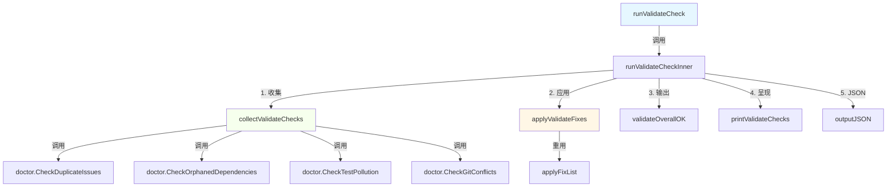

# validation_cli_integration 模块技术深度解析

## 1. 模块概述

`validation_cli_integration 是 beads 系统中的 CLI 接口集成，专门负责提供用户友好的数据完整性验证。它充当底层验证引擎与命令行界面之间的桥梁，将复杂的验证检查、修复和报告以直观的方式呈现给用户。

这个模块解决的核心问题是：如何将 beads 内部复杂的数据完整性验证功能以用户友好的方式暴露出来，同时保持与 doctor 模块核心逻辑的独立封装。它不是重新实现验证逻辑，而是将这些逻辑的"包装器和展示层。

## 2. 核心设计思想

想象 validation_cli_integration 的设计遵循"适配器模式，它将内部验证引擎与 CLI 交互之间建立了一个优雅的适配层。其核心设计理念包括：

1. **关注点分离**：验证逻辑由 doctor 模块负责，而 CLI 呈现由本模块负责
2. **可组合性**：将独立的验证检查被组合成一个连贯的用户体验
3. **修复流程整合**：检查、修复和重新验证的完整流程
4. **多格式输出**：同时支持人类可读输出和机器可读的 JSON 输出

## 3. 架构



### 数据流向说明：

1. **入口点**：`runValidateCheck` 作为用户通过 CLI 触发验证流程
2. **核心流程**：`runValidateCheckInner` 协调整个验证-修复-再验证循环
3. **检查收集**：`collectValidateChecks` 从 doctor 模块收集四种核心数据完整性检查
4. **修复应用**：`applyValidateFixes` 处理可修复问题的确认和应用
5. **结果呈现**：`validateOverallOK` 确定整体状态，`printValidateChecks` 渲染输出

## 4. 核心组件详解

### 4.1 `validateCheckResult` 结构体

```go
type validateCheckResult struct {
	check   doctorCheck
	fixable bool
}
```

**设计意图**：这个结构体封装了 doctor 检查结果和是否可以自动修复的标记。它是验证结果和修复能力的配对信息。

**为什么这样设计**：
- 将检查结果和修复能力解耦
- 允许在不修改 doctor 模块核心结构的情况下，在 CLI 层增加修复元数据
- 提供了灵活的方式来处理哪些问题可以自动化，哪些不行

### 4.2 `collectValidateChecks` 函数

**功能**：收集并执行四种核心数据完整性检查。

**检查内容**：
1. 重复问题检测
2. 孤立依赖检查（可修复）
3. 测试污染检查
4. Git 冲突检查

**设计决策**：
- 硬编码了检查列表，确保验证的一致性和可靠性
- 预先定义了每个检查的修复能力

### 4.3 `applyValidateFixes 函数

**设计亮点**：
1. 智能确认流程
2. 交互式/非交互式模式检测
3. 重用 doctor 模块的修复机制
4. 用户友好的提示和确认

## 5. 依赖关系分析

**调用方**：
- [`doctor` 模块：`CheckDuplicateIssues`、`CheckOrphanedDependencies` 等核心验证逻辑
- `ui` 模块：用于格式化和渲染输出
- `applyFixList`：来自 doctor_fix.go，用于实际应用修复

**被调用方**：
- 作为 CLI 命令的一部分，通常由 `bd doctor --check=validate 命令触发

## 6. 设计决策与权衡

### 6.1 关注点分离 vs. 代码重用

**决策**：验证逻辑与 CLI 呈现完全分离
- 验证逻辑完全保留在 doctor 模块
- CLI 集成仅负责呈现和协调

**权衡**：
- ✅ 优点：doctor 模块可以独立测试和演进
- ✅ 优点：CLI 层可以自由改变呈现方式而不影响验证逻辑
- ⚠️ 权衡：需要在两个模块之间建立清晰的接口边界

### 6.2 修复机制的复用

**决策**：重用 doctor 模块的修复机制而不是重新实现

**权衡**：
- ✅ 优点：避免代码重复
- ✅ 优点：确保修复逻辑的单一真实来源
- ⚠️ 权衡：对 doctor 模块的内部实现有一定依赖

### 6.3 交互式与非交互式模式

**决策**：自动检测终端类型，智能处理确认流程

## 7. 使用与示例

### 基本用法

```bash
# 运行验证检查
bd doctor --check=validate

# 运行并自动修复
bd doctor --check=validate --fix

# 非交互式自动修复
bd doctor --check=validate --fix --yes

# 输出 JSON 格式
bd doctor --check=validate --json
```

## 8. 边缘情况与注意事项

1. **非交互式环境**：在 CI/自动化环境中运行时，必须使用 `--yes` 选项
2. **修复确认**：即使用户取消修复，也会重新运行检查以显示当前状态
3. **JSON 输出**：JSON 输出格式可能缺少某些细节信息
4. **部分修复**：有些问题可能无法完全修复

## 9. 相关模块

- [doctor 模块](doctor.md) - 核心验证引擎
- [UI Utilities](ui_utilities.md) - 输出渲染和格式化

