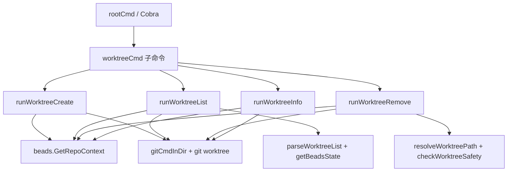

# worktree_command_flow 模块深度解析

`worktree_command_flow`（实现文件为 `cmd/bd/worktree_cmd.go`）本质上是 `bd` CLI 里的“多工作目录协调器”：它把 Git 原生的 `worktree` 能力，和 beads 的 `.beads` 数据目录重定向机制绑定在一起，确保你在并行分支、并行 agent、甚至嵌套 worktree 的场景下，看到的是同一份 issue 数据状态。没有这个模块时，最常见的失败模式是：Git 工作树创建成功了，但每个目录各自有一套 beads 状态，或者命令跑在错误 repo root 上，最终导致“代码在 A 分支改，任务状态在 B 目录漂移”的隐性数据分叉。

## 这个模块到底在解决什么问题

表面上看，这是个“worktree 增删查”的命令集；但真正要解的是“**Git 工作目录拓扑** + **beads 状态一致性** + **命令执行安全边界**”三件事同时成立的问题。

朴素方案通常是直接封装几条 `git worktree` 命令，再在新目录里复制一个 `.beads`。这在单机临时实验时看起来能用，但在长期协作里会出问题：复制 `.beads` 会让 issue 状态分叉；不处理路径解析会在 worktree / redirect / BEADS_DIR 并存时写到错误位置；不限制 git hooks/template 还可能触发不受控代码执行。`worktree_command_flow` 的设计重点不是“让命令跑通”，而是“让并行开发环境里的状态和安全模型可预测”。

## 心智模型：它像一个“铁路道岔调度器”

可以把这个模块想成铁路系统里的道岔控制台。

Git worktree 是轨道，`.beads` 是调度中心数据库，CLI 子命令是列车。这个模块做三类调度：第一，决定列车要进哪条轨道（路径解析与主仓/工作树识别）；第二，确保所有轨道都指向同一个调度中心（`redirect` 文件）；第三，在列车进站/离站前做安全检查（readonly、防脏删、禁用 hooks/templates）。

核心抽象并不复杂，但组合关系非常关键：

- `WorktreeInfo` 是对外展示/JSON 输出的数据合同。
- `runWorktreeCreate` / `runWorktreeList` / `runWorktreeRemove` / `runWorktreeInfo` 是四条主流程。
- `gitCmdInDir` 是统一的 Git 执行器（目录绑定 + 安全环境变量）。
- `parseWorktreeList`、`resolveWorktreePath`、`checkWorktreeSafety`、`getBeadsState` 等是流程编排用的“判定器”和“转换器”。

## 架构与数据流



`init()` 会把 `worktreeCmd` 挂到 `rootCmd`，并注册 `create/list/remove/info` 子命令及其 flag（`--branch`、`--force`）。这意味着该模块的架构角色是典型的**CLI 编排层（orchestrator）**：它不实现 Git 存储，也不实现 beads 重定向解析底层，而是把已有基础能力按命令语义串起来。

关键数据流可以看两条热路径。

第一条是 `runWorktreeCreate`：输入是命令参数 `name` 与可选 `--branch`，先通过 `beads.GetRepoContext()` 拿到 `CWDRepoRoot` 与 `BeadsDir`，在 `repoRoot` 下执行 `git worktree add`，然后在新 worktree 写入 `.beads/redirect` 指向主 `.beads`。这里有一个很关键的实现细节：它会先用 `utils.CanonicalizeIfRelative(mainBeadsDir)` 把目标路径绝对化，再用 `filepath.Rel(worktreeRoot, absMainBeadsDir)` 生成相对路径，避免相对路径基准不一致（代码注释里关联 GH#1098）。

第二条是 `runWorktreeRemove`：输入是 worktree 名称/路径，先经 `resolveWorktreePath()` 宽松解析（绝对路径、相对 cwd、相对 repoRoot、最后查 `git worktree list --porcelain` 注册表），再防止误删主仓库（绝对路径比较），默认执行 `checkWorktreeSafety()` 校验“无未提交改动 + 无未推送提交”，通过后才执行 `git worktree remove`。`--force` 允许跳过安全检查，体现了“默认安全、显式越权”的策略。

## 组件级深潜

### `WorktreeInfo`

`WorktreeInfo` 是命令输出的统一结构：`Name`、`Path`、`Branch`、`IsMain`、`BeadsState`、`RedirectTo`。它承担两层职责：一是人类可读表格展示的中间结构，二是 `--json` 输出合同。值得注意的是注释写了 `BeadsState` 可能是 `"redirect"`, `"shared"`, `"none"`，但 `getBeadsState()` 实际还会返回 `"local"`。这意味着调用方如果硬编码有限枚举会踩坑；新贡献者应按“开放枚举”处理。

### `runWorktreeCreate(cmd, args)`

这是“创建 + 一致性绑定”主流程。它先调用 `CheckReadonly("worktree create")`，把只读模式下的行为前置失败；然后在 Git 成功创建 worktree 后写 `.beads/redirect`，如果后续任一步失败，通过内部 `cleanupWorktree()` 反向执行 `git worktree remove --force` 做补偿。这个补偿动作体现了典型的“伪事务”思路：Git 操作和文件系统写入无法统一事务提交，就用 best-effort rollback 降低脏状态概率。

它还会在 worktree 位于 repo root 内部时，调用 `addToGitignore()` 自动追加忽略项。这不是功能正确性的硬依赖，因此失败只打印 warning，不中断命令——这是对“主路径成功率”的优先保证。

### `runWorktreeList(cmd, args)` 与 `listWorktreesWithoutBeads(ctx, repoRoot)`

`runWorktreeList` 的设计亮点是**降级策略**：优先走 `beads.GetRepoContext()`，拿到主 `.beads` 路径后再 enrich beads 状态；若仓库尚未 `bd init` 导致无 `.beads`，则降级到 `git.GetRepoRoot()` + `listWorktreesWithoutBeads()`，照样列出 worktree，只是 `BeadsState` 统一为 `none`。这避免了“无 beads 即不可观察”的糟糕体验。

列表解析依赖 `parseWorktreeList()` 处理 `git worktree list --porcelain` 输出，再由 `getBeadsState()`、`getRedirectTarget()`追加 beads 语义。输出层支持结构化 JSON 与对齐表格两套通路。

### `runWorktreeRemove(cmd, args)`

删除流程由三段组成：定位目标、风险控制、执行删除。`resolveWorktreePath()` 体现了对真实用户输入的包容性，特别是“显示名不等于路径”的子目录 worktree 场景；`checkWorktreeSafety()` 则强制默认保守。代码注释明确“故意不检查 stash”，因为 stash 是仓库级共享而非 worktree 级，检查它会产生误导信号。这是一个很好的“正确性优先于表面完整性”的决策。

删除后会尝试 `removeFromGitignore()` 清理对应忽略项，同样采用非致命 warning 策略。

### `runWorktreeInfo(cmd, args)`

`info` 命令的目标是回答“我当前站在哪条轨道上”。它先判断是否 worktree：优先用 `beads.GetRepoContext()` 的 `IsWorktree`，失败后回退到 `git.IsWorktree()`；随后用 `git.GetMainRepoRoot()`、`getWorktreeCurrentBranch()` 与 `beads.GetRedirectInfo()` 组装状态。这个流程强调“尽量给信息，不轻易失败”，因此 `GetMainRepoRoot` 失败时会回填 `"(unknown)"`。

### `gitCmdInDir(ctx, dir, args...)`

这是模块里最关键的基础设施函数。所有 Git 调用都经由它构建 `exec.Cmd`，并强制设置 `cmd.Dir`。同时它把 `GIT_HOOKS_PATH`、`GIT_TEMPLATE_DIR` 置空，作为防御纵深，减少在不可信仓库上下文中触发 hooks/template 的风险。你可以把它看作这个模块的“命令沙盒边界”。

### `parseWorktreeList(output)`

该函数是一个轻量流式解析器：按行扫描 porcelain 输出，遇到 `worktree ` 新建记录，遇到 `branch ` 填充分支，遇到 `bare` 打标。最后将首个非 bare 条目标为 `IsMain=true`。这做法简单高效，但依赖 Git porcelain 输出格式稳定；如果上游格式变更，这里会静默解析偏差。

### `resolveWorktreePath(ctx, repoRoot, name)`

它是“用户输入纠偏器”。依次尝试：绝对路径、相对当前目录、相对 repo root、最后查询 git registry 并按 `wt.Name == name || wt.Path == name` 匹配。这个顺序兼顾性能（先本地 `stat`）和兼容性（最后兜底 registry）。如果你要扩展支持更多别名策略，应优先在最后一层加，避免破坏现有路径优先级语义。

### `checkWorktreeSafety(ctx, worktreePath)`

安全检查只看两件高价值信号：`git status --porcelain`（工作区脏）和 `git log @{upstream}.. --oneline`（本地未推送提交）。第二步故意忽略“无 upstream”错误，因为这不应阻断删除。函数的设计风格是“低误报优先”：宁可少报，也不引入含糊告警。

### `getBeadsState(worktreePath, mainBeadsDir)` 与 `getRedirectTarget(worktreePath)`

这两个函数把文件系统事实映射成 beads 语义：有 `redirect` 文件就是 `redirect`；有 `.beads` 但与主目录一致是 `shared`，否则 `local`；都没有是 `none`。`getRedirectTarget()` 对相对路径按 worktree 根目录解析（与 FollowRedirect 语义对齐，见测试说明 GH#1266）。

### `addToGitignore(repoRoot, entry)` 与 `removeFromGitignore(repoRoot, entry)`

这是一对幂等辅助函数。`addToGitignore` 先查重再追加 `# bd worktree` 与目录项；`removeFromGitignore` 采用“看到标记注释就尝试删除下一行 entry”的有限状态机。它的 tradeoff 是实现简单，但对手工编辑很敏感：如果用户移动了注释和条目关系，清理可能不完整。

## 依赖关系与契约分析

从“它调用谁”看，本模块主要依赖四类能力。

第一类是仓库上下文：`beads.GetRepoContext()` 与 `beads.GetRedirectInfo()`。前者提供 `RepoContext`（尤其 `CWDRepoRoot`、`BeadsDir`、`IsWorktree`），后者给出当前目录的 redirect 状态。它们是 worktree 命令能否保持 beads 一致性的核心前提。可参考 [repo_context_resolution_and_git_execution](repo_context_resolution_and_git_execution.md) 与 [repository_discovery_and_redirect](repository_discovery_and_redirect.md)。

第二类是 Git 环境探测：`git.GetRepoRoot()`、`git.IsWorktree()`、`git.GetMainRepoRoot()`。这些 API 来自内部 Git 适配层，处理了 worktree/路径规范化等细节。若这些 API 语义变化（例如 `GetRepoRoot` 在 worktree 下返回策略改变），此模块的“主仓识别”和“回退路径”会连锁受影响。

第三类是 CLI 运行时合同：全局 `jsonOutput` 控制输出模式，`CheckReadonly()` 控制写操作准入，`rootCmd` 负责命令注册。这说明本模块在架构上是强耦合于 `cmd/bd` 进程级状态的，不是独立可复用库。

第四类是工具与展示：`utils.CanonicalizeIfRelative()` 用于路径基准修正，`ui.RenderPass("✓")` 用于人类输出样式。

从“谁调用它”看，主要是 Cobra 命令路由：用户执行 `bd worktree ...` 时触发相应 `RunE`。由于 `runWorktree*` 都返回 `error`，错误会被 CLI 顶层统一处理；这形成了一个隐式契约：函数内部只处理可恢复/可降级路径，致命错误交回框架。

## 设计取舍与非显然决策

这个模块一系列选择都偏向“工程上可落地的稳健性”。

它没有复用 `RepoContext.GitCmd()`，而是定义了本地 `gitCmdInDir()`，并显式用 `CWDRepoRoot`/worktree 路径执行 Git。这是一个有意识的取舍：`RepoContext.GitCmd()`面向 beads 数据仓库语义，而 worktree 管理必须跟随用户当前工作仓库语义。代价是重复了一段“禁 hooks/template”的安全配置代码；收益是命令语义清晰，避免误操作到 BEADS_DIR 指向的外部仓库。

它把“创建 worktree + 写 redirect + 改 gitignore”拆成多步、并为前两步加补偿回滚，而不是追求一次性原子操作。这是因为底层跨 Git 与文件系统，天然难以原子提交。当前实现偏重正确回滚和用户可理解性，牺牲了一点流程简洁。

删除时默认安全检查、`--force` 显式绕过，体现了 correctness-first。与此同时，它没有做更重的检查（比如 stash、远端状态一致性），保持了操作性能和可预测性，避免“删个目录要跑半天检测”。

列表命令支持“无 `.beads` 仍可用”的降级，这是用户体验优先。代价是状态字段在降级模式下信息不完整，但比直接报错更符合运维直觉。

## 使用方式与常见模式

命令层最常用的路径如下。

```bash
# 创建 worktree，并自动写 .beads/redirect
bd worktree create feature-auth

# 指定分支名
bd worktree create bugfix --branch fix-1

# 列出所有 worktree（含 beads 状态）
bd worktree list

# JSON 输出，便于脚本消费
bd worktree list --json

# 安全删除（默认检查脏工作区和未推送提交）
bd worktree remove feature-auth

# 强制删除
bd worktree remove feature-auth --force

# 查看当前目录是否 worktree 及 redirect 状态
bd worktree info --json
```

如果你在代码里扩展同类命令，建议沿用两个惯例：一是任何 Git 调用都通过 `gitCmdInDir()`；二是涉及写操作的入口先 `CheckReadonly(...)`。

## 新贡献者最该注意的边界条件与坑

第一，`BeadsState` 实际可能出现 `local`，不要只按注释里三个值写死判断。

第二，relative redirect 的基准目录非常容易写错。当前实现是“相对于 worktree root（`.beads` 的父目录）”，并且读取时也按 worktree root 解析；如果一端改成相对 `.beads`，另一端不改，会立刻出现路径漂移。

第三，`parseWorktreeList()` 依赖 `git worktree list --porcelain` 文本格式。若你计划支持更多元数据，优先先验证 Git 输出兼容性，否则解析器会悄悄丢字段。

第四，`removeFromGitignore()` 只会删除 `# bd worktree` 后紧邻匹配项。如果用户人工重排 `.gitignore`，可能残留条目；这通常不是致命问题，但要在文档或日志里提示“best effort”。

第五，`checkWorktreeSafety()` 对“无 upstream”是放行的，这符合当前策略。若你在企业场景要求更强约束，需要显式新增策略开关，而不是直接改成遇错即阻断。

## 参考文档

- [CLI Worktree & Dolt Commands](CLI Worktree & Dolt Commands.md)
- [repo_context_resolution_and_git_execution](repo_context_resolution_and_git_execution.md)
- [repository_discovery_and_redirect](repository_discovery_and_redirect.md)
- [hook_runtime_and_status](hook_runtime_and_status.md)

如果你接下来要改这个模块，建议先通读 `cmd/bd/worktree_cmd_test.go`，里面对 GH#1098、GH#1266 的回归场景说明了许多“为什么这样实现”的历史上下文。