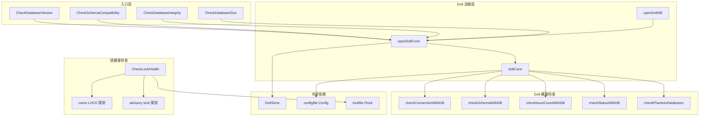

# 数据库与 Dolt 检查

## 模块概述

想象一下，你是一位机械师，每次启动汽车前都要检查机油、胎压、电池电压和刹车片厚度。**数据库与 Dolt 检查**模块就是 beads 系统的"仪表盘诊断系统"——它在 `bd doctor` 命令执行时，对底层数据存储进行全方位健康检查，确保系统运行在可靠的基础上。

这个模块存在的根本原因是：**Dolt 是一个带有版本控制语义的 SQL 数据库，它比传统数据库更复杂，也更容易出现微妙的状态问题**。普通的数据库连接检查不足以捕捉 Dolt 特有的问题，比如：
- 未提交的变更（Dolt 的 working set 概念）
- 锁文件竞争（Dolt 的 noms LOCK 机制）
- 幻影数据库条目（I INFORMATION_SCHEMA 查询崩溃的根源）
- 版本元数据不匹配（CLI 与数据库 schema 版本不一致）

模块的核心设计哲学是：**诊断而非治疗**。它尽可能多地发现问题，但只在安全的情况下提供自动修复。对于破坏性操作（如删除已关闭的 issue），它只提供建议，永不自动执行。

## 架构概览



### 数据流与控制流

模块的检查流程遵循一个清晰的层次结构：

1. **后端检测** → 通过 `GetBackend()` 判断是 Dolt 还是 SQLite 后端
2. **连接建立** → 对 Dolt 后端，通过 MySQL 协议连接到 Dolt SQL 服务器
3. **并行检查** → 多个检查共享同一个连接，避免重复开销
4. **结果聚合** → 所有检查结果汇总为 `[]DoctorCheck` 返回给调用者

关键的数据流路径：

```
用户执行 bd doctor
    ↓
doctor 命令协调器
    ↓
RunDoltHealthChecksWithLock(path, lockCheck)
    ├─→ IsDoltBackend(beadsDir)  [后端检测]
    ├─→ openDoltConn(beadsDir)   [建立连接]
    │       ├─→ configfile.Load()  [读取配置]
    │       ├─→ doltserver.DefaultConfig() [解析端口]
    │       └─→ sql.Open("mysql", connStr) [MySQL 连接]
    │
    ├─→ checkConnectionWithDB(conn)  [连接测试]
    ├─→ checkSchemaWithDB(conn)      [Schema 验证]
    ├─→ checkIssueCountWithDB(conn)  [数据统计]
    ├─→ checkStatusWithDB(conn)      [未提交变更]
    ├─→ checkPhantomDatabases(conn)  [幻影数据库]
    └─→ lockCheck (pre-computed)     [锁健康]
```

## 核心设计决策

### 1. 双模式访问：嵌入式 Store vs SQL 服务器连接

**问题**：Dolt 可以通过两种方式访问：
- 嵌入式：直接通过 `dolt.NewFromConfigWithOptions` 打开本地 `.dolt` 目录
- 服务器模式：通过 MySQL 协议连接到运行的 Dolt SQL 服务器

**选择**：模块主要使用 **SQL 服务器连接**（通过 `openDoltConn`），原因如下：

| 维度 | 嵌入式访问 | SQL 服务器连接 |
|------|-----------|---------------|
| 锁竞争 | 会创建 noms LOCK 文件，可能干扰其他进程 | 不创建新锁，只读访问 |
| 并发安全 | 需要独占访问 | 支持多客户端并发 |
| 诊断准确性 | 可能因锁冲突导致假阳性 | 更稳定可靠 |
| 性能 | 启动开销大 | 连接可复用 |

**权衡**：SQL 服务器连接要求 Dolt server 正在运行。如果 server 未启动，检查会失败。这是一个合理的约束，因为 `bd doctor` 通常在用户主动诊断问题时运行，此时 server 应该已经启动。

### 2. 连接复用模式

**观察**：代码中有两套函数：
- `CheckDoltConnection()` — 独立入口，自己打开/关闭连接
- `checkConnectionWithDB(conn)` — 内部函数，复用已有连接

**设计意图**：这是典型的 **连接池模式的手动实现**。`RunDoltHealthChecksWithLock` 作为协调器，打开一次连接，然后传递给所有子检查函数。这样做的好处：
- 减少连接建立开销（TCP 握手 + 认证）
- 避免多个检查同时打开连接导致的锁竞争
- 统一的错误处理（连接失败时所有检查都返回 N/A）

**代价**：增加了代码复杂度，需要维护两套函数。但考虑到 doctor 检查的性能敏感性（用户期望快速得到结果），这个权衡是值得的。

### 3. 锁健康检查的精细区分

**问题**：Dolt 的 noms LOCK 文件有一个反直觉的行为——它**从不删除**，只在打开时加锁，关闭时释放。这意味着：
- 文件存在 ≠ 锁被占用
- 文件不存在 ≠ 锁可用

**解决方案**：`CheckLockHealth` 使用 `FlockExclusiveNonBlocking` 探测锁的实际状态：

```go
if f, err := os.OpenFile(nomsLock, os.O_RDWR, 0); err == nil {
    if lockErr := lockfile.FlockExclusiveNonBlocking(f); lockErr != nil {
        // 锁被其他进程占用 — 真实竞争
    } else {
        // 文件存在但锁未占用 — 陈旧文件，无害
        _ = lockfile.FlockUnlock(f)
    }
    _ = f.Close()
}
```

**设计洞察**：这是一个经典的 **状态探测 vs 状态假设** 的区别。许多系统会简单地检查文件是否存在来判断锁状态，但这里通过实际尝试获取锁来区分"活跃锁"和"陈旧文件"。

### 4. 幻影数据库检测

**背景**：GH#2051 报告了一个问题——I INFORMATION_SCHEMA 查询会因幻影数据库条目而崩溃。这些幻影条目来自命名约定变更（`beads_*` 前缀或 `*_beads` 后缀）。

**检测逻辑**：
```go
if strings.HasPrefix(dbName, "beads_") || strings.HasSuffix(dbName, "_beads") {
    phantoms = append(phantoms, dbName)
}
```

**为什么这是问题**：Dolt 的 catalog 可能保留旧数据库的元数据，即使这些数据库已经不存在。当查询 INFORMATION_SCHEMA 时，Dolt 会尝试访问这些幻影数据库的元数据，导致崩溃。

**修复建议**：重启 Dolt server 以刷新 catalog。这是一个"软修复"——不需要数据迁移或 schema 变更。

### 5. 破坏性操作的自动修复禁令

**设计原则**：`CheckDatabaseSize` 有一个明确的设计注释：

> DESIGN NOTE: This check intentionally has NO auto-fix. Unlike other doctor checks that fix configuration or sync issues, pruning is destructive and irreversible.

**实现**：当检测到超过阈值的已关闭 issue 时，它只建议用户运行 `bd cleanup --older-than 90`，从不自动执行。

**为什么重要**：这是一个 **安全边界** 的设计。doctor 命令应该帮助用户发现问题，但不应在用户不知情的情况下删除数据。这个原则应该在整个 doctor 系统中保持一致。

## 子模块摘要

### localConfig 结构

**职责**：解析 `config.yaml` 文件以检测 `no-db` 和 `prefer-dolt` 模式配置。

**关键设计**：使用 YAML 解析而非字符串匹配，避免在注释或嵌套键中误匹配。这是一个防御性编程的范例——看似简单的配置检查，实际上需要正确处理边缘情况。

**使用场景**：`isNoDbModeConfigured()` 函数用于判断系统是否配置为无数据库模式，这会影响其他检查的行为。

### doltConn 结构

**职责**：持有 Dolt 数据库连接及其配置上下文，作为 doctor 检查的协调句柄。

**字段说明**：
- `db *sql.DB` — MySQL 协议连接
- `cfg *configfile.Config` — 服务器配置（host/port）
- `port int` — 解析后的端口（来自 `doltserver.DefaultConfig`，而非配置回退）

**设计洞察**：端口解析逻辑有一个重要的注释：

> cfg.GetDoltServerPort() is deprecated — it falls back to 3307 which is wrong for standalone mode where the port is hash-derived from the project path.

这意味着端口不是固定的，而是根据项目路径哈希派生的。这是一个 **多项目隔离** 的设计——不同项目使用不同端口，避免冲突。

## 跨模块依赖

### 上游依赖

| 模块 | 依赖内容 | 用途 |
|------|---------|------|
| [Dolt Storage Backend](Dolt_Storage_Backend.md) | `dolt.NewFromConfigWithOptions`, `dolt.GetBackendFromConfig` | 嵌入式 store 访问和后端检测 |
| [Configuration](Configuration.md) | `configfile.Config`, `configfile.Load` | 读取服务器配置和后端类型 |
| [Dolt Server](Dolt_Server.md) | `doltserver.DefaultConfig` | 端口解析（哈希派生逻辑） |
| [内部锁文件](internal/lockfile) | `lockfile.FlockExclusiveNonBlocking` | 锁状态探测 |

### 下游依赖

| 模块 | 依赖内容 | 用途 |
|------|---------|------|
| [诊断核心](诊断核心.md) | `DoctorCheck`, `RunDoltHealthChecksWithLock` | 检查结果聚合和展示 |
| [维护与修复](维护与修复.md) | `fix.DatabaseConfig` | 自动修复数据库配置不匹配 |

## 使用指南

### 典型调用模式

```go
// 在 doctor 命令中
lockCheck := CheckLockHealth(path)  // 先检查锁，避免后续检查干扰
checks := RunDoltHealthChecksWithLock(path, lockCheck)

// 或者单独检查
check := CheckDatabaseVersion(path, cliVersion)
if check.Status == StatusError {
    // 处理错误
}
```

### 配置阈值

`CheckDatabaseSize` 使用配置项 `doctor.suggest_pruning_issue_count` 控制警告阈值：
- 默认值：5000
- 设置为 0：禁用检查

```yaml
# config.yaml
doctor:
  suggest_pruning_issue_count: 10000  # 自定义阈值
```

## 边缘情况与陷阱

### 1. SQLite 后端的优雅降级

所有检查都首先检查后端类型：
```go
if backend != configfile.BackendDolt {
    return sqliteBackendWarning("Database")
}
```

对于 SQLite 后端，检查返回 `StatusWarning` 并建议迁移到 Dolt。这是一个 **向后兼容** 的设计——旧系统不会崩溃，但会收到升级提示。

### 2. Wisp 表的特殊处理

`checkStatusWithDB` 跳过 wisp 表的未提交变更检查：
```go
func isWispTable(tableName string) bool {
    return tableName == "wisps" || strings.HasPrefix(tableName, "wisp_")
}
```

**原因**：Wisp 表是临时的，被 `dolt_ignore` 排除在版本跟踪之外。报告它们的未提交变更会产生"自我实现的警告"——永远无法清除。

### 3. 连接超时的隐性约束

`openDoltDB` 设置了一个 5 秒的连接超时：
```go
connStr = fmt.Sprintf("%s@tcp(%s:%d)/%s?parseTime=true&timeout=5s", ...)
```

**影响**：如果 Dolt server 响应慢（例如在慢速磁盘上），检查可能超时失败。这不是 bug，而是设计——doctor 检查应该快速失败，而不是无限等待。

### 4. 锁检查的时序敏感性

`CheckLockHealth` 应该在 **任何其他检查之前** 运行。原因：
- 后续检查可能打开嵌入式 Dolt store
- 打开 store 会创建 noms LOCK 文件
- 这会导致锁检查报告假阳性

这就是为什么 `RunDoltHealthChecksWithLock` 接受一个预计算的 `lockCheck` 参数——调用者应该在打开任何数据库之前先运行锁检查。

## 扩展点

### 添加新的 Dolt 检查

遵循以下模式：

1. **创建内部函数**（复用连接）：
```go
func checkNewFeatureWithDB(conn *doltConn) DoctorCheck {
    // 使用 conn.db 执行查询
}
```

2. **创建独立入口**（可选）：
```go
func CheckNewFeature(path string) DoctorCheck {
    conn, err := openDoltConn(beadsDir)
    if err != nil { /* 错误处理 */ }
    defer conn.Close()
    return checkNewFeatureWithDB(conn)
}
```

3. **集成到协调器**：
```go
func RunDoltHealthChecksWithLock(path string, lockCheck DoctorCheck) []DoctorCheck {
    // ...
    return []DoctorCheck{
        // ...
        checkNewFeatureWithDB(conn),
    }
}
```

### 添加自动修复

对于可安全自动修复的问题，在 `fix/` 包中实现修复逻辑，然后在 doctor 检查中返回 `Fix` 字段：

```go
return DoctorCheck{
    Name:    "问题名称",
    Status:  StatusError,
    Message: "问题描述",
    Fix:     "运行 'bd doctor --fix' 自动修复",
}
```

**注意**：只有非破坏性操作才应该支持自动修复。数据删除、schema 变更等操作应该只提供参考命令。
