# 数据库与 Dolt 检查

## 模块概述

想象你是一位机械师，面前是一台复杂的发动机。在开始修理之前，你需要一套诊断工具来快速判断：油压是否正常？火花塞是否工作？皮带是否磨损？**数据库与 Dolt 检查**模块就是 beads 系统的"诊断仪"——它不修改数据，不执行迁移，只做一件事：以只读方式探测 Dolt 数据库的健康状态，并以结构化的方式报告问题。

这个模块存在的根本原因是 Dolt 作为一个版本化的 SQL 数据库，其运行状态比传统 SQLite 复杂得多：它可能以嵌入式模式运行，也可能以独立服务器模式运行；它可能有未提交的变更；它可能持有文件锁导致并发访问阻塞；它甚至可能在元数据中留下"幽灵数据库"条目。`bd doctor` 命令需要可靠地检测这些问题，但又不能因为诊断过程本身而改变系统状态或引入新的竞争条件。

模块的核心设计洞察是：**诊断必须是可组合的、只读的、且对连接友好的**。因此代码采用了"连接复用"模式——多个检查共享同一个数据库连接，而不是每个检查都独立打开关闭连接。这不仅减少了开销，更重要的是避免了因频繁打开数据库而触发的锁竞争问题。

## 架构与数据流

```mermaid
flowchart TB
    subgraph Entry["诊断入口"]
        RunDoltHealthChecksWithLock["RunDoltHealthChecksWithLock"]
    end
    
    subgraph Conn["连接管理层"]
        openDoltConn["openDoltConn"]
        doltConn["doltConn 结构体"]
        openDoltDB["openDoltDB"]
    end
    
    subgraph Checks["健康检查组"]
        checkConnection["checkConnectionWithDB"]
        checkSchema["checkSchemaWithDB"]
        checkIssueCount["checkIssueCountWithDB"]
        checkStatus["checkStatusWithDB"]
        checkPhantom["checkPhantomDatabases"]
        lockCheck["CheckLockHealth 外部传入"]
    end
    
    subgraph Standalone["独立检查入口"]
        CheckDatabaseVersion["CheckDatabaseVersion"]
        CheckSchemaCompatibility["CheckSchemaCompatibility"]
        CheckDatabaseIntegrity["CheckDatabaseIntegrity"]
        CheckDatabaseSize["CheckDatabaseSize"]
    end
    
    subgraph DoltStore["Dolt Store 层"]
        doltStore["internal.storage.dolt.store.DoltStore"]
    end
    
    subgraph Config["配置层"]
        configfile["internal.configfile.configfile.Config"]
        doltserver["internal.doltserver.doltserver.Config"]
    end
    
    RunDoltHealthChecksWithLock --> openDoltConn
    openDoltConn --> doltConn
    openDoltConn --> openDoltDB
    openDoltDB --> configfile
    openDoltDB --> doltserver
    
    doltConn --> checkConnection
    doltConn --> checkSchema
    doltConn --> checkIssueCount
    doltConn --> checkStatus
    doltConn --> checkPhantom
    
    RunDoltHealthChecksWithLock --> lockCheck
    
    CheckDatabaseVersion --> doltStore
    CheckSchemaCompatibility --> doltStore
    CheckDatabaseIntegrity --> doltStore
    CheckDatabaseSize --> doltStore
```



### 架构角色解析

这个模块在 beads 诊断系统中扮演**只读探针**的角色。它位于 `cmd.bd.doctor` 包内，与 [诊断核心](诊断核心.md) 紧密协作，但专注于 Dolt 特有的健康维度。

**数据流的关键路径**：

1. **协调检查路径**：当用户运行 `bd doctor` 时，`RunDoltHealthChecksWithLock` 是主要入口。它首先接收一个预先计算的锁健康检查结果（这是为了避免诊断过程本身创建锁文件导致误报），然后打开一个到 Dolt SQL 服务器的 MySQL 协议连接。这个连接被封装在 `doltConn` 结构体中，传递给所有需要数据库访问的检查函数。

2. **独立检查路径**：某些检查（如 `CheckDatabaseVersion`）不通过协调器，而是直接调用 `dolt.NewFromConfigWithOptions` 打开一个只读的 Dolt Store。这种设计允许这些检查在不依赖 Dolt SQL 服务器的情况下工作——它们直接操作底层的 noms 存储。

3. **配置解析路径**：模块需要知道后端类型（Dolt vs SQLite）、服务器主机/端口、数据库名称等。它通过 `internal.configfile` 读取 `config.yaml`，并通过 `internal.doltserver.DefaultConfig` 解析端口（支持环境变量 > 配置文件 > 哈希派生的优先级）。

### 为什么有两种连接模式？

这是一个关键的设计决策。模块同时使用：
- **MySQL 协议连接**（通过 `database/sql` + `go-sql-driver/mysql`）：用于执行 SQL 查询，如检查表是否存在、统计问题数量、查询 `dolt_status`
- **Dolt Store API**（通过 `internal.storage.dolt.store.DoltStore`）：用于读取元数据、统计信息、配置值

这种双重模式的原因是历史演进和功能需求的结合。Dolt Store API 提供了更底层的访问能力（如 `GetMetadata`、`GetStatistics`），而 SQL 连接则更适合执行任意查询。模块没有尝试统一这两种模式，而是务实地在不同场景下使用合适的工具。

## 核心组件深度解析

### `doltConn` 结构体

```go
type doltConn struct {
    db   *sql.DB
    cfg  *configfile.Config
    port int
}
```

**设计意图**：这是一个轻量级的连接持有者，它的存在是为了解决一个实际问题——多个诊断检查需要访问同一个数据库连接，但 Go 的 `database/sql.DB` 本身是连接池，不携带配置上下文。`doltConn` 将原始连接、配置对象和解析后的端口打包在一起，使得下游检查函数可以访问完整的上下文信息（例如在错误消息中显示实际连接的主机：端口）。

**为什么不是直接传递 `*sql.DB`？** 因为某些检查（如 `checkConnectionWithDB`）需要在返回的 `DoctorCheck` 结果中包含服务器连接详情。如果只传递 `*sql.DB`，这些函数就无法获取配置信息。这是一种典型的"上下文对象"模式——用一个小结构体携带函数执行所需的辅助数据。

**生命周期管理**：`doltConn` 通过 `defer conn.Close()` 模式管理，确保即使检查过程中发生 panic，连接也会被释放。注意 `Close()` 方法忽略了错误（`_ = c.db.Close()`），这是诊断代码的常见做法——在清理阶段报告错误通常没有帮助，因为主错误已经发生。

### `openDoltDB` 函数

**职责**：建立到 Dolt SQL 服务器的 MySQL 协议连接。

**关键设计点**：

1. **端口解析逻辑**：代码注释明确指出 `cfg.GetDoltServerPort()` 已弃用，因为它会回退到硬编码的 3307 端口，这在独立模式下是错误的（独立模式的端口是从项目路径哈希派生的）。正确的做法是使用 `doltserver.DefaultConfig(beadsDir).Port`。这个细节反映了系统从固定端口到动态端口的演进历史。

2. **连接参数调优**：
   ```go
   db.SetMaxOpenConns(2)
   db.SetMaxIdleConns(1)
   db.SetConnMaxLifetime(30 * time.Second)
   ```
   这些设置反映了诊断场景的特殊需求：只需要极少的并发连接（2 个足够），但连接不应存活太久（30 秒），以避免持有不必要的资源。

3. **密码处理**：密码从环境变量 `BEADS_DOLT_PASSWORD` 读取，而不是配置文件。这是一种安全实践——敏感信息不应明文存储在版本控制的文件中。

### `CheckDatabaseVersion` 函数

**问题空间**：beads 系统需要跟踪数据库 schema 版本，以确保 CLI 与存储兼容。版本信息存储在 Dolt 的元数据表中（键为 `bd_version`）。

**检查逻辑链**：
1. 确认后端是 Dolt（非 SQLite）
2. 检查 `.beads/dolt` 目录是否存在
3. 以只读模式打开 Dolt Store
4. 读取 `bd_version` 元数据
5. 比较元数据版本与 CLI 版本

**设计权衡**：
- **只读打开**：使用 `ReadOnly: true` 确保诊断不会意外修改数据库。这是一个防御性设计——诊断工具应该像观察者一样，不改变被观察系统的状态。
- **版本不匹配是警告而非错误**：如果数据库版本与 CLI 版本不同，返回 `StatusWarning` 而非 `StatusError`。这是因为版本不匹配不一定意味着功能损坏——可能是 CLI 刚升级，元数据会在下次正常操作时自动更新。

**边界情况处理**：
- 元数据不存在（空字符串）：返回警告，建议修复元数据
- 读取元数据失败：返回错误，暗示数据库可能损坏
- 无法打开 Store：返回错误，建议重新初始化

### `CheckDatabaseSize` 函数

**独特之处**：这是模块中唯一一个**明确禁止自动修复**的检查。代码注释强调：

> "DESIGN NOTE: This check intentionally has NO auto-fix. Unlike other doctor checks that fix configuration or sync issues, pruning is destructive and irreversible."

**为什么？** 修剪数据库会永久删除已关闭的问题历史。这是一个需要用户明确同意的破坏性操作。诊断工具可以提供建议（"考虑运行 `bd cleanup --older-than 90`"），但绝不能替用户做决定。

**配置机制**：阈值通过 `doctor.suggest_pruning_issue_count` 配置键控制，默认 5000，设置为 0 可禁用检查。这种设计允许用户根据自己的工作流调整敏感度——有些团队可能希望保留所有历史，而有些团队则更关注性能。

### `CheckLockHealth` 函数

**问题背景**：Dolt 使用两种锁机制：
1. **noms LOCK 文件**：Dolt 的底层 noms 存储库在打开时创建，使用 `flock` 实现互斥。关键问题是 Dolt 在关闭时释放锁但**不删除文件**，导致文件系统上留下"僵尸"LOCK 文件。
2. **advisory lock**（`dolt-access.lock`）：beads 自己实现的访问锁，用于协调多个 beads 进程的并发访问。

**检测策略**：模块通过尝试获取非阻塞独占锁来探测锁状态：
```go
if lockErr := lockfile.FlockExclusiveNonBlocking(f); lockErr != nil {
    // 锁被其他进程持有
} else {
    // 文件存在但锁未被持有 —— 是僵尸文件，无害
    _ = lockfile.FlockUnlock(f)
}
```

**关键洞察**：仅仅检查 LOCK 文件是否存在是不够的——必须尝试获取锁来判断它是否被 actively held。这是一个经典的"探测锁状态"模式，在 Unix 系统编程中常见。

**误报预防**：函数注释提到 GH#1981 问题——doctor 自己的诊断过程可能打开 Dolt 数据库，从而创建 noms LOCK 文件，导致后续检查误报。解决方案是 `RunDoltHealthChecksWithLock` 接受一个预先计算的锁检查结果，确保锁检查在任何数据库打开操作之前执行。

### `checkPhantomDatabases` 函数

**问题来源**：当 beads 项目的命名约定发生变化时（例如从 `beads_*` 前缀改为 `*_beads` 后缀），旧的数据库条目可能残留在 Dolt 服务器目录中。这些"幽灵数据库"会导致 `INFORMATION_SCHEMA` 查询崩溃（GH#2051）。

**检测逻辑**：
1. 执行 `SHOW DATABASES` 获取所有数据库
2. 过滤掉系统数据库（`information_schema`、`mysql`）和配置的数据库
3. 标记符合 beads 命名模式的条目（`beads_*` 前缀或 `*_beads` 后缀）

**修复建议**：重启 Dolt 服务器。这是因为幽灵条目是服务器内存中的目录缓存问题，而不是持久化数据问题。

### `checkStatusWithDB` 函数

**检查内容**：查询 Dolt 的 `dolt_status` 系统表，检测未提交的变更。

**特殊处理**：函数跳过 wisp 表（`wisps` 或 `wisp_*` 前缀），因为这些是临时表，被 `dolt_ignore` 排除在版本跟踪之外，预期会有未提交变更。报告这些表的变更会产生"自我实现的警告"——用户永远无法清除它。

**设计模式**：这是一个"预期状态"检查——系统知道某些表应该被忽略，因此主动过滤它们，而不是报告所有变更让用户自行判断。

### `localConfig` 结构体

```go
type localConfig struct {
    SyncBranch string `yaml:"sync-branch"`
    NoDb       bool   `yaml:"no-db"`
    PreferDolt bool   `yaml:"prefer-dolt"`
}
```

**用途**：用于解析 `config.yaml` 以检测 no-db 模式和 prefer-dolt 设置。这个结构体是私有的（小写开头），只在 `isNoDbModeConfigured` 函数内部使用。

**为什么不用 `internal.configfile.Config`？** 因为这里只需要检查几个特定字段，而且 `config.yaml` 的结构可能与完整的配置结构不同。使用一个最小化的结构体避免了依赖完整的配置解析逻辑，也减少了配置格式变化带来的耦合。

## 依赖关系分析

### 上游依赖（被调用方）

| 依赖模块 | 使用方式 | 契约假设 |
|---------|---------|---------|
| [诊断核心](诊断核心.md) | 返回 `DoctorCheck` 结果 | `DoctorCheck` 结构体定义在 doctor 包中，包含 Name、Status、Message、Detail、Fix、Category 字段 |
| `internal.storage.dolt.store` | 打开只读 Store，读取元数据和统计信息 | Store 接口在只读模式下不会修改数据；`GetMetadata` 和 `GetStatistics` 方法可用 |
| `internal.configfile` | 加载配置，获取后端类型、服务器连接参数 | `config.yaml` 和 `metadata.json` 格式稳定；`GetBackendFromConfig` 函数可用 |
| `internal.doltserver` | 解析 Dolt 服务器端口 | `DefaultConfig` 函数正确实现端口优先级逻辑（环境变量 > 配置 > 哈希派生） |
| `internal.lockfile` | 探测文件锁状态 | `FlockExclusiveNonBlocking` 和 `FlockUnlock` 函数在目标平台上可用 |

### 下游依赖（调用方）

| 调用模块 | 调用方式 | 期望行为 |
|---------|---------|---------|
| `cmd.bd.doctor` 主命令 | 调用 `RunDoltHealthChecksWithLock` 或独立检查函数 | 返回 `[]DoctorCheck` 切片，每个检查有明确的状态（OK/Warning/Error） |
| `cmd.bd.doctor.fix` | 调用 `FixDatabaseConfig` | 返回 error，修复配置不匹配问题 |

### 数据契约

**`DoctorCheck` 结构体**（定义在 [诊断核心](诊断核心.md)）：
```go
type DoctorCheck struct {
    Name     string  // 检查名称
    Status   string  // StatusOK, StatusWarning, StatusError
    Message  string  // 人类可读的状态描述
    Detail   string  // 可选的详细技术信息
    Fix      string  // 可选的修复建议
    Category string  // 分类：CategoryCore, CategoryData, CategoryRuntime
}
```

所有检查函数必须返回这个结构体，确保诊断输出的一致性。

## 设计决策与权衡

### 1. 连接复用 vs 独立连接

**选择**：协调检查路径（`RunDoltHealthChecksWithLock`）复用同一个 `doltConn`，而独立检查函数各自打开 Store。

**权衡**：
- **优点**：减少连接开销，避免多次打开数据库触发的锁竞争
- **缺点**：增加了代码复杂度（需要 `checkXWithDB` 和 `CheckX` 两套函数）

**为什么这样设计**：诊断命令通常一次性运行所有检查，连接复用的收益远大于代码复杂度的成本。独立检查函数的存在是为了支持 `bd doctor --check <name>` 这样的细粒度调用场景。

### 2. 只读模式 vs 读写模式

**选择**：所有检查都以只读模式打开数据库。

**权衡**：
- **优点**：诊断不会意外修改数据，不会引入新的问题
- **缺点**：某些潜在问题（如可修复的元数据损坏）无法在诊断时自动修复

**为什么这样设计**：诊断工具的首要原则是"不伤害"。修复操作应该由用户显式触发（`bd doctor --fix`），而不是在诊断过程中隐式执行。

### 3. 警告 vs 错误的分级

**选择**：版本不匹配、未提交变更、大数据库等情况返回 `StatusWarning`，而非 `StatusError`。

**权衡**：
- **优点**：用户不会被非关键问题阻塞，可以区分"需要关注"和"必须修复"的问题
- **缺点**：用户可能忽略警告，导致问题积累

**为什么这样设计**：beads 是一个开发者工具，用户应该有能力判断警告的严重性。过度使用错误状态会导致"狼来了"效应，用户开始忽略所有诊断输出。

### 4. 无自动修复的数据库大小检查

**选择**：`CheckDatabaseSize` 明确不提供自动修复。

**权衡**：
- **优点**：防止用户意外删除历史数据
- **缺点**：用户需要手动运行清理命令

**为什么这样设计**：数据删除是不可逆的。诊断工具可以提供建议，但破坏性操作必须由用户显式确认。这是一个伦理设计决策，而不仅仅是技术决策。

### 5. 跳过 wisp 表的状态检查

**选择**：`checkStatusWithDB` 主动过滤 wisp 表。

**权衡**：
- **优点**：避免报告用户无法解决的"自我实现的警告"
- **缺点**：如果 wisp 表配置错误，问题可能被掩盖

**为什么这样设计**：wisp 表的设计就是临时的、不版本化的。报告它们的未提交变更没有意义，只会增加噪音。这是一种"了解你的领域"的设计——代码反映了业务逻辑的特殊性。

## 使用指南

### 基本用法

诊断检查通常通过 `bd doctor` 命令触发，用户不需要直接调用这些函数。但了解检查内容有助于解读诊断输出：

```bash
# 运行所有诊断检查
bd doctor

# 运行诊断并自动修复可修复的问题
bd doctor --fix

# 查看特定检查的详细信息（如果支持）
bd doctor --verbose
```

### 配置选项

| 配置键 | 默认值 | 说明 |
|-------|-------|------|
| `doctor.suggest_pruning_issue_count` | 5000 | 触发大数据库警告的已关闭问题数量阈值，设为 0 禁用检查 |
| `storage-backend` (config.yaml) | "dolt" | 后端类型，"dolt" 或 "sqlite"（遗留） |
| `dolt-server.host` | "localhost" | Dolt SQL 服务器主机 |
| `dolt-server.user` | "root" | Dolt SQL 服务器用户 |
| `dolt-server.database` | "beads" | Dolt 数据库名称 |
| `BEADS_DOLT_PASSWORD` (环境变量) | 空 | Dolt SQL 服务器密码 |

### 解读诊断输出

**StatusOK**：检查通过，无需操作。

**StatusWarning**：检测到潜在问题，但不影响基本功能。建议按照 `Fix` 字段的指导进行处理。

**StatusError**：检测到严重问题，可能导致功能异常。应优先修复。

**Category 分类**：
- `CategoryCore`：核心功能（连接、schema）
- `CategoryData`：数据完整性（问题数量、未提交变更）
- `CategoryRuntime`：运行时状态（锁健康）

## 边界情况与陷阱

### 1. 锁文件的误报（GH#1981）

**问题**：诊断过程本身打开 Dolt 数据库会创建 noms LOCK 文件，导致后续锁检查误报。

**解决方案**：使用 `RunDoltHealthChecksWithLock` 而非 `RunDoltHealthChecks`，确保锁检查在任何数据库打开操作之前执行。

**对新贡献者的建议**：如果你添加新的诊断检查且需要打开数据库，确保它被包含在 `RunDoltHealthChecksWithLock` 的检查列表中，而不是在锁检查之前独立调用。

### 2. 端口解析的陷阱

**问题**：`cfg.GetDoltServerPort()` 已弃用，会错误地回退到 3307 端口。

**正确做法**：始终使用 `doltserver.DefaultConfig(beadsDir).Port` 获取端口。

**为什么容易出错**：代码库中可能还有其他地方使用旧方法，新贡献者可能复制粘贴错误模式。

### 3. 只读 Store 的限制

**问题**：以 `ReadOnly: true` 打开的 Store 不能执行写操作，某些方法可能返回错误。

**影响**：诊断检查不应尝试修改数据。如果需要修复操作，应通过 `fix` 包的独立函数执行。

### 4. SQLite 后端的兼容处理

**问题**：旧版本 beads 使用 SQLite，新用户使用 Dolt。诊断检查需要优雅处理两种后端。

**模式**：所有检查函数首先检查后端类型，如果是 SQLite 则返回 `sqliteBackendWarning`，提示用户迁移到 Dolt。

**对新贡献者的建议**：添加新的 Dolt 特定检查时，记得添加后端类型检查，避免在 SQLite 用户那里产生 confusing error。

### 5. 幽灵数据库的根因

**问题**：`checkPhantomDatabases` 检测到的幽灵条目是服务器目录缓存问题，不是数据损坏。

**修复**：重启 Dolt 服务器，而不是删除文件或重新初始化数据库。

**为什么容易误解**：用户可能认为"幽灵数据库"意味着数据损坏，尝试危险的修复操作。诊断输出的 `Fix` 字段应清晰说明只需重启服务器。

### 6. 连接超时设置

**问题**：`openDoltDB` 设置 5 秒连接超时和 30 秒连接生命周期。在慢速网络或高负载系统上可能不足。

**症状**：间歇性的"server not reachable"错误，但手动连接正常。

**调试建议**：检查 Dolt 服务器日志，确认服务器是否过载或网络是否有延迟。

## 扩展指南

### 添加新的诊断检查

1. **确定检查类型**：是需要 SQL 连接还是 Dolt Store API？
2. **遵循命名约定**：
   - 协调检查：`checkXWithDB(conn *doltConn) DoctorCheck`
   - 独立检查：`CheckX(path string) DoctorCheck`
3. **添加后端检查**：如果不是 Dolt 特定检查，跳过；如果是，返回适当的 N/A 或警告
4. **添加到协调器**：在 `RunDoltHealthChecksWithLock` 中注册新检查
5. **编写测试**：确保检查在各种边界条件下行为正确

### 修改现有检查

**警告**：诊断检查的输出格式是用户界面的一部分。修改 `Message`、`Detail` 或 `Fix` 字段的格式可能影响依赖这些输出的脚本或文档。

**建议**：如果必须修改，在提交消息中明确说明，并考虑是否需要版本化输出格式。

## 相关模块

- [诊断核心](诊断核心.md)：定义 `DoctorCheck` 结构体和诊断框架
- [服务器与迁移验证](服务器与迁移验证.md)：服务器健康和迁移状态检查
- [深度验证](深度验证.md)：molecule 和 agent bead 的深度验证
- [维护与修复](维护与修复.md)：自动修复逻辑和维护操作
- `internal.storage.dolt.store`：Dolt Store API 文档
- `internal.doltserver`：Dolt 服务器配置和启动逻辑

## 总结

**数据库与 Dolt 检查**模块是 beads 诊断系统的核心组件，负责以只读、可组合的方式探测 Dolt 数据库的健康状态。它的设计体现了几个关键原则：

1. **诊断不伤害**：所有检查都是只读的，不会修改数据或引入新的问题
2. **连接友好**：通过连接复用减少开销和锁竞争
3. **分级报告**：区分 OK、Warning、Error，让用户优先处理关键问题
4. **领域感知**：了解 wisp 表、noms 锁、幽灵数据库等 Dolt 特定概念，避免误报
5. **伦理设计**：对破坏性操作（如数据修剪）明确禁止自动修复

对新贡献者而言，理解这个模块的关键是认识到它不是简单的"运行查询并报告结果"，而是一个需要平衡准确性、性能、用户体验和伦理考量的复杂系统。每次添加新检查时，都应问自己：这个检查会改变系统状态吗？它会误报吗？用户能理解并修复报告的问题吗？
