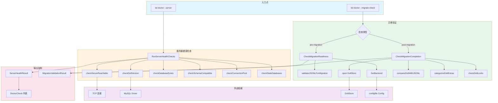

# 服务器与迁移验证

## 概述

想象一下你正在运营一个分布式数据库系统，用户可以在"嵌入式模式"（本地进程内 Dolt）和"服务器模式"（外部 Dolt SQL 服务器）之间切换。当系统出现问题时，你需要一套诊断工具来回答这些关键问题：服务器是否可达？数据库 schema 是否兼容？迁移是否完整？是否有残留的测试数据库在浪费资源？

**服务器与迁移验证**模块正是这套诊断工具的核心。它隶属于 `bd doctor` 命令系统，专门负责两类健康检查：

1. **服务器健康检查** — 当用户配置了 Dolt 服务器模式时，验证从 TCP 连通性到 schema 兼容性的完整链路
2. **迁移验证** — 在用户从 JSONL/SQLite 后端迁移到 Dolt 后端的前后，确保数据完整性、检测数据丢失、识别跨 rig 污染

这个模块的设计哲学是**防御性诊断**：它不假设环境是理想的，而是主动探测所有可能出错的环节，并给出可操作的修复建议。输出既适合人类阅读（通过 `DoctorCheck` 结构），也适合自动化工具消费（通过 `MigrationValidationResult` 的 JSON 序列化）。

## 架构与数据流



### 架构角色解析

这个模块在系统中扮演**诊断网关**的角色。它不修改数据，而是通过只读查询收集状态信息，然后将原始数据转换为结构化的诊断报告。

**数据流的关键路径**：

1. **服务器检查路径**：从配置文件读取服务器参数 → TCP 拨号测试 → MySQL 连接 → Dolt 版本查询 → 数据库存在性验证 → schema 兼容性测试 → 连接池统计 → 残留数据库扫描

2. **迁移验证路径**：定位 JSONL 文件 → 逐行解析验证 → 提取 issue ID 集合 → 与 Dolt 数据库比对 → 分类差异（丢失/外来/临时）→ 生成报告

**依赖关系**：
- **上游**：依赖 `configfile.Config` 获取服务器配置，依赖 `DoltStore` 访问 Dolt 数据库
- **下游**：被 `bd doctor` 命令调用，输出被 CLI 渲染层或自动化工具消费
- **横向**：与 [诊断核心](诊断核心.md) 共享 `DoctorCheck` 结构，与 [数据库与 Dolt 检查](数据库与 dolt 检查.md) 共享 Dolt 连接逻辑

## 核心组件详解

### ServerHealthResult

**设计意图**：将多个独立的健康检查聚合为一个连贯的报告，同时保留每个检查的独立状态。

```go
type ServerHealthResult struct {
    Checks    []DoctorCheck `json:"checks"`
    OverallOK bool          `json:"overall_ok"`
}
```

这个结构的设计体现了**故障快速失败**原则：`OverallOK` 字段允许调用者立即判断是否需要中断后续操作，而 `Checks` 数组保留了完整的诊断细节用于展示或日志记录。

**关键字段**：
- `Checks`：按执行顺序排列的检查结果列表，每个检查包含状态、消息、详情和修复建议
- `OverallOK`：只要有一个检查返回 `StatusError`，此字段即为 `false`

**使用场景**：
```go
result := RunServerHealthChecks(path)
if !result.OverallOK {
    // 快速失败：服务器配置有问题，无法继续
    fmt.Fprintf(os.Stderr, "Server health check failed\n")
    os.Exit(1)
}
```

### RunServerHealthChecks

**设计意图**：按依赖顺序执行一系列健康检查，前一个检查失败时跳过后续依赖它的检查。

**执行流程**：

1. **配置加载**：首先检查 `metadata.json` 是否存在且可解析。如果配置加载失败，后续所有检查都无意义。

2. **后端验证**：确认配置的后端是 Dolt。服务器健康检查仅对 Dolt 后端有意义，SQLite 或 JSONL 后端会返回警告并提前返回。

3. **模式检查**：通过 `cfg.IsDoltServerMode()` 判断是否启用了服务器模式。如果是嵌入式模式（默认），只返回信息性提示，因为嵌入式模式不需要外部服务器连接。

4. **六项核心检查**（按顺序执行，失败时提前返回）：
   - **TCP 连通性**：使用 `net.DialTimeout` 测试 5 秒超时连接，验证服务器进程是否在监听
   - **Dolt 版本**：建立 MySQL 连接并调用 `dolt_version()` 函数，确认是 Dolt 服务器而非普通 MySQL
   - **数据库存在性**：使用 `SHOW DATABASES` 而非 `INFORMATION_SCHEMA`（避免在幻象目录条目上崩溃），验证配置的数据库是否存在
   - **Schema 兼容性**：查询 `issues` 表和 `metadata` 表，确认 schema 完整且包含 `bd_version`
   - **连接池健康**：通过 `db.Stats()` 获取连接池统计，检测是否有异常关闭
   - **残留数据库**：扫描所有数据库，识别测试/临时数据库（如 `testdb_*`、`beads_pt*` 等前缀）

**设计细节**：

```go
// 端口解析使用 doltserver.DefaultConfig，而不是 cfg.GetDoltServerPort()
// 因为后者在 standalone 模式下会错误地回退到 3307
port := doltserver.DefaultConfig(beadsDir).Port
```

这个细节体现了**配置优先级**的正确处理：环境变量 > 配置文件 > 派生默认值。直接使用 `cfg.GetDoltServerPort()` 会跳过环境变量覆盖，导致在特定场景下连接到错误的端口。

**密码处理**：
```go
password := os.Getenv("BEADS_DOLT_PASSWORD")
```

密码从环境变量读取而非配置文件，这是**安全边界**的设计：配置文件可能提交到版本控制，而环境变量是进程隔离的。

### PendingMigration

**设计意图**：表示一个待执行的迁移操作，包含执行命令和优先级。

```go
type PendingMigration struct {
    Name        string // 如 "sync"
    Description string // 如 "Configure sync branch for multi-clone setup"
    Command     string // 如 "bd migrate sync beads-sync"
    Priority    int    // 1 = critical, 2 = recommended, 3 = optional
}
```

**注意**：当前实现中 `DetectPendingMigrations` 函数是桩实现（只返回空列表），这表明迁移检测逻辑尚未完全实现。这是一个**扩展点**，未来可以根据 `.beads` 目录中的状态文件检测待处理的迁移。

### MigrationValidationResult

**设计意图**：提供机器可解析的迁移验证输出，专为自动化工具（如 Claude、CI/CD 流水线）设计。

```go
type MigrationValidationResult struct {
    Phase              string         `json:"phase"`                // "pre-migration" 或 "post-migration"
    Ready              bool           `json:"ready"`                // 迁移是否可以进行/成功
    Backend            string         `json:"backend"`              // 当前后端类型
    JSONLCount         int            `json:"jsonl_count"`          // JSONL 中的 issue 数量
    SQLiteCount        int            `json:"sqlite_count"`         // SQLite 中的 issue 数量（迁移前）
    DoltCount          int            `json:"dolt_count"`           // Dolt 中的 issue 数量（迁移后）
    MissingInDB        []string       `json:"missing_in_db"`        // 在 JSONL 但不在 DB 中的 issue ID（样本）
    MissingInJSONL     []string       `json:"missing_in_jsonl"`     // 在 DB 但不在 JSONL 中的 issue ID（样本）
    Errors             []string       `json:"errors"`               // 阻塞性错误
    Warnings           []string       `json:"warnings"`             // 非阻塞性警告
    JSONLValid         bool           `json:"jsonl_valid"`          // JSONL 是否可解析
    JSONLMalformed     int            `json:"jsonl_malformed"`      // 格式错误的 JSONL 行数
    DoltHealthy        bool           `json:"dolt_healthy"`         // Dolt 数据库是否健康
    DoltLocked         bool           `json:"dolt_locked"`          // Dolt 是否有未提交的更改
    SchemaValid        bool           `json:"schema_valid"`         // schema 是否完整
    RecommendedFix     string         `json:"recommended_fix"`      // 建议的修复命令
    ForeignPrefixCount int            `json:"foreign_prefix_count"` // 外来前缀 issue 数量（跨 rig 污染）
    ForeignPrefixes    map[string]int `json:"foreign_prefixes"`     // 前缀 -> 数量映射
}
```

**设计洞察**：这个结构体现了**可观测性优先**的原则。每个字段都对应一个具体的诊断维度，使得自动化工具可以基于特定条件做出决策（例如：`if !result.Ready { abort_pipeline() }`）。

**关键字段解析**：

- `Phase`：区分迁移前和迁移后检查，两者的验证逻辑不同
- `ForeignPrefixCount` 和 `ForeignPrefixes`：这是**跨 rig 污染检测**的核心。在多 rig 环境中，不同 rig 的 issue 前缀不同（如 `abc-123` vs `xyz-456`）。如果 Dolt 数据库中出现了非本地前缀的 issue，说明发生了数据污染（可能是测试残留或配置错误）
- `DoltLocked`：检测未提交的更改，因为未提交的更改可能导致后续操作失败或数据不一致

### CheckMigrationReadiness

**设计意图**：在用户执行 `bd migrate dolt` 之前，确保迁移可以成功完成。

**验证步骤**：

1. **环境检查**：确认 `.beads` 目录存在
2. **后端检测**：如果已经是 Dolt 后端，直接返回成功（无需迁移）
3. **JSONL 文件定位**：查找 `issues.jsonl` 或 `beads.jsonl`
4. **JSONL 完整性验证**：逐行解析，统计有效 issue 数量和格式错误行数
5. **阻塞条件判断**：如果 JSONL 完全损坏（所有行都格式错误），返回错误

**关键设计决策**：

```go
// 只当所有行都格式错误时才返回阻塞性错误
if len(ids) == 0 && malformed > 0 {
    return 0, malformed, ids, fmt.Errorf("JSONL file is completely corrupt: %d malformed lines", malformed)
}
```

这体现了**渐进式降级**的思想：部分损坏的 JSONL 仍然可以迁移（跳过损坏的行），完全损坏才需要人工干预。

### CheckMigrationCompletion

**设计意图**：在迁移完成后验证数据完整性，确保没有 issue 丢失。

**验证步骤**：

1. **后端确认**：确保当前后端是 Dolt
2. **Dolt 健康检查**：打开只读连接，查询统计信息
3. **锁检测**：检查是否有未提交的更改
4. **数据比对**：如果 JSONL 文件存在，比较 Dolt 和 JSONL 的 issue 集合
5. **差异分类**：将 Dolt 中多出的 issue 分类为"外来前缀"（跨 rig 污染）或"临时"（同前缀的临时 issue）

**差异分类逻辑**：

```go
func categorizeDoltExtras(ctx context.Context, store *dolt.DoltStore, jsonlIDs map[string]bool) (int, map[string]int, int) {
    localPrefix, _ := store.GetConfig(ctx, "issue_prefix")
    // ...
    for rows.Next() {
        var id string
        if err := rows.Scan(&id); err != nil {
            continue
        }
        if jsonlIDs[id] {
            continue // 在 JSONL 中，是预期的
        }
        prefix := utils.ExtractIssuePrefix(id)
        if localPrefix != "" && prefix != "" && prefix != localPrefix {
            foreignPrefixes[prefix]++ // 外来前缀
        } else {
            ephemeralCount++ // 临时 issue
        }
    }
    // ...
}
```

**设计洞察**：这个分类逻辑体现了**上下文感知**的诊断思想。不是简单报告"Dolt 比 JSONL 多 X 个 issue"，而是解释这些额外 issue 的来源：
- **外来前缀**：可能是测试污染或配置错误，需要关注
- **临时 issue**：可能是 wisp 或其他临时数据，可以忽略

### checkStaleDatabases

**设计意图**：识别并报告共享 Dolt 服务器上的残留测试数据库，这些数据库会浪费内存并可能影响性能。

**前缀列表**：

```go
var staleDatabasePrefixes = []string{
    "testdb_",      // BEADS_TEST_MODE=1 时的 FNV 哈希临时路径
    "doctest_",     // doctor 测试助手
    "doctortest_",  // doctor 测试助手
    "beads_pt",     // gastown patrol_helpers_test.go 随机前缀
    "beads_vr",     // gastown mail/router_test.go 随机前缀
    "beads_t",      // 协议测试随机前缀（t + 8 位十六进制）
}
```

**设计洞察**：这个列表是**经验驱动**的，来源于实际测试中观察到的命名模式。它不是静态的，应该随着新的测试模式出现而更新。

**排除逻辑**：

```go
var knownProductionDatabases = map[string]bool{
    "information_schema": true,
    "mysql":              true,
}
```

系统数据库被排除在检查之外，因为它们总是存在且不应该被清理。

### CGO 与非 CGO 构建变体

**设计意图**：支持在不支持 CGO 的环境中编译（如某些 CI/CD 环境或交叉编译场景）。

**文件结构**：
- `migration_validation.go`：`//go:build cgo` — 完整实现，依赖 Dolt
- `migration_validation_nocgo.go`：`//go:build !cgo` — 桩实现，返回 N/A

**桩实现**：

```go
func CheckMigrationReadiness(path string) (DoctorCheck, MigrationValidationResult) {
    return DoctorCheck{
        Name:     "Migration Readiness",
        Status:   StatusOK,
        Message:  "N/A (requires CGO for Dolt)",
        Category: CategoryMaintenance,
    }, MigrationValidationResult{
        Phase:   "pre-migration",
        Ready:   false,
        Backend: "unknown",
        Errors:  []string{"Dolt migration requires CGO build"},
    }
}
```

**设计权衡**：这种设计牺牲了非 CGO 构建的功能完整性，换取了**构建灵活性**。在 CI/CD 环境中，可能只需要运行部分诊断检查，而不需要完整的 Dolt 功能。

## 依赖分析

### 上游依赖

| 依赖 | 用途 | 契约 |
|------|------|------|
| `configfile.Config` | 读取服务器配置（主机、端口、用户、数据库名） | 配置必须包含 `dolt_mode`、`dolt_server_host` 等字段 |
| `doltserver.DefaultConfig` | 解析端口优先级（环境变量 > 配置 > 默认值） | 返回的 `Port` 字段必须是有效的端口号 |
| `DoltStore` | 访问 Dolt 数据库（查询 issue、统计信息） | 必须支持 `GetIssue`、`GetStatistics`、`GetConfig` 方法 |
| `go-sql-driver/mysql` | MySQL 协议连接 | 标准 `database/sql` 接口 |

### 下游依赖

| 调用者 | 期望 | 数据契约 |
|--------|------|----------|
| `bd doctor --server` | 快速获取服务器健康状态 | `ServerHealthResult.OverallOK` 为 `false` 时退出码非零 |
| `bd doctor --migrate-check` | 验证迁移状态 | `MigrationValidationResult.Ready` 为 `false` 时建议修复 |
| 自动化工具（Claude、CI） | 机器可解析的 JSON 输出 | 所有字段必须有明确的类型和语义 |

### 数据流示例：迁移完成验证

```
用户执行 bd doctor --migrate-check
        ↓
CheckMigrationCompletion(path)
        ↓
读取 .beads/metadata.json → 确认 backend == "dolt"
        ↓
打开 DoltStore（只读模式）
        ↓
查询 SELECT COUNT(*) FROM issues → DoltCount
        ↓
检查 dolt_status → DoltLocked
        ↓
查找 issues.jsonl → validateJSONLForMigration → JSONLCount, jsonlIDs
        ↓
compareDoltWithJSONL → MissingInDB
        ↓
categorizeDoltExtras → ForeignPrefixCount, ForeignPrefixes, EphemeralCount
        ↓
构建 MigrationValidationResult → JSON 输出
```

## 设计决策与权衡

### 1. 只读诊断 vs 修复能力

**选择**：这个模块只做诊断，不执行修复。

**权衡**：
- **优点**：诊断逻辑简单、可预测、无副作用；修复命令可以独立测试和回滚
- **缺点**：用户需要执行两个命令（`bd doctor` + `bd doctor --fix` 或具体修复命令）

**替代方案**：在诊断失败时自动尝试修复。但这会增加复杂性（修复可能失败、需要回滚机制），并且违反了"明确优于隐式"的原则。

### 2. 快速失败 vs 完整扫描

**选择**：服务器健康检查采用快速失败策略，迁移验证采用完整扫描策略。

**原因**：
- **服务器检查**：如果 TCP 连接失败，后续检查（版本查询、schema 验证）都会失败，提前返回节省时间
- **迁移验证**：需要完整比对才能给出准确的数据丢失报告，不能提前返回

**权衡**：服务器检查在部分场景下可能遗漏信息（例如，如果只检查到 TCP 失败，用户不知道 schema 是否有问题），但这是可接受的，因为 TCP 失败是最常见且最需要优先解决的问题。

### 3. 样本限制 vs 完整列表

**选择**：`MissingInDB` 和 `MissingInJSONL` 字段只返回前 100 个 ID。

```go
func compareDoltWithJSONL(...) []string {
    var missing []string
    for id := range jsonlIDs {
        // ...
        if len(missing) >= 100 {
            break
        }
    }
    return missing
}
```

**原因**：
- **输出大小控制**：如果有 10000 个 issue 丢失，完整列表会使 JSON 输出过大
- **诊断目的**：用户需要知道"有丢失"，而不是"具体哪些丢失"（后者可以通过其他命令获取）

**权衡**：牺牲了完整性，换取了输出的可用性。如果用户需要完整列表，可以使用专门的比对工具。

### 4. 外来前缀检测的宽松策略

**选择**：外来前缀 issue 只报告为警告，不报告为错误。

**原因**：
- **多 rig 场景**：在开发环境中，用户可能有意在同一个 Dolt 服务器上测试多个 rig
- **测试残留**：外来前缀通常是测试残留，不影响生产数据

**权衡**：可能掩盖真正的配置错误。如果用户意外配置了错误的 rig 前缀，系统不会阻止迁移，只会在警告中提示。

### 5. 密码从环境变量读取

**选择**：Dolt 服务器密码从 `BEADS_DOLT_PASSWORD` 环境变量读取，而不是配置文件。

**原因**：
- **安全性**：配置文件可能提交到版本控制，环境变量是进程隔离的
- **运维惯例**：与数据库密码管理的最佳实践一致

**权衡**：增加了部署复杂性（需要设置环境变量），但这是安全性的必要代价。

## 使用指南

### 服务器健康检查

```bash
# 运行服务器健康检查
bd doctor --server

# 示例输出
Server Health Check Results:
  [✓] Server Config: Dolt mode is 'server'
  [✓] Server Reachable: Connected to 127.0.0.1:3307
  [✓] Dolt Version: Dolt 1.35.0
  [✓] Database Exists: Database 'beads' accessible
  [✓] Schema Compatible: 1234 issues (bd 0.5.0)
  [✓] Connection Pool: Pool healthy
  [⚠] Stale Databases: 3 stale test/polecat databases found
      Found 3 stale databases (of 10 total):
        testdb_abc123
        beads_ptxyz789
        beads_t1a2b3c4d
      Fix: Run 'bd dolt clean-databases' to drop stale databases
```

### 迁移就绪检查

```bash
# 检查是否准备好迁移到 Dolt
bd doctor --migrate-check --phase=pre

# 示例输出（就绪）
Migration Readiness: Ready (1234 issues in JSONL)

# 示例输出（未就绪）
Migration Readiness: Not ready: 1 error(s)
  JSONL validation failed: JSONL file is completely corrupt: 500 malformed lines
  Fix: Run 'bd doctor --fix' to repair JSONL from database
```

### 迁移完成验证

```bash
# 检查迁移是否完整完成
bd doctor --migrate-check --phase=post

# 示例输出（完整）
Migration Completion: Complete (1234 issues in Dolt)

# 示例输出（有警告）
Migration Completion: Complete with warnings (1240 issues)
  Dolt has 6 issues from other rigs (cross-rig contamination): abc (3), xyz (3)
  Dolt has 0 ephemeral issues not in JSONL
```

### 机器可解析输出

```bash
# 获取 JSON 格式的诊断结果
bd doctor --migrate-check --format=json | jq '.migration_validation'

# 在 CI/CD 中使用
result=$(bd doctor --migrate-check --format=json)
ready=$(echo "$result" | jq -r '.migration_validation.ready')
if [ "$ready" != "true" ]; then
    echo "Migration validation failed"
    exit 1
fi
```

## 边界情况与陷阱

### 1. 幻象数据库条目

**问题**：Dolt 在某些情况下会在 `INFORMATION_SCHEMA.SCHEMATA` 中留下已删除数据库的幻象条目，查询这些条目会导致崩溃。

**解决方案**：使用 `SHOW DATABASES` 而非 `INFORMATION_SCHEMA`：

```go
// 错误的方式（可能崩溃）
rows, err := db.QueryContext(ctx, "SELECT schema_name FROM INFORMATION_SCHEMA.SCHEMATA")

// 正确的方式
rows, err := db.QueryContext(ctx, "SHOW DATABASES")
```

**参考**：R-006, GH#2051, GH#2091

### 2. 连字符数据库名称

**问题**：早期版本允许数据库名称包含连字符（如 `my-beads`），但 SQL 标识符标准不支持连字符。

**处理**：
- 使用反引号引用：`` USE `my-beads` ``
- 返回警告而非错误（向后兼容）
- 建议迁移到使用下划线的新命名规范

```go
if strings.ContainsRune(database, '-') {
    return DoctorCheck{
        Name:     "Database Exists",
        Status:   StatusWarning,
        Message:  fmt.Sprintf("Database '%s' uses hyphens (legacy naming)", database),
        Detail:   "New projects use underscores. To migrate: export data, run 'bd init --force', re-import.",
        Category: CategoryFederation,
    }
}
```

### 3. Wisp 表的未提交更改

**问题**：Wisp 表是临时的，预期会有未提交的更改。如果 `checkDoltLocks` 报告这些更改，会产生误报。

**解决方案**：在检查锁时跳过 wisp 表：

```go
func checkDoltLocks(beadsDir string) (bool, string) {
    // ...
    for rows.Next() {
        // ...
        if isWispTable(tableName) {
            continue // 跳过 wisp 表
        }
        // ...
    }
    // ...
}
```

### 4. 跨 rig 污染的误判

**问题**：在多 rig 开发环境中，同一个 Dolt 服务器可能合法地包含多个 rig 的数据。

**处理**：外来前缀 issue 只报告为警告，不阻止迁移。用户需要根据上下文判断是否需要清理。

### 5. CGO 构建限制

**问题**：在非 CGO 构建中，Dolt 相关功能不可用。

**表现**：`CheckMigrationReadiness` 和 `CheckMigrationCompletion` 返回 N/A 状态。

**解决方案**：在 CI/CD 中确保使用 CGO 构建，或者跳过需要 Dolt 的诊断检查。

### 6. 密码环境变量缺失

**问题**：如果 `BEADS_DOLT_PASSWORD` 未设置，连接可能失败（取决于服务器配置）。

**表现**：`checkDoltVersion` 返回 "Server not responding" 错误。

**解决方案**：在服务器模式配置中，确保设置环境变量：

```bash
export BEADS_DOLT_PASSWORD=your_password
bd doctor --server
```

### 7. 端口解析陷阱

**问题**：`cfg.GetDoltServerPort()` 在 standalone 模式下会错误地回退到 3307。

**解决方案**：使用 `doltserver.DefaultConfig(beadsDir).Port` 进行正确的优先级解析。

## 扩展点

### 添加新的服务器检查

```go
func checkNewFeature(db *sql.DB, database string) DoctorCheck {
    ctx, cancel := context.WithTimeout(context.Background(), 5*time.Second)
    defer cancel()
    
    // 执行检查逻辑
    // ...
    
    return DoctorCheck{
        Name:     "New Feature Check",
        Status:   StatusOK, // 或 StatusWarning/StatusError
        Message:  "检查通过",
        Detail:   "详细信息",
        Fix:      "修复建议",
        Category: CategoryFederation,
    }
}

// 在 RunServerHealthChecks 中调用
result.Checks = append(result.Checks, checkNewFeature(db, database))
```

### 添加新的迁移验证维度

在 `MigrationValidationResult` 中添加新字段，并在 `CheckMigrationCompletion` 中填充：

```go
type MigrationValidationResult struct {
    // ... 现有字段 ...
    NewMetric int `json:"new_metric"` // 新增指标
}

func CheckMigrationCompletion(path string) (DoctorCheck, MigrationValidationResult) {
    result := MigrationValidationResult{
        // ...
        NewMetric: computeNewMetric(store),
    }
    // ...
}
```

### 扩展待检测迁移类型

在 `DetectPendingMigrations` 中实现实际的检测逻辑：

```go
func DetectPendingMigrations(path string) []PendingMigration {
    var pending []PendingMigration
    
    // 检查同步配置
    if needsSyncConfig(path) {
        pending = append(pending, PendingMigration{
            Name:        "sync",
            Description: "Configure sync branch for multi-clone setup",
            Command:     "bd migrate sync beads-sync",
            Priority:    2,
        })
    }
    
    // 检查其他迁移...
    
    return pending
}
```

## 相关模块

- [诊断核心](诊断核心.md) — 共享 `DoctorCheck` 结构和诊断框架
- [数据库与 Dolt 检查](数据库与 dolt 检查.md) — 共享 Dolt 连接和配置逻辑
- [深度验证](深度验证.md) — 更深入的 molecule 和 agent bead 验证
- [维护与修复](维护与修复.md) — 基于诊断结果的修复操作

## 参考

- Dolt SQL 服务器文档：https://docs.dolthub.com/sql-reference/server
- MySQL Go 驱动：https://github.com/go-sql-driver/mysql
- 诊断命令设计：`cmd/bd/doctor/` 目录下的其他检查实现
