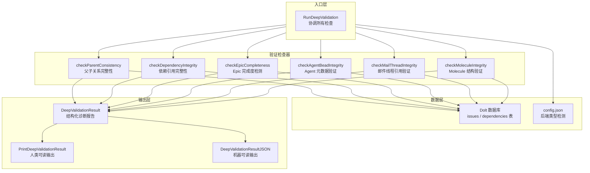

# 深度验证 (Deep Validation)

## 概述

想象你正在维护一个庞大的任务管理系统，其中包含成千上万的 Issue、依赖关系、Epic 层级结构、Agent Bead 元数据，以及复杂的 Molecule 组合。随着时间推移，数据会"腐烂"——删除的 Issue 留下的悬空依赖、状态不一致的 Agent、结构破损的 Molecule。**深度验证模块**就是这个系统的"核磁共振成像仪"：它不满足于表面健康检查，而是深入数据库内部，逐层扫描 Issue 图的语义完整性，发现那些普通查询无法察觉的结构性问题。

这个模块存在的根本原因是：**引用完整性无法仅靠数据库外键约束保证**。Beads 系统使用 Dolt（版本化 SQL 数据库）存储 Issue 和依赖关系，但依赖关系是应用层语义（如 `parent-child`、`blocks`、`attests` 等），而非数据库 schema 强制的外键。当 Issue 被删除、迁移或合并时，依赖记录可能残留，形成"僵尸引用"。深度验证通过执行一系列语义感知的 SQL 查询，系统性地发现并报告这些问题，为后续的自动修复提供精确的诊断输入。

## 架构设计



### 数据流 walkthrough

1. **入口协调**：`RunDeepValidation(path)` 接收 beads 仓库路径，首先通过 [配置文件](configuration.md) 检测后端类型（Dolt vs SQLite）。只有 Dolt 后端才执行深度验证，因为 SQLite 后端使用不同的 schema。

2. **数据库连接**：解析 `.beads` 目录重定向，打开 Dolt SQL 连接。这里使用标准 `database/sql` 接口，而非 Dolt 专有 API，保持与 [存储层](storage_interfaces.md) 的松耦合。

3. **并行无关的检查序列**：六个检查函数按固定顺序执行，每个都是独立的 SQL 查询。它们之间没有数据依赖，但共享同一个数据库连接。这种设计牺牲了潜在的并行性，换取了实现简单性和错误隔离——单个检查失败不会阻塞其他检查。

4. **结果聚合**：每个检查返回一个 `DoctorCheck` 结构（定义在 [诊断核心](诊断核心.md)），包含状态（OK/Warning/Error）、消息、详情和修复建议。`RunDeepValidation` 聚合所有检查结果，计算 `OverallOK` 标志，并填充 `TotalIssues` 和 `TotalDependencies` 用于进度报告。

5. **输出分发**：调用者可选择人类可读的 `PrintDeepValidationResult`（CLI 输出）或机器可读的 `DeepValidationResultJSON`（供其他工具消费，如 MCP 集成）。

## 组件深度解析

### `DeepValidationResult` 结构

**设计意图**：作为深度验证的"诊断报告单"，这个结构将所有检查结果打包成一个可序列化、可聚合的单元。它采用**结果对象模式**（Result Object Pattern），而非通过返回值 + 错误码的传统方式，原因是：
- 需要同时返回多个独立检查的结果（不是单一成功/失败）
- 需要保留每个检查的详细信息（消息、详情、修复建议）
- 需要支持 JSON 序列化供外部工具消费

```go
type DeepValidationResult struct {
    ParentConsistency   DoctorCheck   `json:"parent_consistency"`
    DependencyIntegrity DoctorCheck   `json:"dependency_integrity"`
    EpicCompleteness    DoctorCheck   `json:"epic_completeness"`
    AgentBeadIntegrity  DoctorCheck   `json:"agent_bead_integrity"`
    MailThreadIntegrity DoctorCheck   `json:"mail_thread_integrity"`
    MoleculeIntegrity   DoctorCheck   `json:"molecule_integrity"`
    AllChecks           []DoctorCheck `json:"all_checks"`
    TotalIssues         int           `json:"total_issues"`
    TotalDependencies   int           `json:"total_dependencies"`
    OverallOK           bool          `json:"overall_ok"`
}
```

**字段语义**：
- 六个具名字段：每个对应一个检查函数，便于代码直接访问特定检查结果（如 `if result.ParentConsistency.Status == StatusError { ... }`）
- `AllChecks` 切片：冗余存储所有检查，便于迭代输出和 JSON 序列化时保持数组顺序
- `TotalIssues` / `TotalDependencies`：元数据，用于在输出中显示扫描范围（"Scanned: 1234 issues, 5678 dependencies"），帮助用户理解检查的覆盖度
- `OverallOK`：快速判断标志，由协调逻辑在聚合时计算（任何检查返回 Error 即为 false）

**设计权衡**：这里存在**冗余 vs 便利**的张力。`AllChecks` 与六个具名字段内容重复，但这种设计：
- ✅ 优点：支持两种访问模式——按名称直接访问（类型安全）和迭代访问（便于输出循环）
- ❌ 缺点：如果未来添加新检查，需要同时更新具名字段和聚合逻辑，存在不一致风险

### `RunDeepValidation` 函数

**职责**：深度验证的**编排器**（Orchestrator）。它不执行具体检查逻辑，而是负责：
1. 环境探测（后端类型、数据库存在性）
2. 资源管理（数据库连接打开/关闭）
3. 检查调度（按顺序调用六个检查函数）
4. 结果聚合（收集检查结果，计算总体状态）

**关键设计决策**：

#### 1. 后端类型门控
```go
if backend != configfile.BackendDolt {
    // 返回 Warning，建议迁移到 Dolt
    return result
}
```
深度验证**仅支持 Dolt 后端**。这是因为检查逻辑依赖 Dolt 的特定 schema（如 `issues` 表、`dependencies` 表、`notes` JSON 字段）。SQLite 后端使用不同的数据结构，强行执行会导致 SQL 错误。这里选择**显式拒绝**而非**静默跳过**，通过返回 Warning 引导用户迁移到推荐的后端。

#### 2. 优雅降级策略
```go
_ = db.QueryRow("SELECT COUNT(*) FROM issues").Scan(&result.TotalIssues)
// 注释：Best effort: zero counts are safe defaults for diagnostic display
```
计数查询失败不会中断验证流程。这是**诊断工具的核心设计原则**：尽可能多地报告信息，即使部分数据不可用。零计数是安全的默认值，仅影响输出美观，不影响检查逻辑。

#### 3. 错误传播模式
```go
result.ParentConsistency = checkParentConsistency(db)
result.AllChecks = append(result.AllChecks, result.ParentConsistency)
if result.ParentConsistency.Status == StatusError {
    result.OverallOK = false
}
```
每个检查独立执行，错误不传播（不 `return`），而是通过 `Status` 字段标记。`OverallOK` 在所有检查完成后反映整体健康状态。这种设计允许**部分成功**——即使某些检查失败，用户仍能获得其他检查的结果。

### `checkParentConsistency` 函数

**问题空间**：父子依赖（`parent-child` 类型）是 Beads 系统的核心抽象，用于构建 Issue 层级树（如 Epic → Story → Task）。当子 Issue 或父 Issue 被删除时，依赖记录可能残留，形成"孤儿依赖"。

**SQL 策略**：
```sql
SELECT d.issue_id, d.depends_on_id
FROM dependencies d
WHERE d.type = 'parent-child'
  AND (
    NOT EXISTS (SELECT 1 FROM issues WHERE id = d.issue_id)
    OR NOT EXISTS (SELECT 1 FROM issues WHERE id = d.depends_on_id)
  )
LIMIT 10
```
使用 `NOT EXISTS` 而非 `LEFT JOIN ... WHERE ... IS NULL` 的原因是：
- **性能**：`NOT EXISTS` 在找到第一个匹配项后即可短路，适合"存在性检查"场景
- **语义清晰**：直接表达"不存在对应的 Issue"这一意图
- **LIMIT 保护**：限制返回 10 条，避免在大规模数据损坏时查询阻塞或输出爆炸

**输出策略**：仅展示前 3 个示例（`orphanedDeps[:min(3, len(orphanedDeps))]`），而非全部。这是**用户体验权衡**：
- ✅ 避免终端输出被数百条错误淹没
- ✅ 提供足够样本让用户理解问题性质
- ❌ 用户无法从输出中获知完整修复范围（需依赖 `bd doctor --fix` 自动处理）

### `checkDependencyIntegrity` 函数

**与 `checkParentConsistency` 的区别**：
| 维度 | ParentConsistency | DependencyIntegrity |
|------|-------------------|---------------------|
| 检查范围 | 仅 `parent-child` 类型 | 所有依赖类型 |
| 严重性 | Error | Error |
| 修复命令 | `bd doctor --fix` | `bd repair-deps` |

**设计洞察**：为什么需要两个独立的检查？因为 `parent-child` 是**结构性依赖**（影响 Issue 树遍历、Molecule 展开等核心逻辑），而其他依赖类型（如 `blocks`、`attests`）是**语义性依赖**（主要用于查询和展示）。分开检查允许：
1. 更精确的错误分类（用户知道是层级结构问题还是一般依赖问题）
2. 不同的修复策略（父子依赖可能需要特殊处理）

### `checkEpicCompleteness` 函数

**独特之处**：这是唯一一个返回 `StatusWarning` 而非 `StatusError` 的检查。原因是：
- **不是数据损坏**：Epic 的所有子 Issue 已关闭，但 Epic 本身未关闭，这是**状态不一致**，而非引用完整性问题
- **建议性而非强制性**：系统可以正常运行，但用户可能希望关闭已完成的 Epic 以保持看板整洁

**SQL 聚合逻辑**：
```sql
SELECT e.id, e.title,
       COUNT(c.id) as total_children,
       SUM(CASE WHEN c.status = 'closed' THEN 1 ELSE 0 END) as closed_children
FROM issues e
JOIN dependencies d ON d.depends_on_id = e.id AND d.type = 'parent-child'
JOIN issues c ON c.id = d.issue_id
WHERE e.issue_type = 'epic'
  AND e.status != 'closed'
GROUP BY e.id
HAVING total_children > 0 AND total_children = closed_children
LIMIT 20
```
这个查询的核心是 `HAVING` 子句：筛选出"子 Issue 总数 = 已关闭子 Issue 数"的 Epic。使用 `SUM(CASE ...)` 而非 `COUNT(IF ...)` 是为了兼容不同 SQL 方言。

### `checkAgentBeadIntegrity` 函数

**最复杂的检查**：涉及 JSON 解析、schema 探测、回退策略。

#### Schema 探测
```go
var hasNotes bool
err := db.QueryRow(`
    SELECT COUNT(*) > 0 FROM INFORMATION_SCHEMA.COLUMNS
    WHERE TABLE_SCHEMA = DATABASE() AND TABLE_NAME = 'issues' AND COLUMN_NAME = 'notes'
`).Scan(&hasNotes)
```
**为什么需要探测**：`notes` 字段是可选的，用于存储 Agent Bead 的元数据（`role_bead`、`agent_state`、`role_type`）。旧版本 schema 或手动创建的数据库可能没有这个字段。直接查询会导致 SQL 错误。

#### JSON 提取与回退
```go
query := `
    SELECT id, title,
           COALESCE(JSON_UNQUOTE(JSON_EXTRACT(notes, '$.role_bead')), '') as role_bead,
           ...
    FROM issues
    WHERE issue_type = 'agent'
    LIMIT 100`

rows, err := db.Query(query)
if err != nil {
    // 回退到不提取 JSON 的简化查询
    query = `SELECT id, title, '', '', '' FROM issues WHERE issue_type = 'agent' LIMIT 100`
    rows, err = db.Query(query)
    ...
}
```
**双重回退策略**：
1. 首先尝试完整 JSON 提取（获取所有元数据字段）
2. 如果失败（可能是 JSON 函数不支持或 `notes` 列不存在），回退到仅获取 `id` 和 `title`
3. 如果仍失败，返回 OK（"No agent beads found"）

这种设计体现了**诊断工具的鲁棒性优先**：宁可少报告，也不要因自身错误中断流程。

#### AgentState 验证
```go
state := types.AgentState(agent.AgentState)
if !state.IsValid() {
    invalidAgents = append(invalidAgents, fmt.Sprintf("%s (invalid state: %s)", agent.ID, agent.AgentState))
}
```
这里依赖 [核心领域类型](issue_domain_model.md) 中的 `AgentState.IsValid()` 方法。这是一个**跨模块契约**：深度验证假设 `AgentState` 枚举定义了所有合法状态，任何不在枚举中的值都是损坏数据。

### `checkMailThreadIntegrity` 函数

**特定领域检查**：验证 `dependencies.thread_id` 字段引用的 Issue 是否存在。这个字段用于将依赖关系与邮件线程关联（Beads 的邮件集成功能）。

**与一般依赖检查的区别**：
- `thread_id` 是**可选引用**（可以为空），而非必需外键
- 仅当 `thread_id != '' AND thread_id IS NOT NULL` 时才检查
- 返回 `StatusWarning` 而非 `Error`（因为不影响核心功能）

**聚合统计**：
```go
SELECT d.thread_id, COUNT(*) as refs
...
GROUP BY d.thread_id
```
按 `thread_id` 分组统计引用次数，帮助用户理解影响范围（一个孤儿线程可能被多个依赖引用）。

### `checkMoleculeIntegrity` 函数

**最复杂的结构验证**：Molecule 是 Beads 的核心抽象，代表可组合的工作单元。一个 Molecule 由多个 Bead 通过 `parent-child` 依赖组成 DAG。

**两阶段验证**：
1. **发现 Molecule**：通过 `issue_type = 'molecule'` 或 `label = 'beads:template'` 识别
2. **验证子节点存在性**：对每个 Molecule，检查其所有 `parent-child` 依赖的子 Issue 是否存在

```go
for _, mol := range molecules {
    var orphanCount int
    err := db.QueryRow(`
        SELECT COUNT(*)
        FROM dependencies d
        WHERE d.depends_on_id = ?
          AND d.type = 'parent-child'
          AND NOT EXISTS (SELECT 1 FROM issues WHERE id = d.issue_id)
    `, mol.ID).Scan(&orphanCount)
    ...
}
```

**性能考量**：这里使用**逐 Molecule 查询**而非单一大查询，原因是：
- ✅ 简化逻辑（每个 Molecule 独立计数）
- ✅ 便于定位具体哪个 Molecule 有问题
- ❌ N+1 查询问题（100 个 Molecule = 101 次查询）

这是一个**可读性优先于性能**的选择。深度验证是低频操作（用户手动触发），且 Molecule 数量通常有限（<100），因此 N+1 问题可接受。

### `moleculeInfo` 和 `agentBeadInfo` 结构

**私有辅助结构**：仅用于内部数据传递，不导出。

```go
type moleculeInfo struct {
    ID         string
    Title      string
    ChildCount int  // 注意：实际代码中未使用此字段
}

type agentBeadInfo struct {
    ID         string
    Title      string
    RoleBead   string
    AgentState string
    RoleType   string
}
```

**设计观察**：`moleculeInfo.ChildCount` 字段在定义中存在，但在实际扫描逻辑中未使用（查询仅返回 `id` 和 `title`）。这是一个**遗留字段**，可能是早期设计迭代留下的。建议在未来重构中移除，避免误导维护者。

## 依赖关系分析

### 上游依赖（被谁调用）

深度验证模块是 [诊断核心](诊断核心.md) 的子模块，通过 `RunDeepValidation` 函数被 `bd doctor` 命令调用：

```
bd doctor 命令
    └── 诊断核心 (cmd.bd.doctor.types)
        └── 深度验证 (cmd.bd.doctor.deep) ← 本模块
```

调用者期望：
1. **非阻塞**：验证不应修改数据库（只读查询）
2. **完整报告**：即使部分检查失败，也应返回其他检查结果
3. **可序列化**：支持 JSON 输出供 MCP 集成消费

### 下游依赖（调用谁）

| 被调用模块 | 用途 | 耦合强度 |
|-----------|------|---------|
| [配置文件](configuration.md) (`internal/configfile`) | 检测后端类型（Dolt vs SQLite） | 弱耦合（仅调用 `Load` 和 `GetBackend`） |
| [核心领域类型](issue_domain_model.md) (`internal/types`) | 验证 `AgentState` 枚举值 | 弱耦合（仅调用 `IsValid()` 方法） |
| [诊断核心](诊断核心.md) (`DoctorCheck`) | 返回检查结果结构 | 强耦合（直接依赖 `DoctorCheck` 结构定义） |
| Dolt SQL 驱动 | 执行验证查询 | 中耦合（依赖标准 `database/sql` 接口，但查询针对 Dolt schema） |

### 数据契约

**输入**：
- `path string`：Beads 仓库根目录路径（包含 `.beads` 子目录）

**输出**：
- `DeepValidationResult`：结构化诊断报告
- JSON 字节流（通过 `DeepValidationResultJSON`）

**隐式契约**：
1. 数据库 schema 必须符合预期（`issues` 表、`dependencies` 表、可选的 `notes` 列和 `thread_id` 列）
2. `AgentState` 枚举必须定义 `IsValid()` 方法
3. `DoctorCheck` 结构必须包含 `Status`、`Message`、`Detail`、`Fix` 字段

## 设计决策与权衡

### 1. 只读验证 vs 自动修复

**选择**：深度验证仅报告问题，不执行修复。

**理由**：
- **职责分离**：验证是诊断，修复是治疗。混合两者会导致：
  - 难以测试（验证逻辑依赖修复副作用）
  - 用户失去控制权（可能不希望立即修复）
  - 错误传播复杂（修复失败如何影响验证结果？）
- **可组合性**：分离后，用户可以：
  - 先运行验证，审查报告
  - 再决定是否运行修复
  - 或编写自定义修复脚本

**替代方案**：某些系统（如 `fsck`）提供 `-y` 标志自动确认修复。Beads 选择通过 `bd doctor --fix` 命令显式触发修复，保持验证和修复的清晰边界。

### 2. 固定检查集合 vs 插件化检查

**选择**：六个检查函数硬编码在 `RunDeepValidation` 中，而非通过插件系统注册。

**理由**：
- **简单性优先**：检查数量固定且有限（6 个），插件系统会增加复杂度
- **编译时保证**：硬编码确保所有检查都被执行，无遗漏风险
- **性能可预测**：无动态加载开销

**扩展点**：未来如需添加新检查，应：
1. 添加新的 `checkXxx` 函数
2. 在 `DeepValidationResult` 中添加对应字段
3. 在 `RunDeepValidation` 中调用并聚合

这是一个**显式优于隐式**的设计。

### 3. SQL 查询 vs 应用层遍历

**选择**：所有检查通过 SQL 查询实现，而非在 Go 代码中遍历 Issue 图。

**理由**：
- **性能**：数据库引擎优化了连接和存在性检查，应用层遍历需要加载全部数据到内存
- **原子性**：单个 SQL 查询在事务快照中执行，避免并发修改导致的不一致
- **简洁性**：SQL 表达存在性检查更直观（`NOT EXISTS` vs 多层嵌套循环）

**代价**：
- **数据库锁定**：长查询可能阻塞其他操作（但 Dolt 支持 MVCC，影响有限）
- **Schema 耦合**：查询硬编码表名和列名，schema 变更需同步更新查询

### 4. LIMIT 保护 vs 完整报告

**选择**：所有查询使用 `LIMIT`（10 或 20 或 100），输出仅展示前 3-5 个示例。

**理由**：
- **用户体验**：终端输出不应被数百行错误淹没
- **性能保护**：大规模数据损坏时，避免查询返回数万行
- **修复策略**：修复命令（如 `bd repair-deps`）应处理所有问题，而非仅报告的问题

**风险**：用户可能低估问题规模。缓解措施：
- 在消息中报告总数（"Found 123 broken dependencies"）
- 在详情中说明"Examples: ..."，暗示还有更多

### 5. 错误等级划分（Error vs Warning vs OK）

**策略**：
| 检查 | 典型状态 | 理由 |
|------|---------|------|
| ParentConsistency | Error | 父子关系破损影响核心功能 |
| DependencyIntegrity | Error | 依赖引用破损影响图遍历 |
| EpicCompleteness | Warning | 状态不一致，但不影响功能 |
| AgentBeadIntegrity | Error | Agent 元数据破损可能导致运行时错误 |
| MailThreadIntegrity | Warning | 邮件线程引用可选，不影响核心功能 |
| MoleculeIntegrity | Error | Molecule 结构破损影响工作流执行 |

**设计洞察**：错误等级反映**对系统功能的影响程度**，而非"数据损坏的严重性"。这是一个**用户中心**的设计：帮助用户优先处理最关键的问题。

## 使用指南

### 基本用法

```bash
# 运行深度验证（只读，不修改数据）
bd doctor --deep

# 查看 JSON 输出（供脚本消费）
bd doctor --deep --json | jq '.parent_consistency'
```

### 解读输出

```
Deep Validation Results
========================
Scanned: 1234 issues, 5678 dependencies

[✓] Parent Consistency: All parent-child relationships valid
[✗] Dependency Integrity: Found 3 broken dependencies
    Examples: ISSUE-123→ISSUE-456 (blocks), ISSUE-789→ISSUE-000 (attests)
    Fix: Run 'bd repair-deps' to remove broken dependencies
[!] Epic Completeness: Found 2 epics ready to close
    Examples: EPIC-1 (5/5), EPIC-2 (3/3)
    Fix: Run 'bd close <epic-id>' to close completed epics
...

Some checks failed. See details above.
```

**符号含义**：
- `✓`：OK（检查通过）
- `!`：Warning（建议关注，但不影响功能）
- `✗`：Error（需要修复）

### 与修复命令配合

```bash
# 1. 先运行验证，了解问题
bd doctor --deep

# 2. 根据建议运行修复
bd repair-deps          # 修复破损依赖
bd close EPIC-1         # 关闭已完成的 Epic

# 3. 再次验证，确认修复
bd doctor --deep
```

### 在脚本中使用

```python
import subprocess
import json

result = subprocess.run(
    ["bd", "doctor", "--deep", "--json"],
    capture_output=True,
    text=True
)
report = json.loads(result.stdout)

if not report["overall_ok"]:
    for check in report["all_checks"]:
        if check["status"] == "error":
            print(f"Critical: {check['name']} - {check['message']}")
    exit(1)
```

## 边界情况与陷阱

### 1. SQLite 后端不支持

**现象**：运行深度验证时返回 Warning："SQLite backend detected"。

**原因**：深度验证的 SQL 查询针对 Dolt schema 编写，SQLite 后端使用不同的表结构。

**解决方案**：运行 `bd migrate --to-dolt` 迁移到 Dolt 后端，或跳过深度验证。

### 2. 数据库不存在

**现象**：返回 OK，消息为 "N/A (no database)"。

**原因**：`.beads/dolt` 目录不存在，可能是新初始化的仓库。

**影响**：无害，但用户可能误以为验证通过。注意区分 "N/A" 和 "All checks passed"。

### 3. JSON 函数不可用

**现象**：Agent Bead 检查返回 OK，消息为 "No agent beads to validate"，但实际存在 Agent Issue。

**原因**：Dolt 版本过旧，不支持 `JSON_EXTRACT` 函数，查询回退失败。

**解决方案**：升级 Dolt，或手动检查 `issues` 表中 `issue_type = 'agent'` 的记录。

### 4. N+1 查询性能问题

**现象**：Molecule 数量多时（>1000），验证耗时显著增加。

**原因**：`checkMoleculeIntegrity` 对每个 Molecule 执行独立查询。

**缓解措施**：
- 深度验证是低频操作，通常可接受
- 如需优化，可重构为单一大查询（但会增加 SQL 复杂度）

### 5. 并发修改导致的不一致

**现象**：验证过程中，其他进程修改了数据库，导致结果不准确。

**原因**：Dolt 支持 MVCC，但深度验证未使用显式事务快照。

**影响**：罕见，因为验证是只读查询，且执行时间短。如需强一致性，应在验证前停止其他写入操作。

### 6. 遗留字段误导

**注意**：`moleculeInfo.ChildCount` 字段未使用，是遗留代码。维护者不应依赖此字段。

## 与其他模块的关系

- **[诊断核心](诊断核心.md)**：深度验证是诊断系统的子模块，`DoctorCheck` 结构由诊断核心定义
- **[配置文件](configuration.md)**：用于检测后端类型，决定是否可以执行深度验证
- **[核心领域类型](issue_domain_model.md)**：`AgentState.IsValid()` 方法用于验证 Agent 元数据
- **[存储接口](storage_interfaces.md)**：通过标准 `database/sql` 接口访问 Dolt，保持松耦合
- **[MCP 集成](mcp 集成.md)**：`DeepValidationResultJSON` 输出可被 MCP 工具消费，供 AI 助手分析仓库健康状态

## 扩展指南

### 添加新的检查

1. **定义检查函数**：
```go
func checkXxxIntegrity(db *sql.DB) DoctorCheck {
    check := DoctorCheck{
        Name:     "Xxx Integrity",
        Category: CategoryMetadata,
    }
    // 执行 SQL 查询...
    // 设置 check.Status, check.Message, check.Detail, check.Fix
    return check
}
```

2. **添加到 `DeepValidationResult`**：
```go
type DeepValidationResult struct {
    // ... 现有字段 ...
    XxxIntegrity DoctorCheck `json:"xxx_integrity"`
}
```

3. **在 `RunDeepValidation` 中调用**：
```go
result.XxxIntegrity = checkXxxIntegrity(db)
result.AllChecks = append(result.AllChecks, result.XxxIntegrity)
if result.XxxIntegrity.Status == StatusError {
    result.OverallOK = false
}
```

4. **更新 `PrintDeepValidationResult`**（可选，因为迭代 `AllChecks` 会自动包含）

### 修改现有检查

**向后兼容**：修改 SQL 查询或验证逻辑时，确保：
- 不改变 `DoctorCheck` 的返回结构（字段名和类型）
- 不改变错误等级（Error/Warning/OK），除非有充分理由
- 在提交消息中说明变更原因

## 总结

深度验证模块是 Beads 系统的**数据健康守护者**。它通过一系列语义感知的 SQL 查询，系统性地发现 Issue 图中的结构性问题，为用户提供精确的诊断报告和修复建议。其设计核心是**只读、非阻塞、可组合**，确保验证过程本身不会引入新的问题，同时为后续修复提供可靠输入。

关键设计原则：
1. **诊断与治疗分离**：验证只报告，不修复
2. **部分成功优于完全失败**：单个检查失败不影响其他检查
3. **用户体验优先**：限制输出长度，提供修复建议
4. **Schema 探测与回退**：优雅处理不同版本的数据库结构
5. **显式优于隐式**：硬编码检查集合，而非插件系统

理解这个模块的关键是认识到：**引用完整性是应用层责任，而非数据库责任**。深度验证填补了这一空白，确保 Beads 的 Issue 图始终保持语义一致。
