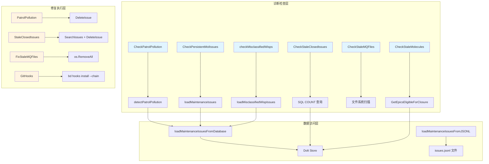

# 维护与修复模块

## 模块概述

**维护与修复**模块是 `bd doctor` 命令的核心诊断组件，专注于识别和清理数据库中的"污染"数据、过期的临时文件，以及确保 Git Hooks 的正确集成。想象一下，这个模块就像是数据库的"清洁工"和"体检医生"——它定期巡查系统，找出那些本应被清理却意外残留的数据，并提供自动化的修复方案。

这个模块存在的根本原因是：**在复杂的开发工作流中，临时数据、过期记录和配置漂移是不可避免的**。如果没有自动化的维护机制，这些问题会逐渐累积，导致数据库膨胀、查询变慢，甚至影响核心功能的正确性。

### 核心职责

1. **污染检测与清理**：识别并删除本应是临时的数据（如 patrol digest、session beads）
2. **过期数据管理**：发现并清理已关闭的旧 issue 和完成的 molecule
3. **遗留文件清理**：删除旧版本留下的临时文件（如 merge queue 文件）
4. **Git Hooks 集成验证**：确保外部 Hook 管理器（lefthook、husky、pre-commit 等）正确集成了 `bd hooks run`

---

## 架构概览



**数据流说明**：
1. **诊断阶段**（蓝色节点）：各种 `Check*` 函数通过不同的数据源（Dolt 数据库、JSONL 文件、文件系统）扫描问题
2. **修复阶段**（橙色节点）：对应的 `Fix*` 函数执行实际的清理操作，通过 `DeleteIssue` 或直接文件系统操作
3. **数据访问层**：提供统一的 issue 加载接口，优先使用 Dolt 数据库，降级到 JSONL 文件作为兼容层

---

## 关键设计决策

### 1. 时间阈值 vs 数据库大小阈值

**决策**：当前使用基于时间的阈值（`stale_closed_issues_days`），但代码注释明确指出这是"粗略的代理"。

**为什么这样选择**：
- **简单性**：时间阈值易于理解和配置
- **可预测性**：用户可以明确知道"30 天前的关闭 issue 会被清理"

**权衡**：
- ❌ **问题**：100 个 5 年前的关闭 issue 不需要清理，但 50,000 个昨天的关闭 issue 可能需要
- ✅ **未来方向**：代码注释建议添加 `max_database_size_mb` 配置，基于实际数据库大小触发清理

**对新贡献者的启示**：如果你看到这个模块的性能问题，考虑实现基于大小的阈值，而不是单纯依赖时间。

### 2. SQL COUNT 查询 vs 全量加载

**决策**：使用 `SELECT COUNT(*)` 而非加载所有 issue 到内存。

**为什么这样选择**：
- **性能**：旧方法通过 `SearchIssues` 加载每个关闭的 issue，在大型数据库上"灾难性地慢"（~23k issues 需要 57 秒）
- **内存效率**：COUNT 查询只返回一个数字，避免 OOM 风险

**代码证据**：
```go
// 使用 SQL COUNT 查询而非加载所有 issue 到内存
err := db.QueryRow("SELECT COUNT(*) FROM issues WHERE status = 'closed'").Scan(&closedCount)
```

### 3. Dolt 优先，JSONL 降级

**决策**：`loadMaintenanceIssues` 函数优先从 Dolt 数据库加载，失败后降级到 JSONL 文件。

**为什么这样选择**：
- **单一事实来源**：Dolt 是当前的权威存储
- **向后兼容**：保留 JSONL 读取能力以支持旧数据迁移

**潜在风险**：
- 如果 Dolt 和 JSONL 数据不一致，可能导致诊断结果不准确
- 降级逻辑增加了代码复杂性和测试难度

### 4. Git Hooks 的链式安装

**决策**：当检测到外部 Hook 管理器时，使用 `--chain` 参数安装 hooks。

**为什么这样选择**：
- **尊重现有工具链**：不覆盖用户已配置的 lefthook、husky 等
- **渐进式集成**：允许 `bd hooks` 与其他工具共存

**代码证据**：
```go
if len(externalManagers) > 0 {
    args = append(args, "--chain")
}
```

---

## 子模块摘要

本模块包含三个紧密协作的子模块，分别负责诊断、Hook 集成验证和清理执行：

### [诊断核心](诊断核心.md)

**职责**：实现各种维护检查逻辑，返回 `DoctorCheck` 结构。

**关键组件**：
- `patrolPollutionResult`：存储污染检测结果（计数 + 样本 ID）
- `CheckStaleClosedIssues`：检测超过阈值的已关闭问题
- `CheckStaleMolecules`：检测已完成但未关闭的 molecule（epic）
- `CheckPersistentMolIssues`：检测应临时但持久化的 mol- 前缀问题
- `checkMisclassifiedWisps`：检测缺少 ephemeral 标记的 wisp 问题
- `CheckPatrolPollution`：检测 patrol 摘要和会话结束标记
- `CheckStaleMQFiles`：检测遗留的合并队列文件

**详细文档**：[诊断核心](诊断核心.md)

### [Hook 集成检测与修复](hook 集成检测与修复.md)

**职责**：检测外部 Hook 管理器（lefthook、husky、pre-commit 等），检查 bd 集成状态，修复 Git Hooks。

**关键组件**：
- `hookManagerConfig`：定义外部 Hook 管理器的配置文件名列表
- `ExternalHookManager`：表示检测到的外部 Hook 管理器
- `hookManagerPattern`：定义 Git Hook 文件中的管理器签名模式
- `HookIntegrationStatus`：描述 bd 与外部 Hook 管理器的集成状态
- `DetectExternalHookManagers`：扫描配置文件检测管理器
- `DetectActiveHookManager`：读取 Git Hook 文件确定活跃管理器
- `CheckLefthookBdIntegration`：解析 lefthook 配置检查 bd 集成
- `CheckPrecommitBdIntegration`：解析 pre-commit 配置检查 bd 集成
- `CheckHuskyBdIntegration`：检查 .husky/ 脚本中的 bd 集成
- `GitHooks`：执行 `bd hooks install` 命令修复 hooks（支持 `--chain` 保留外部 hooks）

**详细文档**：[Hook 集成检测与修复](hook 集成检测与修复.md)

### [维护清理执行](维护清理执行.md)

**职责**：实现具体的清理操作，删除检测到的污染数据。

**关键组件**：
- `cleanupResult`：存储清理操作结果（删除数、跳过数）
- `StaleClosedIssues`：删除超过阈值的已关闭问题（跳过 pinned 问题）
- `PatrolPollution`：删除 patrol 摘要和会话结束标记
- `FixStaleMQFiles`：删除 `.beads/mq/` 目录

**详细文档**：[维护清理执行](维护清理执行.md)

---

## 跨模块依赖

本模块与系统中多个核心模块紧密协作：

### 与 [诊断核心](诊断核心.md) 的关系

本模块是诊断核心模块的子模块，专注于"维护与修复"类别的检查。诊断核心模块定义了 `DoctorCheck` 和 `DoctorResult` 结构，本模块使用这些结构返回检查结果。

### 与 [Dolt 存储后端](dolt 存储后端.md) 的关系

本模块依赖 Dolt 存储后端进行数据读取和删除操作：
- `dolt.NewFromConfig`：打开数据库连接
- `store.SearchIssues`：查询问题
- `store.DeleteIssue`：删除问题
- `store.GetEpicsEligibleForClosure`：查询可关闭的 epic

### 与 [配置引擎](配置引擎.md) 的关系

本模块读取 `metadata.json` 配置：
- `cfg.GetStaleClosedIssuesDays()`：获取关闭问题清理阈值
- `cfg.GetBackend()`：确定后端类型（Dolt/SQLite）

### 与 Git Hooks 模块的关系

本模块调用 `bd hooks install` 命令修复 Git Hooks，通过 `exec.Command` 执行外部命令。当检测到外部 Hook 管理器时，使用 `--chain` 参数保留现有 hooks。

---

## 使用指南

### 运行诊断检查

```bash
# 运行所有检查
bd doctor

# 仅运行维护相关检查
bd doctor --category maintenance
```

### 执行自动修复

```bash
# 自动修复所有可修复的问题
bd doctor --fix

# 仅修复 Git Hooks
bd doctor --fix hooks
```

### 配置阈值

在 `.beads/metadata.json` 中配置：

```json
{
  "stale_closed_issues_days": 30,
  "backend": "dolt"
}
```

---

## 注意事项与陷阱

### ⚠️ 1. 清理操作不可逆

**问题**：`DeleteIssue` 操作是永久性的，没有回收站机制。

**缓解措施**：
- 清理前会打印预览信息
- pinned issue 会被跳过
- 建议先运行 `bd doctor`（不带 `--fix`）查看将要删除的内容

### ⚠️ 2. Dolt 后端的特殊处理

**问题**：某些清理功能（如 `StaleClosedIssues`）在 Dolt 后端被跳过。

**原因**：代码注释说明这是"SQLite 特定的优化"，Dolt 以不同方式处理数据管理。

**影响**：使用 Dolt 后端的用户需要手动管理过期 issue。

### ⚠️ 3. 阈值配置的隐式行为

**问题**：`stale_closed_issues_days=0` 表示"禁用"，而非"立即清理"。

**代码证据**：
```go
if thresholdDays == 0 {
    // 检查是否存在大量关闭 issue 并警告
    if closedCount < largeClosedIssuesThreshold {
        return StatusOK, "Disabled (set stale_closed_issues_days to enable)"
    }
}
```

**建议**：在文档中明确说明这个隐式约定。

### ⚠️ 4. 外部 Hook 管理器的检测优先级

**问题**：当多个 Hook 管理器共存时，检测顺序影响结果。

**优先级顺序**（在 `hookManagerPatterns` 中定义）：
1. lefthook
2. husky
3. prek（必须在 pre-commit 之前）
4. pre-commit
5. simple-git-hooks

**为什么 prek 在 pre-commit 之前**：prek 是 pre-commit 的 Rust 替代品，使用相同配置文件但更快的实现。

---

## 扩展点

### 添加新的诊断检查

1. 在 `maintenance.go` 中实现 `Check*` 函数，返回 `DoctorCheck` 结构
2. 遵循现有模式：先检查数据源可用性，再执行检测逻辑
3. 提供清晰的 `Fix` 字段说明如何修复

### 添加新的修复处理器

1. 在 `fix/maintenance.go` 或 `fix/hooks.go` 中实现修复函数
2. 函数签名：`func <Name>(path string) error`
3. 使用 `validateBeadsWorkspace` 验证工作区
4. 打印操作结果到 stdout

### 支持新的 Hook 管理器

1. 在 `hookManagerConfigs` 中添加管理器配置
2. 在 `hookManagerPatterns` 中添加检测正则
3. 实现 `Check<Manager>BdIntegration` 函数
4. 在 `checkManagerBdIntegration` 的 switch 中添加 case

---

## 性能考虑

### 查询优化

- **避免 N+1 查询**：使用批量操作而非循环删除
- **使用索引**：`status`、`closed_at`、`ephemeral` 字段应有索引
- **限制结果集**：只加载必要的字段（如 misclassified wisps 只加载 ID）

### 内存管理

- **流式处理**：JSONL 解码使用流式而非全量加载
- **早期退出**：检测到问题达到阈值后立即返回，避免不必要的全量扫描

---

## 测试建议

1. **模拟大型数据库**：使用 `largeClosedIssuesThreshold` 变量（非常量）以便测试覆盖
2. **测试降级路径**：确保 JSONL 回退逻辑在 Dolt 不可用时正常工作
3. **Hook 管理器共存**：测试多个管理器同时存在时的检测优先级
4. **边界条件**：测试阈值刚好命中/未命中的情况

---

## 总结

**维护与修复**模块是 Beads 系统的"健康管家"，它通过定期巡检和清理，确保数据库保持整洁、高效。模块的设计体现了以下原则：

- **安全第一**：默认禁用清理，检查与修复分离
- **性能优先**：使用 SQL 聚合查询，避免全量加载
- **灵活配置**：阈值可配置，支持不同团队需求
- **优雅降级**：Dolt 优先，JSONL 回退
- **生态集成**：支持多种外部 Hook 管理器

对于新贡献者，理解这个模块的关键是认识到：**它不是在阻止问题发生，而是在问题积累到不可控之前发出预警并提供清理工具**。这种"预防性维护"的设计哲学，使得 Beads 系统能够在长期使用中保持健康和高效。

---

## 相关文档

- [诊断核心](诊断核心.md) - 父模块，包含 doctor 命令的整体架构
- [诊断核心 - 维护与修复](诊断核心.md#维护与修复) - 本模块在诊断核心中的位置
- [Hook 集成检测与修复](hook 集成检测与修复.md) - Hook 管理器检测与集成验证详解
- [维护清理执行](维护清理执行.md) - 清理操作实现详解
- [Dolt 存储后端](dolt 存储后端.md) - 底层存储实现
- [配置引擎](配置引擎.md) - 配置系统说明
