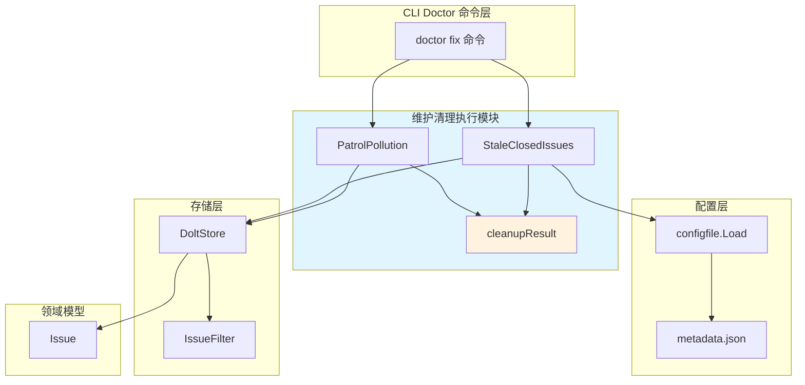

# 维护清理执行

## 概述

想象一下你的数据库是一个不断生长的花园。随着时间推移，枯萎的花朵（已关闭的旧 issue）和落叶（系统临时 beads）会堆积起来，占用空间、降低性能，让真正重要的内容难以被发现。**维护清理执行**模块就是这个花园的园丁 —— 它负责安全、可控地清除这些不再需要的数据，保持数据库的健康和整洁。

这个模块是 `doctor fix` 命令系统的执行层，专门处理两类清理任务：
1. **过期关闭 issue 清理**：删除超过配置阈值的已关闭 issue
2. **巡逻污染清理**：删除系统内部产生的临时 beads（巡逻摘要、会话结束标记）

关键设计洞察是：**清理操作必须是显式配置且可审计的**。默认情况下所有清理功能都是禁用的，用户必须明确设置阈值才能启用。这种"安全优先"的设计防止了意外数据丢失，同时让清理策略成为可版本化的配置决策。

## 架构与数据流



### 组件角色与数据流

**入口点**：`doctor fix` 命令调用清理函数，传入工作区路径。这是整个流程的触发器。

**配置检查层**：清理函数首先加载 `metadata.json` 配置文件，检查后端类型和清理阈值。这是一个关键的防护层 —— 如果后端是 Dolt 或者阈值为 0，清理操作会直接跳过。这种设计将清理策略外置为配置，而不是硬编码的逻辑。

**存储访问层**：使用 `dolt.NewFromConfig` 工厂函数打开数据库连接。这里的关键是工厂函数会根据配置自动选择正确的后端（Dolt 或 SQLite），清理模块不需要关心底层存储细节。

**查询过滤层**：通过 `IssueFilter` 结构体构建查询条件。对于过期 issue 清理，过滤器包含状态（closed）和时间 cutoff（早于阈值日期）；对于污染清理，过滤器排除 ephemeral beads，然后在内存中进行模式匹配。

**执行与报告层**：遍历匹配的 issue，逐个删除并统计结果。删除失败时记录警告但继续处理其他 issue，这种"尽力而为"的策略确保部分失败不会阻塞整个清理过程。最终结果通过 `cleanupResult` 结构体返回，包含删除数量和跳过数量。

## 核心组件详解

### cleanupResult

```go
type cleanupResult struct {
    DeletedCount  int  // 成功删除的 issue 数量
    SkippedPinned int  // 因 pinned 标志被跳过的 issue 数量
}
```

**设计意图**：这个结构体是清理操作的审计记录。它不返回复杂的错误链或详细日志，而是提供两个关键指标：**实际清理了多少**和**保护了多少**。这种设计反映了清理操作的本质 —— 它是一个批处理操作，用户关心的是整体效果，而不是每个 issue 的处理细节。

**使用场景**：当前代码中 `cleanupResult` 主要作为内部返回值，但它的存在为未来的扩展留下了空间。例如，可以添加 `FailedCount` 字段来跟踪删除失败的 issue 数量，或者添加 `SpaceReclaimed` 来估算释放的存储空间。

**注意**：这个结构体目前没有导出（小写开头），这意味着它是模块内部实现细节。如果需要让上层命令（如 `doctor fix`）访问这些统计信息，需要考虑导出它或者提供访问器方法。

### StaleClosedIssues

```go
func StaleClosedIssues(path string) error
```

**解决的问题**：长期运行的项目会积累大量已关闭的 issue。虽然这些 issue 在历史上可能有价值，但大多数在关闭后几个月就不再需要了。它们占用存储空间、拖慢查询速度、让 issue 列表变得杂乱。

**为什么不能简单删除所有关闭的 issue**：
1. **合规性需求**：某些项目需要保留完整的历史记录
2. **知识沉淀**：一些关闭的 issue 包含重要的设计决策讨论
3. **审计追踪**：需要追踪谁在什么时候关闭了什么

**设计洞察**：通过配置阈值（`stale_closed_issues_days`）将决策权交给用户。默认值 0 表示禁用，用户必须显式设置正数天数才能启用清理。这种设计平衡了自动化和可控性。

**内部机制**：
1. **验证工作区**：调用 `validateBeadsWorkspace` 确保路径有效
2. **后端检测**：如果是 Dolt 后端，直接跳过（Dolt 有自己的版本管理机制）
3. **阈值检查**：从配置读取 `stale_closed_issues_days`，0 则禁用
4. **时间计算**：`cutoff = now - thresholdDays`，构建时间边界
5. **查询过滤**：使用 `IssueFilter{Status: closed, ClosedBefore: cutoff}` 查询候选 issue
6. **保护检查**：跳过 `Pinned=true` 的 issue（重要上下文标记）
7. **批量删除**：逐个删除并统计结果

**参数与返回值**：
- `path`: 工作区根目录路径（通常是 git 仓库根目录）
- 返回 `error`: 配置加载失败、数据库打开失败、查询失败等致命错误；单个 issue 删除失败只记录警告

**副作用**：
- 永久删除符合条件的 issue（不可恢复，除非有备份）
- 打印清理统计信息到 stdout
- 不修改配置文件

**关键保护机制**：
- **Pinned 保护**：`Pinned=true` 的 issue 被视为持久化上下文标记，不会被清理。这是为了防止误删重要的设计文档或决策记录。
- **后端感知**：Dolt 后端跳过清理，因为 Dolt 的版本控制机制已经提供了历史管理能力。
- **显式启用**：默认禁用，防止意外数据丢失。

### PatrolPollution

```go
func PatrolPollution(path string) error
```

**解决的问题**：Beads 系统在运行过程中会产生一些内部临时 beads，用于系统协调和状态跟踪。这些 beads 包括：
- **巡逻摘要**（Patrol Digests）：标题格式为 `Digest: mol-*-patrol`，是巡逻 molecule 定期生成的状态摘要
- **会话结束标记**（Session Ended Beads）：标题格式为 `Session ended: *`，标记 Agent 会话的结束

这些 beads 是系统内部实现细节，对用户没有直接价值，但会累积并污染数据库。

**为什么需要专门的清理函数**：这些 beads 不是通过正常的 issue 生命周期创建的，它们没有明确的"过期"时间，也不应该出现在用户的 issue 列表中。如果不定期清理，它们会：
1. 占用存储空间
2. 干扰 issue 统计（总数、状态分布等）
3. 让 issue 搜索和浏览体验变差

**设计洞察**：使用**标题模式匹配**而不是元数据标记来识别污染 beads。这种设计的优点是向后兼容（旧的 beads 没有特殊标记也能被识别），缺点是可能有误匹配的风险（如果用户恰好创建了类似标题的 issue）。

**内部机制**：
1. **全量查询**：获取所有 `ephemeral=false` 的 issue（排除已经是临时的 beads）
2. **模式匹配**：
   - 巡逻摘要：`strings.HasPrefix(title, "Digest: mol-") && strings.HasSuffix(title, "-patrol")`
   - 会话结束：`strings.HasPrefix(title, "Session ended:")`
3. **批量删除**：收集所有匹配的 ID，逐个删除
4. **结果报告**：分别报告两类 beads 的删除数量

**参数与返回值**：
- `path`: 工作区根目录路径
- 返回 `error`: 验证失败、数据库打开失败、查询失败等致命错误

**副作用**：
- 永久删除匹配的污染 beads
- 打印删除统计信息到 stdout

**潜在风险**：
- **误匹配**：如果用户创建了标题符合模式的正常 issue，会被误删。这是一个已知的设计权衡 —— 为了简化实现，牺牲了 100% 的准确性。
- **无保护机制**：与 `StaleClosedIssues` 不同，这个函数不检查 `Pinned` 标志。如果用户 pinned 了一个标题符合模式的 issue，它仍然会被删除。

## 依赖关系分析

### 上游依赖（被谁调用）

**`doctor fix` 命令**：清理函数是 `doctor fix` 命令的执行处理器。当用户运行 `bd doctor fix stale-closed-issues` 或 `bd doctor fix patrol-pollution` 时，命令层调用对应的清理函数。

调用链：
```
cmd.bd.doctor.fix.maintenance.cleanupResult
    ↑
cmd.bd.doctor.maintenance.patrolPollutionResult (诊断结果)
    ↑
cmd.bd.doctor.doctorCheck (检查定义)
    ↑
doctor fix 命令入口
```

**期望契约**：
- 清理函数应该幂等：多次运行不会产生额外副作用（除了第一次删除数据）
- 清理函数应该可中断：中途失败不应该留下不一致状态
- 清理函数应该可审计：输出清晰的统计信息

### 下游依赖（调用谁）

**`configfile.Load`**：加载 `metadata.json` 配置文件。清理模块依赖这个函数获取后端类型和清理阈值。

**契约**：配置文件不存在或格式错误时返回 error；成功时返回 `*Config` 或 nil（表示使用默认值）。

**`dolt.NewFromConfig`**：工厂函数，根据配置创建存储后端实例。清理模块不直接使用 `DoltStore` 构造函数，而是通过工厂函数，这样可以在未来支持多种后端。

**契约**：返回实现 `Storage` 接口的实例；调用者负责调用 `Close()` 释放资源。

**`Storage.SearchIssues`**：查询 issue 列表。清理模块依赖这个方法的过滤能力来减少内存中的数据量。

**契约**：返回匹配的 issue 列表；如果过滤条件无效返回 error。

**`Storage.DeleteIssue`**：删除单个 issue。清理模块对每个候选 issue 调用这个方法。

**契约**：删除成功后返回 nil；如果 issue 不存在或权限不足返回 error。

### 数据契约

**IssueFilter → Storage**：
```go
IssueFilter{
    Status:       &StatusClosed,
    ClosedBefore: &cutoff,  // time.Time
}
```
这个过滤器告诉存储层："给我所有在 cutoff 时间之前关闭的 issue"。存储层负责将这个高级过滤条件转换为底层查询（SQL 或其他）。

**Issue → 清理逻辑**：
```go
Issue{
    ID:     "bd-abc123",
    Title:  "Digest: mol-patrol-001",
    Pinned: false,
    // ... 其他字段
}
```
清理逻辑只关心少数几个字段：`ID`（用于删除）、`Title`（用于模式匹配）、`Pinned`（用于保护检查）。其他字段被忽略。

**Config → 清理决策**：
```go
Config{
    Backend:               "dolt" | "sqlite",
    StaleClosedIssuesDays: 0 | 30 | 90 | ...,
}
```
配置决定清理是否启用以及清理的激进程度。0 表示禁用，正数表示保留最近 N 天的关闭 issue。

## 设计决策与权衡

### 1. 默认禁用 vs 默认启用

**选择**：清理功能默认禁用（阈值=0）。

**权衡**：
- **优点**：防止意外数据丢失，用户必须明确表达清理意图
- **缺点**：新用户可能不知道这个功能存在，数据库可能积累大量垃圾数据

**为什么这样设计**：数据丢失是不可逆的，而存储空间相对便宜。在"安全"和"便利"之间，这个模块选择了安全。用户可以通过设置 `stale_closed_issues_days` 来启用清理，这个配置可以版本化到 git 中，成为团队共识。

**替代方案**：可以默认启用但设置一个很大的阈值（如 365 天），或者在第一次运行时提示用户选择。但这些方案都增加了复杂性。

### 2. 模式匹配 vs 元数据标记

**选择**：使用标题字符串模式匹配识别污染 beads。

**权衡**：
- **优点**：向后兼容，不需要修改现有 beads 的元数据；实现简单
- **缺点**：可能误匹配用户创建的正常 issue；字符串匹配比元数据检查慢

**为什么这样设计**：污染 beads 是系统内部产生的，它们的标题格式是受控的。使用模式匹配避免了给所有污染 beads 添加特殊元数据标记的开销。这是一个"约定优于配置"的设计。

**替代方案**：可以给污染 beads 添加 `Internal=true` 或 `BeadType=system` 元数据，清理时检查元数据而不是标题。但这需要修改 beads 创建逻辑，并且旧的 beads 无法被识别。

### 3. 逐个删除 vs 批量删除

**选择**：逐个调用 `DeleteIssue` 删除 issue。

**权衡**：
- **优点**：每个删除操作独立，单个失败不影响其他；可以精确统计成功/失败数量
- **缺点**：多次数据库往返，性能较差；没有事务保证（可能删除一半失败）

**为什么这样设计**：清理操作不是性能关键路径，可靠性比速度更重要。逐个删除允许部分成功，并且可以在每个删除操作前后添加日志或钩子。

**替代方案**：可以添加 `DeleteIssues(ids []string)` 批量方法，在单个事务中删除所有匹配的 issue。但这会增加存储层的复杂性，并且失败时可能回滚整个批次。

### 4. Pinned 保护 vs 无保护

**选择**：`StaleClosedIssues` 保护 pinned issues，`PatrolPollution` 不保护。

**权衡**：
- **优点**：区分了"用户标记的重要 issue"和"系统内部 beads"，前者需要保护，后者不需要
- **缺点**：不一致的保护策略可能让用户困惑

**为什么这样设计**：Pinned 标志是用户显式设置的，表示"这个 issue 很重要，不要自动处理"。巡逻污染 beads 是系统内部产生的，用户不应该手动创建它们，所以不需要保护。如果用户真的创建了一个标题为 `Session ended: xxx` 的 pinned issue，那是用户的错误，系统不保证保护。

### 5. 后端感知 vs 后端无关

**选择**：`StaleClosedIssues` 跳过 Dolt 后端，`PatrolPollution` 不区分后端。

**权衡**：
- **优点**：Dolt 有自己的版本管理和历史保留机制，不需要额外的清理；SQLite 后端没有这些机制，需要清理
- **缺点**：增加了后端特定的逻辑，未来添加新后端时需要更新清理代码

**为什么这样设计**：Dolt 是一个版本化数据库，删除操作会创建新的提交，历史仍然可追溯。SQLite 是一个传统数据库，删除是永久的。因此，Dolt 后端对清理的需求较低。

## 使用指南

### 启用过期关闭 issue 清理

在 `metadata.json` 中设置阈值：

```json
{
  "database": "beads.db",
  "stale_closed_issues_days": 90
}
```

然后运行：

```bash
bd doctor fix stale-closed-issues
```

输出示例：
```
  Cleaned up 15 stale closed issue(s) (older than 90 days)
  Skipped 3 pinned issue(s)
```

### 执行巡逻污染清理

巡逻污染清理不需要配置，直接运行：

```bash
bd doctor fix patrol-pollution
```

输出示例：
```
  Deleted 5 patrol digest bead(s)
  Deleted 2 session ended bead(s)
  Total: 7 pollution bead(s) removed
```

### 自动化清理（推荐）

将清理命令添加到 CI/CD 流水线或 cron 任务中，定期执行：

```bash
# 每周日凌晨 2 点执行清理
0 2 * * 0 cd /path/to/repo && bd doctor fix stale-closed-issues
0 2 * * 0 cd /path/to/repo && bd doctor fix patrol-pollution
```

### 配置建议

| 项目类型 | 推荐阈值 | 理由 |
|---------|---------|------|
| 个人项目 | 30-60 天 | 快速迭代，历史记录价值低 |
| 团队项目 | 90-180 天 | 需要保留一定历史用于回顾 |
| 合规项目 | 365+ 天或禁用 | 需要完整审计追踪 |

## 边界情况与注意事项

### 1. 误删风险

**问题**：`PatrolPollution` 使用标题模式匹配，可能误删用户创建的正常 issue。

**缓解措施**：
- 在运行清理前先用 `bd where` 命令预览会被删除的 issue：
  ```bash
  bd where 'title startsWith "Digest: mol-" and title endsWith "-patrol"'
  ```
- 定期备份数据库
- 对重要 issue 设置 `Pinned=true`（注意：这只对 `StaleClosedIssues` 有效）

### 2. Dolt 后端跳过

**问题**：`StaleClosedIssues` 在 Dolt 后端下直接跳过，不执行任何清理。

**原因**：Dolt 的版本控制机制已经提供了历史管理能力，删除操作会创建新提交，历史可追溯。额外的清理没有价值。

**影响**：如果你使用 Dolt 后端并希望清理旧 issue，需要手动使用 Dolt 的命令（如 `dolt_gc`）或等待未来支持。

### 3. 部分失败

**问题**：清理过程中如果某个 issue 删除失败，函数会记录警告并继续，不会回滚已删除的 issue。

**原因**：清理操作不是事务性的，回滚已删除的 issue 需要复杂的日志和恢复机制。

**影响**：如果清理中途失败（如磁盘满、权限问题），可能只删除了部分 issue。重新运行清理函数会删除剩余的 issue。

### 4. 时区问题

**问题**：`ClosedBefore` 过滤使用本地时间，如果服务器时区变化，可能导致清理行为不一致。

**缓解措施**：确保服务器时区固定，或者使用 UTC 时间。

### 5. 并发安全

**问题**：清理函数没有加锁，如果多个进程同时运行清理，可能删除相同的 issue 两次（第二次会失败）或删除正在被其他进程访问的 issue。

**缓解措施**：确保同一时间只有一个清理进程在运行。可以使用文件锁或数据库锁来协调。

### 6. 性能考虑

**问题**：清理函数先查询所有候选 issue 到内存，然后逐个删除。如果候选 issue 数量很大（如数万），可能占用大量内存。

**缓解措施**：
- 增加阈值减少候选数量
- 分批清理（未来可以添加 `--batch-size` 参数）
- 在低峰期运行清理

## 扩展点

### 添加新的清理策略

如果要添加新的清理类型（如"删除未分配的旧 issue"），遵循以下模式：

1. **定义配置选项**：在 `Config` 结构体中添加新字段，如 `UnassignedIssuesDays int`
2. **实现清理函数**：
   ```go
   func UnassignedIssues(path string) error {
       // 1. 验证工作区
       // 2. 加载配置
       // 3. 检查是否启用
       // 4. 查询候选 issue
       // 5. 过滤保护项
       // 6. 批量删除
       // 7. 报告结果
   }
   ```
3. **注册到 doctor 命令**：在 `doctor fix` 命令中添加新的子命令
4. **添加诊断检查**：在 `doctor check` 中添加对应的检查，报告有多少 issue 符合清理条件

### 添加删除前钩子

如果需要在删除 issue 前执行自定义逻辑（如备份、通知），可以添加钩子机制：

```go
type CleanupHook func(issue *Issue) error

func StaleClosedIssues(path string, hooks ...CleanupHook) error {
    // ...
    for _, issue := range issues {
        // 执行钩子
        for _, hook := range hooks {
            if err := hook(issue); err != nil {
                // 跳过这个 issue
                continue
            }
        }
        // 删除 issue
    }
}
```

### 添加事务支持

如果需要原子性（要么全部删除，要么都不删除），可以在存储层添加事务支持：

```go
tx, err := store.BeginTransaction()
if err != nil {
    return err
}
defer tx.Rollback() // 默认回滚

// 执行删除
for _, id := range toDelete {
    if err := tx.DeleteIssue(id); err != nil {
        return err // 回滚整个事务
    }
}

return tx.Commit() // 提交事务
```

## 相关模块

- [诊断核心](诊断核心.md)：定义 doctor 检查的结构和状态
- [维护与修复](维护与修复.md)：父模块，包含其他维护操作
- [Dolt Storage Backend](Dolt Storage Backend.md)：存储后端实现
- [Configuration](Configuration.md)：配置文件加载和解析
- [Core Domain Types](Core Domain Types.md)：Issue、IssueFilter 等核心类型定义
