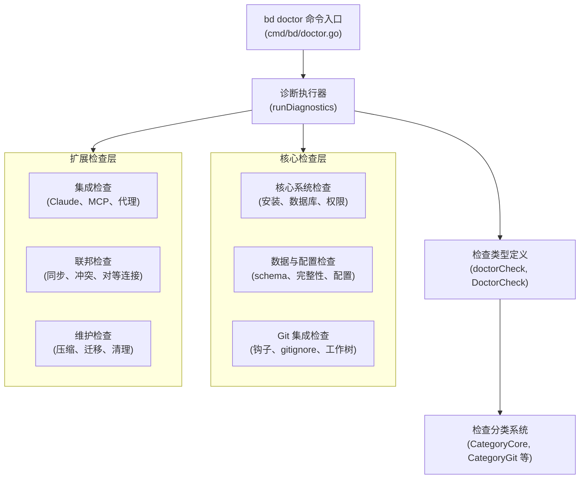

# 诊断核心模块

## 概述

诊断核心模块是 beads 系统的健康检查和故障排除中心，负责检测、报告和修复系统各个层面的问题。想象它是系统的"全科医生"——从基础的文件系统检查到复杂的数据库完整性验证，从 Git 集成健康到联邦同步状态，它提供了全面的诊断能力。

这个模块存在的核心理由是：beads 系统是一个由多个组件（数据库、Git 钩子、外部跟踪器、联邦同步等）组成的复杂系统，任何一个组件的异常都可能导致整个系统失效。诊断核心提供了统一的诊断框架，让用户能够快速定位和解决问题，而不是在黑暗中摸索。

## 架构概览

诊断核心采用了分层的插件式架构，将不同类型的检查组织成独立的模块，同时通过统一的接口进行协调。



### 架构叙事

诊断流程从 `bd doctor` 命令开始，它是整个诊断系统的入口点。命令解析用户的参数（如 `--fix`、`--deep`、`--check` 等），然后调用 `runDiagnostics` 函数执行实际的检查。

`runDiagnostics` 函数按照预定义的顺序执行一系列检查，每个检查都返回一个 `doctorCheck` 结构，包含检查名称、状态、消息、详细信息和修复建议。这些检查被组织到不同的类别中（如"Core System"、"Git Integration"等），以便于输出时的分组和排序。

检查的执行顺序是经过精心设计的：
1. **早期基础检查**：首先检查 `.beads/` 目录是否存在，Git 钩子是否健康
2. **核心系统检查**：数据库版本、schema 兼容性、权限等
3. **数据完整性检查**：依赖关系、重复项、孤儿问题等
4. **集成和联邦检查**：外部系统的连接状态
5. **维护建议**：压缩候选、数据库大小等

这种顺序确保了早期发现的严重问题不会被后续的检查掩盖，同时也为修复流程提供了合理的优先级。

## 核心数据模型

### 检查结果模型

诊断核心的核心数据模型是 `doctorCheck` 和 `DoctorCheck` 结构，它们代表了单个诊断检查的结果：

```go
// doctorCheck (主包) 和 DoctorCheck (doctor 包) 结构
type doctorCheck struct {
    Name     string // 检查名称，如 "Database Version"
    Status   string // "ok", "warning", 或 "error"
    Message  string // 简短的人类可读消息
    Detail   string // 详细信息（可选）
    Fix      string // 修复建议（可选）
    Category string // 分类，用于分组输出
}
```

这个结构设计的巧妙之处在于它的**多用途性**：
- 既包含机器可读的字段（`Status`、`Category`）
- 又包含人类友好的字段（`Message`、`Detail`、`Fix`）
- 支持 JSON 序列化，便于导出和自动化处理

### 诊断结果集合

`doctorResult` 结构将多个检查结果组织在一起，形成完整的诊断报告：

```go
type doctorResult struct {
    Path       string            // 检查的路径
    Checks     []doctorCheck     // 所有检查的结果
    OverallOK  bool              // 总体是否通过
    CLIVersion string            // CLI 版本
    Timestamp  string            // 时间戳（用于历史跟踪）
    Platform   map[string]string // 平台信息（用于调试）
}
```

### 分类系统

诊断核心使用分类系统来组织检查，这不仅让输出更易读，也反映了系统的架构层次：

| 分类 | 描述 | 示例检查 |
|------|------|----------|
| `CategoryCore` | 核心系统健康 | 安装状态、数据库版本、权限 |
| `CategoryGit` | Git 集成 | 钩子健康、gitignore、工作树状态 |
| `CategoryData` | 数据与配置 | Schema 兼容性、配置值、指纹 |
| `CategoryIntegration` | 外部集成 | Claude 插件、MCP 工具、代理文档 |
| `CategoryFederation` | 联邦同步 | 对等连接、同步状态、冲突检测 |
| `CategoryMaintenance` | 维护建议 | 压缩候选、迁移状态、清理建议 |

## 关键设计决策

### 1. 检查顺序的精心编排

**设计决策**：检查按照严格的预定义顺序执行，而不是并行或随机顺序。

**为什么这样设计**：
- 早期检查的失败会使后续检查失去意义（例如，如果 `.beads/` 目录不存在，检查数据库版本就没有意义）
- 某些检查依赖于前面检查的状态（例如，锁健康检查必须在打开数据库之前执行）
- 修复流程需要按照特定的顺序应用，以避免级联问题

**权衡**：
- ✅ 优点：逻辑清晰，避免无意义的检查，提供合理的修复优先级
- ❌ 缺点：不是最性能优化的（某些检查可以并行），代码顺序变得敏感

### 2. 可插拔的检查架构

**设计决策**：每个检查都是独立的函数，通过 `runDiagnostics` 中的调用来编排，而不是使用接口或注册表。

**为什么这样设计**：
- 简单直接——新检查只需要编写一个函数并在 `runDiagnostics` 中调用即可
- 易于理解和调试——检查流程是线性的，一目了然
- 避免过度工程化——诊断模块本身就是一个调试工具，不需要复杂的依赖注入

**权衡**：
- ✅ 优点：简单、透明、易于扩展
- ❌ 缺点：`runDiagnostics` 函数会变得很长，检查之间的依赖关系是隐式的

### 3. 修复与诊断分离

**设计决策**：诊断和修复是两个独立的阶段——首先运行所有诊断，然后才应用修复。

**为什么这样设计**：
- 用户可以先查看所有问题，再决定是否修复
- 避免部分修复导致系统处于不一致状态
- 支持 `--dry-run` 模式，让用户预览修复内容

**权衡**：
- ✅ 优点：安全、可预测、用户可控
- ❌ 缺点：某些修复可能需要重新运行诊断来验证（代码中确实这样做了）

### 4. 多模式支持（单一检查、深度验证、迁移验证等）

**设计决策**：通过命令行标志支持多种诊断模式，而不是拆分成多个命令。

**为什么这样设计**：
- 单一入口点，用户易于记忆
- 共享基础设施（输出格式化、修复应用等）
- 避免命令爆炸

**权衡**：
- ✅ 优点：用户体验一致，代码复用高
- ❌ 缺点：`doctorCmd` 的 `Run` 函数变得复杂，有很多分支逻辑

## 数据流程详解

让我们跟踪一次典型的 `bd doctor --fix` 调用的完整流程：

1. **命令解析与路径确定**
   - 解析命令行标志（`--fix`、`--yes` 等）
   - 确定检查路径（参数 > BEADS_DIR > 当前目录）
   - 转换为绝对路径

2. **特殊模式检查**
   - 检查是否是性能模式（`--perf`）、健康检查模式（`--check-health`）等
   - 如果是，执行相应的专门流程并返回

3. **诊断运行阶段**
   ```
   runDiagnostics(path) → doctorResult
   ```
   - 自动检测 gastown 模式
   - 按顺序执行所有检查，收集结果
   - 计算 `OverallOK` 状态

4. **修复应用阶段**（如果使用 `--fix`）
   ```
   releaseDiagnosticLocks(path) → 清理锁文件
   applyFixes(result) → 应用修复
   releaseDiagnosticLocks(path) → 再次清理
   result = runDiagnostics(path) → 重新诊断验证
   ```

5. **输出与导出**
   - 如果需要，添加时间戳和平台信息
   - 如果指定了 `--output`，导出到 JSON 文件
   - 根据 `--json` 标志选择输出格式
   - 如果有错误，退出码为 1

### 关键数据转换

诊断流程中有几个重要的数据转换点：

1. **内部检查结果到公共结构**：
   ```go
   // doctor 包的 DoctorCheck 转换为主包的 doctorCheck
   convertDoctorCheck(dc doctor.DoctorCheck) doctorCheck
   ```

2. **诊断结果到 JSON**：
   ```go
   // 用于导出和机器处理
   exportDiagnostics(result, outputPath)
   ```

3. **诊断结果到人类可读输出**：
   ```go
   // 用于控制台显示
   printDiagnostics(result)
   ```

## 子模块概览

诊断核心模块包含以下子模块：

- [数据库与 Dolt 检查](数据库与_Dolt_检查.md)：负责数据库连接、schema 和性能的诊断
- [服务器与迁移验证](服务器与迁移验证.md)：处理 Dolt 服务器健康和迁移验证
- [深度验证](深度验证.md)：执行完整的图完整性验证
- [维护与修复](维护与修复.md)：提供自动修复功能和维护建议
- [遗留文件与性能诊断](遗留文件与性能诊断.md)：检测遗留文件和性能问题
- [验证 CLI 集成](验证_CLI_集成.md)：验证 CLI 相关的集成点

## 与其他模块的交互

诊断核心是一个**消费者**模块，它依赖于系统的几乎所有其他部分来执行检查：

- **[Core Domain Types](Core_Domain_Types.md)**：用于验证 issue 和依赖关系的结构
- **[Storage Interfaces](Storage_Interfaces.md)** 和 **[Dolt Storage Backend](Dolt_Storage_Backend.md)**：用于数据库健康检查
- **[Tracker Integration Framework](Tracker_Integration_Framework.md)**：用于验证外部跟踪器集成
- **[Configuration](Configuration.md)**：用于检查配置健康
- **[Beads Repository Context](Beads_Repository_Context.md)**：用于仓库上下文操作

诊断核心与其他模块的交互方式是**只读**的，除非用户明确要求修复（`--fix`），这种设计确保了诊断过程本身不会改变系统状态。

## 实用指南

### 常见用法模式

1. **初次故障排除**：
   ```bash
   bd doctor  # 查看所有问题
   ```

2. **自动修复**：
   ```bash
   bd doctor --fix  # 自动修复可修复的问题
   bd doctor --fix --yes  # 无需确认自动修复
   ```

3. **特定检查**：
   ```bash
   bd doctor --check=pollution  # 只检查测试污染
   bd doctor --check=validate  # 只检查数据完整性
   ```

4. **深度验证**：
   ```bash
   bd doctor --deep  # 完整的图完整性验证
   ```

### 新贡献者注意事项

#### 1. 检查顺序很重要

在 `runDiagnostics` 中添加新检查时，**位置很关键**。例如：
- 不要在 `.beads/` 目录检查之前添加需要访问数据库的检查
- 锁健康检查必须在打开数据库之前执行（GH#1981）

#### 2. 避免在诊断阶段修改状态

诊断阶段应该是**只读**的。任何修改都应该在修复阶段进行，并且应该是可选的（由 `--fix` 标志控制）。

#### 3. 正确设置检查分类

使用适当的分类，这会影响用户看到输出的顺序和方式。如果不确定，`CategoryCore` 或 `CategoryMaintenance` 通常是安全的选择。

#### 4. 提供有意义的修复建议

即使你的检查不能自动修复，也要提供清晰的手动修复步骤。`Fix` 字段支持多行文本，使用 `\n` 分隔。

#### 5. 测试在不同状态下的行为

确保你的检查在以下情况下都能正常工作：
- 全新的仓库（没有 `.beads/`）
- 刚初始化的仓库（有 `.beads/` 但没有数据）
- 正常使用的仓库
- 有已知问题的仓库

### 边缘情况和隐性契约

1. **锁文件处理**：
   - 诊断阶段可能会留下 Dolt 锁文件，`releaseDiagnosticLocks` 函数负责清理
   - 这是因为 `CloseWithTimeout` 在超时时可能会留下 goroutine 和锁文件

2. **BEADS_DIR 环境变量处理**：
   - 诊断过程中会临时修改 `BEADS_DIR` 来跟踪版本，然后恢复原始值
   - 这确保了 `bd doctor <path>` 不会意外修改当前仓库的状态

3. **Gastown 模式自动检测**：
   - 如果存在 `routes.jsonl` 文件，会自动启用 gastown 模式
   - 这会影响重复项检查的容忍度阈值

4. **早期锁检查**：
   - 锁健康检查在打开任何数据库之前执行，以避免误报
   - 这个预计算的检查结果随后传递给 Dolt 健康检查函数

## 总结

诊断核心模块是 beads 系统的"安全网"，它通过精心设计的检查框架，让用户能够快速定位和解决问题。它的架构体现了几个重要的设计原则：

- **简单性优先**：避免过度工程化，使用直接的函数调用和线性流程
- **安全性**：诊断和修复分离，只读检查在前，修改操作在后
- **用户体验**：提供清晰的分类、有意义的消息和可操作的修复建议
- **完整性**：覆盖从文件系统到联邦同步的所有层面

作为一个新贡献者，理解这个模块的最好方式是：
1. 阅读 `runDiagnostics` 函数，了解检查的顺序和逻辑
2. 查看几个具体的检查函数，了解它们的结构和模式
3. 在测试仓库上运行 `bd doctor --verbose`，查看完整的输出
4. 尝试添加一个简单的检查，体验完整的流程

诊断核心可能不是系统中最耀眼的模块，但它绝对是最重要的之一——它确保了整个系统的健康和可靠性。
