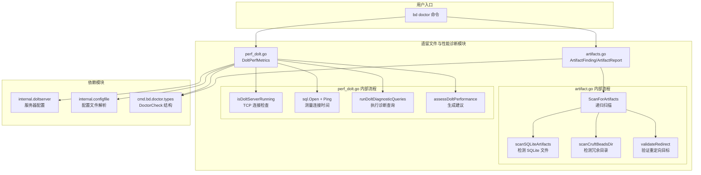

# 遗留文件与性能诊断

> **一句话总结**：这个模块是 beads 从 SQLite 迁移到 Dolt 后的"清洁工"和"体检医生"——它扫描迁移后遗留的旧文件垃圾，并对 Dolt 数据库进行性能体检，确保系统运行在健康状态。

## 问题空间：为什么需要这个模块？

beads 经历了一次重大的存储后端迁移：从嵌入式 SQLite 切换到基于 MySQL 协议的 Dolt 版本控制数据库。这种迁移不是一夜之间完成的，而是渐进式的。在迁移过程中和迁移后，系统面临两个核心问题：

### 1. 遗留文件污染（Artifact Pollution）

想象你搬进了一栋新房子，但旧房子的家具还堆在地下室里。迁移后，`.beads/` 目录中可能残留着：

- **SQLite 数据库文件**（`beads.db`、`beads.db-wal`、`beads.db-shm`）：Dolt 激活后这些文件不再使用，但占用磁盘空间
- **迁移前备份文件**（`beads.backup-*.db`）：迁移工具创建的临时备份，迁移完成后应删除
- **冗余的 .beads 目录**：某些工作树（worktree）、polecat、crew 场景下，`.beads/` 应该只包含一个 `redirect` 文件指向规范位置，但可能残留了完整的数据副本
- **无效的 redirect 文件**：指向不存在目标的重定向文件，会导致运行时错误

这些遗留文件不会导致功能故障，但会：
- 浪费磁盘空间
- 增加备份/同步时间
- 造成混淆（"我应该用哪个数据库？"）
- 在极端情况下导致数据不一致（如果用户误操作使用了旧文件）

### 2. 性能黑盒（Performance Black Box）

Dolt 是一个功能强大的版本控制数据库，但它的性能特征与 SQLite 截然不同：

- SQLite 是进程内嵌入的，没有网络连接开销
- Dolt 通常以 `sql-server` 模式运行，通过 MySQL 协议通信
- 查询性能取决于索引、数据量、服务器配置等多种因素

用户报告"beads 变慢了"时，需要一套标准化的诊断工具来回答：
- 是网络连接问题吗？
- 是特定查询慢，还是所有操作都慢？
- 数据库是否过大需要清理？
- 是否需要调整索引或配置？

## 架构概览



### 数据流详解

#### 遗留文件扫描流程

```
用户执行 bd doctor --check=artifacts
         ↓
CheckClassicArtifacts(path)
         ↓
ScanForArtifacts(path) — 递归遍历目录树
         ↓
    发现 .beads/ 目录
         ↓
    scanBeadsDir(beadsDir)
         ├─→ scanSQLiteArtifacts() — 检查是否有 SQLite 文件
         ├─→ scanCruftBeadsDir() — 检查是否应该是 redirect-only
         └─→ validateRedirect() — 验证 redirect 文件有效性
         ↓
    构建 ArtifactReport
         ↓
返回 DoctorCheck{Status: Warning, Detail: "..."}
```

#### 性能诊断流程

```
用户执行 bd doctor perf-dolt
         ↓
RunDoltPerformanceDiagnostics(path, enableProfiling)
         ↓
    1. 解析 .beads/ 目录
    2. 验证是 Dolt 后端
    3. 从 doltserver.DefaultConfig 获取服务器配置
    4. isDoltServerRunning() — TCP 连接测试
         ↓
    如果服务器未运行 → 返回错误
         ↓
    如果服务器运行：
    5. 可选：启动 CPU profiling
    6. sql.Open() 建立 MySQL 连接 → 记录 ConnectionTime
    7. runDoltDiagnosticQueries() 执行一组预定义查询
         ├─→ COUNT(*) FROM issues — 统计总数
         ├─→ GetReadyWork 等价查询 → 记录 ReadyWorkTime
         ├─→ List open issues → 记录 ListOpenTime
         ├─→ Show single issue → 记录 ShowIssueTime
         ├─→ Complex filter query → 记录 ComplexQueryTime
         └─→ dolt_log query → 记录 CommitLogTime
    8. getDoltDatabaseSize() — 计算 .dolt/ 目录大小
    9. assessDoltPerformance() — 根据阈值生成建议
         ↓
返回 DoltPerfMetrics + 打印报告
```

## 核心设计决策

### 1. 诊断与修复分离（Diagnostic vs. Remediation）

**选择**：这个模块只负责**发现问题**，不负责**修复问题**。

**为什么**：
- 关注点分离：诊断逻辑和修复逻辑有不同的风险 profile。诊断是只读的，修复是写入的。
- 用户自主权：删除文件是危险操作，应该让用户明确知道自己在做什么。
- 可组合性：`bd doctor --check=artifacts` 可以安全地在 CI 中运行，而 `bd doctor --fix` 需要人工确认。

**权衡**：
- 优点：诊断命令可以无副作用运行，适合自动化
- 缺点：用户需要执行两个命令才能完成"发现问题 → 修复问题"的完整流程

### 2. 基于阈值的性能评估（Threshold-Based Assessment）

**选择**：性能评估使用硬编码的阈值（如 `ReadyWorkTime > 200ms` 触发警告）。

**为什么**：
- 简单直观：用户不需要理解复杂的统计模型
- 可操作：阈值对应具体的优化建议（"检查索引"）
- 渐进式：可以随着用户反馈调整阈值

**权衡**：
- 优点：实现简单，输出清晰
- 缺点：阈值可能不适合所有场景（小数据库 vs. 大数据库，本地服务器 vs. 远程服务器）
- 缓解：提供 `--profile` 选项让用户进行深入分析

### 3. 递归扫描与智能跳过（Recursive Scan with Smart Skipping）

**选择**：`ScanForArtifacts` 递归遍历整个目录树，但智能跳过某些目录。

```go
// 跳过 node_modules 等
if info.IsDir() && (base == "node_modules" || base == "vendor" || base == "__pycache__") {
    return filepath.SkipDir
}

// 但允许进入 .git 以查找 beads-worktrees
if base == ".git" && info.IsDir() {
    return nil
}
```

**为什么**：
- beads 可能存在于 monorepo 中，需要扫描所有项目
- 但某些目录（`node_modules`）明显不包含 beads 数据
- `.git/beads-worktrees/` 是特殊场景，需要支持

**权衡**：
- 优点：全面扫描，不会遗漏
- 缺点：在大目录树上可能较慢
- 缓解：扫描是只读的，可以安全中断

### 4. 服务器模式专用（Server-Mode Only）

**选择**：性能诊断**仅**在 Dolt 服务器模式下运行。

```go
if !serverRunning {
    return metrics, fmt.Errorf("dolt sql-server is not running...")
}
```

**为什么**：
- 嵌入式模式（embedded）的性能特征不同，不需要网络诊断
- 服务器模式是生产推荐配置，更需要监控
- 简化实现：不需要处理两种模式的差异

**权衡**：
- 优点：实现简单，聚焦高价值场景
- 缺点：使用嵌入式模式的用户无法获得性能诊断

## 子模块概览

### 遗留文件扫描（artifacts.go）

负责扫描和报告迁移后遗留的文件。核心类型：

- [`ArtifactFinding`](#artifactfinding)：单个发现的描述（路径、类型、是否可安全删除）
- [`ArtifactReport`](#artifactreport)：扫描结果的汇总

详细文档：[遗留文件扫描](遗留文件扫描.md)

### Dolt 性能诊断（perf_dolt.go）

负责测量 Dolt 数据库的性能指标。核心类型：

- [`DoltPerfMetrics`](#doltperfmetrics)：性能指标的集合（连接时间、查询时间、数据库大小等）

详细文档：[Dolt 性能诊断](Dolt 性能诊断.md)

## 与其他模块的依赖关系

### 上游依赖

| 依赖模块 | 用途 |
|---------|------|
| [internal.doltserver](internal.doltserver.md) | 获取 Dolt 服务器配置（host:port） |
| [internal.configfile](internal.configfile.md) | 读取 beads 配置文件，确定数据库名称 |
| [cmd.bd.doctor.types](CLI Doctor Commands.md) | `DoctorCheck` 结构，用于统一诊断输出格式 |

### 下游消费者

| 消费者 | 用途 |
|-------|------|
| `bd doctor --check=artifacts` | 调用 `CheckClassicArtifacts` |
| `bd doctor --check=perf-dolt` | 调用 `CheckDoltPerformance` |
| `bd doctor perf-dolt` | 调用 `RunDoltPerformanceDiagnostics` + `PrintDoltPerfReport` |

## 使用示例

### 检查遗留文件

```bash
# 快速检查
$ bd doctor --check=artifacts

[WARN] Classic Artifacts: 2 SQLite artifact(s), 1 cruft .beads dir(s)
  /home/user/project/.beads/beads.db: SQLite database file (Dolt is active backend)
  /home/user/project/.beads/beads.db-wal: SQLite database file (Dolt is active backend)
  /home/user/project/polecats/feature-x/.beads/: should be redirect-only but contains: beads.db
Fix: Run 'bd doctor --fix' to clean up, or 'bd doctor --check=artifacts' for details
```

### 运行性能诊断

```bash
# 详细性能报告
$ bd doctor perf-dolt

Dolt Performance Diagnostics
==================================================

Backend: dolt-server
Server Status: running
Platform: linux/amd64
Go: go1.21.0
Dolt: 1.32.0

Database Statistics:
  Total issues:      1234
  Open issues:       456
  Closed issues:     778
  Dependencies:      890
  Database size:     45.67 MB

Operation Performance (ms):
  Connection:               12ms
  bd ready (GetReadyWork):  89ms
  bd list --status=open:    34ms
  bd show <issue>:          5ms
  Complex filter query:     156ms
  dolt_log query:           23ms

Performance Assessment:
  [OK] Performance looks healthy
```

### 启用 CPU Profiling

```bash
# 生成性能剖析文件
$ bd doctor perf-dolt --profile

# 查看火焰图
$ go tool pprof -http=:8080 beads-dolt-perf-2024-01-15-143022.prof
```

## 新贡献者注意事项

### 1. 不要删除文件，只报告

`artifacts.go` 中的代码**永远不要**调用 `os.Remove`。它的职责是发现问题，不是修复问题。修复逻辑在 `cmd.bd.doctor.fix` 包中。

### 2. 阈值调整需要数据支持

如果要修改 `assessDoltPerformance` 中的阈值（如 `ReadyWorkTime > 200`），请：
- 收集真实用户的性能数据
- 考虑不同规模数据库的差异
- 在 PR 描述中说明调整理由

### 3. 错误处理要宽容

扫描过程中遇到权限错误或读取错误时，选择跳过而不是失败：

```go
if err != nil {
    return nil // Skip directories we can't read
}
```

这是因为诊断工具应该尽可能提供有用信息，而不是因为一个目录不可读就完全失败。

### 4. 性能诊断查询要只读

`runDoltDiagnosticQueries` 中的所有查询都是 `SELECT`，不会修改数据。这是为了保证诊断命令可以安全运行。

### 5. 注意路径遍历安全

`validateRedirect` 中的路径处理需要小心：

```go
// #nosec G304 - path constructed from walked dir
data, err := os.ReadFile(redirectPath)
```

这里的 `#nosec` 注释是合理的，因为 `redirectPath` 来自 `filepath.Walk` 的遍历结果，不是用户直接输入。但如果未来代码结构变化，需要重新评估。

## 扩展点

### 添加新的 artifact 类型

要检测新的遗留文件类型：

1. 在 `ArtifactReport` 中添加新的切片字段
2. 在 `scanBeadsDir` 中添加新的扫描逻辑
3. 在 `CheckClassicArtifacts` 中更新报告格式
4. 在 `ScanForArtifacts` 中更新总数计算

### 添加新的性能指标

要测量新的性能指标：

1. 在 `DoltPerfMetrics` 中添加新字段
2. 在 `runDoltDiagnosticQueries` 中添加测量逻辑（使用 `measureQueryTime`）
3. 在 `PrintDoltPerfReport` 中添加输出
4. 在 `assessDoltPerformance` 中添加评估逻辑

## 故障排查

### 问题：性能诊断显示"server is not running"

**原因**：Dolt 服务器未启动，或端口配置不匹配。

**解决**：
```bash
# 检查服务器状态
bd dolt status

# 启动服务器
bd dolt start

# 如果端口冲突，检查配置
cat .beads/metadata.json | jq .dolt_server_port
```

### 问题：扫描报告大量 cruft .beads dirs

**原因**：工作树或 polecat 的 `.beads/` 目录没有正确设置为 redirect-only。

**解决**：
```bash
# 查看详细报告
bd doctor --check=artifacts --verbose

# 确认 redirect 文件存在且正确
cat .beads/redirect

# 运行修复（谨慎！）
bd doctor --fix=artifacts
```

### 问题：性能指标显示"failed"

**原因**：查询执行失败，可能是权限问题或表结构不匹配。

**解决**：
```bash
# 手动连接服务器检查
mysql -h 127.0.0.1 -P 3307 -u root beads

# 检查表是否存在
SHOW TABLES;

# 检查表结构
DESCRIBE issues;
```
