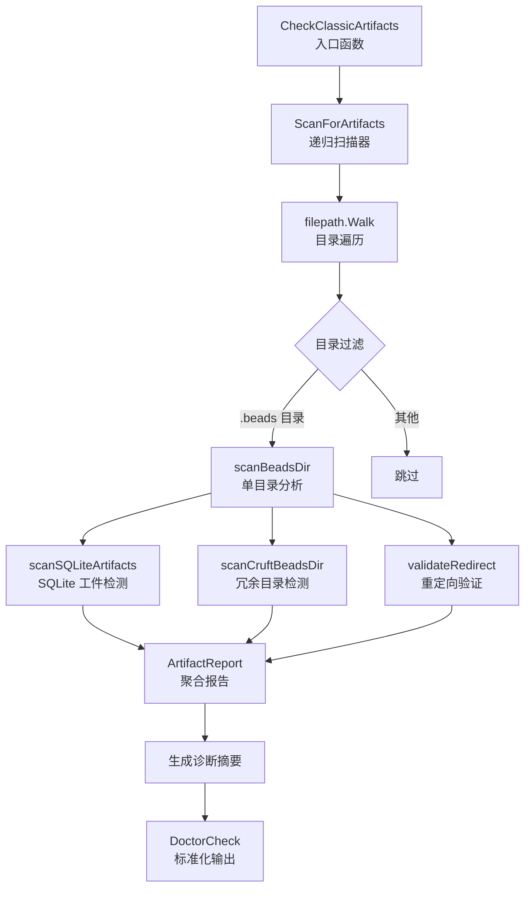

# 遗留文件扫描模块深度解析

## 概述：为什么需要这个模块

想象一下你刚刚完成了一次大规模的数据迁移——把整个系统从 SQLite 数据库迁移到了 Dolt 版本控制系统。迁移脚本跑完了，数据都转移了，但文件系统里还散落着大量"历史遗留物"：旧的数据库文件、备份文件、配置目录……这些东西不删吧，占空间还容易造成混淆；删吧，又怕误删了还在用的东西。

**遗留文件扫描模块**就是为了解决这个"迁移后清理"问题而生的。它是一个智能的文件系统扫描器，专门识别那些在 Dolt 迁移完成后应该被清理掉的经典 beads 工件（classic artifacts）。这个模块不是简单的"找特定文件名"，而是理解 beads 系统的目录结构语义——它能区分哪些 `.beads/` 目录应该是"重定向专用"的，哪些 SQLite 文件是安全的删除候选，以及重定向文件本身是否有效。

这个模块的核心设计洞察是：**清理策略必须理解系统的架构意图**。一个 `.beads/` 目录在 `polecats/` 工作树下和在主仓库下的清理规则完全不同；一个 `beads.db` 文件在 Dolt 是活跃后端时是垃圾，在 SQLite 仍是活跃后端时却是生命线。模块通过编码这些领域知识，让自动化清理变得安全可靠。

## 架构与数据流



### 架构角色解析

这个模块在系统中扮演**诊断探针**的角色，位于 `cmd.bd.doctor` 诊断框架之下。它的输入是一个文件系统路径（通常是仓库根目录），输出是一个结构化的 `ArtifactReport`，最终被包装成 `DoctorCheck` 供 CLI 展示。

数据流的核心是**递归下降 + 分类检测**模式：

1. **遍历层**（`ScanForArtifacts`）：使用 `filepath.Walk` 递归遍历目录树，但带有智能过滤——跳过 `node_modules`、`vendor` 等无关目录，但会进入 `.git/beads-worktrees` 这样的特殊路径。

2. **分析层**（`scanBeadsDir`）：对每个发现的 `.beads/` 目录执行三项独立检查，这三项检查彼此正交，可以并行理解：
   - SQLite 工件检测：只标记那些在 Dolt 成为活跃后端后变成"僵尸"的文件
   - 冗余目录检测：识别那些应该只包含重定向文件却残留了其他内容的目录
   - 重定向验证：确保重定向文件指向的目标真实存在

3. **聚合层**（`ArtifactReport`）：将三类发现分别归入 `SQLiteArtifacts`、`CruftBeadsDirs`、`RedirectIssues` 三个切片，并计算总数和安全删除计数。

4. **呈现层**（`CheckClassicArtifacts`）：将原始报告转换为人类可读的诊断结果，包括摘要消息、详细列表（最多显示 3 个示例）和修复建议。

## 核心组件深度解析

### ArtifactFinding：单个发现的标准化表示

```go
type ArtifactFinding struct {
    Path        string // 工件的绝对路径
    Type        string // "jsonl", "sqlite", "cruft-beads", "redirect"
    Description string // 人类可读的描述
    SafeDelete  bool   // 是否可安全删除而不造成数据丢失
}
```

这个结构的设计体现了**最小充分信息**原则。它不尝试编码复杂的清理逻辑，而是提供足够的信息让上层决策：

- `Path` 是绝对路径，这很重要——因为扫描是递归的，相对路径会在深层嵌套中失去意义
- `Type` 是枚举式的分类，用于分组统计和差异化处理（例如 SQLite 文件可能需要备份确认，而 cruft 目录可以直接删除）
- `Description` 不是给机器解析的，而是直接展示给用户的，所以措辞要清晰（如 "pre-migration backup" 比 "backup file" 更明确）
- `SafeDelete` 是关键的安全闸门——它为自动化清理提供了依据，`false` 的发现需要人工确认

**设计权衡**：为什么不用接口或多态来表示不同类型的发现？答案是这个模块的发现类型是封闭的（只有 4 种），且处理逻辑差异不大。用单一结构体简化了聚合和序列化，避免了不必要的抽象。

### ArtifactReport：扫描结果的聚合容器

```go
type ArtifactReport struct {
    SQLiteArtifacts []ArtifactFinding
    CruftBeadsDirs  []ArtifactFinding
    RedirectIssues  []ArtifactFinding
    TotalCount      int
    SafeDeleteCount int
}
```

这个结构采用**分类聚合**而非扁平列表的设计，原因有三：

1. **语义分组**：三类问题性质不同——SQLite 文件是"过时数据"，cruft 目录是"结构冗余"，重定向问题是"配置错误"。分开存储便于针对性处理。

2. **统计效率**：`TotalCount` 和 `SafeDeleteCount` 是预计算的，避免每次展示时重新遍历切片。这是典型的空间换时间优化，考虑到报告可能被多次读取（CLI 展示、JSON 输出、日志记录），这个 tradeoff 是合理的。

3. **扩展性**：如果未来需要新增一类发现（比如 JSONL 日志文件），只需添加一个新字段，不影响现有逻辑。

### CheckClassicArtifacts：诊断框架的适配器

```go
func CheckClassicArtifacts(path string) DoctorCheck
```

这个函数是模块与外部世界的**契约边界**。它接收一个路径，返回一个标准化的 `DoctorCheck` 结构，完全符合诊断框架的预期。

关键设计点：

- **零发现即成功**：如果 `TotalCount == 0`，返回 `StatusOK`，这符合"无问题即健康"的诊断语义
- **非零发现即警告**：即使所有发现都是 `SafeDelete=true`，也返回 `StatusWarning` 而非 `StatusError`——因为遗留文件不影响系统运行，只是需要清理
- **摘要 + 详情双层呈现**：`Message` 字段给出简洁统计（如 "3 SQLite artifact(s), 2 cruft .beads dir(s)"），`Detail` 字段列出具体路径（最多 3 个示例），避免输出过长
- **可操作的修复建议**：`Fix` 字段直接告诉用户运行什么命令，降低认知负担

**为什么返回 `DoctorCheck` 而不是 `ArtifactReport`？** 这是**关注点分离**的体现。扫描逻辑关心的是"发现了什么"，诊断框架关心的是"用户需要知道什么"。这个函数充当了两者之间的翻译器。

### ScanForArtifacts：递归扫描的编排器

```go
func ScanForArtifacts(rootPath string) ArtifactReport
```

这是模块的**核心算法入口**。它使用 `filepath.Walk` 进行深度优先遍历，但通过返回值控制遍历行为：

```go
if base == ".git" && info.IsDir() {
    return nil  // 允许进入 .git 以查找 beads-worktrees
}
if info.IsDir() && (base == "node_modules" || ...) {
    return filepath.SkipDir  // 跳过无关目录
}
if !info.IsDir() || base != ".beads" {
    return nil  // 继续深入，但不处理
}
scanBeadsDir(path, &report)
return filepath.SkipDir  // 已扫描，无需进入 .beads 内部
```

这段代码体现了**智能遍历**的设计思想：

- `.git` 目录通常应该跳过，但 `beads-worktrees` 可能在其中，所以允许进入
- `node_modules`、`vendor`、`__pycache__` 是明确的噪音源，直接跳过整个子树
- 找到 `.beads` 后立即扫描并跳过其内部，因为工件都在 `.beads` 根目录，不在子目录

**性能考量**：`filepath.Walk` 是同步阻塞的，但对于文件系统扫描这个场景是合适的——I/O 是瓶颈，CPU 不是，且需要按顺序处理依赖关系（先发现目录，再分析内容）。

### scanBeadsDir：单目录的三维分析

```go
func scanBeadsDir(beadsDir string, report *ArtifactReport) {
    isRedirectExpected := isRedirectExpectedDir(beadsDir)
    hasRedirect := hasRedirectFile(beadsDir)
    
    scanSQLiteArtifacts(beadsDir, report)
    if isRedirectExpected {
        scanCruftBeadsDir(beadsDir, hasRedirect, report)
    }
    if hasRedirect {
        validateRedirect(beadsDir, report)
    }
}
```

这个函数是**条件化分析**的典范。它先收集两个布尔信号（是否应该重定向、是否有重定向文件），然后基于这些信号决定执行哪些检查：

1. **SQLite 检查无条件执行**：因为任何 `.beads` 目录都可能有 SQLite 残留
2. **Cruft 检查有条件执行**：只有那些"应该只包含重定向"的目录才需要检查是否有多余文件
3. **重定向验证有条件执行**：只有存在重定向文件时才需要验证其有效性

这种设计避免了误报——如果一个目录本来就不应该重定向，那么它包含多个文件是完全正常的，不应该标记为 cruft。

### isRedirectExpectedDir：领域知识的编码

```go
func isRedirectExpectedDir(beadsDir string) bool {
    parent := filepath.Dir(beadsDir)
    parentName := filepath.Base(parent)
    grandparent := filepath.Dir(parent)
    grandparentName := filepath.Base(grandparent)
    
    if grandparentName == "polecats" { return true }
    if grandparentName == "crew" { return true }
    if parentName == "rig" && grandparentName == "refinery" { return true }
    if grandparentName == "beads-worktrees" { return true }
    // ... 更多模式匹配
}
```

这个函数是整个模块中**领域知识最密集**的部分。它编码了 beads 系统的目录结构约定：

- `*/polecats/*/.beads/`：polecat 工作树的叶子目录，应该重定向到主仓库
- `*/crew/*/.beads/`：crew 工作空间的叶子目录，应该重定向
- `*/refinery/rig/.beads/`：refinery rig 的叶子目录，应该重定向
- `.git/beads-worktrees/*/.beads/`：Dolt worktree 的 beads 目录，应该重定向
- `gastown/.beads/`（有 `mayor/` 或 `polecats/` 兄弟目录）：rig 根目录，如果有规范位置则应该重定向

**为什么硬编码这些模式？** 因为这是系统的架构约束，不是用户可配置的策略。这些模式反映了 beads 的多仓库同步设计——某些位置的 `.beads` 只是"代理"，真实数据在别处。如果未来架构变化，这些模式需要更新，但这正是"单一事实来源"的体现。

### scanSQLiteArtifacts：后端感知的清理判断

```go
func scanSQLiteArtifacts(beadsDir string, report *ArtifactReport) {
    if !IsDoltBackend(beadsDir) {
        return  // SQLite 仍是活跃后端，beads.db 是有效数据
    }
    // ... 检查 SQLite 文件
}
```

这是模块中**最关键的安全检查**。它确保只有在 Dolt 成为活跃后端时，才将 SQLite 文件标记为可清理。这个判断依赖于 `IsDoltBackend` 函数（读取本地配置中的 `PreferDolt` 标志）。

**设计洞察**：清理逻辑必须与运行时状态解耦。一个文件是否"遗留"不取决于它是什么，而取决于系统当前用什么。这种**上下文感知**的设计避免了在迁移过程中误删活跃数据。

标记规则：
- `beads.db-shm` 和 `beads.db-wal`：SQLite 的临时文件，总是 `SafeDelete=true`
- `beads.db`：主数据库文件，`SafeDelete=false`（即使 Dolt 是活跃后端，也可能需要保留作为备份）
- `beads.backup-*.db`：迁移前的备份，`SafeDelete=true`（明确是备份）

### scanCruftBeadsDir：重定向专用目录的完整性检查

```go
func scanCruftBeadsDir(beadsDir string, hasRedirect bool, report *ArtifactReport) {
    // 遍历目录内容，收集非 redirect 和非 .gitkeep 的文件
    // 如果有额外文件，标记为 cruft
    // SafeDelete = hasRedirect（只有重定向文件已存在时才安全）
}
```

这个函数的逻辑是：**如果一个目录应该只包含重定向文件，那么除了 `redirect` 和 `.gitkeep` 之外的任何文件都是可疑的**。

**为什么 `.gitkeep` 被豁免？** 因为 `.gitkeep` 是 Git 的占位文件，用于确保空目录被版本控制。它不包含数据，删除它可能导致目录从 Git 历史中消失，所以保留它是安全的。

**为什么 `SafeDelete` 依赖 `hasRedirect`？** 因为如果一个目录应该重定向但还没有重定向文件，直接删除整个目录会破坏重定向能力。只有重定向文件已存在时，清理其他文件才是安全的。

### validateRedirect：重定向链的完整性验证

```go
func validateRedirect(beadsDir string, report *ArtifactReport) {
    // 读取重定向文件
    // 解析目标路径（支持相对路径和注释）
    // 验证目标存在且是目录
}
```

这个函数确保重定向文件不是"断头链接"。它处理了几个边界情况：

- **注释支持**：重定向文件可以包含 `#` 开头的注释行，解析时会跳过
- **相对路径解析**：如果目标是相对路径，相对于 `.beads` 的父目录（项目根）解析
- **存在性检查**：目标必须存在且是目录，否则重定向无效

**为什么 `SafeDelete=false` 对于重定向问题？** 因为重定向文件本身是配置，不是垃圾。如果它有问题，应该修复而不是删除。

## 依赖关系分析

### 上游依赖：诊断框架

遗留文件扫描模块完全依赖于 `cmd.bd.doctor` 诊断框架定义的契约：

- **输入**：一个文件系统路径（通常是仓库根目录）
- **输出**：`DoctorCheck` 结构，包含 `Name`、`Status`、`Message`、`Detail`、`Fix`、`Category` 字段
- **状态码**：`StatusOK`（无问题）、`StatusWarning`（需要关注）、`StatusError`（严重错误）

这个模块不直接调用诊断框架的其他部分，而是被 `doctor` 命令调用。它假设：
- 路径是有效的（无效路径会在 `filepath.Walk` 中静默跳过）
- 调用者会处理 `DoctorCheck` 的展示和后续操作

### 下游依赖：文件系统

模块直接依赖 Go 标准库的 `os` 和 `filepath` 包，没有外部依赖。这意味着：
- **可移植性高**：在任何支持 Go 文件系统 API 的系统上都能运行
- **权限敏感**：无法读取的目录会静默跳过（`err != nil` 时返回 `nil` 继续遍历）
- **符号链接处理**：`filepath.Walk` 默认不跟随符号链接，这避免了无限循环，但也可能漏掉某些情况

### 隐式依赖：Dolt 后端检测

模块调用 `IsDoltBackend(beadsDir)` 来判断是否应该标记 SQLite 文件。这个函数（未在提供的代码中显示，但从使用方式推断）应该：
- 读取 `.beads/local-config.yaml` 或类似配置文件
- 检查 `prefer-dolt` 或 `no-db` 标志
- 返回布尔值表示 Dolt 是否是活跃后端

**耦合风险**：如果配置文件的格式或位置变化，这个模块会受到影响。理想情况下应该通过接口注入后端检测逻辑，但当前设计选择了简单直接的调用。

## 设计决策与权衡

### 1. 静默错误 vs 显式报错

**选择**：`filepath.Walk` 遇到错误时返回 `nil` 继续遍历，而不是中止扫描。

**理由**：诊断工具应该尽可能提供部分结果，而不是因为一个权限问题就完全失败。用户更希望看到"扫描了 100 个目录，5 个无法访问"而不是"扫描失败：权限拒绝"。

**代价**：可能漏掉某些目录中的问题，且用户不知道漏掉了。这是一个"可用性优先于完整性"的权衡。

### 2. 硬编码模式 vs 可配置规则

**选择**：`isRedirectExpectedDir` 中硬编码了目录模式，而不是从配置文件读取。

**理由**：这些模式是系统架构的一部分，不是用户策略。如果允许用户配置，会导致不同用户的清理行为不一致，增加支持复杂度。

**代价**：架构变化时需要修改代码并重新编译。但对于 beads 这样的系统，架构变化频率低，这个代价可接受。

### 3. 预计算计数 vs 按需计算

**选择**：`ArtifactReport` 中预计算 `TotalCount` 和 `SafeDeleteCount`。

**理由**：报告可能被多次读取（CLI 展示、JSON 输出、日志记录），预计算避免了重复遍历。空间成本是两个整数，时间成本是 O(n) 的遍历，但 n 通常很小（几十个发现）。

**代价**：如果报告在创建后被修改（当前设计不允许），计数会过期。这是一个"不可变数据结构"的隐式假设。

### 4. 示例截断 vs 完整列表

**选择**：`Detail` 字段最多显示 3 个示例，然后用 "... and N more" 省略。

**理由**：CLI 输出应该简洁，完整列表可以通过其他命令（如 `bd doctor --check=artifacts --verbose`）获取。这是"默认简洁，按需详细"的设计。

**代价**：用户可能需要运行两次命令才能看到所有问题。但对于大多数情况（问题数量少），一次就够了。

### 5. 同步遍历 vs 并行扫描

**选择**：使用 `filepath.Walk` 同步遍历，而不是并行扫描每个 `.beads` 目录。

**理由**：文件系统 I/O 是瓶颈，并行化不会显著提升性能，反而增加复杂度（需要处理并发写入 `report`）。对于典型仓库（几十个 `.beads` 目录），同步扫描在毫秒级完成。

**代价**：在极端情况下（数千个 `.beads` 目录），扫描可能较慢。但这是边缘情况，可以未来优化。

## 使用指南

### 基本调用

```go
// 扫描当前仓库
report := ScanForArtifacts(".")

// 检查是否有问题
if report.TotalCount == 0 {
    fmt.Println("没有发现遗留文件")
} else {
    fmt.Printf("发现 %d 个遗留文件，其中 %d 个可安全删除\n", 
        report.TotalCount, report.SafeDeleteCount)
}
```

### 集成到诊断命令

```go
// 在 doctor 命令中调用
check := CheckClassicArtifacts(repoRoot)
printDiagnostic(check)  // 由诊断框架处理展示
```

### 处理报告

```go
// 遍历 SQLite 工件
for _, finding := range report.SQLiteArtifacts {
    if finding.SafeDelete {
        os.Remove(finding.Path)  // 直接删除
    } else {
        fmt.Printf("需要手动确认：%s\n", finding.Path)
    }
}

// 遍历 cruft 目录
for _, finding := range report.CruftBeadsDirs {
    // 删除额外文件，保留 redirect
    cleanupCruft(finding.Path)
}
```

### 配置选项

当前模块没有运行时配置选项，所有行为由代码决定。未来可能的扩展点：
- 添加 `ScanOptions` 结构，支持排除特定路径模式
- 支持自定义"安全删除"规则
- 添加干跑模式（只报告不删除）

## 边界情况与陷阱

### 1. 符号链接循环

**问题**：如果 `.beads` 目录包含指向父目录的符号链接，`filepath.Walk` 可能陷入循环。

**现状**：`filepath.Walk` 默认不跟随符号链接，所以不会循环。但如果未来改为 `filepath.WalkDir` 并启用跟随符号链接，需要添加循环检测。

**缓解**：当前设计是安全的，但修改遍历逻辑时需要注意。

### 2. 并发修改

**问题**：扫描过程中，其他进程可能修改或删除文件，导致 `os.Stat` 或 `os.ReadFile` 失败。

**现状**：错误被静默忽略（返回 `nil` 继续），可能导致漏报。

**缓解**：对于诊断工具，漏报比误报更可接受。如果需要强一致性，应该在扫描前获取仓库锁。

### 3. 相对路径解析

**问题**：重定向文件中的相对路径相对于哪个目录？

**现状**：相对于 `.beads` 的父目录（项目根），这是文档化的行为。

**陷阱**：如果重定向文件使用 `../other/.beads` 这样的路径，解析结果可能出乎意料。建议重定向文件使用绝对路径或相对于项目根的路径。

### 4. 权限不足

**问题**：扫描需要读取目录内容的权限，某些目录可能无法访问。

**现状**：权限错误被静默忽略，可能导致漏报。

**缓解**：以适当权限运行 `bd doctor` 命令。在 CI/CD 环境中，确保运行用户有足够权限。

### 5. 跨平台路径分隔符

**问题**：Windows 使用 `\`，Unix 使用 `/`，路径处理可能不一致。

**现状**：使用 `filepath` 包自动处理分隔符，应该是跨平台的。

**陷阱**：重定向文件中的路径应该使用本地分隔符，或者使用 `/`（Go 的 `filepath` 在 Windows 上也接受 `/`）。

### 6. 大仓库性能

**问题**：在包含数千个 `.beads` 目录的仓库中，扫描可能较慢。

**现状**：没有超时或进度报告机制。

**缓解**：对于大仓库，考虑添加 `--path` 参数限制扫描范围，或添加进度指示器。

## 扩展点

### 新增工件类型

要添加新的工件类型（如 JSONL 日志文件）：

1. 在 `ArtifactFinding` 的 `Type` 字段注释中添加新类型
2. 在 `ArtifactReport` 中添加新切片字段
3. 创建新的扫描函数（如 `scanJSONLArtifacts`）
4. 在 `scanBeadsDir` 中调用新函数
5. 在 `CheckClassicArtifacts` 中更新摘要消息构建逻辑

### 自定义清理策略

当前模块只报告不清理。要实现自动清理：

```go
func CleanupArtifacts(report ArtifactReport, dryRun bool) error {
    for _, finding := range report.SQLiteArtifacts {
        if finding.SafeDelete {
            if dryRun {
                fmt.Printf("会删除：%s\n", finding.Path)
            } else {
                os.Remove(finding.Path)
            }
        }
    }
    // 处理其他类型...
}
```

### 集成到 CI/CD

可以在 CI 流水线中添加检查步骤：

```yaml
- name: Check for legacy artifacts
  run: bd doctor --check=artifacts
  continue-on-error: true  # 警告不失败
```

## 相关模块

- [诊断核心](诊断核心.md)：诊断框架的主入口，定义了 `DoctorCheck` 契约
- [数据库与 Dolt 检查](数据库与_dolt_检查.md)：检查 Dolt 连接和配置，与后端检测相关
- [维护与修复](维护与修复.md)：提供实际的清理操作，与本报告配合使用

## 总结

遗留文件扫描模块是一个**领域特定的诊断工具**，它将 beads 系统的架构知识编码为可执行的清理规则。它的核心价值不是"找文件"，而是"理解哪些文件在什么上下文中是垃圾"。

对于新贡献者，理解这个模块的关键是：**它不是通用的文件扫描器，而是 beads 迁移过程的专用助手**。所有设计决策都围绕这个定位展开——静默错误是为了可用性，硬编码模式是为了架构一致性，预计算计数是为了展示性能。

如果你需要修改这个模块，先问自己：这个改动是否理解了 beads 的多仓库同步模型？是否考虑了迁移过程中的状态变化？是否保持了"报告优先于行动"的诊断哲学？如果答案都是肯定的，那么你的改动很可能是正确的。
