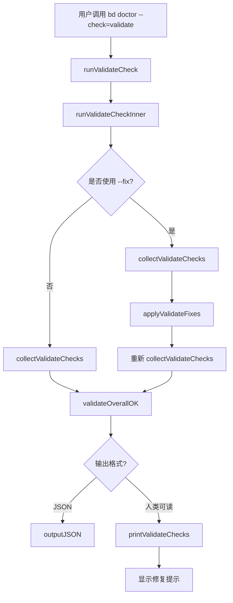

# 验证 CLI 集成模块技术深度解析

## 1. 模块概述

**验证 CLI 集成**模块是 beads 项目中一个专注于数据完整性检查的 CLI 工具组件。它作为 `doctor` 命令体系的一部分，提供了一套聚焦的数据验证检查，帮助用户快速识别和修复常见的数据完整性问题。

### 解决的核心问题

在项目管理工具中，随着时间推移和团队协作，数据完整性问题经常会悄然出现：
- 重复的 issue 条目
- 孤立的依赖关系（指向不存在的 issue）
- 测试污染（测试数据混入生产数据）
- Git 冲突标记残留

这些问题如果不及时发现和修复，会导致：
- 错误的依赖关系分析
- 不准确的统计数据
- 混乱的项目视图
- 潜在的数据同步问题

### 设计思路

该模块采用了"聚焦验证"的设计思路——不同于完整的 `doctor` 命令可能运行数十项检查，它专注于数据完整性领域的四项核心检查，提供快速、针对性的验证能力。同时，它集成了自动修复功能，让用户可以一键解决可修复的问题。

## 2. 核心组件分析

### validateCheckResult 结构体

```go
type validateCheckResult struct {
	check   doctorCheck
	fixable bool
}
```

这个结构体是模块的核心数据结构，它将一个检查结果与是否可自动修复的标志配对。这种设计体现了**关注点分离**的原则：
- `check` 字段包含检查的实际结果（名称、状态、消息等）
- `fixable` 字段标识该检查是否支持自动修复

这种配对设计使得在收集检查结果时就能明确知道哪些问题可以自动修复，为后续的修复流程提供了清晰的信息。

### 核心函数分析

#### runValidateCheck & runValidateCheckInner

这两个函数构成了模块的入口点：

```go
func runValidateCheck(path string) {
	if !runValidateCheckInner(path) {
		os.Exit(1)
	}
}

func runValidateCheckInner(path string) bool {
	// 实际的检查逻辑
}
```

**设计意图**：将 `os.Exit` 调用与实际业务逻辑分离，使 `runValidateCheckInner` 可以被测试代码调用而不会导致测试进程意外退出。这是一种常见的**可测试性设计模式**。

#### collectValidateChecks

这个函数负责收集并运行四项数据完整性检查：

```go
func collectValidateChecks(path string) []validateCheckResult {
	return []validateCheckResult{
		{check: convertDoctorCheck(doctor.CheckDuplicateIssues(path, doctorGastown, gastownDuplicatesThreshold))},
		{check: convertDoctorCheck(doctor.CheckOrphanedDependencies(path)), fixable: true},
		{check: convertDoctorCheck(doctor.CheckTestPollution(path))},
		{check: convertDoctorCheck(doctor.CheckGitConflicts(path))},
	}
}
```

**设计亮点**：
1. 集中管理所有检查，便于维护和扩展
2. 直接在返回语句中标记哪些检查可修复（目前只有 `CheckOrphanedDependencies`）
3. 使用 `convertDoctorCheck` 统一转换来自 `doctor` 包的检查结果

#### applyValidateFixes

这个函数处理自动修复逻辑，是模块中最复杂的函数之一：

```go
func applyValidateFixes(path string, checks []validateCheckResult) {
	// 1. 收集可修复的问题
	// 2. 交互式确认（除非 --yes）
	// 3. 应用修复
}
```

**设计特点**：
1. **复用现有机制**：重用 `doctor` 包的 `applyFixList` 函数进行实际修复，避免代码重复
2. **交互式确认**：在非自动化环境中要求用户确认，防止意外修改
3. **环境检测**：检测是否在交互式终端中运行，在非交互模式下给出明确提示
4. **灵活控制**：通过 `--yes` 标志支持自动化场景

## 3. 数据流程与架构

### 数据流程图



### 流程详解

1. **入口阶段**：用户通过 CLI 调用验证命令，控制权传递给 `runValidateCheck`
2. **检查收集阶段**：`collectValidateChecks` 调用 `doctor` 包中的四个检查函数，收集结果
3. **修复阶段**（如果使用 `--fix`）：
   - 收集可修复的问题
   - 检测运行环境并根据需要请求用户确认
   - 应用修复
   - 重新收集检查结果以反映修复后的状态
4. **结果评估阶段**：`validateOverallOK` 确定所有检查是否通过
5. **输出阶段**：根据用户选择输出 JSON 或人类可读格式

### 与其他模块的关系

- **依赖**：该模块深度依赖 [CLI Doctor Commands](CLI_Doctor_Commands.md) 模块，复用其核心检查功能
- **被依赖**：作为 CLI 命令体系的一部分，它被主 CLI 入口点调用
- **数据流向**：检查结果从 `doctor` 包流向本模块，经过格式化后输出给用户

## 4. 设计决策与权衡

### 1. 聚焦 vs 完整

**决策**：创建一个独立的验证命令，而不是简单使用完整的 `doctor` 命令

**原因**：
- **性能**：只运行四项检查比运行所有 doctor 检查更快
- **清晰**：专注于数据完整性，避免用户被其他不相关的检查结果干扰
- **可用性**：可以作为 CI/CD 流程中的快速验证步骤

**权衡**：
- ✅ 优点：快速、聚焦、易于集成到自动化流程
- ❌ 缺点：可能需要维护两套检查调用逻辑（虽然本模块复用了 doctor 的核心实现）

### 2. 修复逻辑的复用 vs 重写

**决策**：复用 `doctor` 包的 `applyFixList` 函数，而不是重写修复逻辑

**原因**：
- **DRY 原则**：避免代码重复，确保修复逻辑的一致性
- **可维护性**：修复逻辑的改进只需在一处进行
- **扩展性**：未来添加新的可修复检查时，无需修改本模块

**权衡**：
- ✅ 优点：代码复用、一致性好、维护成本低
- ❌ 缺点：对 `doctor` 包有较强依赖，耦合度较高

### 3. 交互式确认的设计

**决策**：在非自动化环境中要求用户确认修复操作

**原因**：
- **安全性**：防止用户意外修改数据
- **透明度**：让用户明确知道将要修复什么问题
- **用户体验**：给用户取消操作的机会

**实现细节**：
- 检测是否在交互式终端中运行
- 在非交互模式下给出明确提示，建议使用 `--yes` 标志
- 提供清晰的修复问题列表供用户确认

**权衡**：
- ✅ 优点：安全、透明、用户友好
- ❌ 缺点：增加了代码复杂度，在某些自动化场景中可能需要额外的 `--yes` 标志

### 4. 双重检查收集

**决策**：在应用修复后重新收集检查结果

**原因**：
- **准确性**：确保输出的结果反映修复后的实际状态
- **反馈闭环**：让用户看到修复的效果
- **可靠性**：即使某些修复失败，也能在最终结果中反映出来

**权衡**：
- ✅ 优点：结果准确、用户反馈清晰
- ❌ 缺点：需要额外运行一次检查，稍微增加了执行时间

## 5. 使用指南与最佳实践

### 基本使用

运行数据完整性检查：

```bash
bd doctor --check=validate
```

运行检查并自动修复可修复的问题：

```bash
bd doctor --check=validate --fix
```

在自动化脚本中使用（无需交互式确认）：

```bash
bd doctor --check=validate --fix --yes
```

### 输出格式

#### 人类可读格式（默认）

```
Data Integrity
  ✓  Duplicate Issues
  ✓  Orphaned Dependencies
  !  Test Pollution: 2 test issues found
     └─ Issue #123: test-issue-1
     └─ Issue #456: test-issue-2
  ✓  Git Conflicts

────────────────────────────────────────────────────────────────────────────────
✓ 3 passed  ! 1 warnings  ✗ 0 failed

Tip: Use 'bd doctor --check=validate --fix' to auto-repair fixable issues
```

#### JSON 格式

```bash
bd doctor --check=validate --json
```

输出：
```json
{
  "path": "/path/to/repo",
  "checks": [
    {
      "name": "Duplicate Issues",
      "status": "ok",
      "message": ""
    },
    {
      "name": "Orphaned Dependencies",
      "status": "ok",
      "message": ""
    },
    {
      "name": "Test Pollution",
      "status": "warning",
      "message": "2 test issues found"
    },
    {
      "name": "Git Conflicts",
      "status": "ok",
      "message": ""
    }
  ],
  "overall_ok": false
}
```

### 最佳实践

1. **CI/CD 集成**：在 CI 流程中添加验证检查，确保代码更改不会引入数据完整性问题

2. **定期检查**：在项目的定期维护中运行验证检查，及时发现和修复潜在问题

3. **修复前备份**：在使用 `--fix` 之前，建议先创建数据备份，以防意外情况

4. **结合使用**：将验证检查与完整的 `doctor` 检查结合使用，验证检查用于日常快速检查，完整检查用于定期全面检查

## 6. 边缘情况与注意事项

### 边缘情况

1. **非交互式环境中的修复尝试**

   如果在非交互式环境（如 CI/CD）中尝试使用 `--fix` 而没有 `--yes`，模块会：
   - 检测到非交互式环境
   - 输出警告信息
   - 跳过修复操作
   - 提供使用 `--yes` 的建议

2. **部分修复失败**

   如果某些修复成功而某些失败，模块会：
   - 应用所有可能的修复
   - 重新收集检查结果
   - 在最终输出中显示修复后的状态

3. **没有可修复的问题**

   如果使用 `--fix` 但没有可修复的问题，模块会：
   - 静默跳过修复步骤
   - 继续执行检查和输出流程

### 注意事项

1. **修复操作的不可逆性**

   虽然大多数修复操作是安全的，但某些修复（如删除孤立依赖）是不可逆的。建议在使用 `--fix` 前先备份数据。

2. **与完整 doctor 命令的关系**

   验证命令是完整 doctor 命令的子集，它只运行数据完整性相关的检查。对于全面的健康检查，仍需使用完整的 `bd doctor` 命令。

3. **性能考虑**

   虽然验证命令比完整 doctor 命令快，但在大型仓库中仍可能需要一些时间。在性能敏感的场景中，可能需要考虑优化或选择性运行检查。

4. **扩展检查列表**

   如果需要添加新的验证检查，应在 `collectValidateChecks` 函数中添加，并考虑是否需要标记为可修复。

## 7. 总结

验证 CLI 集成模块是一个专注于数据完整性检查的工具，它通过聚焦四项核心检查，提供了快速、有效的数据验证能力。其设计体现了以下关键原则：

1. **聚焦**：专注于数据完整性领域，避免信息过载
2. **复用**：充分利用现有 doctor 包的功能，避免代码重复
3. **安全**：提供交互式确认和环境检测，防止意外操作
4. **灵活**：支持多种输出格式和自动化场景

通过理解这个模块的设计思路和工作原理，开发者可以更好地使用它来维护项目数据的完整性，也可以为其扩展新的检查和修复功能。
