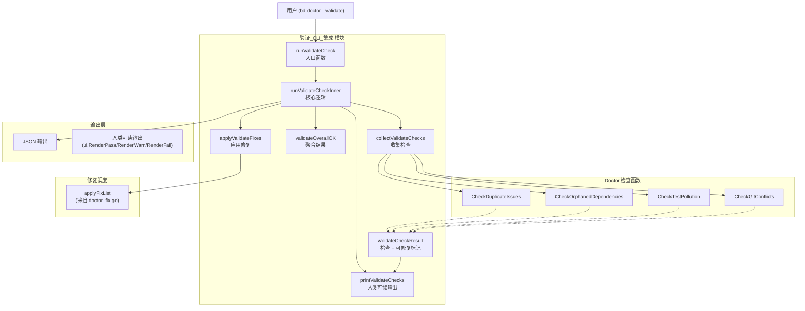

# 验证_CLI_集成

## 模块概述

想象一下你有一个复杂的数据库系统，里面存储着成千上万个 issue 和它们之间的依赖关系。随着时间推移，数据可能会"腐烂"：出现重复记录、悬空依赖、测试污染，或者与 Git 状态不同步。**验证_CLI_集成** 模块就是这个系统的"健康检查仪"——它运行一组聚焦的数据完整性检查，告诉你系统是否健康，并且在可能的情况下自动修复问题。

这个模块的核心洞察是：**验证和修复应该是同一个工作流的两个阶段，而不是两个独立的命令**。用户运行 `bd doctor --check=validate` 时，他们真正想要的是"告诉我哪里有问题，并且如果可能的话帮我修好"。模块通过将每个检查标记为是否可修复（`fixable`），并在 `--fix` 标志下自动进入修复流程，实现了这种无缝体验。

从架构角色来看，这是一个**验证器 + 协调器**：它调用底层的检查函数（来自 `doctor` 包），将结果包装成统一的结构，然后根据用户意图决定是仅报告还是执行修复。它不实现具体的检查逻辑，而是专注于编排和用户体验。

## 架构与数据流



### 数据流 walkthrough

1. **入口**：用户执行 `bd doctor --check=validate`（或 `--validate` 简写），调用 `runValidateCheck(path)`。这个函数只做一件事：调用 `runValidateCheckInner`，如果返回 `false` 则以退出码 1 终止进程。这种分离是**可测试性模式**——`runValidateCheckInner` 返回布尔值而不是调用 `os.Exit`，使得单元测试可以验证逻辑而不终止测试运行器。

2. **检查收集**：`collectValidateChecks` 创建四个 `validateCheckResult` 实例，每个对应一个数据完整性检查：
   - `CheckDuplicateIssues`：检测重复 issue（使用 Gastown 阈值）
   - `CheckOrphanedDependencies`：检测悬空依赖（**唯一标记为可修复的检查**）
   - `CheckTestPollution`：检测测试污染
   - `CheckGitConflicts`：检测 Git 冲突

3. **修复阶段（可选）**：如果 `--fix` 标志设置，`applyValidateFixes` 会被调用。它筛选出所有 `fixable=true` 且状态不是 `statusOK` 的检查，然后：
   - 检测终端是否交互模式（使用 `term.IsTerminal`）
   - 非交互模式下，如果没有 `--yes` 则跳过并提示用户
   - 交互模式下，显示问题列表并等待用户确认
   - 调用 `applyFixList` 执行实际修复

4. **重新检查**：修复后，`collectValidateChecks` 再次运行，确保输出反映修复后的状态。这是一个**防御性设计**——修复可能失败或部分成功，重新检查保证用户看到的是真实状态。

5. **结果聚合**：`validateOverallOK` 遍历所有检查，如果任何一个状态是 `statusError` 或 `statusWarning` 则返回 `false`。这个简单的逻辑意味着**任何警告都视为整体失败**，体现了"零容忍"的数据完整性哲学。

6. **输出**：根据 `jsonOutput` 标志，选择 JSON 或人类可读格式。人类可读输出使用 `ui` 包的样式函数（`RenderPass`、`RenderWarn`、`RenderFail`）提供视觉反馈，并在有可修复问题时显示提示。

## 组件深度解析

### `validateCheckResult`

```go
type validateCheckResult struct {
    check   doctorCheck
    fixable bool
}
```

**设计意图**：这个结构体是模块的核心抽象，它将底层的 `doctorCheck`（来自 [诊断核心](诊断核心.md)）与一个布尔标记 `fixable` 组合在一起。为什么需要这个包装？

关键在于**关注点分离**：`doctorCheck` 是通用的检查结果结构，被所有 doctor 检查共享。但验证场景有特殊需求——它需要知道哪些检查可以自动修复。如果直接在 `doctorCheck` 中添加 `Fixable` 字段，会污染通用结构，并且其他检查类别（如服务器健康、迁移验证）不需要这个字段。

`validateCheckResult` 是一个**上下文特定的视图**：它只在验证工作流中存在，将"检查结果"和"修复能力"这两个概念绑定在一起。这种设计避免了在通用结构中塞入特定场景的字段，同时保持了类型安全。

**使用模式**：
- `check` 字段存储实际的检查结果（名称、状态、消息、详情）
- `fixable` 字段在编译时硬编码（目前只有 `CheckOrphanedDependencies` 为 `true`）
- 在 `applyValidateFixes` 中用于过滤可修复的检查

**扩展点**：未来如果其他检查变得可修复，只需在 `collectValidateChecks` 中设置对应的 `fixable: true`，无需修改结构体或修复逻辑。

### `runValidateCheckInner`

```go
func runValidateCheckInner(path string) bool
```

**职责**：执行完整的验证工作流，返回整体是否通过。

**内部机制**：
1. 调用 `collectValidateChecks` 获取初始检查结果
2. 如果 `doctorFix` 为真，调用 `applyValidateFixes` 然后重新收集检查
3. 调用 `validateOverallOK` 判断整体状态
4. 根据 `jsonOutput` 选择输出格式
5. 如果不是修复模式且整体未通过，检查是否有可修复问题并显示提示
6. 如果整体通过，显示成功消息

**返回值**：`true` 表示所有检查通过（状态为 `statusOK`），`false` 表示存在警告或错误。

**副作用**：
- 向标准输出打印检查结果（除非 JSON 模式）
- 如果 `--fix` 设置，可能修改仓库状态（通过 `applyFixList`）
- 如果整体失败且非 JSON 模式，以退出码 1 终止进程（在 `runValidateCheck` 中）

**设计权衡**：这个函数做了太多事情——收集、修复、聚合、输出。理想情况下应该拆分成更小的函数。但考虑到验证工作流是线性的、步骤之间有依赖（修复后需要重新检查），合并到一个函数中减少了状态传递的复杂性。这是一个**实用性优于纯粹性**的选择。

### `collectValidateChecks`

```go
func collectValidateChecks(path string) []validateCheckResult
```

**职责**：执行四个数据完整性检查并包装成 `validateCheckResult` 切片。

**检查详解**：

| 检查函数 | 可修复 | 说明 |
|---------|--------|------|
| `CheckDuplicateIssues(path, doctorGastown, gastownDuplicatesThreshold)` | ❌ | 检测重复 issue，使用 Gastown 存储和阈值配置 |
| `CheckOrphanedDependencies(path)` | ✅ | 检测没有对应 issue 的悬空依赖引用 |
| `CheckTestPollution(path)` | ❌ | 检测测试文件中的污染（如硬编码路径） |
| `CheckGitConflicts(path)` | ❌ | 检测 Git 合并冲突标记 |

**设计洞察**：为什么只有 `CheckOrphanedDependencies` 是可修复的？因为悬空依赖的修复策略是明确的——删除无效的依赖引用。而其他检查（如重复 issue、Git 冲突）需要人工判断：哪个重复项应该保留？冲突应该如何解决？这些决策无法自动化。

**参数传递**：`CheckDuplicateIssues` 需要额外的 `doctorGastown` 和 `gastownDuplicatesThreshold` 参数，这些是全局标志，控制 Gastown 存储的使用和重复阈值。这种设计允许用户通过命令行调整检查的敏感度。

### `applyValidateFixes`

```go
func applyValidateFixes(path string, checks []validateCheckResult)
```

**职责**：自动修复所有可修复的验证问题。

**内部机制**：
1. 过滤出 `fixable=true` 且状态不是 `statusOK` 的检查
2. 如果没有可修复问题，直接返回
3. 如果 `doctorYes` 为假，进入交互确认流程：
   - 检测终端是否交互模式（`term.IsTerminal(int(os.Stdin.Fd()))`）
   - 非交互模式下，打印警告并提示使用 `--yes` 标志
   - 交互模式下，显示问题列表并等待用户输入 Y/n
4. 调用 `applyFixList(path, fixable)` 执行实际修复

**关键设计决策**：

**交互 vs 非交互模式检测**：使用 `term.IsTerminal` 检测标准输入是否是终端。这是一个**防御性设计**，防止在 CI/CD 或脚本中意外阻塞。如果检测到非交互模式且没有 `--yes`，函数会打印有帮助的错误信息而不是静默失败或无限等待。

**复用现有修复基础设施**：函数注释明确说明"Reuses doctor's applyFixList for dispatch (doctor_fix.go)"。这是一个**避免重复**的选择——验证模块不实现自己的修复逻辑，而是委托给 doctor 的通用修复调度器。这意味着：
- 修复逻辑集中在一处，易于维护
- 验证模块只关心"哪些检查可修复"，不关心"如何修复"
- 未来添加新的可修复检查时，只需在 `applyFixList` 中添加 case

**确认提示的 UX 设计**：提示语是"This will attempt to fix %d issue(s). Continue? (Y/n): "。使用"attempt"而不是"will"是**诚实的 UX**——修复可能失败，提前管理用户预期。默认选项是 Y（空输入视为同意），因为验证场景下用户通常确实想要修复。

### `printValidateChecks`

```go
func printValidateChecks(checks []validateCheckResult)
```

**职责**：以人类可读格式打印验证结果。

**输出格式**：
```
Data Integrity
  ✓  Duplicate Issues
  ⚠  Orphaned Dependencies: Found 3 orphaned dependencies
     └─ Storage: dolt
  ✗  Git Conflicts: Found conflicts in 2 files

────────────────────────────────────────
✓ 2 passed  ⚠ 1 warnings  ✗ 1 failed
```

**实现细节**：
- 使用 `ui.RenderCategory` 渲染类别标题
- 使用 `ui.RenderPassIcon`、`ui.RenderWarnIcon`、`ui.RenderFailIcon` 渲染状态图标
- 使用 `ui.RenderMuted` 渲染次要信息（消息和详情）
- 使用 `ui.MutedStyle.Render(ui.TreeLast)` 渲染树形连接线
- 最后显示汇总统计

**设计意图**：这个函数体现了**渐进式信息披露**原则。基本信息（检查名称和状态）总是显示，详细信息（消息和详情）只在存在时显示。汇总统计帮助用户快速了解整体情况。

## 依赖分析

### 上游依赖（被调用）

| 依赖模块 | 组件 | 调用原因 |
|---------|------|---------|
| [诊断核心](诊断核心.md) | `doctor.CheckDuplicateIssues` | 检测重复 issue |
| [诊断核心](诊断核心.md) | `doctor.CheckOrphanedDependencies` | 检测悬空依赖 |
| [诊断核心](诊断核心.md) | `doctor.CheckTestPollution` | 检测测试污染 |
| [诊断核心](诊断核心.md) | `doctor.CheckGitConflicts` | 检测 Git 冲突 |
| [诊断核心](诊断核心.md) | `doctorCheck` | 检查结果数据结构 |
| cmd.bd.doctor.fix | `applyFixList` | 执行实际修复 |
| internal/ui | `RenderPass`, `RenderWarn`, `RenderFail` | 格式化输出 |
| internal/ui | `RenderCategory`, `RenderSeparator`, `RenderMuted` | 样式渲染 |
| golang.org/x/term | `IsTerminal` | 检测交互模式 |

### 下游依赖（调用者）

| 调用模块 | 组件 | 调用场景 |
|---------|------|---------|
| cmd.bd.doctor | `runValidateCheck` | 用户执行 `bd doctor --check=validate` |

### 数据契约

**输入**：
- `path string`：仓库路径
- 全局标志：`doctorFix`（是否修复）、`doctorYes`（是否跳过确认）、`jsonOutput`（是否 JSON 输出）、`doctorGastown`（Gastown 存储）、`gastownDuplicatesThreshold`（重复阈值）

**输出**：
- 控制台输出（人类可读或 JSON）
- 退出码：0 表示通过，1 表示失败
- 副作用：如果 `--fix` 设置，可能修改仓库状态

**隐式契约**：
1. 所有检查函数必须返回 `doctorCheck` 结构，且 `Status` 字段必须是 `statusOK`、`statusWarning` 或 `statusError` 之一
2. `applyFixList` 必须能够处理传入的检查列表，并尝试修复每个检查
3. 修复后重新检查必须反映真实状态（修复可能部分成功）

## 设计决策与权衡

### 1. 验证与修复的耦合

**选择**：验证和修复在同一个命令中，通过 `--fix` 标志切换。

**替代方案**：分离成两个命令，如 `bd doctor --validate` 和 `bd doctor --fix-validate`。

**权衡**：
- **耦合的优势**：用户体验更流畅，发现问题的同时可以立即修复；代码复用（`collectValidateChecks` 被调用两次）
- **耦合的劣势**：函数职责不单一；修复逻辑依赖验证结果结构

**为什么这样选择**：验证和修复是同一个用户意图的两个阶段。分离会导致用户需要运行两次命令，且第二次命令需要重新执行相同的检查来知道修复什么。耦合减少了冗余工作，符合"约定优于配置"的原则。

### 2. 硬编码的可修复标记

**选择**：`fixable` 字段在 `collectValidateChecks` 中硬编码，而不是从检查函数返回。

**替代方案**：让每个检查函数返回 `fixable` 信息，如 `CheckOrphanedDependencies() (doctorCheck, bool)`。

**权衡**：
- **硬编码的优势**：检查函数保持简单，只关注检测逻辑；可修复性是验证场景的元数据，不是检查本身的属性
- **硬编码的劣势**：如果检查的可修复性变化，需要修改 `collectValidateChecks` 而不是检查函数

**为什么这样选择**：可修复性不是检查的内在属性，而是**上下文的属性**。同一个检查在不同上下文中可能有不同的修复策略。将 `fixable` 放在验证模块中，保持了检查函数的通用性。

### 3. 修复后重新检查

**选择**：修复后再次调用 `collectValidateChecks`，而不是信任修复函数的返回值。

**替代方案**：`applyFixList` 返回修复结果，直接更新检查状态。

**权衡**：
- **重新检查的优势**：保证输出反映真实状态；修复可能部分成功或失败；防御性编程
- **重新检查的劣势**：性能开销（检查被执行两次）

**为什么这样选择**：数据完整性检查的性能开销相对较小（毫秒级），而状态不一致的代价很高（用户看到错误的成功状态）。这是一个**正确性优于性能**的选择。

### 4. 交互模式检测

**选择**：使用 `term.IsTerminal(int(os.Stdin.Fd()))` 检测是否交互模式。

**替代方案**：仅依赖 `--yes` 标志，非交互模式下默认失败。

**权衡**：
- **检测的优势**：在 CI/CD 中提供有帮助的错误信息；防止意外阻塞
- **检测的劣势**：增加了复杂性；在某些边缘情况下可能误判（如伪终端）

**为什么这样选择**：CLI 工具应该**优雅降级**。在交互模式下，用户可以看到提示并做出选择；在非交互模式下，工具应该提供清晰的错误信息而不是静默失败或无限等待。

### 5. 任何警告都视为失败

**选择**：`validateOverallOK` 将 `statusWarning` 和 `statusError` 都视为失败。

**替代方案**：仅将 `statusError` 视为失败，`statusWarning` 仅显示但不影响退出码。

**权衡**：
- **零容忍的优势**：强制用户关注所有问题；防止警告累积成错误
- **零容忍的劣势**：可能过于严格；某些警告可能是可接受的

**为什么这样选择**：数据完整性是系统的基石。警告意味着"可能有问题"，在数据完整性场景下，**宁可错杀不可放过**。用户可以通过 `--fix` 自动修复，或者手动检查警告原因。

## 使用指南

### 基本用法

```bash
# 运行验证检查
bd doctor --check=validate

# 运行验证并自动修复
bd doctor --check=validate --fix

# 运行验证并跳过确认提示
bd doctor --check=validate --fix --yes

# JSON 输出（适合脚本处理）
bd doctor --check=validate --json
```

### 在脚本中使用

```bash
#!/bin/bash
# CI/CD 中的验证检查
if ! bd doctor --check=validate --json > /tmp/validate.json; then
    echo "验证失败，检查结果："
    cat /tmp/validate.json
    exit 1
fi
```

### 配置选项

| 标志 | 类型 | 默认值 | 说明 |
|-----|------|--------|------|
| `--check=validate` | 标志 | - | 选择验证检查 |
| `--fix` | 标志 | `false` | 自动修复可修复的问题 |
| `--yes` | 标志 | `false` | 跳过修复确认提示 |
| `--json` | 标志 | `false` | 输出 JSON 格式 |
| `--gastown` | 标志 | `false` | 使用 Gastown 存储检查重复 |
| `--gastown-duplicates-threshold` | 整数 | 系统默认 | 重复检测阈值 |

## 边界情况与陷阱

### 1. 非交互模式下的修复

**问题**：在 CI/CD 或脚本中运行 `bd doctor --check=validate --fix` 时，如果没有 `--yes` 标志，修复会被跳过。

**表现**：
```
⚠ Running in non-interactive mode
  To auto-fix issues without prompting, use: bd doctor --validate --yes
```

**解决方案**：在脚本中始终使用 `--yes` 标志，或者先运行不带 `--fix` 的检查，根据结果决定是否运行带 `--fix --yes` 的命令。

### 2. 修复后状态不一致

**问题**：修复可能部分成功，导致重新检查后仍有问题。

**表现**：运行 `--fix` 后，输出仍显示某些检查失败。

**原因**：`applyFixList` 可能对某些问题修复失败（如权限问题、并发修改）。

**解决方案**：检查输出的详细信息，手动干预无法自动修复的问题。这是一个**设计特性**——工具诚实地报告状态，而不是假装成功。

### 3. Gastown 存储依赖

**问题**：`CheckDuplicateIssues` 依赖 Gastown 存储，如果未配置可能导致检查跳过或失败。

**表现**：重复检查显示"跳过"或"存储不可用"。

**解决方案**：确保 Gastown 存储正确配置，或使用 `--gastown` 标志显式启用。

### 4. 并发修改

**问题**：在验证过程中，其他进程可能修改仓库状态。

**表现**：检查结果可能不是最新状态，修复可能失败。

**解决方案**：在运行验证前确保没有其他进程修改仓库。这是一个**已知限制**——验证不是原子操作。

### 5. JSON 输出的结构变化

**问题**：JSON 输出结构可能随版本变化，依赖它的脚本可能断裂。

**表现**：脚本解析 JSON 失败或获取错误的字段。

**解决方案**：不要依赖未文档化的 JSON 字段。当前输出结构：
```json
{
    "path": "仓库路径",
    "checks": [
        {
            "name": "检查名称",
            "status": "statusOK|statusWarning|statusError",
            "message": "消息",
            "detail": "详情（可选）",
            "fix": "修复建议（可选）",
            "category": "类别（可选）"
        }
    ],
    "overall_ok": true|false
}
```

## 扩展指南

### 添加新的验证检查

1. 在 `internal/doctor` 包中实现检查函数：
```go
func CheckNewIssue(path string) doctorCheck {
    // 实现检查逻辑
    return doctorCheck{
        Name:   "New Issue Check",
        Status: statusOK, // 或 statusWarning/statusError
        Message: "检查结果",
    }
}
```

2. 在 `collectValidateChecks` 中添加：
```go
func collectValidateChecks(path string) []validateCheckResult {
    return []validateCheckResult{
        // ... 现有检查
        {check: convertDoctorCheck(doctor.CheckNewIssue(path)), fixable: false},
    }
}
```

3. 如果检查可修复，在 `internal/doctor/fix` 包中添加修复逻辑，并在 `applyFixList` 中添加 case。

### 使检查可修复

1. 确保检查的 `Fix` 字段有值（修复建议）
2. 在 `collectValidateChecks` 中设置 `fixable: true`
3. 在 `applyFixList` 中添加对应的修复 case

## 相关模块

- [诊断核心](诊断核心.md)：提供底层检查函数和 `doctorCheck` 数据结构
- [hook 集成检测与修复](hook_集成检测与修复.md)：提供 `applyFixList` 修复调度器
- [internal/ui](internal_ui.md)：提供输出样式渲染函数
