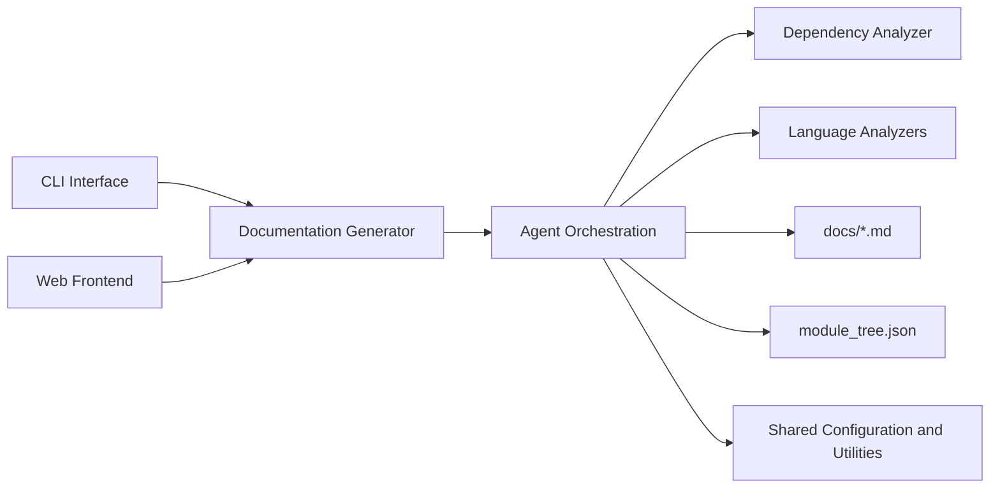
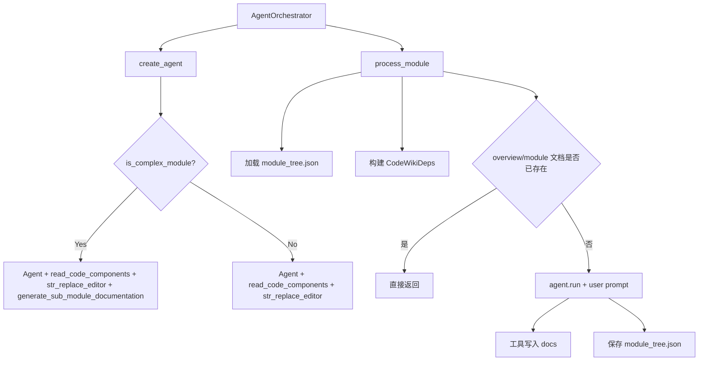
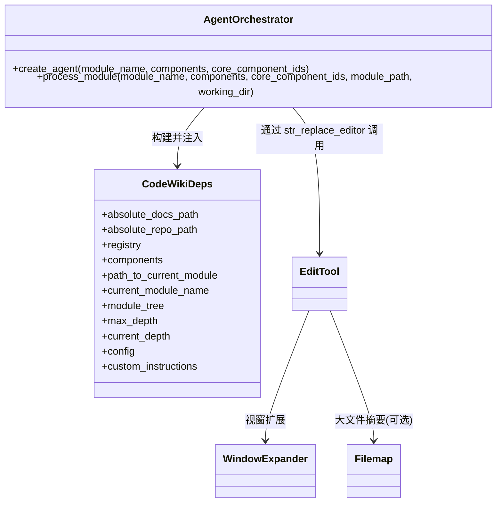
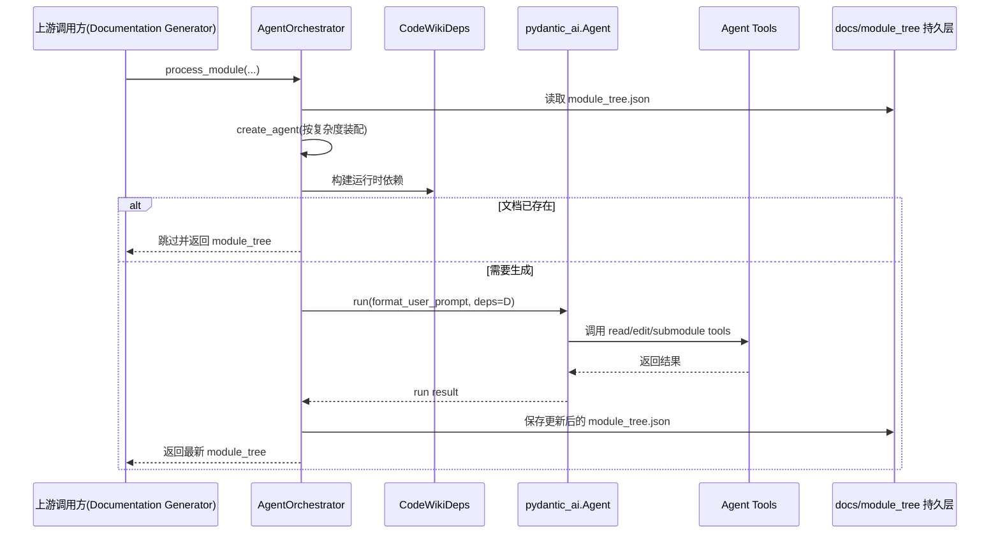

# Agent Orchestration

## 简介与职责

`Agent Orchestration` 模块是 CodeWiki 文档生成流程中的**执行中枢**：它负责把“模块树 + 核心组件代码 + 运行配置”转化为一次可执行的 AI Agent 文档生成任务，并通过受控工具链完成文档落盘。

该模块核心价值：

- 根据模块复杂度动态装配 Agent 能力（普通模块 vs 复杂模块）
- 注入统一运行时依赖上下文（`CodeWikiDeps`）
- 协调工具调用（读代码、编辑文档、生成子模块文档）
- 保证幂等执行（已有文档时跳过）与状态持久化（`module_tree.json`）

---

## 在系统中的位置

- 与上游关系：由 [Documentation Generator.md](Documentation Generator.md) 触发具体模块文档生成。
- 与下游关系：产出的 Markdown 后续可被 [CLI Interface.md](CLI Interface.md) 的 HTML/Git 流程或 [Web Frontend.md](Web Frontend.md) 消费。

> 说明：本文件聚焦 **Agent Orchestration**，不重复依赖分析细节。依赖图构建请见 [Dependency Analyzer.md](Dependency Analyzer.md) 与 [Language Analyzers.md](Language Analyzers.md)。

---

## 架构总览

---

## 核心组件与子模块

当前模块可分为 3 个子模块：

1. **orchestration-runtime**（运行时编排）  
   负责 Agent 创建策略、执行流程、跳过策略与状态持久化。  
   详见：[orchestration-runtime.md](orchestration-runtime.md)

2. **agent-dependency-context**（依赖上下文契约）  
   通过 `CodeWikiDeps` 承载路径、组件、模块树、深度控制与全局配置。  
   详见：[agent-dependency-context.md](agent-dependency-context.md)

3. **agent-editing-toolchain**（编辑工具链）  
   提供 `WindowExpander`、`EditTool`、`Filemap` 等能力，支撑安全可回滚的文档编辑。  
   详见：[agent-editing-toolchain.md](agent-editing-toolchain.md)

---

## 关键组件关系

---

## 端到端数据流

---

## 设计要点（维护视角）

- **能力按复杂度升级**：复杂模块才启用 `generate_sub_module_documentation`，避免简单模块过度拆分。
- **仓库与文档目录隔离**：`str_replace_editor` 在 `repo` 目录仅允许 `view`，编辑仅限 `docs`，降低误改源码风险。
- **幂等与可恢复**：已存在文档即跳过；工具支持 `undo_edit`。
- **统一上下文协议**：工具和 Agent 通过 `CodeWikiDeps` 共享同一运行时事实，减少参数漂移。

---

## 与其它模块的边界

- 依赖分析来源： [Dependency Analyzer.md](Dependency Analyzer.md)、[Language Analyzers.md](Language Analyzers.md)
- 任务与配置模型： [CLI Models.md](CLI Models.md)
- 触发入口与运维交互： [CLI Interface.md](CLI Interface.md)、[Web Frontend.md](Web Frontend.md)
- 全局配置与文件工具： [Shared Configuration and Utilities.md](Shared Configuration and Utilities.md)

---

## 文件索引

- 主文档：`Agent Orchestration.md`
- 子模块：
  - `orchestration-runtime.md`
  - `agent-dependency-context.md`
  - `agent-editing-toolchain.md`
