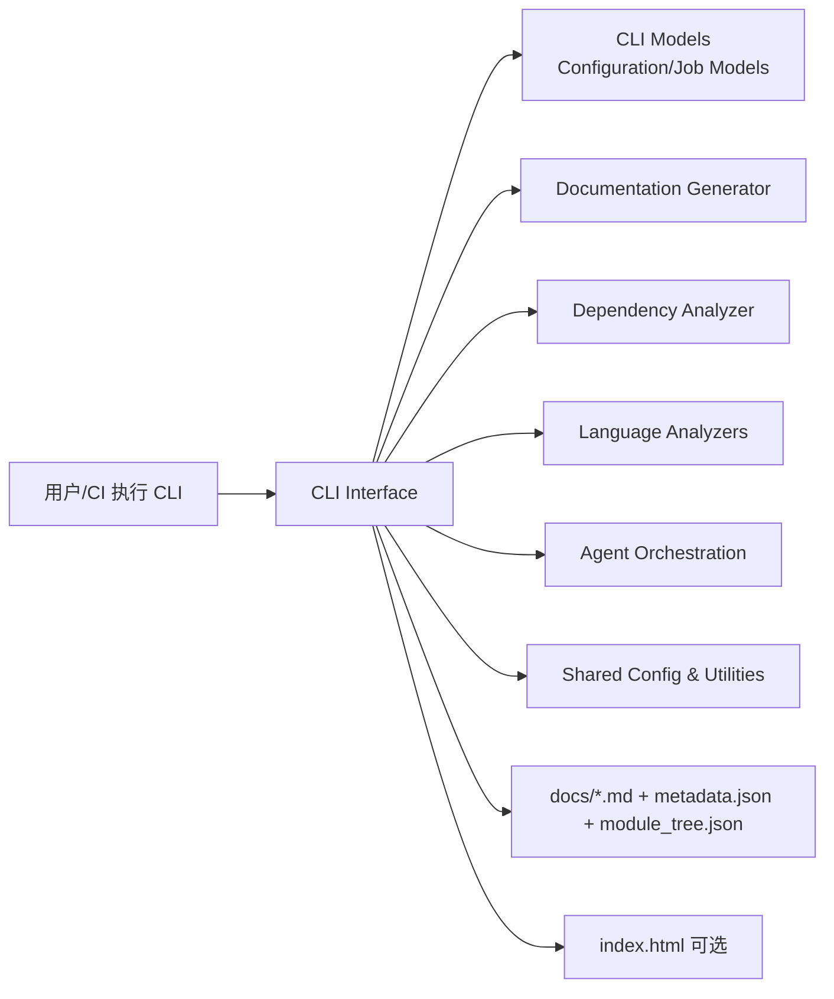
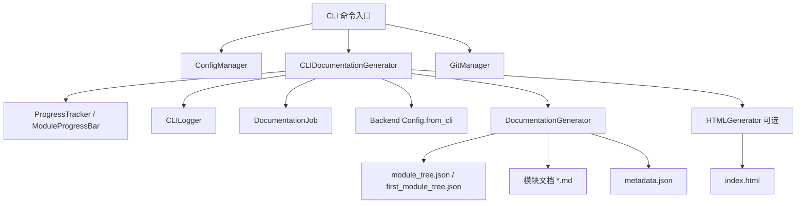
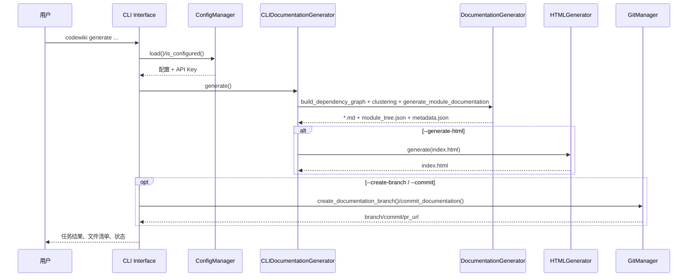
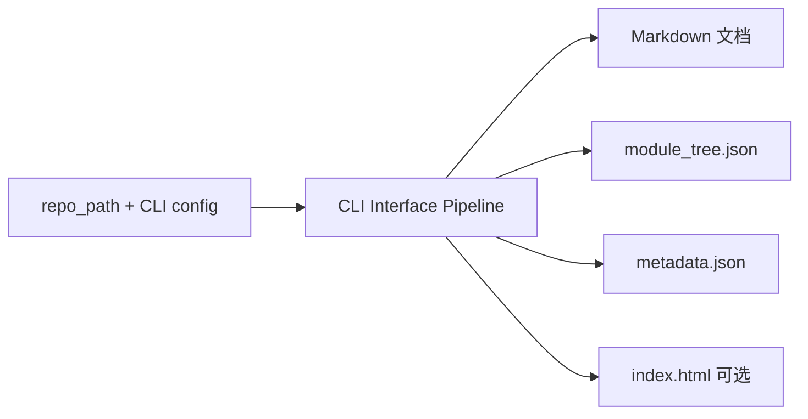

# CLI Interface

## 模块简介

`CLI Interface` 是 CodeWiki 在命令行场景下的入口层，负责把“用户命令 + 本地仓库 + 配置参数”转换为可执行的文档生成流水线。

它本身不实现核心代码分析或 LLM 文档生成算法，而是承担**编排与适配**职责：

- 管理 CLI 运行时配置与密钥
- 驱动后端依赖分析与文档生成
- 提供进度、日志与错误反馈
- 集成 Git 工作流（分支、提交、PR 链接）
- 可选生成 `index.html` 静态浏览器视图

---

## 在系统中的定位

`CLI Interface` 是“前台调度层”，后端模块（`Documentation Generator`、`Dependency Analyzer`、`Agent Orchestration`）是“执行引擎层”。

---

## 架构总览（CLI Interface 内部）

### 已生成的 CLI Interface 子模块文档

- [cli-adapter-generation.md](cli-adapter-generation.md)
- [configuration-and-credentials.md](configuration-and-credentials.md)
- [git-operations.md](git-operations.md)
- [html-viewer-generation.md](html-viewer-generation.md)
- [cli-observability.md](cli-observability.md)

---

## 核心子模块与职责

> 详细设计见各子文档（已拆分，避免重复）。

| 子模块 | 核心组件 | 主要职责 | 详细文档 |
|---|---|---|---|
| CLI 生成适配层 | `CLIDocumentationGenerator` | 串联 5 阶段流水线；桥接 CLI 参数与后端配置；维护 `DocumentationJob` 生命周期 | [cli-adapter-generation.md](cli-adapter-generation.md) |
| 配置与凭据管理 | `ConfigManager` | 维护 `~/.codewiki/config.json`；通过 keyring 安全保存 API Key；配置完整性检查 | [configuration-and-credentials.md](configuration-and-credentials.md) |
| Git 工作流集成 | `GitManager` | 仓库状态检查、文档分支创建、提交 docs、推导 GitHub PR URL | [git-operations.md](git-operations.md) |
| HTML 浏览器生成 | `HTMLGenerator` | 从 `module_tree.json`/`metadata.json` 生成静态 `index.html`（GitHub Pages/local） | [html-viewer-generation.md](html-viewer-generation.md) |
| CLI 可观测性 | `CLILogger` / `ProgressTracker` / `ModuleProgressBar` | 终端日志、阶段进度、模块级进度条、ETA 估算 | [cli-observability.md](cli-observability.md) |

---

## 关键流程（端到端）

---

## 阶段模型（CLIDocumentationGenerator）

`ProgressTracker` 定义了标准 5 阶段权重：

1. Dependency Analysis（40%）
2. Module Clustering（20%）
3. Documentation Generation（30%）
4. HTML Generation（5%，可选）
5. Finalization（5%）

该模型确保 CLI 输出具有稳定的“阶段感知”，即使不同仓库规模差异较大，也能给出可理解的执行进度与 ETA。

---

## 与其他模块的关系（避免重复）

CLI Interface 主要做“调用与适配”，以下能力由外部模块提供：

- 依赖图与调用图分析：见 [dependency-analyzer.md](dependency-analyzer.md)
- 多语言 AST/Tree-sitter 解析：见 [language-analyzers.md](language-analyzers.md)
- Agent 执行与工具链：见 [agent-orchestration.md](agent-orchestration.md)
- 文档内容生成主流程：见 [documentation-generator.md](documentation-generator.md)
- 配置基类与通用文件工具：见 [shared-configuration-and-utilities.md](shared-configuration-and-utilities.md)
- CLI 数据模型：见 [cli-models.md](cli-models.md)

---

## 数据产物与目录语义

典型输出（`output_dir`）包括：

- `*.md`：模块文档与总览
- `module_tree.json`：当前模块树
- `first_module_tree.json`：初次聚类缓存（用于复用）
- `metadata.json`：生成元数据
- `index.html`：静态浏览器（可选）

---

## 错误处理与可维护性要点

- CLI 层统一把阶段失败包装为可理解的错误（如 `APIError` / `ConfigurationError` / `RepositoryError`）。
- `ConfigManager` 在 keyring 不可用时支持回退，提升跨平台可用性。
- `GitManager` 默认阻止“脏工作区”直接建分支，保证文档提交可追溯。
- `CLIDocumentationGenerator` 的阶段化输出便于定位瓶颈（分析慢、聚类慢、生成慢）。

---

## 维护者快速导航

- 执行主入口与后端桥接：**[cli-adapter-generation.md](cli-adapter-generation.md)**
- 配置/密钥问题：**[configuration-and-credentials.md](configuration-and-credentials.md)**
- Git 分支与提交问题：**[git-operations.md](git-operations.md)**
- HTML 页面渲染问题：**[html-viewer-generation.md](html-viewer-generation.md)**
- 日志/进度显示问题：**[cli-observability.md](cli-observability.md)**

