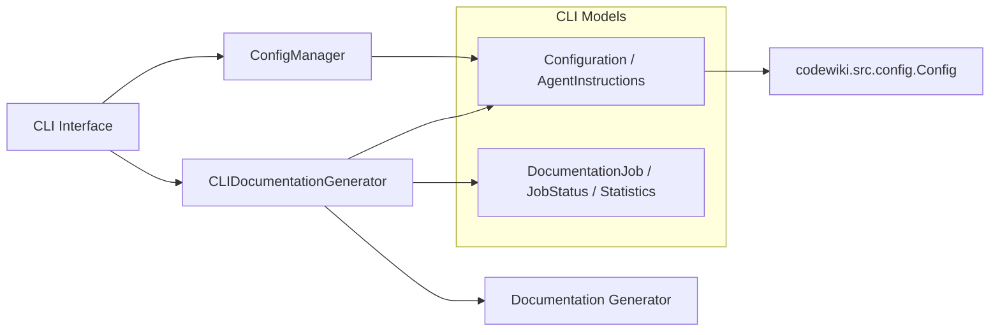
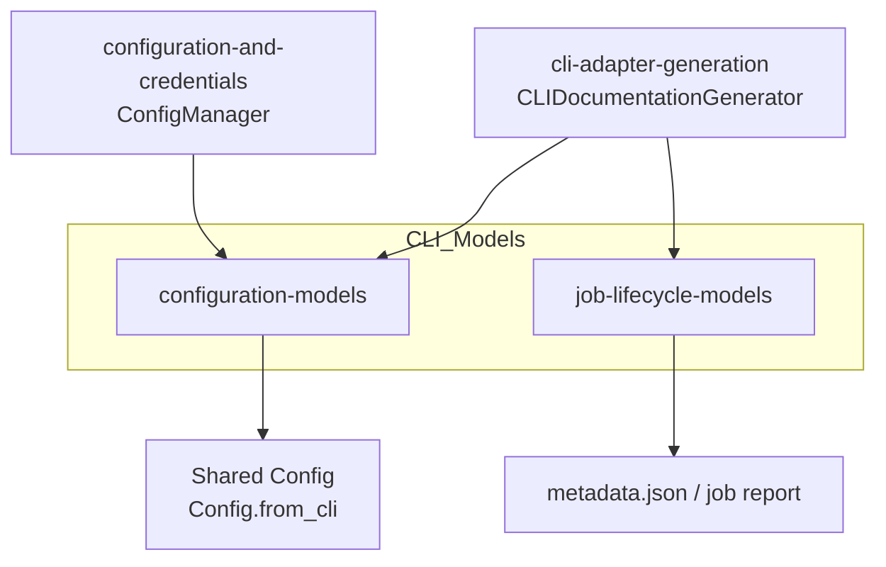
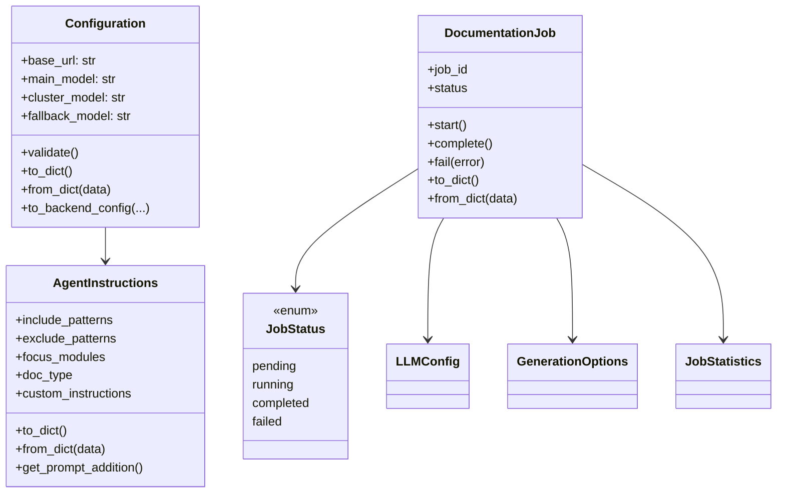
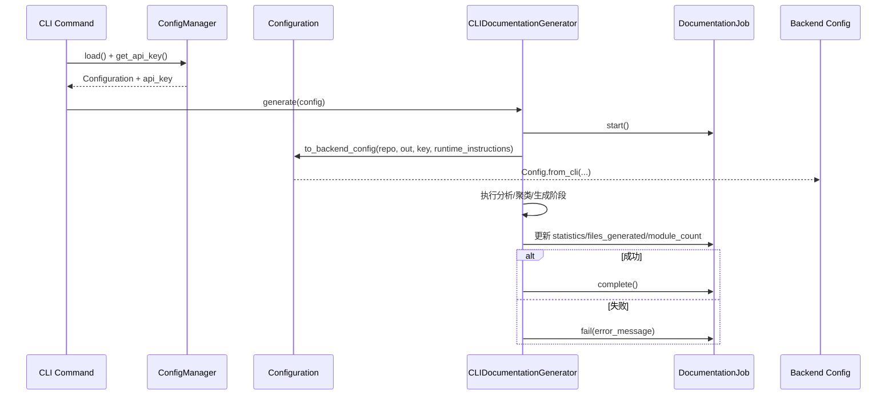

# CLI Models

## 模块简介

`CLI Models` 是 `CLI Interface` 的数据契约层，负责定义：

- **配置模型**：如何表达 CLI 持久化配置、运行时覆盖参数、以及向后端 `Config` 的转换。
- **任务模型**：如何表达一次文档生成任务的生命周期、状态、统计信息与序列化格式。

该模块不直接执行依赖分析或文档生成，而是为上层编排器（如 `CLIDocumentationGenerator`、`ConfigManager`）提供稳定的数据结构。

---

## 在系统中的定位

- 上游：`CLI Interface.md`（命令入口与编排）
- 下游：`shared-configuration-and-utilities.md`（后端 `Config` 契约）
- 配套：`cli-adapter-generation.md`、`configuration-and-credentials.md`

---

## 架构总览

`CLI Models` 可清晰拆分为两个子模块：

1. **configuration-models**：配置语义、校验、序列化、CLI→Backend 配置桥接。
2. **job-lifecycle-models**：任务状态机、运行元数据、结果与统计的序列化。

---

## 子模块总览（含详细文档链接）

| 子模块 | 核心组件 | 关键职责 | 详细文档 |
|---|---|---|---|
| configuration-models | `Configuration`, `AgentInstructions` | 持久化配置建模、字段校验、指令合并、转换为后端 `Config` | [configuration-models.md](configuration-models.md) |
| job-lifecycle-models | `DocumentationJob`, `JobStatus`, `JobStatistics`, `LLMConfig`, `GenerationOptions` | 任务状态机、执行元数据、统计与 JSON 序列化 | [job-lifecycle-models.md](job-lifecycle-models.md) |

---

## 核心组件关系

---

## 关键数据流

---

## 与其他模块的边界

为避免重复，详细实现请参考下列文档：

- CLI 执行编排：[`CLI Interface.md`](CLI%20Interface.md)
- CLI 生成适配：[`cli-adapter-generation.md`](cli-adapter-generation.md)
- 配置/凭据读写：[`configuration-and-credentials.md`](configuration-and-credentials.md)
- 当前模块子文档（配置模型）：[`configuration-models.md`](configuration-models.md)
- 当前模块子文档（任务生命周期模型）：[`job-lifecycle-models.md`](job-lifecycle-models.md)
- 后端配置基类：`Shared Configuration and Utilities` 模块文档（`shared-configuration-and-utilities.md`）
- Web 任务状态模型：`Web Frontend` 模块文档（`JobStatus` / `JobStatusResponse`）

> 说明：CLI 的 `JobStatus`（`pending/running/completed/failed`）与 Web Frontend 状态字段（常见为 `queued/processing/completed/failed`）语义相近但并非同一模型，应通过适配层显式映射。

---

## 维护要点

- 配置模型与后端 `Config` 字段需保持同步，避免 CLI/Backend 配置漂移。
- `AgentInstructions` 的 prompt 规则在 CLI 与 Backend 两侧均有体现，变更时建议同步检查。
- 任务模型默认不强制状态迁移约束（由编排层保证顺序），扩展并发/恢复能力时建议补充状态守卫。

---

## 维护者快速导航

- 配置语义与转换细节：**[configuration-models.md](configuration-models.md)**
- 任务生命周期与序列化：**[job-lifecycle-models.md](job-lifecycle-models.md)**
