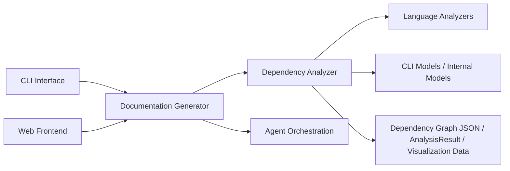
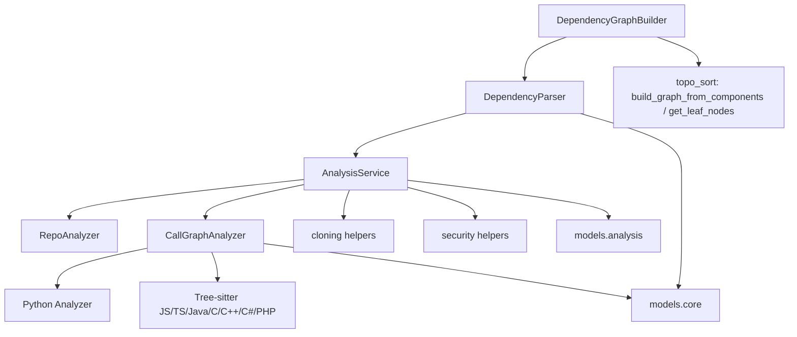
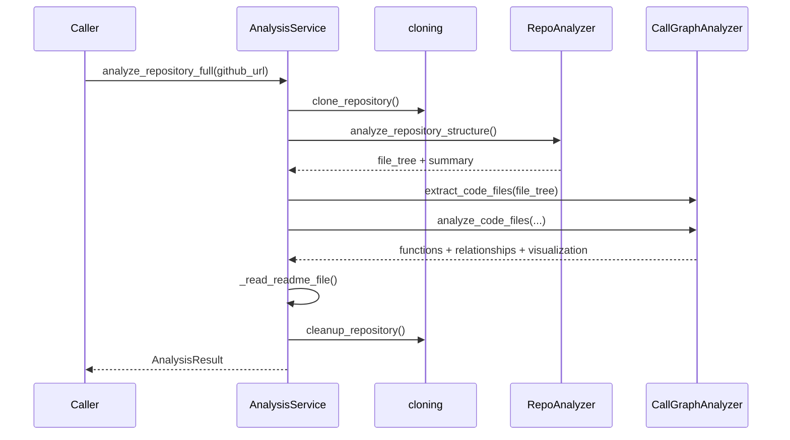
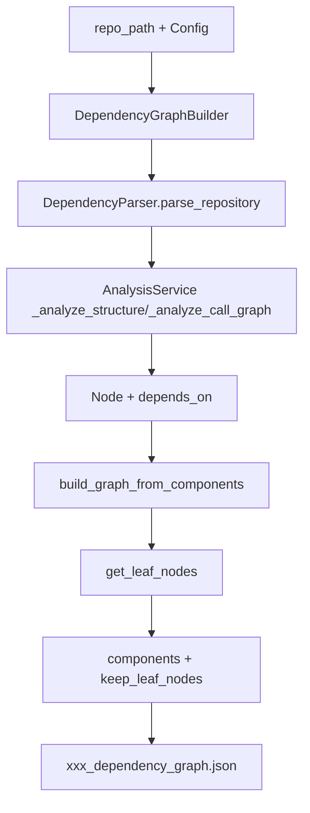
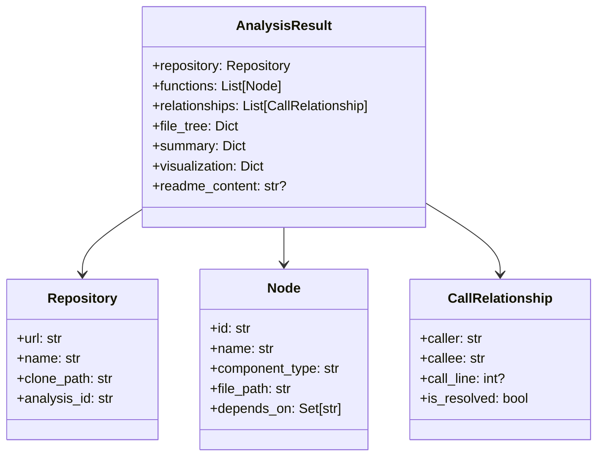

# Dependency Analyzer

## 模块简介

`Dependency Analyzer` 是 CodeWiki 后端中负责“**代码结构识别 + 依赖关系提取 + 调用图构建**”的核心分析引擎。

它将仓库（本地路径或 GitHub URL）转换为可消费的结构化结果：

- 标准化节点模型（`Node`）
- 调用关系模型（`CallRelationship`）
- 仓库上下文模型（`Repository`）
- 综合分析结果（`AnalysisResult`）
- 可视化数据（Cytoscape 兼容）

该模块是上游“代码仓库输入”与下游“文档生成/Agent 编排”的中枢桥梁。

---

## 在系统中的定位

- 与 [Documentation Generator](Documentation Generator.md) 关系：提供结构化依赖图与调用图，供文档编排使用。
- 与 [Language Analyzers](Language Analyzers.md) 关系：作为多语言分析分发与汇聚层。
- 与 [Agent Orchestration](Agent Orchestration.md) 关系：向 Agent 工作流提供组件粒度上下文。
- 与 [Shared Configuration and Utilities](Shared Configuration and Utilities.md) 关系：复用配置与文件工具。

---

## 架构总览

---

## 核心能力分层

### 1) 分析编排层（Orchestration）

- 入口：`AnalysisService`
- 能力：克隆仓库、结构扫描、调用图分析、README 安全读取、结果装配与清理。
- 支持模式：
  - `analyze_local_repository`（本地）
  - `analyze_repository_full`（远程完整分析）
  - `analyze_repository_structure_only`（轻量结构分析）

### 2) 调用图引擎层（Call Graph Engine）

- 入口：`CallGraphAnalyzer`
- 能力：
  - 从 file tree 提取代码文件
  - 路由到语言分析器
  - 关系解析（callee 名称 -> 真实节点）
  - 去重与可视化输出

### 3) 仓库结构分析层（Repository Scanning）

- 入口：`RepoAnalyzer`
- 能力：
  - include/exclude 模式过滤
  - 目录树构建
  - 文件计数与体积统计
  - 路径安全约束（阻止 symlink 逃逸）

### 4) 组件投影与依赖图层（Projection & Graph）

- `DependencyParser`：将分析结果投影为组件级依赖（`Node.depends_on`）
- `DependencyGraphBuilder`：落盘依赖图 JSON、构建拓扑图、筛选叶子节点

### 5) 领域模型与可观测性

- `Node` / `CallRelationship` / `Repository` / `AnalysisResult` / `NodeSelection`
- `ColoredFormatter` 提供终端彩色日志格式化

---

## 关键流程

### A. 远程仓库完整分析

### B. 依赖图构建（供文档生成）

---

## 组件关系与数据契约

---

## 模块边界与设计要点

- **多语言解耦**：`CallGraphAnalyzer` 只负责调度，语言细节下沉到 `Language Analyzers`。
- **安全优先**：文件读取统一经过 `safe_open_text` + `assert_safe_path`，并在目录遍历中阻断 symlink。
- **弹性执行**：分析失败时进行异常包装与临时目录清理；`cleanup_all` + `__del__` 兜底。
- **兼容演进**：保留函数式兼容入口 `analyze_repository(...)` 与 `analyze_repository_structure_only(...)`。
- **输出双形态**：既有强类型 `AnalysisResult`，也有给下游工具链消费的 JSON 依赖图。

---

## 子模块文档索引

> 详细实现拆分在子文档，主文档仅保留架构与边界信息。

- [analysis-service-orchestration.md](analysis-service-orchestration.md)
- [call-graph-analysis-engine.md](call-graph-analysis-engine.md)
- [repository-structure-analysis.md](repository-structure-analysis.md)
- [dependency-parser-and-component-projection.md](dependency-parser-and-component-projection.md)
- [dependency-graph-build-and-leaf-selection.md](dependency-graph-build-and-leaf-selection.md)
- [analysis-domain-models.md](analysis-domain-models.md)
- [logging-and-console-formatting.md](logging-and-console-formatting.md)

---

## 维护者快速导航

- 如果你要改“分析入口流程”：优先看 `AnalysisService`
- 如果你要扩展语言支持：优先看 `CallGraphAnalyzer` 的分发分支与对应 analyzer
- 如果你要调文件过滤规则：看 `RepoAnalyzer` + patterns 配置
- 如果你要改叶子节点策略：看 `DependencyGraphBuilder` 与 `topo_sort.get_leaf_nodes`
- 如果你要追踪输出格式兼容性：看 `models.core` / `models.analysis`
