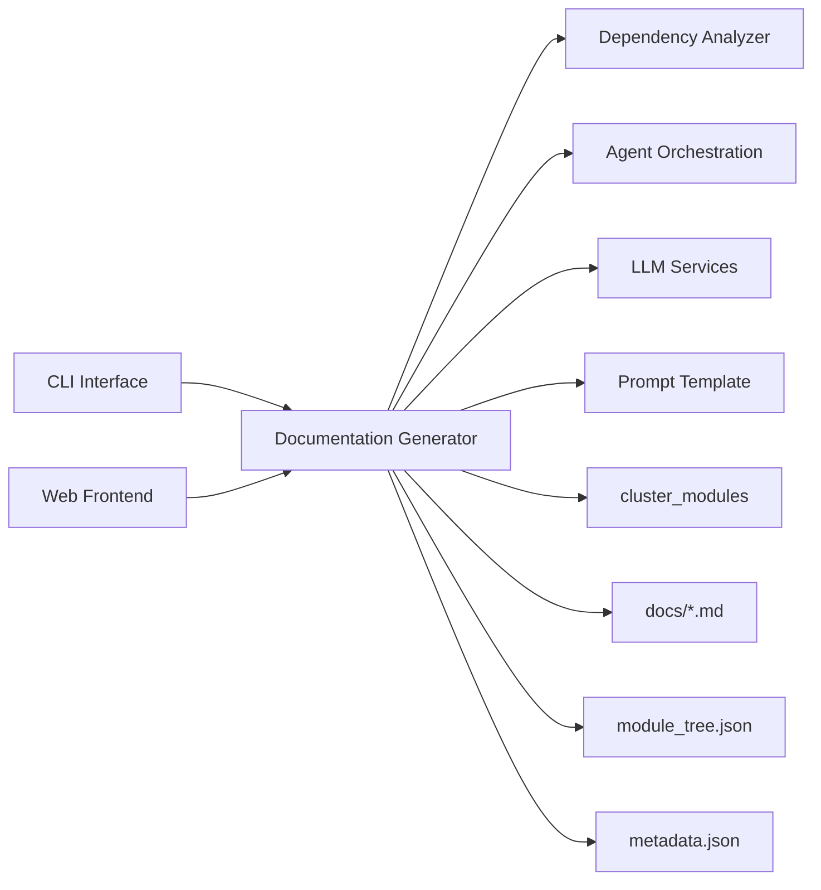
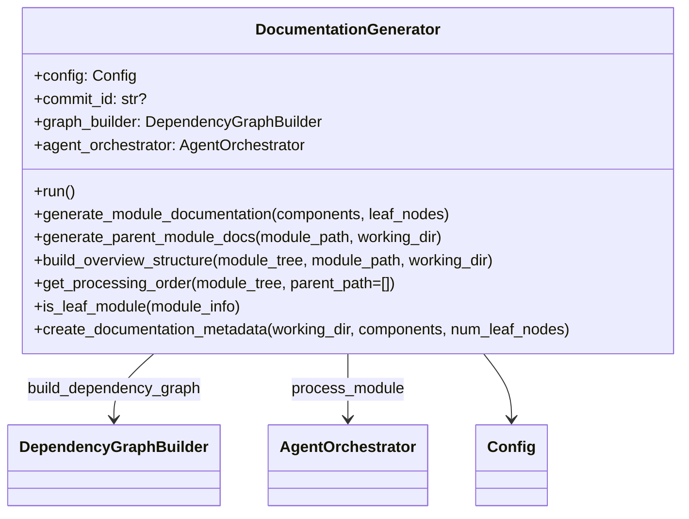
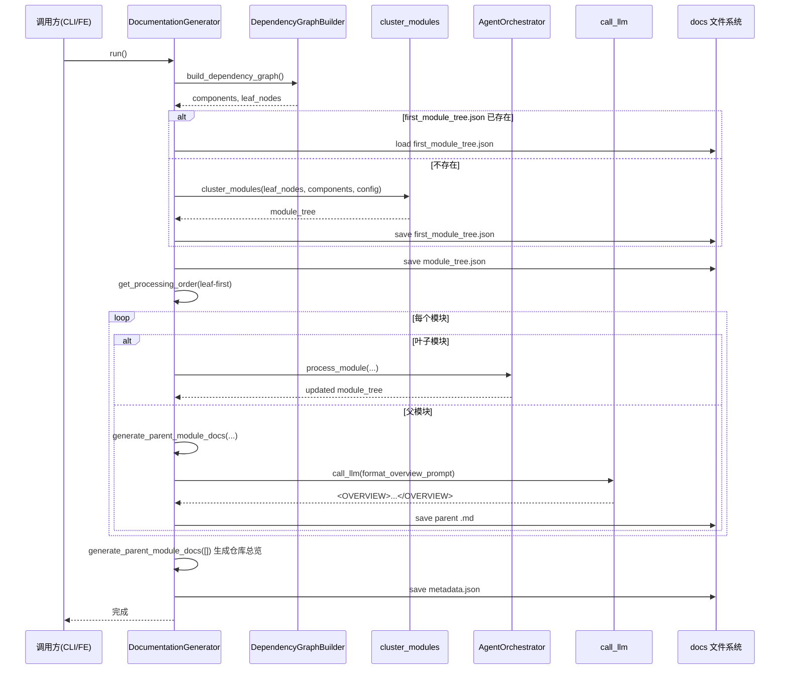
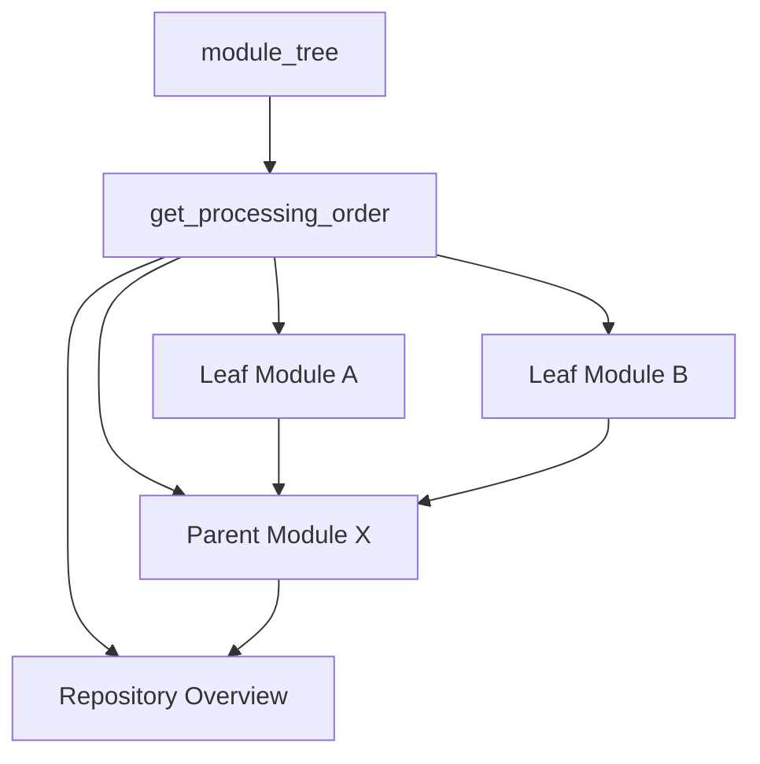
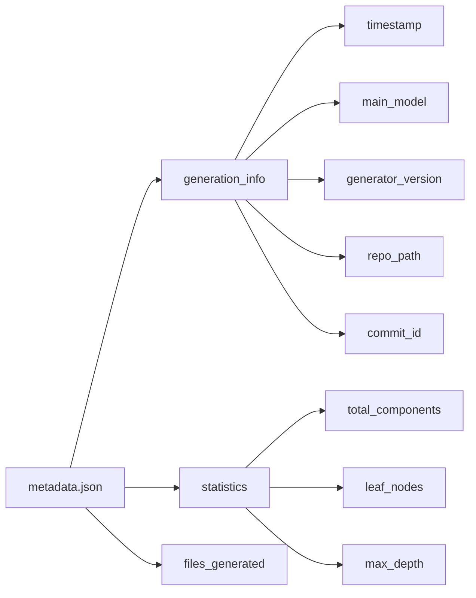
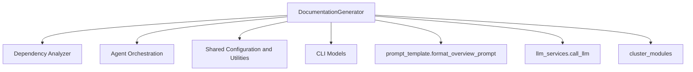

# Documentation Generator

## 模块简介

`Documentation Generator` 模块（核心组件：`codewiki.src.be.documentation_generator.DocumentationGenerator`）是 CodeWiki 文档生产链路中的**总控编排器**。  
它的核心任务是把依赖分析结果（组件图、叶子节点、模块树）转化为最终文档产物（各模块 `.md`、`overview.md`、`metadata.json`）。

一句话概括：它决定“**先写谁、后写谁、如何汇总**”。

---

## 在系统中的定位

- 上游入口通常来自 [CLI Interface.md](CLI Interface.md) 或 [Web Frontend.md](Web Frontend.md)。
- 依赖图与叶子节点来自 [Dependency Analyzer.md](Dependency Analyzer.md)（`DependencyGraphBuilder`）。
- 叶子模块正文生成委托给 [Agent Orchestration.md](Agent Orchestration.md)。
- 父模块/仓库级概览通过 `call_llm + format_overview_prompt` 生成。

---

## 核心职责

`DocumentationGenerator` 负责 5 件事：

1. **依赖图构建入口**：调用 `DependencyGraphBuilder.build_dependency_graph()` 获取 `components` 与 `leaf_nodes`。
2. **模块树准备**：加载或生成 `first_module_tree.json`，并同步到 `module_tree.json`。
3. **动态规划式生成**：按“叶子模块优先、父模块后置、最后仓库总览”的顺序生成文档。
4. **父级文档汇总**：读取 1 层子模块文档，构造 overview prompt，生成父模块或仓库概览文档。
5. **元数据落盘**：生成 `metadata.json`（模型、提交号、统计信息、产物列表）。

---

## 核心对象与方法

### 方法分工（维护视角）

- `run()`：总入口，串起“分析 → 分组 → 生成 → 元数据”。
- `generate_module_documentation(...)`：主体调度器，执行按序生成。
- `get_processing_order(...)`：递归 DFS，保证子模块先于父模块。
- `generate_parent_module_docs(...)`：父级/仓库级文档汇总生成。
- `build_overview_structure(...)`：把目标节点标记到树里，并注入子文档正文到 `docs` 字段。
- `create_documentation_metadata(...)`：最终产物登记。

---

## 处理流程（端到端）

---

## 动态规划式生成策略

模块采用“自底向上”的生成顺序，避免父文档在子文档缺失时生成：

关键点：

- 叶子模块通过 `AgentOrchestrator.process_module(...)` 先产出基础文档。
- 父模块通过读取一层子文档拼装 prompt，再调用 LLM 汇总。
- 最后调用 `generate_parent_module_docs([])` 生成仓库级 `overview.md`。

---

## 文件与数据产物

### 运行时关键文件

- `first_module_tree.json`：初始模块分组快照（用于稳定重跑）。
- `module_tree.json`：当前进度下的模块树状态。
- `overview.md`：仓库总览文档。
- `<module_name>.md`：模块文档（叶子或父模块）。
- `metadata.json`：本次生成元信息。

### `metadata.json` 内容

---

## 依赖关系与边界

边界说明：

- `Documentation Generator` **不负责**语言级 AST 解析或调用图抽取（交给 Dependency Analyzer）。
- `Documentation Generator` **不负责**具体工具调用写文档细节（交给 Agent Orchestration）。
- 它主要负责**流程编排、顺序控制、结果汇总与持久化**。

---

## 幂等性、容错与恢复

模块内建了实用的重跑与容错策略：

- **文件存在即跳过**：
  - `overview.md` 已存在时，父级总览生成可短路。
  - 某父模块 `.md` 已存在时，跳过再次生成。
- **逐模块 try/except**：单模块失败不会中断整体批次，错误记录后继续处理后续模块。
- **双树文件机制**：
  - `first_module_tree.json` 保留首轮分组结果。
  - `module_tree.json` 作为可更新工作副本。
- **全局异常上抛**：`run()` 最外层捕获并记录 traceback 后 `raise`，便于上游统一处理。

---

## 特殊路径：仓库可一次性进入上下文

当 `module_tree` 为空时，进入“整仓单模块模式”：

1. 以仓库名作为模块名直接调用 `agent_orchestrator.process_module(...)`。
2. 保存最终 `module_tree.json`。
3. 将 `<repo_name>.md` 重命名为 `overview.md`。

该路径适用于小仓库或高上下文窗口模型，避免不必要的模块拆分。

---

## 与其它模块文档的关联阅读

- 依赖图来源与叶子节点策略：
  - [Dependency Analyzer.md](Dependency Analyzer.md)
  - [dependency-graph-build-and-leaf-selection.md](dependency-graph-build-and-leaf-selection.md)
- Agent 执行与工具链：
  - [Agent Orchestration.md](Agent Orchestration.md)
  - [orchestration-runtime.md](orchestration-runtime.md)
  - [agent-editing-toolchain.md](agent-editing-toolchain.md)
- 入口与运行形态：
  - [CLI Interface.md](CLI Interface.md)
  - [Web Frontend.md](Web Frontend.md)
- 配置与工具函数：
  - [Shared Configuration and Utilities.md](Shared Configuration and Utilities.md)

---

## 维护者快速检查清单

- 修改生成顺序：优先检查 `get_processing_order()` 与 `is_leaf_module()`。
- 修改父文档汇总内容：检查 `build_overview_structure()` + `format_overview_prompt()`。
- 排查“文档没生成”：先看 `docs` 下是否已有同名 `.md` 导致短路，再看模块级异常日志。
- 排查“树结构不对”：检查 `first_module_tree.json` 是否陈旧，必要时删除后重跑。
- 扩展元数据字段：修改 `create_documentation_metadata()` 并保持向后兼容。
