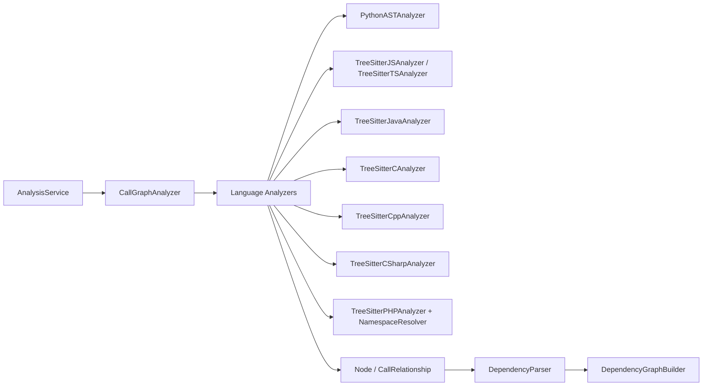
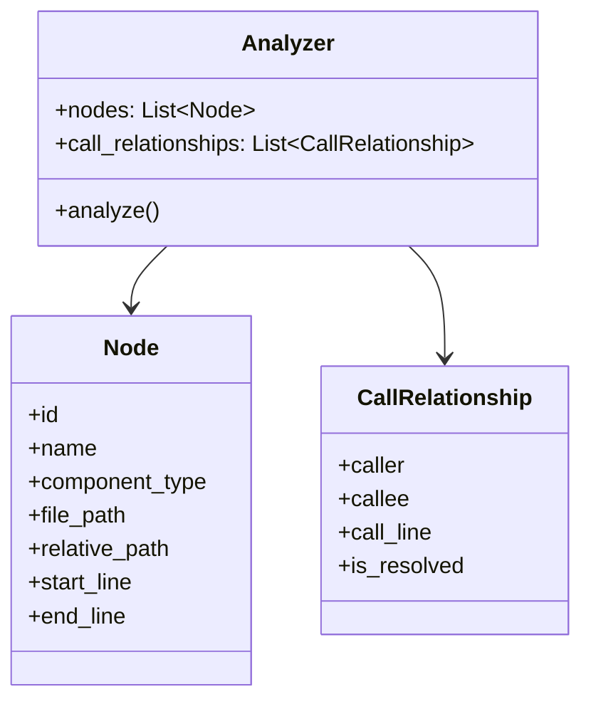
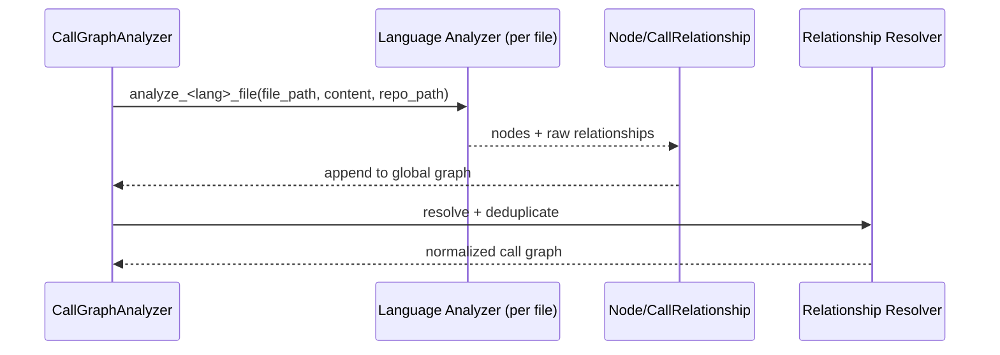

# Language Analyzers

## 模块简介

`Language Analyzers` 是 `Dependency Analyzer` 的语言解析层，负责把不同语言源码统一转换为：

- `Node`（组件节点：class/function/interface/enum/method 等）
- `CallRelationship`（依赖/调用关系）

该模块本身不做仓库遍历、不做最终全局解析，而是作为 **语言适配器集合** 被 [Dependency Analyzer](Dependency Analyzer.md) 的 `CallGraphAnalyzer` 调度。

---

## 在系统中的位置

相关模块：
- 调度与汇聚： [Dependency Analyzer](Dependency Analyzer.md)
- 领域模型： [analysis-domain-models.md](analysis-domain-models.md)
- 组件投影： [dependency-parser-and-component-projection.md](dependency-parser-and-component-projection.md)
- 调用图引擎： [call-graph-analysis-engine.md](call-graph-analysis-engine.md)

---

## 架构概览

### 1) 统一输入/输出契约

### 2) 语言实现策略

- Python：使用内置 `ast`（`PythonASTAnalyzer`）
- JavaScript/TypeScript：使用 Tree-sitter（JS/TS 各自 analyzer）
- Java/C/C++/C#：使用 Tree-sitter 对应 grammar
- PHP：Tree-sitter + `NamespaceResolver` 处理命名空间与 `use` 别名

### 3) 关系解析边界

各语言 analyzer 主要输出“文件内可识别关系 + 部分未解析关系”；
跨文件/跨语言解析在 `CallGraphAnalyzer._resolve_call_relationships()` 中统一进行（见 [call-graph-analysis-engine.md](call-graph-analysis-engine.md)）。

---

## 子模块说明

> 详细实现已拆分到子文档，主文档只保留职责与边界。

### 1. Python AST 分析器
- 核心组件：`codewiki.src.be.dependency_analyzer.analyzers.python.PythonASTAnalyzer`
- 能力：提取 Python 顶层类/函数、调用关系、类继承关系（同文件可解析部分）
- 文档： [python-ast-analyzer.md](python-ast-analyzer.md)

### 2. JavaScript / TypeScript 分析器
- 核心组件：
  - `codewiki.src.be.dependency_analyzer.analyzers.javascript.TreeSitterJSAnalyzer`
  - `codewiki.src.be.dependency_analyzer.analyzers.typescript.TreeSitterTSAnalyzer`
- 能力：提取声明节点、调用/构造/继承/类型依赖；TS 额外包含更丰富的类型与导出场景
- 文档： [javascript-typescript-analyzers.md](javascript-typescript-analyzers.md)

### 3. Java / C / C++ / C# 分析器
- 核心组件：
  - `codewiki.src.be.dependency_analyzer.analyzers.java.TreeSitterJavaAnalyzer`
  - `codewiki.src.be.dependency_analyzer.analyzers.c.TreeSitterCAnalyzer`
  - `codewiki.src.be.dependency_analyzer.analyzers.cpp.TreeSitterCppAnalyzer`
  - `codewiki.src.be.dependency_analyzer.analyzers.csharp.TreeSitterCSharpAnalyzer`
- 能力：抽取静态语言中的类型结构、调用关系、继承/实现、字段或参数类型依赖
- 文档： [java-c-cpp-csharp-analyzers.md](java-c-cpp-csharp-analyzers.md)

### 4. PHP 分析与命名空间解析
- 核心组件：
  - `codewiki.src.be.dependency_analyzer.analyzers.php.TreeSitterPHPAnalyzer`
  - `codewiki.src.be.dependency_analyzer.analyzers.php.NamespaceResolver`
- 能力：三阶段解析（namespace/use、节点、关系），支持别名与限定名解析，过滤模板类 PHP 文件
- 文档： [php-analyzer-and-namespace-resolution.md](php-analyzer-and-namespace-resolution.md)

---

## 关键数据流

---

## 设计特点与维护要点

- **多语言同构输出**：便于上层统一处理。
- **弱侵入扩展**：新增语言通常只需新增 analyzer + 在 `CallGraphAnalyzer` 注册分发。
- **分层解析**：语言层做“提取”，引擎层做“全局解析/去重”。
- **可容错**：各 analyzer 对 parser 初始化失败/语法异常有降级处理，避免单文件阻断整体任务。

维护建议：
1. 若要新增语言，优先对齐 `Node`/`CallRelationship` 字段规范。
2. 若要提升精度，优先改进语言 analyzer 的 `callee` 提取与 `is_resolved` 标注。
3. 若出现跨文件误连，优先检查 `component_id` 生成规则与全局 resolve 逻辑。

---

## 与其它模块的职责边界

- `Language Analyzers`：语言 AST 提取与初步关系构建。
- `CallGraphAnalyzer`：跨文件汇总、关系解析、去重、可视化数据生成。
- `DependencyParser`：将分析结果投影为 `Node.depends_on`。
- `DependencyGraphBuilder`：构图、叶子节点选择与 JSON 输出。

详见： [Dependency Analyzer](Dependency Analyzer.md)

### 文档文件清单（已交叉引用）
- [Language Analyzers.md](Language Analyzers.md)
- [python-ast-analyzer.md](python-ast-analyzer.md)
- [javascript-typescript-analyzers.md](javascript-typescript-analyzers.md)
- [java-c-cpp-csharp-analyzers.md](java-c-cpp-csharp-analyzers.md)
- [php-analyzer-and-namespace-resolution.md](php-analyzer-and-namespace-resolution.md)
