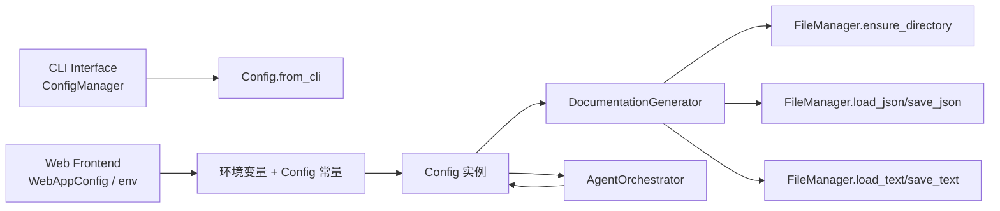
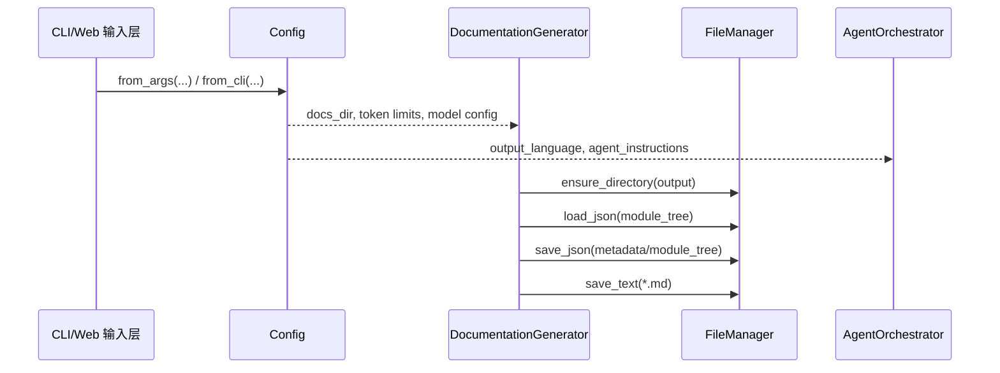

# Shared Configuration and Utilities

## 模块简介

`Shared Configuration and Utilities` 是 CodeWiki 在后端（`codewiki.src`）中的基础能力模块，负责提供：

- **统一配置入口**（`codewiki.src.config.Config`）
- **跨流程文件读写能力**（`codewiki.src.utils.FileManager`）

该模块并不直接执行依赖分析或文档生成算法，而是作为所有核心流程的“地基层”：

- 为 [Documentation Generator.md](Documentation%20Generator.md) 提供运行参数与输出路径配置
- 为 [Agent Orchestration.md](Agent%20Orchestration.md) 提供模型配置、提示词附加指令、语言设定
- 为 [Web Frontend.md](Web%20Frontend.md) 与 [CLI Interface.md](CLI%20Interface.md) 提供统一的配置语义与文件操作能力

---

## 核心职责概览

1. **运行时配置建模与构造**
   - 从环境变量、CLI 参数构造 `Config`
   - 统一定义目录、模型、token 限制、语言输出、agent 指令
   - 兼容 CLI / Web 两种上下文

2. **轻量文件系统抽象**
   - 目录创建、JSON/文本读写
   - 为文档生成流水线中的 module tree / metadata / markdown 落盘提供稳定接口

3. **跨模块契约稳定层**
   - 通过常量（目录名、文件名、默认阈值）保持不同子系统间的行为一致性

---

## 架构总览

---

## 组件关系与数据流

---

## 子模块划分（高层）

> 该模块可自然拆分为“配置子系统”与“文件 I/O 子系统”。

- `configuration-runtime-and-prompt-control`：负责 `Config`、常量、上下文标记、提示词扩展策略（详见 [configuration-runtime-and-prompt-control.md](configuration-runtime-and-prompt-control.md)）
- `file-io-abstraction`：负责 `FileManager` 的目录与文本/JSON 操作（详见 [file-io-abstraction.md](file-io-abstraction.md)）

（详细说明见对应子模块文档）

---

## 与其他模块的协作边界

- 与 **CLI Interface**：
  - CLI 的 `ConfigManager` 负责“用户配置持久化 + keyring 密钥管理”
  - 本模块的 `Config` 负责“运行时配置对象”，是执行期消费的统一结构

- 与 **Web Frontend**：
  - Web 侧 `WebAppConfig` 定义服务运行参数（缓存、端口、队列）
  - 本模块更偏向文档引擎运行参数（LLM、token、输出文档路径）

- 与 **Documentation Generator / Agent Orchestration**：
  - `DocumentationGenerator` 读取 `Config` 与 `FileManager`
  - `AgentOrchestrator` 利用 `Config.get_prompt_addition()` 将策略注入 system prompt

---

## 关键设计取舍

- **简洁优先**：`FileManager` 保持无状态静态方法，降低耦合与测试复杂度
- **兼容优先**：保留 legacy 常量别名（如 `MAX_TOKEN_PER_MODULE`）
- **上下文感知**：通过 `set_cli_context` / `is_cli_context` 区分 CLI 与 Web 执行场景
- **可扩展提示词**：`agent_instructions` 聚合文档类型、聚焦模块、自定义说明

---

## 参考文档

- [CLI Interface.md](CLI%20Interface.md)
- [CLI Models.md](CLI%20Models.md)
- [Agent Orchestration.md](Agent%20Orchestration.md)
- [Documentation Generator.md](Documentation%20Generator.md)
- [Web Frontend.md](Web%20Frontend.md)
