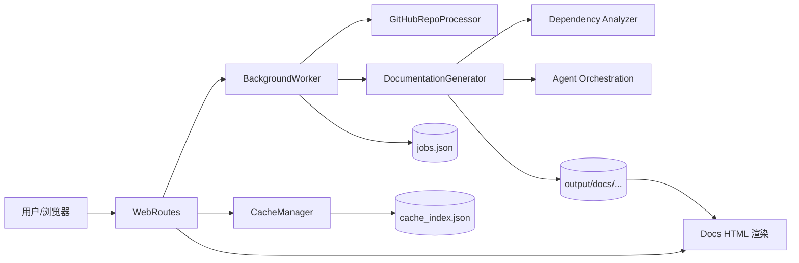
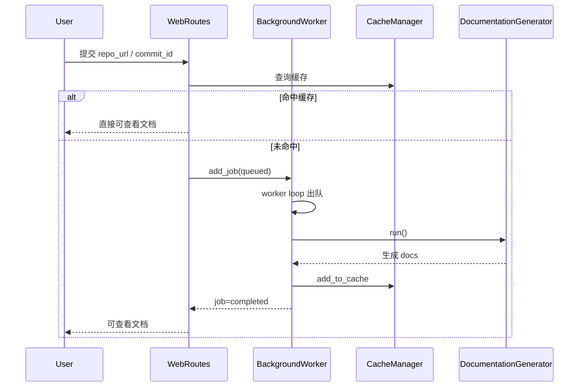
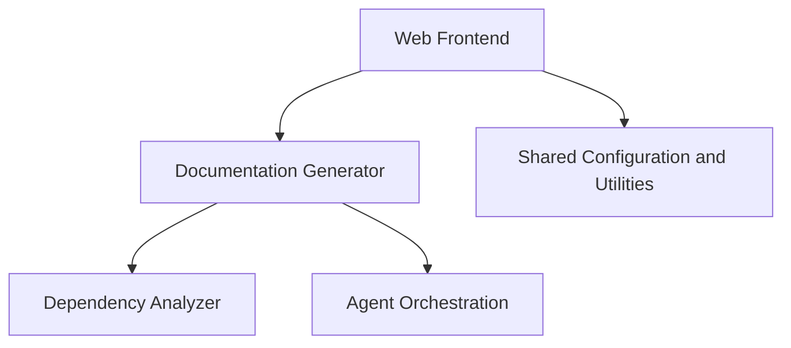

# Web Frontend

## 模块简介

`Web Frontend` 是 CodeWiki 的 Web 入口层，负责把“用户提交仓库 → 异步生成文档 → 在线浏览结果”串成完整闭环。  
该模块本身不做深度代码分析，而是通过后端能力进行编排：

- 调用 [Documentation Generator](Documentation Generator.md) 执行文档生成
- 复用 [Dependency Analyzer](Dependency Analyzer.md) 与 [Agent Orchestration](Agent Orchestration.md) 的下游结果
- 复用 Shared Configuration and Utilities 模块中的配置与文件工具能力

---

## 架构总览

### 分层说明

1. **请求与页面层**：`WebRoutes` 处理表单、状态查询、文档页面访问。
2. **异步执行层**：`BackgroundWorker` 使用队列+线程执行任务，驱动克隆、生成、缓存。
3. **缓存与持久化层**：`CacheManager` 与 `jobs.json/cache_index.json` 共同提供恢复能力。
4. **模板渲染层**：`StringTemplateLoader` + Jinja2 完成字符串模板渲染。
5. **配置与模型层**：`WebAppConfig` 与 `models.py` 统一数据契约与运行参数。

---

## 关键运行流程

---

## 核心组件职责

- **`BackgroundWorker`**：任务队列、状态迁移、调用文档生成器、临时目录清理。
- **`CacheManager`**：按 repo URL 哈希索引缓存、TTL 过期控制、索引落盘。
- **`GitHubRepoProcessor`**：GitHub URL 校验/解析、clone 与可选 commit checkout。
- **`WebRoutes`**：提交校验、去重与失败冷却、状态 API、文档页面渲染。
- **`models`**（`JobStatus/JobStatusResponse/RepositorySubmission/CacheEntry`）：前后端与内部执行状态的数据模型。
- **`StringTemplateLoader`**：支持字符串模板渲染，服务 Web 页面与导航片段。
- **`WebAppConfig`**：统一目录、队列、缓存、重试、Git 与服务端默认配置。

---

## 子模块文档索引

> 详细实现已拆分到以下子文档：

- [job-processing-and-execution.md](job-processing-and-execution.md)  
  任务处理主链路：队列、后台执行、缓存命中与生成回填。
- [web-routing-and-request-lifecycle.md](web-routing-and-request-lifecycle.md)  
  路由行为与请求生命周期：提交、轮询、查看文档。
- [frontend-models-and-configuration.md](frontend-models-and-configuration.md)  
  前端数据模型与运行配置常量。
- [template-rendering-utilities.md](template-rendering-utilities.md)  
  Jinja2 字符串模板渲染与页面片段生成。

---

## 模块间依赖关系

为避免重复，以下细节请直接参考对应模块文档：

- 文档生成编排细节： [Documentation Generator](Documentation Generator.md)
- 依赖/调用图分析细节： [Dependency Analyzer](Dependency Analyzer.md)
- Agent 工具链与执行细节： [Agent Orchestration](Agent Orchestration.md)
