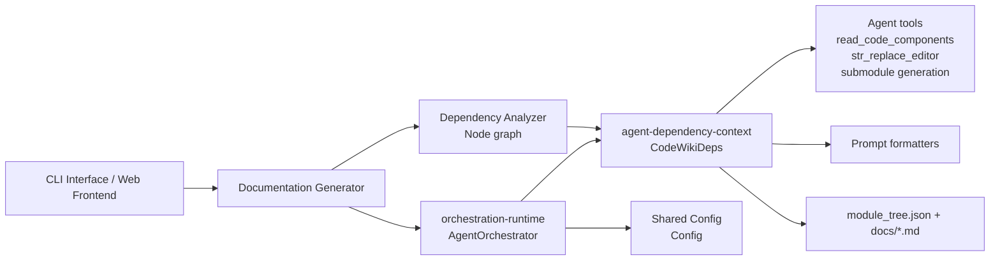
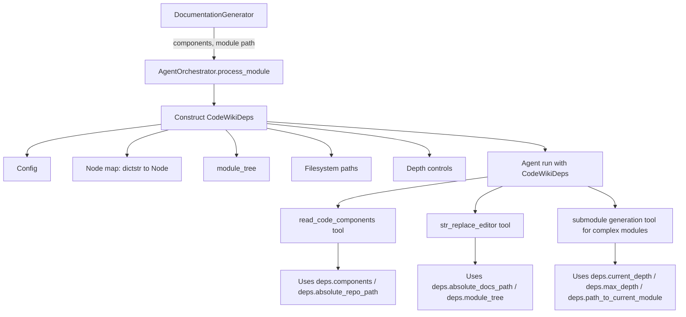
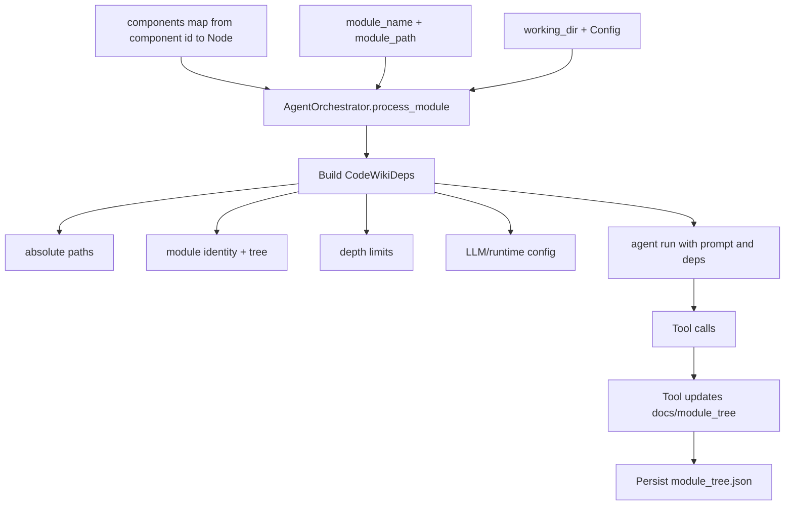
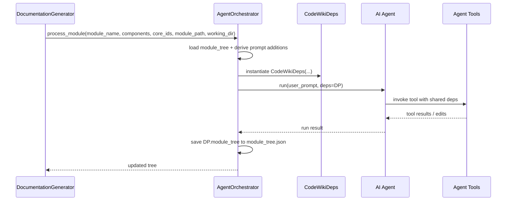
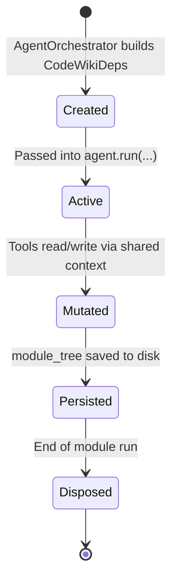

# agent-dependency-context Module

## Introduction

The `agent-dependency-context` module defines the **runtime dependency contract** used by AI agents during documentation generation.

Its core component, `CodeWikiDeps`, is a compact but critical context object that packages:

- filesystem locations,
- module-tree traversal state,
- component registry and selected nodes,
- generation limits,
- LLM/runtime configuration.

In practice, this module is the **shared context boundary** between `AgentOrchestrator` and agent tools (such as code readers and file editors).

---

## Core Component

### `CodeWikiDeps` (`codewiki.src.be.agent_tools.deps.CodeWikiDeps`)

`CodeWikiDeps` is a dataclass passed to each agent run (`deps=...`) so both the agent and its tools can operate with consistent runtime state.

```python
@dataclass
class CodeWikiDeps:
    absolute_docs_path: str
    absolute_repo_path: str
    registry: dict
    components: dict[str, Node]
    path_to_current_module: list[str]
    current_module_name: str
    module_tree: dict[str, any]
    max_depth: int
    current_depth: int
    config: Config
    custom_instructions: str = None
```

---

## Field-Level Contract

| Field | Type | Purpose | Primary Producer | Primary Consumers |
|---|---|---|---|---|
| `absolute_docs_path` | `str` | Absolute path to generated docs workspace | `AgentOrchestrator.process_module` | Editing/generation tools writing `.md` files |
| `absolute_repo_path` | `str` | Absolute repository path | `AgentOrchestrator.process_module` | Code-reading tools, path resolvers |
| `registry` | `dict` | Runtime scratch registry for tool coordination/state | `AgentOrchestrator` (initialized) | Agent tools (shared transient state) |
| `components` | `dict[str, Node]` | All analyzed components keyed by component ID | `DocumentationGenerator` → `AgentOrchestrator` | Prompt/tool lookups, component expansion |
| `path_to_current_module` | `list[str]` | Hierarchical location in module tree | `DocumentationGenerator` traversal | Submodule/overview context and path-aware logic |
| `current_module_name` | `str` | Active module being documented | `DocumentationGenerator` traversal | Prompt generation, output naming |
| `module_tree` | `dict[str, any]` | Shared mutable module tree (`module_tree.json` mirror) | Loaded in orchestrator | Parent/child docs flow, state persistence |
| `max_depth` | `int` | Depth cap for recursive/submodule generation | `Config` | Tool/prompt recursion control |
| `current_depth` | `int` | Current recursion depth | Orchestrator (initially `1`) | Depth-aware generation policies |
| `config` | `Config` | Global runtime + LLM configuration | CLI/Web startup configuration | Prompt behavior, model/token settings |
| `custom_instructions` | `str \| None` | User-defined prompt additions | Derived from `Config.get_prompt_addition()` | Agent prompting and style control |

---

## Position in the System



`CodeWikiDeps` does not perform logic itself; it standardizes context so logic in orchestrators/tools remains deterministic.

---

## Architecture and Relationships



### Key external dependencies

- `Node` model from Dependency Analyzer (`codewiki.src.be.dependency_analyzer.models.core.Node`)
- `Config` from Shared Configuration (`codewiki.src.config.Config`)
- Runtime creator: `AgentOrchestrator` in [orchestration-runtime.md](orchestration-runtime.md)

---

## Data Flow



---

## Component Interaction Sequence



---

## Process Flow (Lifecycle of `CodeWikiDeps`)



---

## How This Module Fits the Overall System

`agent-dependency-context` is a **contract module**, not a behavior module.

- **Without it**: each tool/orchestrator function would need ad-hoc parameters, increasing coupling and drift.
- **With it**: all agent-facing runtime dependencies are passed through one typed object (`CodeWikiDeps`), improving consistency and maintainability.

It is especially important for:

1. **Tool interoperability** (shared paths, shared tree, shared registry),
2. **Deterministic recursion control** (`max_depth` / `current_depth`),
3. **Cross-cutting configuration propagation** (`Config`, `custom_instructions`).

---

## Design Notes and Maintenance Guidance

- `CodeWikiDeps` is intentionally minimal and declarative. Keep business logic in orchestrators/tools.
- Prefer adding new runtime context fields here instead of growing positional/keyword arguments across many tool APIs.
- If a new field is introduced, verify:
  1. constructor call in `AgentOrchestrator.process_module`,
  2. tool compatibility,
  3. serialization/persistence assumptions for `module_tree`.
- `registry` is untyped (`dict`) by design for flexibility; if usage grows, consider introducing a typed sub-structure.

---

## Related Documentation

- Runtime orchestration and agent execution: [orchestration-runtime.md](orchestration-runtime.md)
- Agent editing and file mutation tools: [agent-editing-toolchain.md](agent-editing-toolchain.md)
- Top-level generation pipeline: [documentation-generator.md](documentation-generator.md)
- Dependency graph and `Node` model origins: [dependency-analyzer.md](dependency-analyzer.md)
- Global configuration model (`Config`): [shared-configuration-and-utilities.md](shared-configuration-and-utilities.md)
- Parent context for this module grouping: [agent-orchestration.md](agent-orchestration.md)
