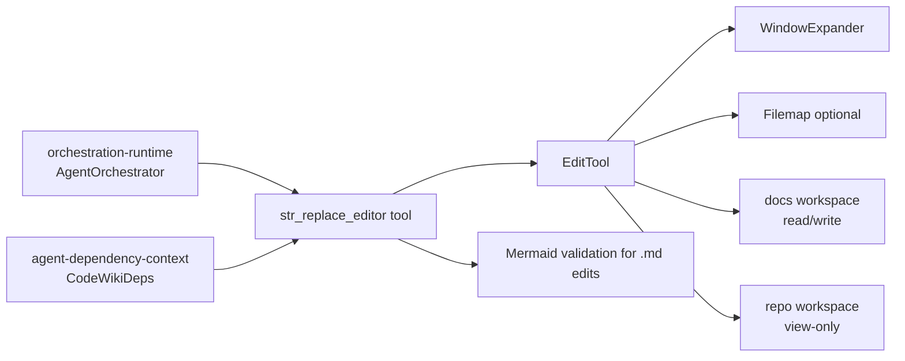
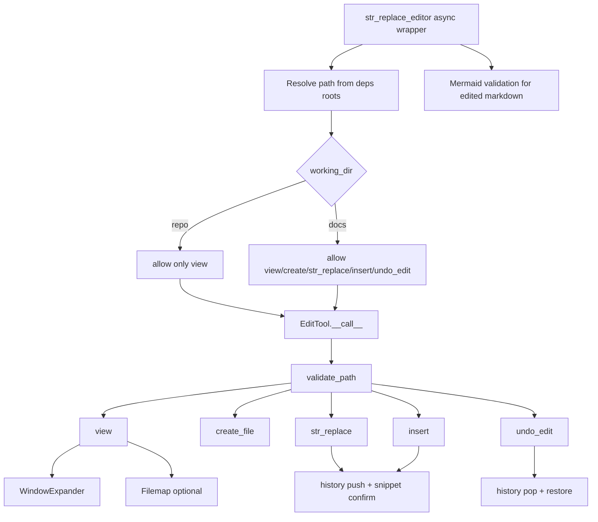
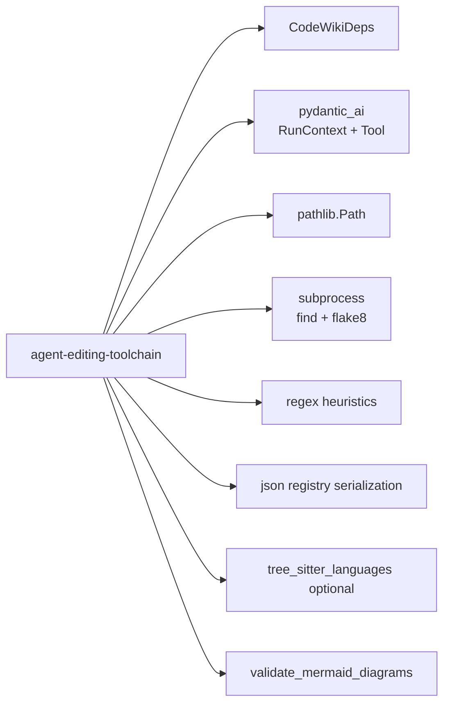
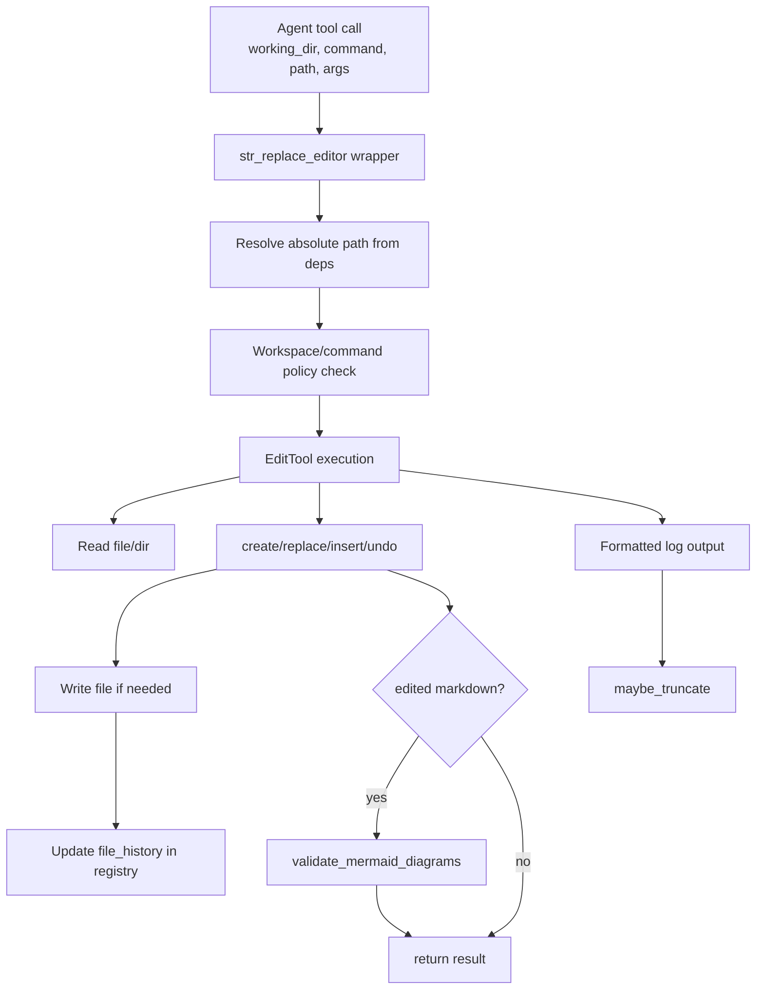
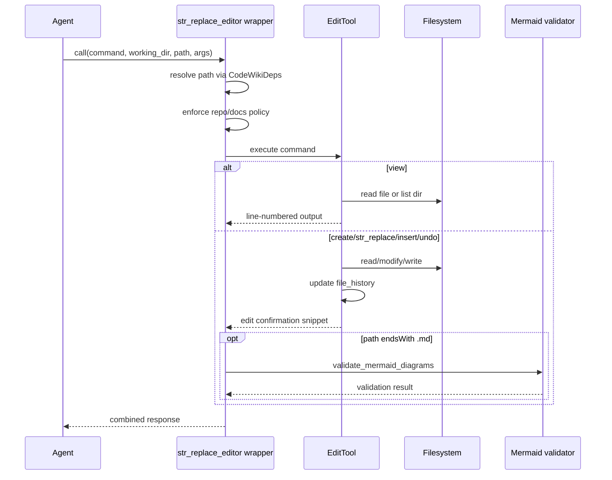
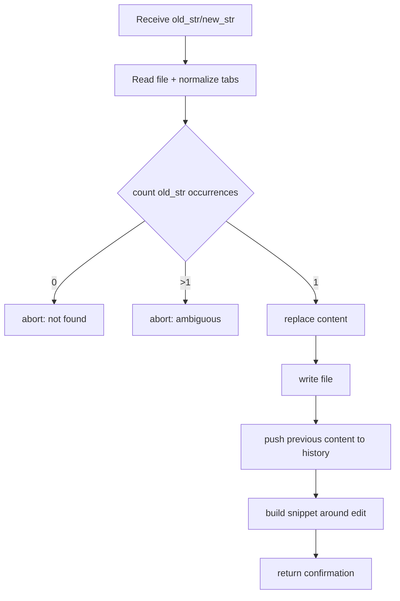
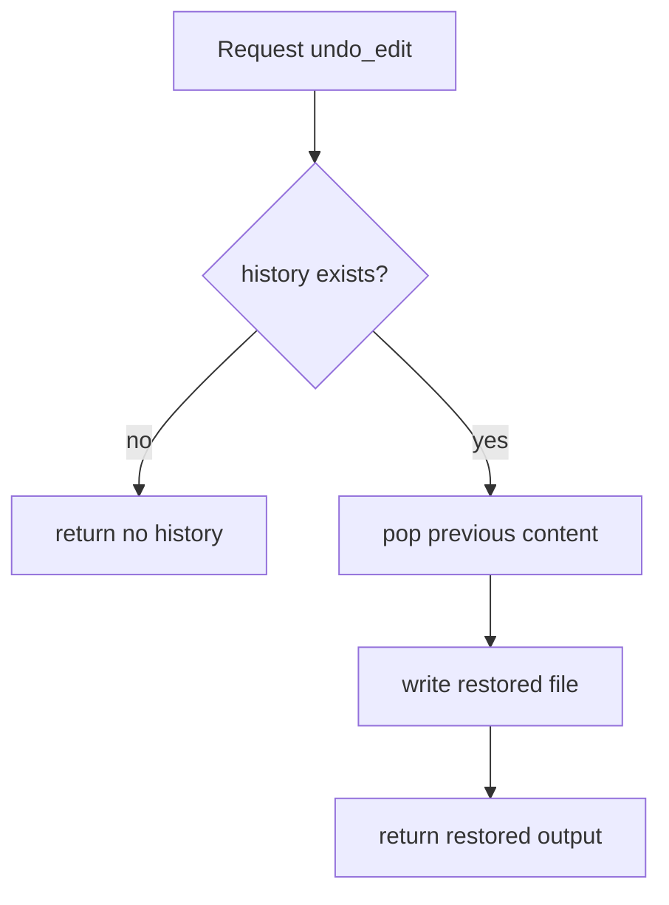
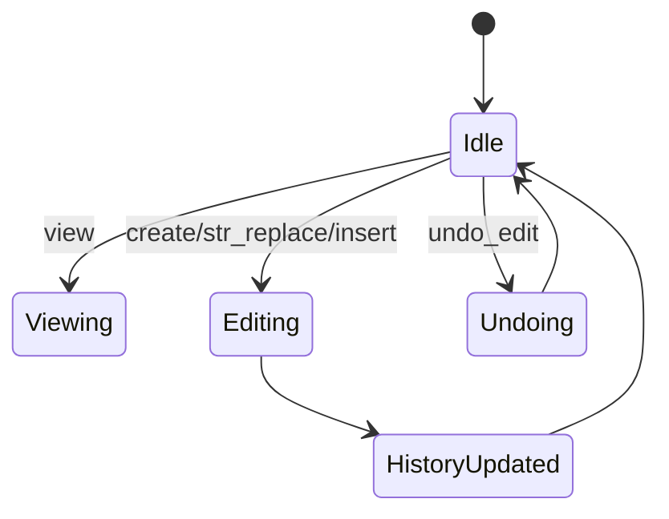

# agent-editing-toolchain Module

## Introduction

The `agent-editing-toolchain` module provides the **safe, stateful file editing interface** used by CodeWiki agents during documentation generation.

It centers on three core components:

- `WindowExpander`: expands line-based view/edit windows to cleaner semantic boundaries (e.g., blank lines, Python defs/classes).
- `EditTool`: performs constrained filesystem operations (`view`, `create`, `str_replace`, `insert`, `undo_edit`) with validation, history, and formatted output.
- `Filemap`: creates abbreviated structural views of large Python files using tree-sitter.

Together, these components let an LLM agent inspect repository files and modify docs with predictable behavior, bounded access, and recoverability.

---

## Position in the System

This module is the **execution boundary between agent intent and filesystem mutation**.

For orchestration behavior, see [orchestration-runtime.md](orchestration-runtime.md).  
For dependency context injection, see [agent-dependency-context.md](agent-dependency-context.md).

---

## Core Components

## 1) `EditTool`

`EditTool` is the operational engine behind the `str_replace_editor` tool.

### Responsibilities

- Validate path + command combinations before execution.
- Enforce command constraints:
  - directories: `view` only,
  - non-existent files: only `create`,
  - existing files: cannot use `create`.
- Execute file operations and return user-friendly, line-numbered outputs (`cat -n` style).
- Maintain per-file edit history (`registry["file_history"]`) for `undo_edit`.
- Apply truncation policy for long outputs.
- Optionally integrate lint checks (present in code path, currently toggled by `USE_LINTER=False`).

### Supported commands

| Command | Behavior |
|---|---|
| `view` | Show directory tree (max depth 2, non-hidden) or file content with line numbers; optional ranged view |
| `create` | Create new file (fails if already exists) |
| `str_replace` | Replace a **unique** exact string occurrence |
| `insert` | Insert text at a specific line index |
| `undo_edit` | Revert last edit from in-memory persisted history |

### Key reliability controls

- **Absolute path requirement** inside the low-level tool.
- **Uniqueness check** for `old_str` in `str_replace` prevents ambiguous replacements.
- **History-backed revert** enables iterative correction.
- **Encoding fallback strategy** (`utf-8`, `latin-1`, replacement mode) for resilient reads.

---

## 2) `WindowExpander`

`WindowExpander` improves readability and edit confirmation by expanding requested line ranges.

### How it works

- Finds nearby "breakpoints" above and below a target range.
- Breakpoint heuristics include:
  - blank lines / double blank lines,
  - Python semantic anchors (`def`, `class`, decorators),
  - file boundaries.
- Returns a non-shrinking expanded range bounded by `max_added_lines`.

### Current runtime settings

In this module configuration:

- `MAX_WINDOW_EXPANSION_VIEW = 0`
- `MAX_WINDOW_EXPANSION_EDIT_CONFIRM = 0`

So expansion logic exists but is effectively disabled unless constants are changed.

---

## 3) `Filemap`

`Filemap` builds a compressed representation of large Python files by eliding long function bodies.

### Mechanism

- Uses `tree_sitter_languages` parser/query for Python.
- Detects function body nodes.
- Elides body line ranges beyond threshold length.
- Emits line-numbered output with placeholders like `... eliding lines X-Y ...`.

### Runtime usage

Currently gated by:

- `USE_FILEMAP = False`

When enabled and file output is large, `view` can return abbreviated structure first, prompting agent to query precise ranges next.

---

## Public Tool Entry Point

Besides the three core classes, the module exposes async function `str_replace_editor(...)` and registers `str_replace_editor_tool = Tool(...)`.

## Wrapper-level policy

The wrapper enforces workspace-level safety:

- `working_dir = "repo"` → **only `view` allowed**.
- `working_dir = "docs"` → full edit commands allowed.
- Accepts both `path` and `file` parameter names (compatibility shim).
- Resolves relative input to absolute paths using `CodeWikiDeps` roots.
- Runs Mermaid validation after non-view edits to `.md` files via `validate_mermaid_diagrams(...)`.

This creates a clear split: repository inspection is read-only; documentation workspace is mutable.

---

## Internal Architecture

---

## Dependency Map

### Notes

- `tree_sitter_languages` is used only by `Filemap`.
- `flake8` integration exists but is disabled by default (`USE_LINTER=False`).

---

## Data Flow

---

## Component Interaction Sequence

---

## Process Flows

### A) `str_replace` lifecycle

### B) `undo_edit` lifecycle

---

## State and Persistence Model

`EditTool` persistence is session-scoped via `CodeWikiDeps.registry`:

- `file_history` is serialized to JSON in `registry`.
- History is keyed by file path, storing prior versions.
- This enables multi-step edits across tool calls in one agent session.

---

## Error Handling and Guardrails

- Invalid command parameters append actionable logs rather than hard-crashing.
- Invalid ranges (`view_range`, `insert_line`) return precise constraints.
- Non-absolute paths are rejected with suggested absolute path hint.
- Directory mutation attempts are blocked.
- Long responses are clipped with explicit continuation guidance.

Operationally, this design optimizes for **agent recoverability**: failures are informative and incremental retries are easy.

---

## Integration with Other Modules

- **Upstream runtime**: [orchestration-runtime.md](orchestration-runtime.md) creates agent/tool runtime and invokes this tool.
- **Dependency contract**: [agent-dependency-context.md](agent-dependency-context.md) supplies workspace roots and shared registry.
- **Higher-level generation pipeline**: [documentation-generator.md](documentation-generator.md).
- **Parent architecture context**: [agent-orchestration.md](agent-orchestration.md).

---

## Maintenance Notes

- `MAX_WINDOW_EXPANSION_*`, `USE_FILEMAP`, and `USE_LINTER` are key behavior toggles.
- If enabling linter filtering, verify `_update_previous_errors`/`format_flake8_output` behavior against multiline edits.
- If enabling filemap broadly, validate tree-sitter availability in runtime environments.
- Keep wrapper-level workspace restrictions (`repo` view-only) intact to preserve safety guarantees.
