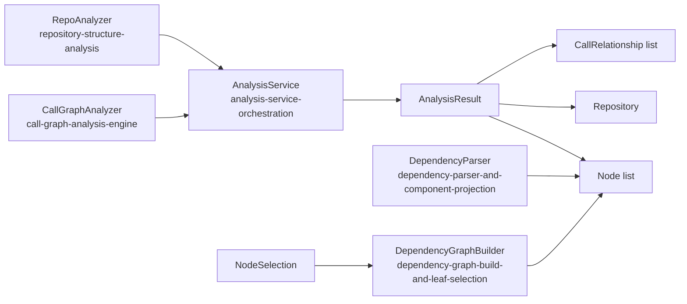
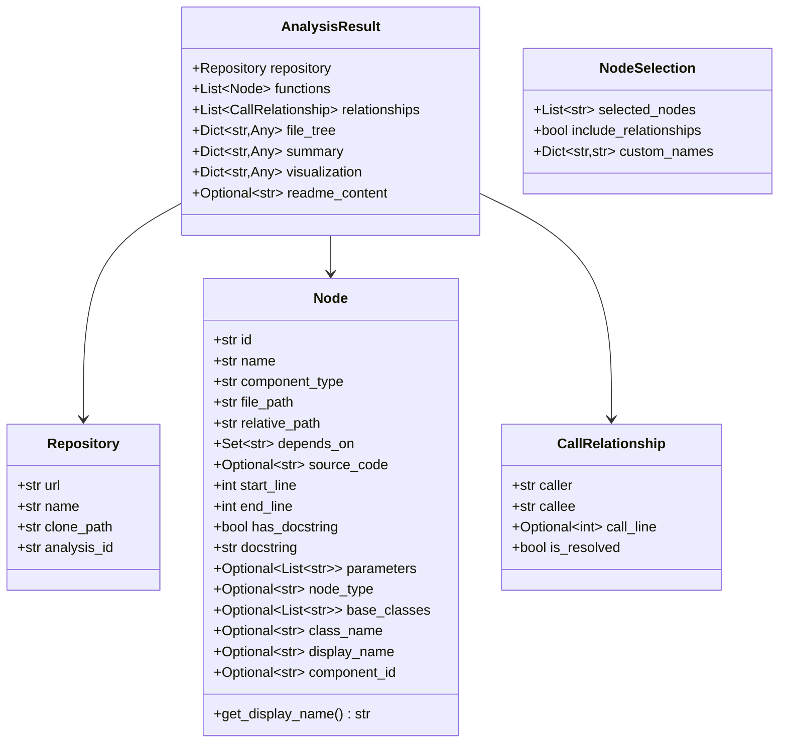
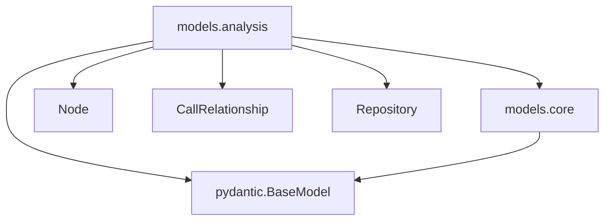
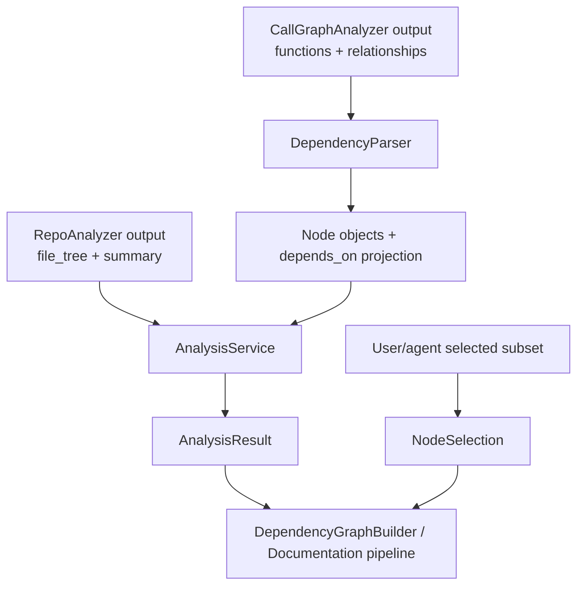
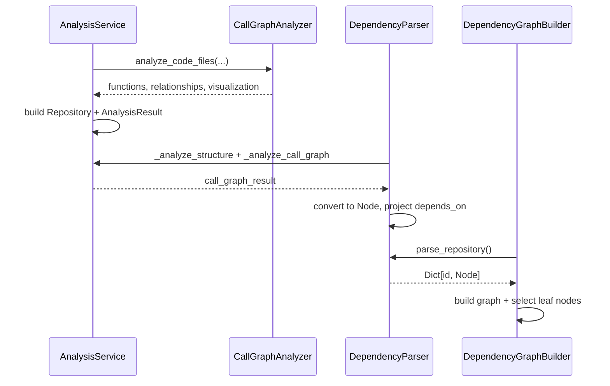
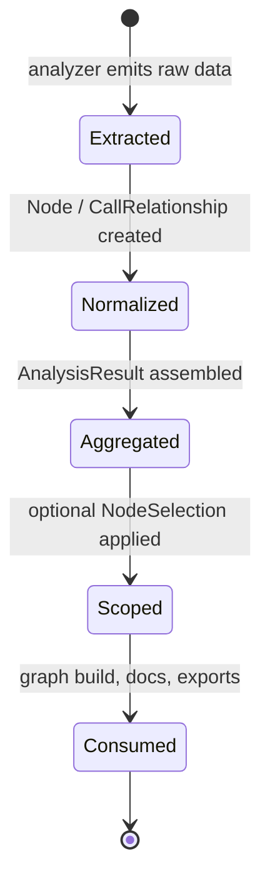

# analysis-domain-models Module

## Introduction

The `analysis-domain-models` module defines the **canonical data contracts** used across the Dependency Analyzer pipeline.
It provides the shared Pydantic models that represent:

- repository identity and analysis context,
- discovered code components,
- caller/callee relationships,
- assembled analysis output, and
- optional user-driven node selection for partial export.

In short: this module is the **schema backbone** that keeps parsing, graph-building, and orchestration layers interoperable.

---

## Core Components

- `Node`
- `CallRelationship`
- `Repository`
- `AnalysisResult`
- `NodeSelection`

---

## Architectural Role in the System

### Why this matters

These models decouple subsystem responsibilities:

- analyzers can focus on extraction,
- orchestrators can focus on workflow,
- graph/build/export layers can consume stable typed structures.

---

## Domain Model Structure

---

## Component Details

### `Node`

Represents a single code component discovered by analyzers and later used in dependency graph construction.

Key semantics:

- `id`: canonical unique identifier (primary key across modules).
- `component_type`: semantic role (`class`, `interface`, `struct`, `function`, etc.).
- `depends_on`: outgoing dependency edges to other node IDs.
- `source_code`, `docstring`, `parameters`, line-range fields: metadata for documentation and analysis quality.
- `display_name` + `get_display_name()`: presentation-safe label fallback to `name`.

Used heavily by:

- [`dependency-parser-and-component-projection.md`](dependency-parser-and-component-projection.md)
- [`dependency-graph-build-and-leaf-selection.md`](dependency-graph-build-and-leaf-selection.md)

### `CallRelationship`

Represents a raw or resolved call edge between two component IDs/names.

- `caller` / `callee`: relationship endpoints.
- `call_line`: source line hint when available.
- `is_resolved`: indicates whether endpoint resolution has high confidence.

This model is a transfer object between call-graph extraction and projection logic.

### `Repository`

Stores repository-level metadata for traceability:

- origin (`url`),
- logical identity (`name`),
- local runtime location (`clone_path`),
- analysis run ID (`analysis_id`).

Primarily assembled by [`analysis-service-orchestration.md`](analysis-service-orchestration.md).

### `AnalysisResult`

Top-level aggregate returned by full analysis mode.

It consolidates:

- repository metadata,
- discovered nodes and relationships,
- file tree + summary statistics,
- visualization payload,
- optional README content.

This is the module’s central integration contract.

### `NodeSelection`

Defines selective export scope for downstream workflows.

- `selected_nodes`: explicit node IDs to include.
- `include_relationships`: whether to include graph edges among selected nodes.
- `custom_names`: optional alias mapping for display/custom packaging.

This model supports partial, user-directed documentation generation without mutating source analysis data.

---

## Dependency Relationships (Code-Level)

- `models.analysis` depends on `models.core` for reusable primitives.
- All models inherit from `BaseModel`, enabling validation/serialization and predictable schema behavior.

---

## Data Flow Across Modules

Interpretation:

1. Raw extraction generates low-level function/relationship data.
2. Projection normalizes them into `Node` and edge contracts.
3. Orchestration composes everything into `AnalysisResult`.
4. Optional `NodeSelection` narrows downstream processing scope.

---

## Component Interaction (Sequence)

---

## Model Lifecycle and Process Flow

---

## Contract and Validation Notes

- Models are typed with Pydantic `BaseModel`, providing runtime validation and structured dumps.
- `Node.depends_on` is set-based in memory (good for deduplication) and often converted to list for JSON serialization by downstream components.
- `AnalysisResult.visualization` and `summary` are flexible `Dict[str, Any]` contracts to support analyzer evolution without frequent schema churn.
- `NodeSelection` defaults allow no-selection/relationship-inclusive behavior out of the box.

### Practical caution for maintainers

Several fields use mutable defaults (`{}`, `[]`, `set()`). If refactoring model behavior, prefer explicit `Field(default_factory=...)` patterns to avoid accidental shared-state edge cases and to keep intent clear.

---

## How This Module Fits the Overall System

The `analysis-domain-models` module sits at the center of the Dependency Analyzer subsystem:

- Upstream analyzers produce data that must map into these models.
- Midstream orchestration uses these models to compose stable outputs.
- Downstream graph/documentation modules rely on these contracts for selection, traversal, and rendering.

Because of this central role, changes to these schemas should be treated as **cross-module contract changes**.

---

## Cross-Module References

For implementation details beyond these models, see:

- Analysis workflow orchestration: [`analysis-service-orchestration.md`](analysis-service-orchestration.md)
- Component projection from analyzer output: [`dependency-parser-and-component-projection.md`](dependency-parser-and-component-projection.md)
- Graph construction and leaf-node filtering: [`dependency-graph-build-and-leaf-selection.md`](dependency-graph-build-and-leaf-selection.md)
- Call graph extraction internals: [`call-graph-analysis-engine.md`](call-graph-analysis-engine.md)
- Repository structure scan and filtering: [`repository-structure-analysis.md`](repository-structure-analysis.md)
