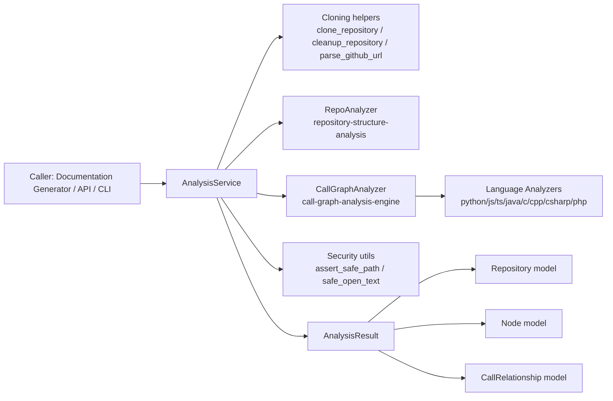
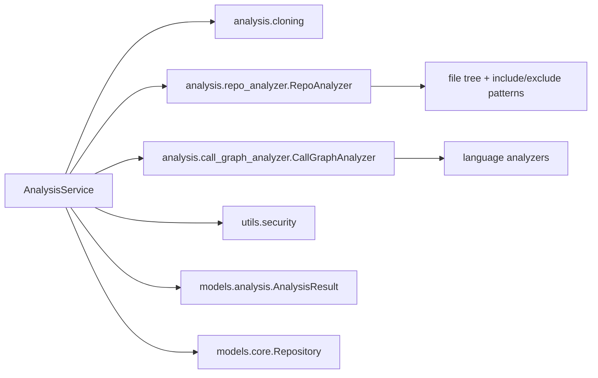
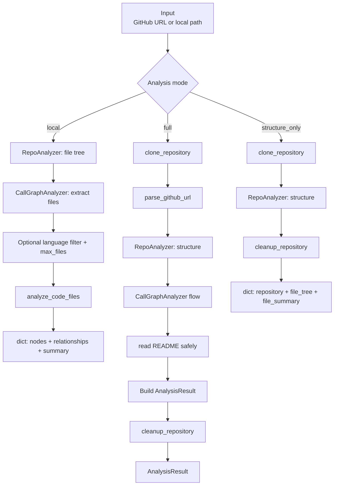
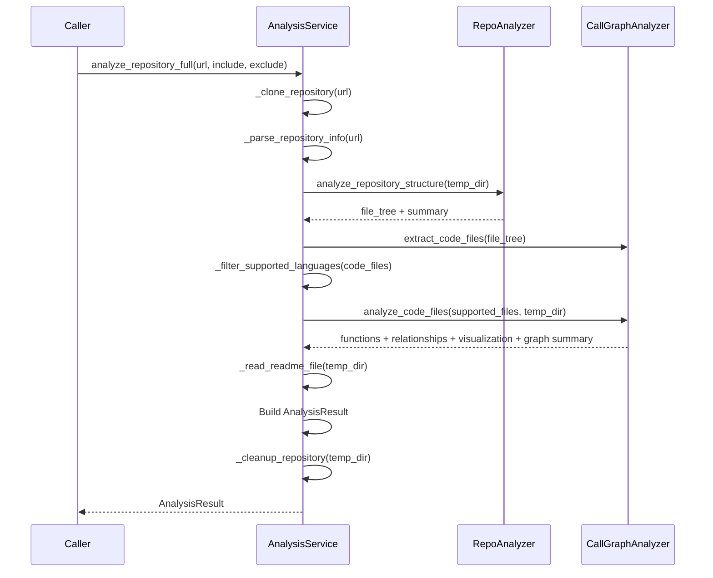
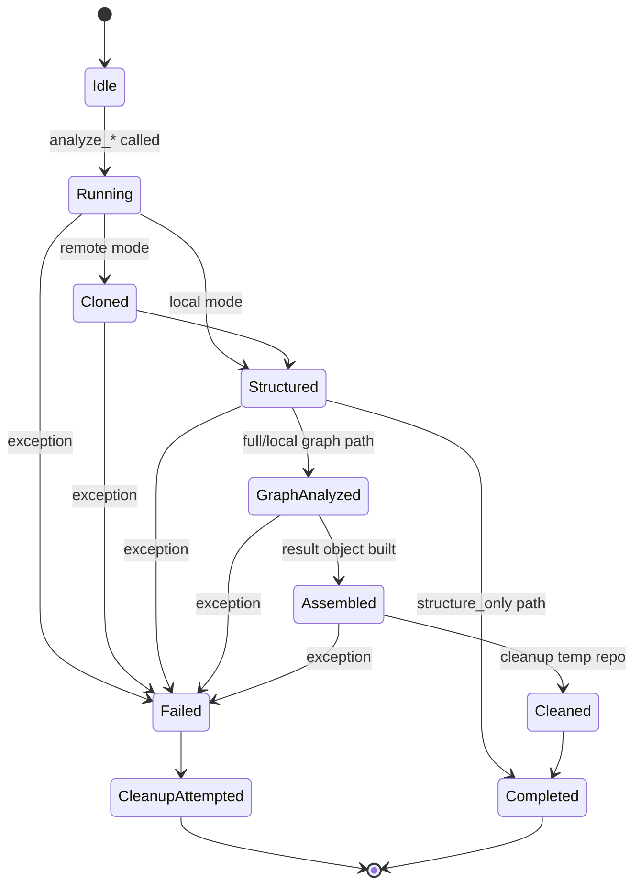
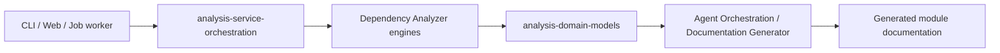

# analysis-service-orchestration Module

## Introduction

The `analysis-service-orchestration` module is the orchestration layer of the Dependency Analyzer subsystem.  
Its core component, `AnalysisService`, coordinates end-to-end repository analysis workflows by combining:

- repository acquisition (clone/cleanup),
- repository structure analysis,
- multi-language call-graph analysis,
- safe metadata extraction (README), and
- result normalization into API-friendly models.

In practice, this module is the **entry point that turns a GitHub URL or local path into structured analysis output** consumed by downstream documentation and orchestration flows.

---

## Core Component

### `AnalysisService`

`AnalysisService` centralizes three analysis modes:

1. **`analyze_local_repository(...)`**
   - Runs analysis on an already available local folder.
   - Produces lightweight dictionary output (`nodes`, `relationships`, `summary`).

2. **`analyze_repository_full(...)`**
   - Clones a remote GitHub repository.
   - Runs structure + call graph analysis.
   - Reads README safely.
   - Returns a typed `AnalysisResult` object.

3. **`analyze_repository_structure_only(...)`**
   - Clones a repository.
   - Performs only file-tree and summary analysis.
   - Skips call-graph generation for faster metadata scans.

It also encapsulates lifecycle helpers (`_clone_repository`, `_cleanup_repository`, `cleanup_all`, `__del__`) to reduce temporary-directory leakage risk.

---

## Module Responsibilities

- **Workflow orchestration** across cloning, structure analysis, and graph analysis.
- **Language filtering and scope control** (`max_files`, language list, supported-language filtering).
- **Security-conscious file access** for README extraction using safe path/file utilities.
- **Failure containment and cleanup** with cleanup on both success and error paths.
- **Backward compatibility** through wrapper functions:
  - `analyze_repository(...)`
  - `analyze_repository_structure_only(...)`

---

## Architectural Position

`AnalysisService` is intentionally thin in parsing logic: it delegates static-analysis internals to specialized modules and focuses on **ordering, validation, and assembly**.

---

## Internal Component Architecture

```mermaid
graph TD
    A[AnalysisService.__init__] --> B[Instantiate CallGraphAnalyzer]
    A --> C[Initialize _temp_directories tracking]

    D[analyze_repository_full] --> E[_clone_repository]
    D --> F[_parse_repository_info]
    D --> G[_analyze_structure]
    D --> H[_analyze_call_graph]
    D --> I[_read_readme_file]
    D --> J[Build AnalysisResult]
    D --> K[_cleanup_repository]

    L[analyze_repository_structure_only] --> E
    L --> F
    L --> G
    L --> K

    M[analyze_local_repository] --> N[RepoAnalyzer.analyze_repository_structure]
    M --> O[CallGraphAnalyzer.extract_code_files]
    M --> P[Optional language filter + max_files limit]
    M --> Q[CallGraphAnalyzer.analyze_code_files]
```

---

## Dependency Relationships

### Key dependency notes

- `RepoAnalyzer` applies include/exclude logic and symlink/path protections during tree traversal.
- `CallGraphAnalyzer` handles extraction, per-language AST analysis, relationship resolution/deduplication, and visualization payload generation.
- Cloning helpers sanitize URLs and enforce timeout/error handling.
- Security utilities protect README reads from symlink/path-escape attacks.

---

## Data Flow

---

## Call-Graph Orchestration Process

---

## Lifecycle and Error/Cleanup Semantics

`AnalysisService` attempts cleanup on all remote-analysis paths, tracks temporary directories in `_temp_directories`, and provides `cleanup_all()` plus destructor-triggered cleanup as a fallback.

---

## Output Contracts

### Full analysis output (`AnalysisResult`)

- `repository: Repository`
  - `url`, `name`, `clone_path`, `analysis_id`
- `functions: List[Node]`
- `relationships: List[CallRelationship]`
- `file_tree: Dict[str, Any]`
- `summary: Dict[str, Any]`
  - merged structure and call-graph metrics
  - includes `analysis_type = "full"`
  - includes `languages_analyzed`
- `visualization: Dict[str, Any]`
- `readme_content: Optional[str]`

### Local analysis output (dict)

- `nodes`
- `relationships`
- `summary` (`total_files`, `total_nodes`, `total_relationships`)

### Structure-only output (dict)

- `repository`
- `file_tree`
- `file_summary` (`analysis_type = "structure_only"` + structure metrics)

---

## Important Behavioral Notes

- **Supported language filtering mismatch**:
  - `_filter_supported_languages` currently includes `go` and `rust`.
  - `_get_supported_languages` currently returns up to `php` (no `go`/`rust`).
  - This can produce metadata inconsistency in reported capabilities.

- **Local mode vs full mode result shape differs**:
  - local returns dict with `nodes`
  - full returns `AnalysisResult` with `functions`
  - callers should normalize if they consume both paths.

- **Temporary clone path in model**:
  - `Repository.clone_path` in `AnalysisResult` points to a temp dir that is cleaned before return.
  - consumers should not assume path persistence.

- **URL parsing is permissive**:
  - `parse_github_url` is simple string splitting and may return `unknown` owner/name for malformed URLs.

---

## How This Module Fits the Overall System

`analysis-service-orchestration` is the **service façade** of the Dependency Analyzer domain.

- It receives high-level analysis requests.
- It delegates analysis mechanics to specialized modules.
- It emits structured analysis objects used by orchestration and documentation generation pipelines.

---

## Related Modules

To avoid duplication, see the dedicated docs for deeper internals:

- [call-graph-analysis-engine.md](call-graph-analysis-engine.md) — call graph extraction/resolution and visualization generation.
- [repository-structure-analysis.md](repository-structure-analysis.md) — file tree traversal, include/exclude filtering, and size/count aggregation.
- [analysis-domain-models.md](analysis-domain-models.md) — `AnalysisResult`, `Repository`, `Node`, and `CallRelationship` schemas.
- [dependency-parser-and-component-projection.md](dependency-parser-and-component-projection.md) — parser-level dependency extraction details.
- [dependency-graph-build-and-leaf-selection.md](dependency-graph-build-and-leaf-selection.md) — graph shaping and node selection logic for module planning.
- [logging-and-console-formatting.md](logging-and-console-formatting.md) — logging formatter and diagnostics conventions.
