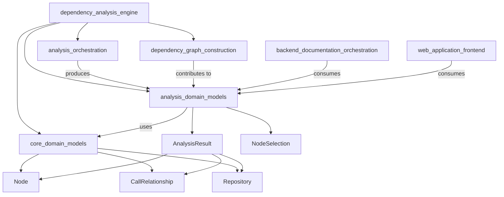
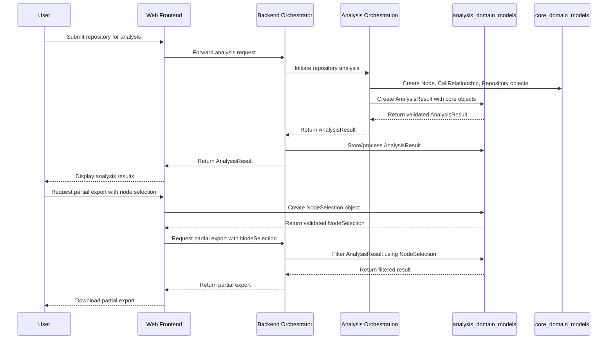

# analysis_domain_models Module Documentation

## Introduction

The `analysis_domain_models` module is a fundamental component of the CodeWiki dependency analysis system, providing the core data structures that encapsulate the results of repository analysis and node selection operations. This module exists to standardize the representation of analysis outputs, ensuring consistency across different parts of the application—from the dependency analysis engine to the frontend visualization and export mechanisms.

At its core, this module defines two key data models: `AnalysisResult` and `NodeSelection`. These models capture the complete state of a repository analysis, including the repository metadata, identified functions, their relationships, and the configuration for partial exports. By using Pydantic models, the module ensures data validation, clear type definitions, and easy serialization/deserialization, making it a reliable foundation for data exchange between components.

This module is part of the `dependency_analysis_engine` system, working in conjunction with other modules like `analysis_orchestration` (which performs the actual analysis) and `dependency_graph_construction` (which builds the relationship graphs). It also integrates with the `backend_documentation_orchestration` and `web_application_frontend` modules to deliver analysis results to end users.

## Core Components

### AnalysisResult

The `AnalysisResult` class is the primary data structure for storing the complete output of a repository dependency analysis. It aggregates all relevant information about the analyzed repository, including its structure, identified functions, call relationships, and visualization data.

#### Key Attributes:
- `repository`: A `Repository` object containing metadata about the analyzed repository (such as name, path, and version control information).
- `functions`: A list of `Node` objects representing the functions, classes, or other code elements identified during analysis.
- `relationships`: A list of `CallRelationship` objects defining the dependencies and interactions between the identified nodes.
- `file_tree`: A nested dictionary representing the hierarchical structure of the repository's files and directories.
- `summary`: A dictionary containing high-level summary statistics and insights about the analysis (e.g., total number of functions, most connected nodes).
- `visualization`: An optional dictionary storing data for visualizing the dependency graph (default: empty dictionary).
- `readme_content`: An optional string containing the content of the repository's README file, if available (default: None).

#### Usage Example:
```python
from codewiki.src.be.dependency_analyzer.models.analysis import AnalysisResult
from codewiki.src.be.dependency_analyzer.models.core import Repository, Node, CallRelationship

# Create sample core objects
repo = Repository(name="my-repo", path="/path/to/repo")
func1 = Node(id="func1", name="calculate_sum", type="function")
func2 = Node(id="func2", name="main", type="function")
rel = CallRelationship(source=func1.id, target=func2.id, type="calls")

# Create AnalysisResult
result = AnalysisResult(
    repository=repo,
    functions=[func1, func2],
    relationships=[rel],
    file_tree={"my-repo": {"src": {"main.py": {}}}},
    summary={"total_functions": 2, "total_relationships": 1},
    visualization={"layout": "force-directed"},
    readme_content="# My Repository\nThis is a sample repo."
)

# Serialize to JSON for API response
json_result = result.model_dump_json()
```

### NodeSelection

The `NodeSelection` class defines the configuration for selecting a subset of nodes from a complete analysis result, typically used for partial exports or focused visualizations. It allows users to specify which nodes to include, whether to include their relationships, and to assign custom display names.

#### Key Attributes:
- `selected_nodes`: A list of node IDs representing the subset of nodes to include in the export/visualization.
- `include_relationships`: A boolean indicating whether to include the call relationships between the selected nodes (default: True).
- `custom_names`: A dictionary mapping node IDs to custom display names, allowing for more readable visualizations or exports.

#### Usage Example:
```python
from codewiki.src.be.dependency_analyzer.models.analysis import NodeSelection

# Create a node selection for focused export
selection = NodeSelection(
    selected_nodes=["func1", "func2"],
    include_relationships=True,
    custom_names={"func1": "Calculate Sum", "func2": "Main Function"}
)

# Validate and access attributes
if selection.include_relationships:
    print(f"Including relationships for nodes: {selection.selected_nodes}")
```

## Architecture and Relationships

The `analysis_domain_models` module is a central component in the CodeWiki architecture, acting as a data hub that connects the analysis engine with the rest of the system. The following diagram illustrates its position and relationships with other modules:



### Component Relationships Explained:

1. **Dependency on core_domain_models**: The `AnalysisResult` class depends on the `Node`, `CallRelationship`, and `Repository` classes from the `core_domain_models` module. These core models define the basic building blocks of the dependency analysis, and `AnalysisResult` aggregates them into a complete result set.

2. **Interaction with analysis_orchestration**: The `analysis_orchestration` module (containing `AnalysisService`, `CallGraphAnalyzer`, and `RepoAnalyzer`) is responsible for performing the actual repository analysis. It produces an `AnalysisResult` object as its output, which is then passed to other components.

3. **Integration with dependency_graph_construction**: The `dependency_graph_construction` module (containing `DependencyGraphBuilder`) contributes to the `relationships` and `visualization` attributes of `AnalysisResult` by building the call relationship graphs and preparing visualization data.

4. **Consumption by backend_documentation_orchestration**: The `backend_documentation_orchestration` module uses `AnalysisResult` to generate documentation from the analysis data, leveraging the repository structure, functions, and relationships to create comprehensive documentation.

5. **Consumption by web_application_frontend**: The `web_application_frontend` module consumes both `AnalysisResult` (to display analysis results to users) and `NodeSelection` (to handle user requests for partial exports or focused visualizations).

## Data Flow

The typical data flow involving `analysis_domain_models` components begins with a repository analysis request and ends with the delivery of results to the end user. The following sequence diagram illustrates this process:



### Data Flow Steps:

1. **Analysis Initiation**: A user submits a repository for analysis through the web frontend. The frontend forwards this request to the backend orchestrator.

2. **Analysis Execution**: The backend orchestrator initiates the analysis process through the `analysis_orchestration` module. This module analyzes the repository and creates core domain objects (`Node`, `CallRelationship`, `Repository`).

3. **Result Aggregation**: The `analysis_orchestration` module creates an `AnalysisResult` object, populating it with the core domain objects, file tree, summary, and visualization data. The `AnalysisResult` is validated by Pydantic before being returned.

4. **Result Delivery**: The `AnalysisResult` is passed back through the backend orchestrator to the web frontend, which displays the results to the user.

5. **Partial Export Request**: If the user requests a partial export, the frontend creates a `NodeSelection` object based on the user's input, validates it, and sends it to the backend orchestrator.

6. **Result Filtering**: The backend orchestrator uses the `NodeSelection` to filter the original `AnalysisResult`, including only the selected nodes, their relationships (if requested), and applying any custom names.

7. **Partial Export Delivery**: The filtered result is returned to the frontend, which provides it to the user as a download.

## Usage and Configuration

The `analysis_domain_models` module is primarily used as a data transfer object (DTO) layer, so it doesn't require extensive configuration. However, there are several best practices and usage patterns to follow:

### Best Practices:

1. **Always Validate**: When creating instances of these models programmatically, use Pydantic's validation to ensure data integrity. Pydantic will automatically validate field types and raise `ValidationError` if any constraints are violated.

2. **Use model_dump() and model_dump_json()**: For serializing models to dictionaries or JSON, use Pydantic's built-in `model_dump()` and `model_dump_json()` methods instead of manual serialization. These methods handle nested objects and optional fields correctly.

3. **Handle Optional Fields**: Be aware that `visualization` and `readme_content` are optional fields in `AnalysisResult`. Always check if they exist before accessing them to avoid `AttributeError`.

4. **Consistent Node IDs**: When working with `NodeSelection`, ensure that the node IDs in `selected_nodes` exactly match the IDs of nodes in the corresponding `AnalysisResult`'s `functions` list. Mismatched IDs will result in empty or incomplete filtered results.

### Error Handling:

When using these models, you may encounter the following error conditions:

1. **ValidationError**: Raised by Pydantic when trying to create a model instance with invalid data (e.g., wrong type for a field, missing required field). Always wrap model creation in a try-except block when dealing with untrusted input.

   ```python
   from pydantic import ValidationError
   
   try:
       selection = NodeSelection(selected_nodes="not a list")
   except ValidationError as e:
       print(f"Invalid node selection: {e}")
   ```

2. **Missing Dependencies**: If the `core_domain_models` module is not available or the required classes (`Node`, `CallRelationship`, `Repository`) are not imported correctly, you will get an `ImportError`. Ensure that the module path is correct and that all dependencies are installed.

3. **Inconsistent Data**: When using `NodeSelection` to filter an `AnalysisResult`, if the `selected_nodes` contain IDs that are not present in the `functions` list, the filtered result will be missing those nodes. Always validate the node IDs against the `AnalysisResult` before creating the `NodeSelection`.

## Extending the Module

While the current models are designed to be general-purpose, there may be cases where you need to extend them to support additional features. Here are some guidelines for extension:

### Extending AnalysisResult:

To add new fields to `AnalysisResult`, simply add them to the class definition with appropriate type annotations. For example, if you want to add a field for code quality metrics:

```python
class AnalysisResult(BaseModel):
    # ... existing fields ...
    code_quality_metrics: Optional[Dict[str, Any]] = None
```

Make sure to update any components that create or consume `AnalysisResult` to handle the new field appropriately.

### Extending NodeSelection:

Similarly, you can add new configuration options to `NodeSelection`. For example, if you want to add a depth limit for relationship inclusion:

```python
class NodeSelection(BaseModel):
    # ... existing fields ...
    relationship_depth: Optional[int] = None
```

You would then need to update the filtering logic in the `backend_documentation_orchestration` module to respect this new parameter.

### Creating Custom Models:

If you need more specialized data structures, you can create new Pydantic models in the same module. For example, a model for analysis configuration:

```python
class AnalysisConfig(BaseModel):
    include_private_functions: bool = False
    max_depth: int = 5
    excluded_directories: List[str] = ["tests", "docs"]
```

When extending the module, always ensure backward compatibility. Make new fields optional with default values, and avoid removing or changing existing fields without proper deprecation.

## Related Modules

For more information about related modules, refer to their documentation:

- [core_domain_models](core_domain_models.md): Defines the core data structures (`Node`, `CallRelationship`, `Repository`) used by `AnalysisResult`.
- [analysis_orchestration](analysis_orchestration.md): Explains how the analysis is performed and how `AnalysisResult` is produced.
- [dependency_graph_construction](dependency_graph_construction.md): Details how the call relationship graphs are built and integrated into `AnalysisResult`.
- [backend_documentation_orchestration](backend_documentation_orchestration.md): Describes how `AnalysisResult` is used to generate documentation.
- [web_application_frontend](web_application_frontend.md): Shows how `AnalysisResult` and `NodeSelection` are used in the user interface.
