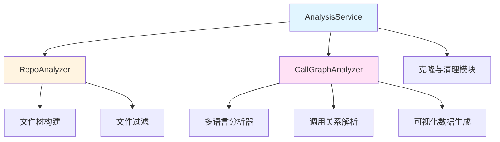
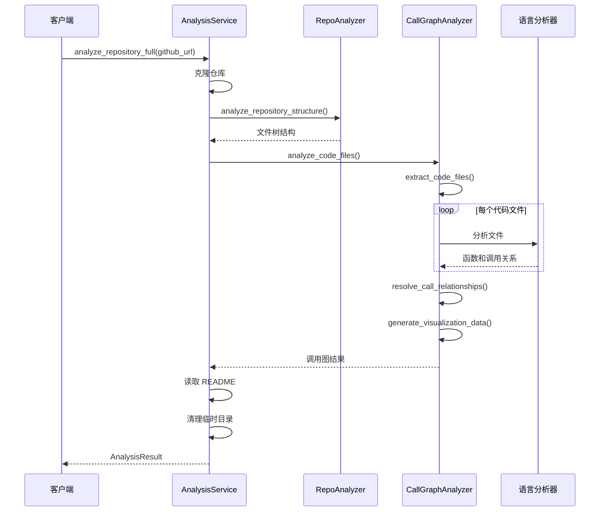

# analysis_orchestration 模块文档

## 1. 模块概述

analysis_orchestration 模块是 dependency_analysis_engine 中的核心协调模块，负责组织和管理整个代码仓库分析流程。该模块提供了从仓库克隆、结构分析到多语言调用图生成的完整分析管道，是连接各个分析组件的中枢神经系统。

本模块的主要设计目标是提供一个统一的接口，使得复杂的多语言代码分析过程变得简单易用。它封装了仓库克隆、文件过滤、语言特定分析、调用图构建等多个步骤，为上层应用提供了简洁而强大的分析能力。

### 主要功能与价值

- **统一分析接口**：提供一致的入口点来执行不同类型的代码分析
- **多语言支持**：协调多种编程语言的分析过程，包括 Python、JavaScript、TypeScript、Java、C#、C、C++、PHP、Go、Rust 等
- **完整分析流程**：管理从仓库获取到结果生成的完整分析生命周期
- **灵活的分析选项**：支持全量分析、结构分析等多种分析模式

## 2. 架构设计

analysis_orchestration 模块采用分层架构设计，将分析过程分解为多个可管理的步骤，每个步骤由专门的组件负责。这种设计使得模块具有良好的可扩展性和可维护性。

### 核心组件关系图



### 架构说明

1. **AnalysisService**：作为模块的门面（Facade），对外提供简洁的 API，内部协调各个组件完成分析工作。
2. **RepoAnalyzer**：负责仓库结构分析，包括文件树构建、文件过滤等功能。
3. **CallGraphAnalyzer**：专注于代码文件的分析，包括多语言 AST 解析、调用关系提取和调用图构建。

这种架构遵循了单一职责原则，每个组件都有明确的职责边界，便于独立维护和扩展。

## 3. 核心组件

### 3.1 AnalysisService

`AnalysisService` 是整个模块的核心协调者，它封装了完整的分析流程，提供了多个高级 API 来满足不同的分析需求。

#### 主要功能

- **仓库克隆与管理**：自动处理 GitHub 仓库的克隆和临时目录管理
- **分析流程协调**：按顺序协调结构分析和调用图分析
- **结果整合**：将各个组件的分析结果整合成统一的格式
- **资源清理**：确保分析完成后正确清理临时资源

#### 关键方法

- `analyze_repository_full()`：执行完整的仓库分析，包括结构分析和调用图生成
- `analyze_repository_structure_only()`：仅执行仓库结构分析，不进行代码层面的分析
- `analyze_local_repository()`：分析本地已存在的仓库目录

### 3.2 RepoAnalyzer

`RepoAnalyzer` 专注于仓库的文件结构分析，它能够构建详细的文件树，并支持灵活的文件过滤机制。

#### 主要功能

- **文件树构建**：递归遍历目录结构，构建包含详细信息的文件树
- **文件过滤**：基于包含和排除模式过滤文件，支持 glob 模式匹配
- **元数据收集**：收集文件大小、类型等元数据信息
- **安全性检查**：检测并拒绝符号链接和逃逸路径，确保分析安全

#### 核心逻辑

`RepoAnalyzer` 使用深度优先遍历算法构建文件树，在遍历过程中应用过滤规则，并收集必要的元数据。它通过 `_should_include_file()` 和 `_should_exclude_path()` 方法实现灵活的文件过滤机制。

### 3.3 CallGraphAnalyzer

`CallGraphAnalyzer` 是代码分析的核心组件，负责协调多语言分析器，提取函数定义和调用关系，构建完整的调用图。

#### 主要功能

- **多语言分析协调**：根据文件类型路由到相应的语言分析器
- **函数和关系提取**：从代码中提取函数定义和调用关系
- **调用关系解析**：将函数调用与实际定义进行匹配
- **可视化数据生成**：生成适用于 Cytoscape.js 的可视化数据

#### 关键处理流程

1. **文件提取**：从文件树中提取支持的代码文件
2. **语言特定分析**：根据文件语言调用相应的分析器
3. **关系解析**：解析跨文件和跨语言的调用关系
4. **去重处理**：去除重复的调用关系
5. **可视化准备**：生成图可视化所需的数据结构

## 4. 工作流程

analysis_orchestration 模块的典型工作流程如下：



### 流程详细说明

1. **初始化阶段**：客户端调用 `AnalysisService` 的分析方法，传入 GitHub URL 或本地路径。
2. **仓库获取**：如果是远程仓库，服务会先克隆到临时目录。
3. **结构分析**：`RepoAnalyzer` 构建文件树，应用过滤规则。
4. **代码分析**：`CallGraphAnalyzer` 处理代码文件，调用相应的语言分析器。
5. **关系解析**：解析函数调用关系，匹配调用与定义。
6. **结果整合**：将结构信息、调用图和 README 内容整合成最终结果。
7. **资源清理**：删除临时目录，释放资源。

## 5. 使用指南

### 5.1 基本用法

#### 完整分析远程仓库

```python
from codewiki.src.be.dependency_analyzer.analysis.analysis_service import AnalysisService

service = AnalysisService()
result = service.analyze_repository_full(
    github_url="https://github.com/example/repo",
    include_patterns=["*.py", "*.js"],
    exclude_patterns=["tests/*"]
)

# 访问结果
print(f"分析完成，发现 {result.summary['total_functions']} 个函数")
print(f"包含 {len(result.relationships)} 个调用关系")
```

#### 仅分析仓库结构

```python
result = service.analyze_repository_structure_only(
    github_url="https://github.com/example/repo"
)

print(f"仓库包含 {result['file_summary']['total_files']} 个文件")
```

#### 分析本地仓库

```python
result = service.analyze_local_repository(
    repo_path="/path/to/local/repo",
    max_files=100,
    languages=["python", "javascript"]
)
```

### 5.2 配置选项

#### 文件过滤

- `include_patterns`：指定要包含的文件模式，例如 `["*.py", "src/*.js"]`
- `exclude_patterns`：指定要排除的文件模式，例如 `["tests/*", "*.min.js"]`

#### 语言选择

使用 `analyze_local_repository()` 时，可以通过 `languages` 参数指定要分析的语言：

```python
languages=["python", "javascript", "typescript"]
```

支持的语言包括：python, javascript, typescript, java, csharp, c, cpp, php, go, rust。

## 6. 与其他模块的关系

analysis_orchestration 模块是 dependency_analysis_engine 的核心协调模块，与其他模块有密切的关系：

- **依赖 ast_parsing_and_language_analyzers 模块**：使用各种语言特定的分析器来解析不同语言的代码文件
- **使用 core_domain_models**：依赖核心数据模型如 Node、CallRelationship 和 Repository 来表示分析结果
- **为 backend_documentation_orchestration 提供服务**：其分析结果被用于生成文档

更多关于相关模块的信息，请参考：
- [ast_parsing_and_language_analyzers](ast_parsing_and_language_analyzers.md)
- [dependency_graph_construction](dependency_graph_construction.md)
- [core_domain_models](core_domain_models.md)

## 7. 注意事项与最佳实践

### 资源管理

- `AnalysisService` 实现了 `__del__` 方法来确保临时目录被清理，但建议在使用完毕后显式调用 `cleanup_all()` 方法
- 分析大型仓库可能会消耗大量内存和时间，建议使用 `max_files` 参数限制分析的文件数量

### 错误处理

- 所有公共方法都可能抛出 `RuntimeError`，建议使用 try-except 块进行错误处理
- 分析过程中的错误会被记录到日志中，建议配置适当的日志级别

### 性能考虑

- 结构分析通常很快，但完整的代码分析可能需要较长时间
- 对于大型仓库，建议先使用 `analyze_repository_structure_only()` 了解仓库规模，再决定是否进行完整分析
